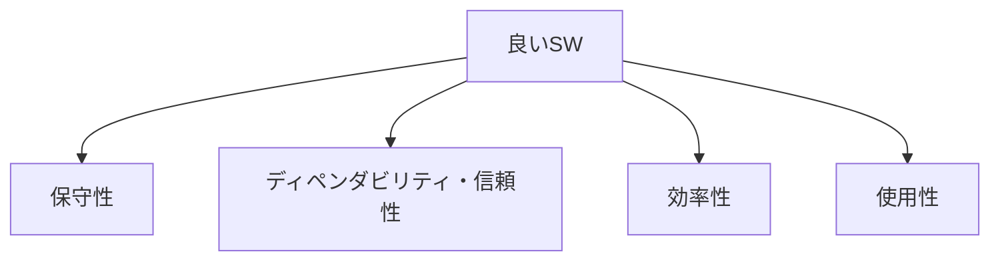

# 良いソフトウェアが備えるべき4つの特性

## 1. 概要

### A. 定義
> 良いソフトウェアとは、ユーザーの機能要求を満たすことに加えて、**保守性(Maintainability)・ディペンダビリティ(Dependability)・効率性(Efficiency)・使用性(Usability)**という四つの品質特性をバランスよく備えたソフトウェアである(I. Sommerville)。

ここでの要点は、「要求された機能を実装した」ことと「良いソフトウェアである」という判断が**互いに異なる次元**であるという点である。機能は受け入れ時点の最低条件にすぎず、ソフトウェアの実際の価値は、引き渡し後の数年にわたる**運用・変更・拡張**の過程で決まる。そのためSommervilleは、機能仕様に還元されない非機能的な品質、すなわち変化をどれだけうまく受け入れられるか(保守性)、どれだけ信頼して任せられるか(ディペンダビリティ)、資源をどれだけ節約するか(効率性)、どれだけ容易に使えるか(使用性)を、良いソフトウェアの軸として提示した。

### B. 登場背景および必要性
ソフトウェアのコストの大部分は、開発ではなく**保守**で発生する。通常、ライフサイクル総コストの60%以上が引き渡し後の欠陥修正・機能改善・環境移行に費やされ、要求は絶えず変化する。初期の開発速度だけを追って構造を犠牲にすると、その後の変更1回あたりのコストが指数関数的に増大する**技術的負債(Technical Debt)**が蓄積する。また金融・医療のように障害がそのまま損失・人命のリスクにつながる領域では、信頼が崩れれば製品そのものが無意味になる。良いソフトウェアの4大特性は、このように**長期的な価値とリスク**を管理するために、目には見えないがコストを左右する品質を明示的な管理対象へと引き上げた概念である。

## 2. 4大特性

**A. 保守性(Maintainability)**とは、変化する要求と環境に合わせてソフトウェアを**修正・進化**させやすい度合いである。ソフトウェアは物理的に摩耗しないが、世の中が変わるにつれて「古びていく」。規制が変わり料金体系が変われば、コードもそれに合わせて変わらなければならないが、このとき特定の部分を修正しても他の部分が連鎖的に壊れないことをもって、保守性が高いという。結合度が低く凝集度が高いモジュール構造がその土台である。

**B. ディペンダビリティ・信頼性(Dependability)**とは、ユーザーがソフトウェアを**信頼して任せられるか**を包括する特性であり、信頼性(正常動作の継続)・可用性(必要なときに使用可能)・安全性(障害時にも危害がない)・セキュリティ(攻撃に対する防御)を包含する。例えばオンラインバンキングは、口座振替がたまに1回間違えることも許されず(信頼性)、メンテナンス中で使えないことも許されず(可用性)、口座情報が漏れることも許されない(セキュリティ)。ディペンダビリティはこのように複数の下位属性の総和であり、最も弱い環が全体の信頼を決定する。

**C. 効率性(Efficiency)**とは、CPU・メモリ・ストレージ・ネットワーク・応答時間などの**資源を浪費しない**度合いである。ただし効率性は絶対的な善ではなく、目標に対する相対的な概念である。同じ応答時間を2倍のサーバで達成すればクラウド料金は2倍になるため、効率性はそのまま運用コストとユーザーの体感性能に直結する。例えば、O(n²)のソートをO(n log n)に変えれば、データが100万件のとき処理時間は数百分の一に短縮される。

**D. 使用性(Usability)**とは、**対象ユーザー**が学びやすく、ミスなく便利に使える度合いである。ここでは「対象ユーザー」が重要であり、プロのトレーダー向け端末と高齢者向けの公共アプリとでは、良い使用性の基準そのものが異なる。いかに機能が優れていても、ユーザーが目的の作業に到達できなければ、その機能は存在しないのと同じである。

| 特性 | 説明 | 欠如時の症状 |
|---|---|---|
| 保守性 | 変化に合わせた修正・進化が容易 | 小さな変更でも広範な波及・回帰欠陥 |
| ディペンダビリティ・信頼性 | 信頼・可用・安全・セキュリティ | 障害・データ漏えい・誤動作 |
| 効率性 | 資源の浪費がない | 遅い応答・過剰なインフラコスト |
| 使用性 | 学びやすく便利 | 習得困難・操作ミス・離脱 |

## 3. 品質標準との連携(ISO/IEC 25010)

Sommervilleの4大特性は学術的な概念であるため、そのままでは測定が難しい。これを**定量測定・契約・監理**が可能な形に標準化したものがISO/IEC 25010の製品品質モデルであり、8つの品質特性とその副特性によって4大特性を具体化している。すなわち25010は、「良いソフトウェア」という定性的な目標を指標へと還元する橋渡しの役割を担う。

| 25010の品質特性 | 対応する4大特性 |
|---|---|
| 保守性(モジュール性・再利用性・解析性・修正性・試験性) | 保守性 |
| 信頼性・セキュリティ・安全性 | ディペンダビリティ |
| 性能効率性(時間効率性・資源効率性・容量満足性) | 効率性 |
| 使用性(習得性・運用操作性・アクセシビリティなど) | 使用性 |
| 機能適合性・互換性・移植性 | 拡張の観点 |

## 4. 確保方策

各特性は開発の後半に検査だけで付け加えることはできず、**設計・実装・検証の全段階にわたって内在化**しなければならない。保守性は、モジュール化と低結合・高凝集、明確なインタフェースと文書化・静的解析によって確保する。ディペンダビリティは、十分なテストとフォールトトレランス(Fault Tolerance)設計、セキュアコーディング・冗長化によって確保する。効率性は、データ構造・アルゴリズムの選択とアーキテクチャの最適化、プロファイリング・性能テストによって確保する。使用性は、UX設計原則・アクセシビリティ指針(WCAG)・実ユーザーテストによって確保する。

| 特性 | 確保方策 |
|---|---|
| 保守性 | モジュール化・低結合/高凝集、コーディング規約・文書化・静的解析 |
| ディペンダビリティ | テスト自動化・フォールトトレランス・冗長化・セキュアコーディング |
| 効率性 | アルゴリズム・アーキテクチャの最適化、プロファイリング・性能テスト |
| 使用性 | UX設計・アクセシビリティ(WCAG)・ユーザーテスト |

## 5. 考慮事項および示唆
四つの特性は独立しておらず、しばしば**相反(トレードオフ)**する。極端な効率のために低水準で最適化するとコードが難解になって保守性が低下し、強力なセキュリティ手続きは使用性を損なう可能性がある。技術士の観点での要点は、いずれか一つを最大化することではなく、**システムの性格に応じて優先順位を定め、均衡点を設計**することである。セーフティクリティカルなシステムはディペンダビリティを、一般向けサービスは使用性を、大規模トラフィックのサービスは効率性を優先するといった具合である。また品質は後半での補強ではなく、**設計段階で内在化(Quality by Design)**してこそコストが最小化され、ISO/IEC 25010の指標で定量的に測定・追跡して継続的に管理しなければならない。

---

> **一言まとめ**: 良いソフトウェアは*保守性・ディペンダビリティ(信頼性)・効率性・使用性*をバランスよく備えなければならず、これらの特性は互いにトレードオフの関係にあるため、システムの性格に合った優先順位で設計段階において内在化し、ISO/IEC 25010で定量的に管理する。
