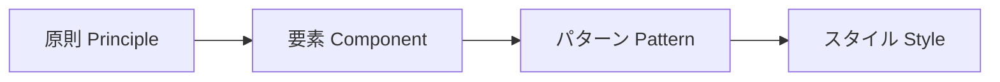
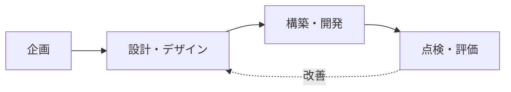

# デジタル政府サービスUI/UXガイドライン(2024.2、韓国行政安全部)

## 1. 概要

### A. 定義および目的
> 中央行政機関・地方自治体・公共機関が提供するデジタルサービス(Web・アプリ)の**UI/UX品質を一貫して向上**させるために遵守すべき原則と詳細設計事項をまとめた行政安全部の基準である。**国民の誰もが容易に、差別なく利用**できるサービスの実現を目標とする。

### B. 登場背景および必要性
これまで公共デジタルサービスは省庁・機関ごとに個別に発注・構築されてきたため、同じ政府サービスであっても画面構成・用語・認証手続きがまちまちで、国民は毎回新たに学習しなければならない負担が大きかった。また、高齢者・弱視者・障害者といった**デジタル弱者**は、アクセシビリティが確保されていない画面を前にしてサービスそのものを利用できないという情報格差の問題が深刻であった。本ガイドラインは、こうした**断片化とアクセシビリティの欠如**を解消するため、政府全体で共有する共通設計基準と再利用可能なコンポーネントを提示することで、国民には一貫した体験を、機関には開発効率と品質向上を同時に提供しようという趣旨で策定された。

ガイドラインが目指す中核的価値は四つである。**一貫性**はどの機関のサービスでも慣れた方法で使えるようにし、**包摂性・アクセシビリティ**はデジタル弱者に配慮し、**ユーザー中心**は供給者の都合ではなく国民の視点で設計し、**信頼性**は公共サービスにふさわしい安心感を与える。

## 2. ガイドラインの構造(構成要素)

ガイドラインは、抽象的な方向性から具体的な視覚ルールへと降りていく**4階層構造**を持つ。このように階層を分けた理由は、上位の原則が下位の要素・パターン・スタイルへ一貫して貫かれるようにし、設計者が恣意的に判断しなくても統一された結果を出せるようにするためである。

最上位の**原則(Principle)**は「ユーザー中心・一貫性・アクセシビリティ・信頼」といった判断基準を提示する。その下の**要素(Component)**はボタン・入力欄・ナビゲーションのように画面を構成する共通UI部品を、**パターン(Pattern)**は検索・申請・認証のように複数のサービスで繰り返される画面フローの標準設計を、最下位の**スタイル(Style)**は色彩・タイポグラフィ・アイコンといった視覚表現ルールを定義する。例えば「アクセシビリティ」という原則は、要素階層では「ボタンは十分な大きさと明度コントラストを確保」として、スタイル階層では「本文コントラスト4.5:1以上」という具体的数値として実装される。

| 構成 | 内容 | 役割 |
|---|---|---|
| **原則(Principle)** | ユーザー中心・一貫性・アクセシビリティ・信頼 | 設計判断の基準 |
| **要素(Component)** | ボタン・入力・ナビゲーション等のUI部品 | 再利用単位 |
| **パターン(Pattern)** | 検索・申請・認証等の繰り返し画面フロー | 標準設計テンプレート |
| **スタイル(Style)** | 色彩・タイポ・アイコン等の視覚ルール | 一貫した外観 |

## 3. 適用対象および基準

適用対象は、中央行政機関・地方自治体・公共機関が運営するWeb・アプリのデジタルサービス全般である。遵守基準の中核は**Webアクセシビリティ(KWCAG、韓国型Webコンテンツアクセシビリティ指針)**である。これは単なる推奨ではなく、後述するように法的義務と結び付いており、代替テキスト・キーボード操作・明度コントラストといった項目を通じて、画面を見ることができない、あるいはマウスを使いにくいユーザーもサービスを利用できるようにする。

| 区分 | 内容 |
|---|---|
| **対象** | 中央行政機関・地方自治体・公共機関のWeb・アプリサービス |
| **基準** | Webアクセシビリティ(KWCAG)・レスポンシブ・モバイルファースト、共通コンポーネント遵守 |
| **アクセシビリティ** | 弱視者・高齢者等のデジタル弱者への配慮(代替テキスト・キーボードアクセス・明度コントラスト) |

特に**モバイルファースト(Mobile-First)・レスポンシブ**を基準としたのは、多くの国民がPCよりもスマートフォンで公共サービスにアクセスしている現実を反映したものである。画面サイズに応じてレイアウトが柔軟に再配置されてこそ、どのデバイスでも同一のサービス品質を保証できる。

## 4. 活用方法(適用プロセス)

ガイドラインは特定の段階でのみ参照する文書ではなく、**サービスライフサイクルの全段階にわたって適用**される。企画段階ではユーザージャーニーとパターンを定義し、設計・デザイン段階では共通コンポーネントとスタイルを再利用し、構築段階ではアクセシビリティ基準をコードに反映し、点検・評価段階ではチェックリストとユーザビリティ評価で遵守状況を確認する。評価結果は再び設計へフィードバックされ、改善が繰り返される循環構造をなす。

このとき、**共通コンポーネントの再利用**は単なる効率化を超えた意味を持つ。すでにアクセシビリティ・ユーザビリティが検証された部品を用いれば、機関ごとに品質を新たに確保する必要がなく、開発生産性と品質の下限を同時に引き上げる**デザインシステム**として機能する。また保守の際にも、コンポーネント一つを改善すればそれを使用するすべてのサービスに反映されるという利点がある。

## 5. 考慮事項および示唆点
- **段階的適用戦略**: すでに運用中の既存サービスは一度に変更することが難しいため、リニューアル・改編の時期に合わせて段階的に反映する現実的なアプローチが必要である。
- **法的義務との連携**: Webアクセシビリティは障害者差別禁止法に基づく義務事項であり、ガイドラインの遵守は規制リスク管理に直結する。アクセシビリティを事後補完ではなく設計初期から内在化(Accessibility by Design)することで、コストを削減できる。
- **政府全体のデザインシステムへの発展**: 本ガイドラインは個別の指針を超え、共有コンポーネントライブラリ・デザイントークンの形のデザインシステムへと拡張され、国民体験の一貫性と政府の開発効率をともに高めるインフラとして定着しつつある。

---

> **一言まとめ**: 本ガイドラインは、*原則・要素・パターン・スタイル*の4階層構造によって公共デジタルサービスのUI/UX品質とアクセシビリティ(KWCAG)を一貫して確保するよう、企画から点検・評価までの全段階に共通コンポーネントの再利用を適用する政府全体の基準であり、アクセシビリティの法的義務と連動する。
