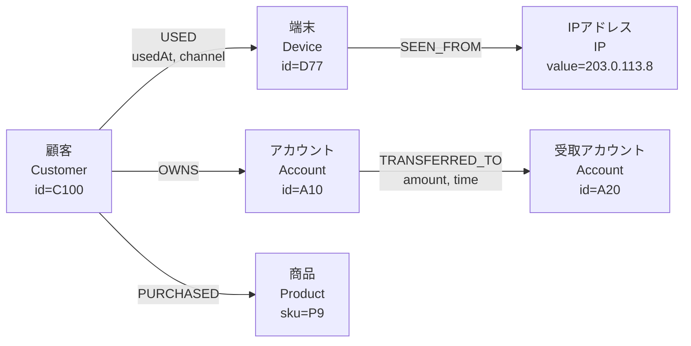
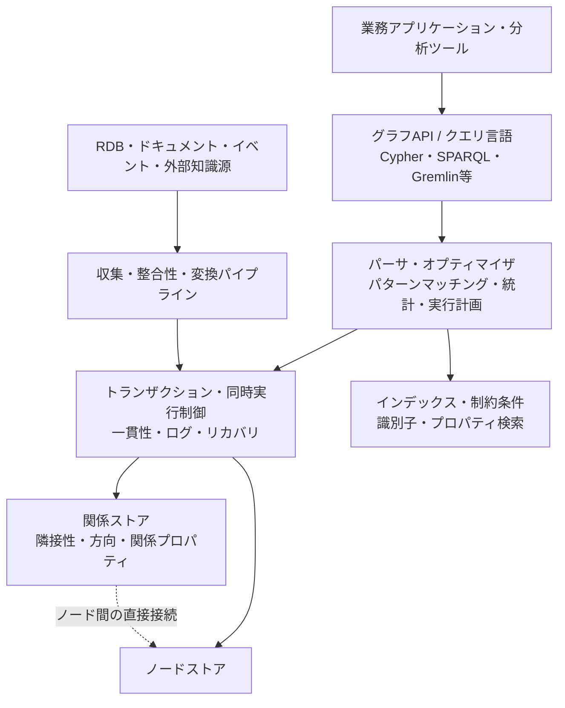

# グラフデータベース(Graph Database)とプロパティグラフ・RDFモデル

## 1. 概要

> **定義**: グラフデータベースとは、データを独立した行と列の集合としてではなく**ノード(Node)、関係(EdgeまたはRelationship)、プロパティ(Property)**で表現し、関係を格納構造の中核として、接続・経路・パターンを効率的に問い合わせるデータベースである。

リレーショナルデータベースは、エンティティをテーブルに格納し、テーブル間の関係を外部キーと`JOIN`で復元する。この方式は定型データの整合性・集計・トランザクションに非常に強いが、接続の深さが深くなったり関係の種類が増え続けたりする問題では、クエリが複雑になりうる。人とアカウント、アカウントと取引、取引と端末、端末とIPアドレスが多段に接続された不正検知の問題を考えると、中心となる問いは各テーブルの値よりも「どのような経路で接続されているか」となる。

グラフデータベースは、この接続を問い合わせ時点で毎回結合によって作り出すのではなく、ノードと関係を格納時点から一体として管理する。したがって「AからBへ到達できるか」「2人の顧客は何段階の共通関係を持つか」「特定の取引がすでに知られている攻撃集団とつながっているか」といった経路中心の問いを自然に表現できる。グラフの利点とは、すべてのクエリが自動的に高速になるという意味ではなく、関係の探索幅と深さが重要な問題に対して、データモデルと実行方式がよく適合するという意味である。

グラフデータベースが注目された背景には、データの接続性の増大がある。ソーシャルネットワーク、サプライチェーン、通信網、ナレッジグラフ、レコメンデーションシステム、金融取引網では、データそのものよりもデータ間の関係が業務上の意味を決定する。関係が新たな業務ルールとして追加され続ける環境では、テーブルを分解し結合し続けるよりも、ドメインオブジェクトと関係をグラフとして直接モデリングするほうが変更に柔軟でありうる。

ただし、グラフデータベースがリレーショナルデータベースを全面的に置き換えるわけではない。大規模な精算集計、厳格な行・列スキーマ、複雑な数値分析、汎用SQLツールとの連携が中核となる業務には、リレーショナルモデルのほうが適している場合がある。技術士は、関係の複雑度、クエリの深さ、一貫性要件、分析パターン、運用人材とエコシステムを総合し、グラフを単独・補助・ポリグロットのいずれの方式で採用するかを選択しなければならない。

本ノートの範囲は、グラフデータベースの基本構造、プロパティグラフとRDFグラフの違い、モデリング・クエリ・分析の原理、リレーショナルデータベースとの比較、産業事例および技術士の観点からの導入考慮事項である。

## 2. グラフデータモデルと全体構造

グラフ \(G\) は、頂点集合 \(V\) と辺集合 \(E\) の組 \(G=(V,E)\) として考えることができる。ノードは人・商品・アカウント・文書・場所といったエンティティを表し、関係はノード間の意味のある接続を表す。ノードと関係にプロパティを付与すれば、「顧客Aが端末Xを使用した」「商品PがカテゴリCに属する」のようにドメインの事実を直接表現できる。

プロパティグラフでは、ノードに一つ以上のラベルを付け、関係に方向とタイプを付与する。例えば`Customer`ノードと`Device`ノードの間に`USED`関係を置き、`usedAt`、`channel`、`riskScore`といったプロパティを関係に持たせることができる。関係そのものが業務上の事実であるため、関係にプロパティを持たせられる点が単純な隣接リストとは異なる。



上記の構造において、顧客・端末・アカウント・商品・IPアドレスはノードであり、`USED`、`OWNS`、`TRANSFERRED_TO`などは関係タイプである。`amount`と`time`は受取アカウントノードのプロパティではなく、送金関係のプロパティである。この区別を誤ると、時間とともに変化する関係上の事実をノードに上書きすることになり、履歴と監査可能性が失われる。

**ノード**は、識別子、ラベル、プロパティの集合で構成される。識別子は業務キーまたはシステム内部キーでありうるが、複数システムのキーを一つのグラフに統合する際には、グローバルな一意性・キー衝突・再利用の有無を決定しなければならない。ラベルはノードの役割を表し、インデックス・制約条件の範囲を定めるのに活用される。

**関係**は始点ノードと終点ノードを接続し、一般に方向・タイプ・プロパティを持つ。業務上は方向のない関係であっても、格納時には一貫した方向を定め、双方向の探索を許容する方式で扱うほうが運用上有利である。方向を恣意的に混用すると、同じ意味の接続が2種類に重複して格納され、経路クエリの結果が変わりうる。

**プロパティ**は、ノードや関係に付くキー・バリューのデータである。プロパティは検索条件・ソート条件・スコア計算に使われるため、データ型を明確にしなければならない。日付を文字列で格納したり、金額の単位をレコードごとに異なる形で格納したりすると、グラフの走査自体は成功しても分析結果の信頼性が崩れる。

グラフデータベースの内部実装は製品ごとに異なるが、論理的にはカタログ・インデックス・ノードストア・関係ストア・クエリエンジン・トランザクション層に分けて理解できる。関係を隣接した形で高速にたどれるよう格納するネイティブグラフエンジンがある一方で、リレーショナルストアの上にグラフクエリ層を提供するマルチモデルデータベースもある。



クエリ処理において、インデックスは始点ノードを見つけるコストを削減し、関係ストアは見つけたノードから次のノードへ移動するコストを削減する。したがってグラフクエリは、「どこから開始するか」と「どの関係を何段階探索するか」を分離して設計しなければならない。始点が不明確な全件走査は、インデックスがあってもコストが大きくなりうる。

リレーショナル結合とネイティブグラフ探索の違いは、格納構造の目的に由来する。リレーショナル結合は各テーブルの行を条件に合わせて結合するのに対し、グラフ探索は現在のノードの隣接関係をたどって次のノード集合を展開する。そのため、グラフは経路長が短く選択度の高いクエリに強く、大規模な全体集計には別途の分析エンジンやカラム型ストアのほうが適している場合がある。

## 3. プロパティグラフとRDFグラフ

グラフデータベースを設計する際に最初に決定すべきことは、グラフの意味モデルである。実務の製品で広く使われているモデルはプロパティグラフであり、Web標準・知識表現・データ統合ではRDFグラフが重要である。両者ともノードと接続を表現するが、識別・プロパティ・意味論・クエリ方式が異なるため、同一のものとして扱ってはならない。

### A. プロパティグラフ

プロパティグラフは、ノードと関係の両方にキー・バリューのプロパティを持たせることができるモデルである。ノードにはラベルを、関係にはタイプと方向を付与し、アプリケーションドメインのオブジェクト構造を直感的に表現する。例えば`(:Person {id:'P1'})-[:WORKS_AT {since:2020}]->(:Company {id:'C1'})`は、人・会社・在職開始年を一つの関係パターンで表現する。

プロパティグラフには、ドメイン探索と経路分析を素早く開始できるという利点がある。関係に`since`、`weight`、`status`を入れれば、同じ2つのノード間の複数の業務イベントを区別できる。しかし、プロパティ名と意味論が組織ごとに異なりうるため、ラベル・関係タイプ・プロパティ型をデータ標準として管理しなければ、グラフは柔軟である反面、一貫性が低下する。

プロパティグラフの識別子設計は特に重要である。住民登録番号・口座番号のような機微な業務キーをそのままノード識別子として使用すると、ログ・バックアップ・クエリ履歴を通じて個人情報が拡散しうる。内部のサロゲートキーを使用し、ソースシステムのキーは別途の保護プロパティまたはマッピングテーブルで管理する方式が安全である。

### B. RDFグラフ

RDF(Resource Description Framework)は、事実を主語(subject)・述語(predicate)・目的語(object)のトリプルで表現する。例えば`ex:customer100 ex:owns ex:account10`は、顧客がアカウントを所有するという一つの事実である。W3CのRDF 1.1概念文書は、RDFグラフをRDFトリプルの集合として定義し、IRI・リテラル・blank nodeをRDF termとして説明している。

RDFは、異なる組織がデータの識別子と意味を合意して接続することに強い。IRIでリソースをグローバルに識別し、オントロジーと推論ルールを組み合わせれば、「このリソースはどの上位概念に属するか」を意味論的に表現できる。データ統合やリンクトデータでは、この交換性と意味論がアプリケーションごとのプロパティ名よりも重要である場合が多い。

SPARQLはRDFデータのためのクエリ言語である。基本グラフパターンはトリプルパターンの組み合わせによって部分グラフとマッチングされ、`SELECT`、`CONSTRUCT`、`ASK`、`DESCRIBE`の各タイプで結果を返すことができる。`OPTIONAL`、`UNION`、`FILTER`、集計とproperty pathを用いれば、複雑なグラフパターンと多段経路を表現できる。

### C. 2つのモデルの選択基準

プロパティグラフは、アプリケーション開発者がオブジェクト・関係・プロパティを素早くモデリングし、関係プロパティ・経路・レコメンデーション・不正検知を実装するのに便利である。RDFは、組織間の意味統合、標準語彙、データ交換、ナレッジグラフと推論が中核となる環境に適している。どちらか一方が絶対的に優れているのではなく、データの利用者と相互運用性の要件がモデル選択を決定する。

| 区分 | プロパティグラフ | RDFグラフ |
|---|---|---|
| 基本表現 | ノード・関係・プロパティ | 主語・述語・目的語のトリプル |
| 識別方式 | 製品・ドメインごとのIDとラベル | IRI中心のグローバル識別 |
| 関係プロパティ | 関係に直接キー・バリューのプロパティを付与 | 関係をリソースとして再構成するか、reification・named graphを使用 |
| 主要クエリ | Cypher・Gremlin・製品固有言語 | SPARQL |
| 強み | 直感的モデリング・経路探索・アプリケーション開発 | 意味論・データ統合・標準交換・推論 |
| 注意点 | 組織間の意味・スキーマ合意が別途必要 | オントロジー設計と推論コストの管理が必要 |

表の違いは単なる文法の違いではない。プロパティグラフでは関係そのものにプロパティを付けるのが自然であるが、RDFの基本単位はトリプルであるため、関係に関する追加の事実を表現する方式が異なる。逆に、RDFのIRIとオントロジーは複数のデータ提供者が同一の概念を指すようにするのに有利であり、プロパティグラフではこうした合意を別途のガバナンスで補完しなければならない。

## 4. モデリング・ロード・クエリ処理の手順

グラフ構築は、ソースデータをグラフに移す単純なETL作業ではない。どのオブジェクトをノードにし、どのイベントを関係にするかを決定するドメインモデリングのプロセスが中核である。「顧客が商品を購入した」を顧客と商品の現在の状態としてのみ格納すると、購入時点・数量・価格・チャネルが失われる。購入イベントを関係とするか、別途のイベントノードとするかは、履歴と分析の重要度に応じて決定しなければならない。

第1段階は、クエリと業務上の問いを収集することである。「2つのアカウント間の送金経路を見つける」と「月別売上を集計する」は、異なる格納・実行特性を要求する。前者は関係の方向と時間条件が重要であり、後者はカラム型集計とパーティショニングが重要であるため、同一のグラフにすべてを入れる場合でも、補助ストアと参照経路をあわせて設計しなければならない。

第2段階は、ノード・関係・プロパティの候補を導出し、識別子を定めることである。一つの業務エンティティが複数のソースに重複して存在する場合は、エンティティ解決(entity resolution)のルールを先に定めなければならない。同じ名前の人を同じノードに統合するのか、異なる人が同じ電話番号を共有しうるのかといったルールが、グラフの接続結果を左右する。

第3段階は、関係の方向・カーディナリティ・有効期間・削除ポリシーを定めることである。`OWNS`は顧客からアカウントへ向かうようにでき、`TRANSFERRED_TO`は送金の送信・受信を保持しなければならない。関係が取り消されたからといって物理削除すると監査証跡が途切れうるため、`status`、`validFrom`、`validTo`で有効期間を管理する方式がよく用いられる。

第4段階は、インデックス・制約条件・品質ルールを適用することである。顧客IDや口座IDのように始点検索に頻繁に使うプロパティにはインデックスを置き、識別子が重複しないよう一意性制約を設定する。関係タイプごとの必須プロパティ、許容される始点・終点ラベル、日付範囲、金額単位も、ロード前に検証しなければならない。

第5段階は、初期一括ロードと変更データの反映を分離することである。初期ロードはソースのスナップショットを基準に再現可能にし、その後はCDC・イベント・バッチ差分で変更分を反映する。再処理時に重複した関係が生じないよう、ソースイベントIDと冪等キーを格納することが重要である。

第6段階は、クエリ性能とグラフ品質をあわせて検証することである。特定の顧客から3段階の近傍を見つけるクエリが高速であっても、一つのハブノードが数百万件の関係を持っていれば、全体の結果が爆発しうる。最大深さ、結果件数、時間制限、許容関係タイプを明示し、運用クエリがグラフ全体を無制限に探索しないようにしなければならない。

## 5. グラフクエリと分析アルゴリズム

グラフクエリは通常、始点ノードを特定したうえで関係パターンをマッチングし、条件に合う次のノードを展開し、経路・集計・ソートの結果を返す。プロパティグラフのクエリでは、パターンを視覚的に読める宣言型言語が活用される。以下の例は文法の概念を示すためのものであり、実際の文法と関数は製品バージョンに応じて確認しなければならない。

```text
MATCH p = (c:Customer)-[:TRANSFERRED_TO*1..3]->(a:Account)
WHERE c.id = 'C100'
  AND ALL(r IN relationships(p) WHERE r.status = 'COMPLETED')
RETURN a.id, length(p) AS hops
ORDER BY hops
LIMIT 50
```

このクエリで重要なのは、顧客からアカウントへ向かう関係を1〜3段階まで探索するという点である。深さを無制限に開放すると、循環グラフとハブノードのために実行時間が予測できなくなる。実務では、時間ウィンドウ、関係タイプ、状態、最大結果数を条件にあわせて入れ、業務上の意味と性能を同時に制御する。

RDF環境では、SPARQLの基本グラフパターンとproperty pathを活用する。例えば、特定のリソースから`ex:knows`関係を1回以上たどって到達可能なリソースを見つけるパターンは、関係の反復経路を表現する。W3C SPARQL 1.1 Query Languageは、property pathの順次・代替・逆方向・0回以上・1回以上の経路を定義している。

グラフアルゴリズムはクエリと区別しなければならない。クエリは特定条件の事実と経路を見つけることに焦点を置き、アルゴリズムはグラフ全体または部分グラフの構造的特性を計算する。経路分析にはBFS・DFS・ダイクストラ系が、重要度分析にはdegree・closeness・betweenness・PageRank系が、集団分析にはコミュニティ検出と連結成分分析が活用される。

**経路探索**は、2つのエンティティを接続する経路、最短経路、条件を満たすすべての経路を見つける問題である。道路網では距離・時間・通行料を重みとして使用でき、サプライチェーンでは納期・リスク度・代替可能性を重みとすることができる。「最短」という言葉の意味が距離なのかコストなのかリスクなのかを先に定義しなければ、アルゴリズムが正確であっても業務上の結果は誤ったものになる。

**中心性分析**は、グラフにおける影響力や接続構造上の重要度を測定する。次数中心性は直接接続の数を、媒介中心性は他のノード間の経路にどれだけ頻繁に登場するかを、近接中心性は他のノードまでの平均距離を見る。金融不正検知では、媒介中心性の高いアカウントが資金フローの中継点である可能性があるが、高い中心性がすなわち不正行為を意味するわけではないため、ルール・モデル・調査を組み合わせなければならない。

**コミュニティ検出**は、内部の接続は密で外部の接続は相対的に少ない集団を見つける。ソーシャルレコメンデーション、サプライチェーンのリスククラスタ、アカウント乗っ取り組織の分析に活用できる。クラスタ数と解像度はアルゴリズムの設定によって変わるため、結果を絶対的な組織境界として解釈せず、業務ラベル・時間変化・現場検証とあわせて使用しなければならない。

**類似度と埋め込み**は、ノードの近傍構造やプロパティをベクトルで表現し、類似した商品・文書・顧客を見つける方式である。グラフ埋め込みはレコメンデーションと分類に有用であるが、ベクトルが元の関係の意味・時間・禁止ルールを自動的に保持するわけではない。モデル入力に個人情報が含まれるか、関係の方向と削除要求が反映されるか、再学習時に結果が再現されるかを別途管理しなければならない。

## 6. リレーショナルデータベースとの比較

リレーショナルモデルとグラフモデルの違いは「テーブル対図」の違いではなく、関係をどこで、どのようなコストで計算するかの違いである。リレーショナルデータベースは、正規化されたテーブルとインデックスによって重複を減らし、集計・トランザクションを強力に処理する。グラフデータベースは、接続を直接表現して走査することで、多段の関係クエリを簡潔にする。

| 比較項目 | リレーショナルデータベース | グラフデータベース |
|---|---|---|
| 基本単位 | 行・列・テーブル | ノード・関係・プロパティ |
| 関係表現 | 外部キーとJOIN | 格納された関係と走査 |
| 強み | 定型集計・トランザクション・SQLエコシステム | 多段経路・接続パターン・関係探索 |
| スキーマ変更 | 厳格なスキーマとマイグレーション | 柔軟なモデルまたは制約ベースの進化 |
| 分析適合性 | 大規模数値集計・レポーティング | 経路・中心性・コミュニティ・接続異常 |
| リスク | 深いJOIN・スキーマ結合度 | 高次数ハブ・経路爆発・標準化不足 |
| 運用の焦点 | インデックス・パーティション・実行計画 | 始点選択・探索深さ・グラフ品質 |

リレーショナルデータベースで5つのテーブルを連続して結合するクエリは、結合順序・統計・中間結果のサイズによってコストが大きくなる。グラフデータベースもタダではないが、すでに接続された隣接関係をたどるように格納されていれば、同じ関係探索をより直接的に実行できる。逆に、数十億件のすべてのノードをグループ別に集計する作業はグラフ格納だけでは解決せず、分析用の複製やカラム型エンジンが必要になりうる。

スキーマの柔軟性も誤解されやすい部分である。グラフがプロパティの追加に柔軟であっても、識別子・関係の意味・必須プロパティ・禁止された接続を統制しなければ、データ品質は急速に悪化する。したがって「スキーマレス」を「ガバナンスレス」と解釈してはならず、論理スキーマと品質ルールを別途のカタログで管理しなければならない。

実務では、両者を競合関係よりも補完関係とみなす場合が多い。顧客・アカウントの元帳と決済精算はリレーショナルシステムで処理し、関係探索とリスク分析をグラフに投影することができる。このとき、グラフが元帳システムを置き換えるのか、読み取り専用の派生グラフなのか、一部の関係のシステム・オブ・レコードなのか、データの所有権を文書化しなければならない。

## 7. 適用事例

### A. 金融の異常取引・不正検知

金融取引網では、アカウント・顧客・端末・電話番号・IP・加盟店・受取アカウントをノードとし、所有・使用・ログイン・送金・共有の関係をエッジとすることができる。単一取引の金額だけを見ると正常に見える取引でも、短時間のうちに同一端末を共有するアカウント群や、すでに制裁を受けたアドレスとの経路が明らかになれば、調査の優先順位を上げることができる。

例えば、顧客C100の新規送金が端末D77から発生し、D77が過去24時間に複数の新規アカウントで使用され、それらのアカウントが同一の受取アカウントA20に集まっているとする。グラフクエリは、顧客→端末→他のアカウント→受取アカウントの経路を見つけ、リスク特徴量とすることができる。この数値は説明可能な調査根拠となるが、実際にブロックするかどうかは、取引金額・本人確認・誤検知コスト・法的手続きを含めて決定しなければならない。

運用設計では、リアルタイムの経路クエリとバッチ分析を分離する。リアルタイムの承認段階では、制限された深さ・直近の時間ウィンドウ・中核となる関係タイプのみを使用し、夜間分析ではコミュニティ・中心性・長期パターンを計算する。グラフの結果を元帳取引の最終判定として直接上書きせず、リスクスコアと証拠経路を審査システムに渡す構造が、監査と誤検知対応に有利である。

### B. レコメンデーションとナレッジグラフ

レコメンデーションシステムでは、ユーザー・商品・カテゴリ・ブランド・検索語・購入イベントを接続することができる。「この商品を見た顧客が一緒に見た商品」「顧客が好むカテゴリと類似した商品」といった経路は、協調フィルタリングとコンテンツ属性をあわせて使うよう拡張できる。

ナレッジグラフでは、文書・概念・機関・人物・法令・製品を標準識別子で接続し、出典・作成日・信頼度・有効期間をあわせて格納する。生成AIの検索拡張にグラフを使用する場合は、回答に使用した経路と原文の出典を追跡しなければならず、単に接続されているという理由だけで事実の真偽を保証してはならない。

レコメンデーション事例の核心は、接続の数ではなく接続の意味である。購入と単純閲覧を同じ`INTERACTED`関係にまとめると、モデルは強い購入意図と弱い関心を区別できない。関係タイプ・重み・時間減衰を明示し、未成年者・センシティブな商品・個人情報に基づくレコメンデーションの制限をポリシーとして反映しなければならない。

### C. サプライチェーン・資産依存関係分析

サプライチェーンでは、製品・部品・サプライヤー・工場・輸送経路・認証書・国・規制要件を接続できる。特定の部品サプライヤーが停止した際に影響を受ける製品と代替サプライヤーを数段階の経路で見つけることができ、認証書の期限切れがどの生産ラインに影響するかを追跡できる。

IT資産管理では、サービス・アプリケーション・API・サーバ・データベース・クラウドアカウント・担当組織を接続すれば、変更影響分析を実施できる。デプロイ前に、変更対象サービスから決済・個人情報・災害復旧のコンポーネントへつながる経路を確認すれば、単純な設定ファイルの検索よりも業務影響範囲を理解しやすい。

この事例では、グラフの最新性が重要である。CMDBや資産リストが古くなると、グラフは実際の依存関係ではなく過去の接続を答えることになる。イベントベースの更新、所有者の確認、観測データとの照合、期限切れ関係の非活性化が、品質運用の必須手順である。

## 8. 深掘り: グラフ分析・ベクトル検索・ナレッジグラフの結合

近年のグラフ活用は、単純なCRUDを超えて、グラフ分析とベクトル検索を組み合わせる方向へと拡張されている。文書や商品を埋め込んで類似度を求め、グラフを用いて権限・出典・時間・業務文脈をフィルタリングすれば、意味的に類似しつつ業務上も許可された結果を選択できる。

しかし、ベクトル類似度とグラフ接続性は異なるシグナルである。埋め込み上で近い文書が組織の公式な根拠文書であるという保証はなく、グラフ上で接続された文書が質問に意味的に適合するという保証もない。したがって検索パイプラインは、ベクトル候補生成、グラフ条件フィルタリング、原文根拠の確認、再ランキング、回答の引用を分離して観測しなければならない。

ナレッジグラフを構築する際は、オントロジーと事実データの寿命を区別しなければならない。概念体系が変わったからといって過去の事実をすべて現在の概念で上書きすると、時点ごとの再現性が失われる。事実には出典・収集時刻・有効期間・信頼度・検証状態を格納し、オントロジーのバージョンとマッピングルールを別途管理することが望ましい。

グラフ分析のスケーラビリティは、ノード数よりも接続の分布に大きく影響される。特定のハブノードが異常に多くの接続を持つと走査結果が爆発し、コミュニティ・中心性の計算もメモリと時間が増大する。高次数ノードの事前フィルタ、サンプリング、階層グラフ、時間スライシング、事前計算された特徴量を用いて、グラフ全体分析のコストを制御しなければならない。

W3C RDF 1.1とSPARQL 1.1は、グラフの交換・表現・クエリの基準点として活用できる。一方、プロパティグラフのクエリ言語と格納機能は製品ごとの差が大きいため、特定製品の文法を組織のデータ標準と誤認してはならない。導入時に論理モデル、クエリの抽象化、交換フォーマット、製品別アダプタを分離すれば、長期的な移植性を高めることができる。

## 9. 考慮事項および示唆点

### A. 業務上の問いから逆算するモデリング

グラフ導入の出発点を製品選定や「ノード数」に置かず、既存システムが繰り返し解決できなかった関係上の問いに置かなければならない。深い経路・動的な関係・接続に基づく説明が業務価値の中核であるかを確認し、単純なリスト・集計の問題であれば、グラフを追加しないほうが全体の複雑度を下げられる。

### B. グラフ品質とエンティティ解決

異なるソースの同一エンティティを誤って統合すると、グラフは虚偽の経路を作り出す。氏名・住所・電話番号を単純比較するのではなく、識別子の信頼度、マッチングルール、手動レビュー、統合・分離の履歴を管理しなければならない。グラフ品質指標には、孤立ノード比率、重複ノード率、必須関係欠落率、有効期間エラー率、出典のない事実の比率を含めることができる。

### C. 性能・コスト・スケーラビリティ

始点インデックス、関係タイプの選択度、探索深さ、ハブノード、結果上限を性能設計の基本軸としなければならない。運用クエリにはタイムアウトと最大展開数を設け、長期分析は別途のバッチ・分析用グラフで実施する。分散グラフでは、パーティションをまたぐ関係探索がネットワークコストを生むため、頻繁に一緒に探索されるデータを同じパーティションに置くか、ホットスポットをどう分散するかを検討しなければならない。

### D. 一貫性と元帳システムの境界

決済・口座残高・在庫のように強い一貫性が必要なデータのシステム・オブ・レコードを安易にグラフへ移すと、二重元帳が生じる。グラフを派生読み取りモデルとする場合は、CDC遅延、重複イベント、順序逆転、削除反映、再処理基準を定義しなければならない。グラフの結果が元帳と異なりうる許容範囲と最新性SLAを、業務ごとに合意しなければならない。

### E. セキュリティ・個人情報・監査

グラフは複数のデータセットの接続を通じて、ソースには存在しなかったセンシティブな推論を可能にする。関係経路が個人の行動・関係・リスク度を明らかにしうるため、ノードと関係レベルのアクセス制御、行・列またはサブグラフのフィルタ、目的別の参照ログ、マスキング・仮名化を適用しなければならない。削除要求では、直接のノードだけを削除するのではなく、派生関係・キャッシュ・埋め込み・バックアップ・検索インデックスまで追跡して処理しなければならない。

### F. 標準化とベンダーロックイン

RDF・SPARQLベースの相互運用が必要か、プロパティグラフの開発容易性と製品機能が優先かを先に決定する。製品ごとのクエリ言語・インデックス・トランザクション・分散機能の違いを評価し、論理モデルと物理モデルを分離して移行可能性を確保しなければならない。PoCでは、機能デモよりも、実際のクエリセット、データ再ロード時間、障害復旧、バックアップ復元、運用人材の学習コストを測定しなければならない。

### G. 運用オブザーバビリティと説明可能性

グラフサービスは、クエリのレイテンシだけをモニタリングするのでは不十分である。探索深さ、展開された関係数、結果件数、ハブノードへのアクセス頻度、CDC遅延、孤立ノード、品質ルール違反、出典欠落をあわせて観測しなければならない。不正検知・レコメンデーション・AI検索のように意思決定に影響を与える結果は、使用されたノード・関係・フィルタ・モデルバージョンを証拠経路として残し、再現と異議申し立てを可能にしなければならない。

## 参考資料

- W3C, RDF 1.1 Concepts and Abstract Syntax: https://www.w3.org/TR/rdf11-concepts/
- W3C, SPARQL 1.1 Query Language: https://www.w3.org/TR/sparql11-query/
- Neo4j, What is a graph database: https://neo4j.com/docs/getting-started/graph-database/
- Neo4j, Cypher Manual Introduction: https://neo4j.com/docs/cypher-manual/current/introduction/
- Oracle, What Is a Graph Database?: https://www.oracle.com/apac/autonomous-database/what-is-graph-database/

---
> **一言まとめ**: グラフデータベースは、ノードよりも関係を第一級のデータとして扱い、経路・パターン・接続分析を効率化する技術であり、プロパティグラフとRDFの目的の違い・データ品質・セキュリティ・元帳との境界をあわせて設計してこそ実務上の価値が生まれる。
