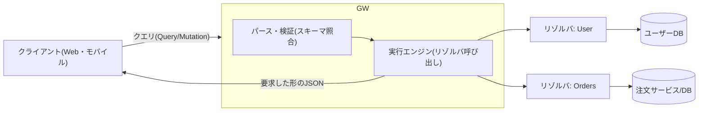
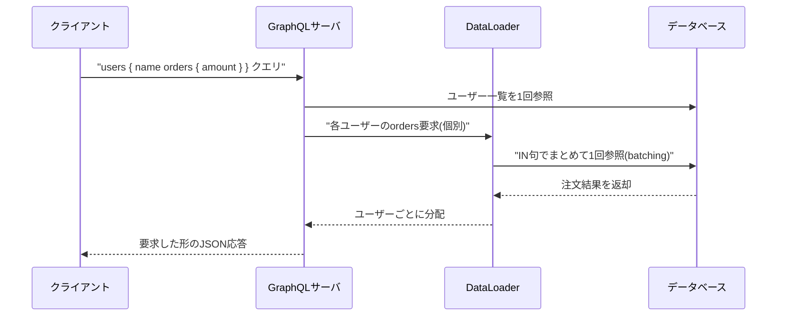

# GraphQL(グラフQL、APIクエリ言語)

## 1. 概要

### A. 定義

> **GraphQL**とは、クライアントが必要なデータの構造を自ら明示して要求すると、サーバがまさにその形(shape)で応答を返す、**API用のクエリ言語(query language)であり、ランタイム実行仕様**である。2015年にMeta(旧Facebook)が公開し、現在は中立的な財団(GraphQL Foundation)が仕様を管理している。

GraphQLの中核的な発想は、「サーバがあらかじめ定めた応答をクライアントが受け取る」という従来のAPI構造を逆転させることにある。RESTがリソース(resource)ごとにエンドポイントを設け、その応答形式をサーバが決定するのに対し、GraphQLは**単一エンドポイント(通常`/graphql`)**に強い型付けのスキーマ(schema)を置き、クライアントがそのスキーマの範囲内で必要なフィールドだけを組み合わせて問い合わせる。その結果、応答は要求したフィールドと正確に一致するJSONとして返される。すなわち「何をどのように取得するか」についての制御権が、サーバからクライアントへと移るのである。

このためGraphQLは、単なるプロトコルではなく、**型システム・クエリ言語・実行エンジン**をあわせて規定する契約(contract)中心の技術として理解すべきである。スキーマこそがAPIの仕様であり文書でもあり、フロントエンドとバックエンドがこのスキーマを共有契約として、独立して開発できるようになる。

### B. 登場背景と必要性

GraphQLは、モバイル環境の普及という具体的な問題意識から生まれた。多様な画面(iOS・Android・Web)が同じバックエンドを使い、画面ごとに必要なデータが少しずつ異なるが、これをRESTで支えると二つの慢性的な非効率が生じる。第一は**オーバーフェッチ(over-fetching)**であり、ユーザー名一つだけが必要でも、サーバが定めたユーザーオブジェクト全体(住所・登録日・設定など)を丸ごと受け取ることになる。第二は**アンダーフェッチ(under-fetching)**であり、一つの画面を描画するためにユーザー・注文・商品のエンドポイントをそれぞれ何度も呼び出さなければならない。特に移動通信網のように遅延が大きく帯域幅が制限された環境では、このラウンドトリップ(round-trip)のコストがユーザーの体感性能を大きく低下させる。

RESTが抱えるもう一つの困難は、**エンドポイントの急増とバージョン管理**である。画面の要求が増えるたびに`/user/{id}/summary`、`/user/{id}/detail`のような専用エンドポイントが増え、応答構造を変えるには`/v1`、`/v2`のようにAPI全体をバージョン分岐させなければならない。GraphQLはクライアントがフィールドを選択するため、画面が変わってもサーバのエンドポイントを追加する必要がなく、新しいフィールドを追加する進化的な変更が既存のクライアントを壊さないため、**バージョンレス(versionless)な進化**が可能となる。

整理すると、GraphQLは①ネットワークのラウンドトリップ・ペイロードの最小化、②多様なクライアントの異なる要求の受容、③強い型付けの契約によるフロント・バックエンドの分離開発、④スキーマに基づく自己文書化、という四つのニーズを同時に狙った技術である。ただし、この柔軟性はサーバ側の複雑度とキャッシュ・セキュリティの負担という代償を伴うため、導入はトレードオフに対する判断を前提とする。

## 2. GraphQLのアーキテクチャと実行構造

GraphQLシステムは、クライアントが送ったクエリ文書をサーバが**パース→検証→実行→応答**する流れで処理する。実行の中心には、スキーマと、各フィールドの値を実際に計算する関数である**リゾルバ(resolver)**がある。クライアントのクエリはツリー形式であり、サーバはこのツリーを上から下へとたどりながら各フィールドのリゾルバを呼び出して値を埋めていく。



上記の構造において、サーバは複数のソース(DB・マイクロサービス・外部API)を**一つのスキーマの背後に統合(aggregation)**する。クライアントはデータがどこから来るかを知る必要がなく、スキーマが約束したフィールドだけを要求し、各フィールドのリゾルバがその背後で適切なソースを呼び出す。この点で、GraphQLサーバはしばしば複数のバックエンドを束ねる**APIゲートウェイ兼組み合わせ層(BFF、Backend For Frontend)**の役割を兼ねる。

GraphQLが規定する操作(operation)は3種類である。**Query**はデータ参照(読み取り)であり副作用があってはならず、**Mutation**はデータ変更(書き込み)でありサーバの状態を変え、**Subscription**はサーバのイベントをクライアントが継続的に受信する(リアルタイムプッシュ、通常WebSocketベース)操作である。以下の表は3つの操作とRESTの対応を概念的に比較したものであるが、GraphQLではすべてが同一の単一エンドポイントで処理されるという点が本質的な違いである。

| 操作 | 目的 | 副作用 | RESTの類似概念 |
|------|------|----------|----------------|
| Query | 参照(読み取り) | なし(冪等) | GET |
| Mutation | 作成・更新・削除 | あり(状態変更) | POST/PUT/PATCH/DELETE |
| Subscription | リアルタイムイベント購読 | ストリーム受信 | WebSocket/SSE |

## 3. 中核構成要素 — スキーマ・型・リゾルバ

GraphQLの骨格は、**スキーマ定義言語(SDL、Schema Definition Language)**で記述する強い型付けのスキーマである。スキーマはAPIが提供する型とフィールドを宣言する契約書であり、クライアントが何を問い合わせることができ、どのような形で回答を受け取るかを確定させる。例えば次のように定義する。

```graphql
type User {
  id: ID!
  name: String!
  orders: [Order!]!
}
type Order { id: ID! amount: Int! }
type Query { user(id: ID!): User }
```

ここで`!`は非null(non-null)を、`[ ]`はリストを意味する。このように型が明示されるため、サーバはリクエストを実行する前にスキーマと照合して**静的検証**を行うことができ、クライアントツールはスキーマをダウンロードして自動補完・型生成・文書化を提供する。スキーマ自体を問い合わせることのできる**イントロスペクション(introspection)**機能のおかげで、GraphQL APIは別途の文書がなくても自らを説明する。

リゾルバは、スキーマの各フィールドが実際にどのような値を返すかを定義する関数である。実行エンジンはクエリツリーを走査し、親フィールドの結果を子リゾルバに渡す方式で値を埋めていく。この階層的な実行がGraphQLの強力さであると同時にリスクの源泉でもある。例えばユーザー一覧を参照し、各ユーザーの注文を再度参照すると、ユーザーがN人の場合に注文参照クエリがN回追加で発生する**N+1問題**が生じる。これを放置すると、一つの画面が数百件のDBクエリを引き起こしうる。

この問題の標準的な解決策が**DataLoader**パターンである。同一の実行サイクル内で発生する個別の参照要求をいったん集めて(batching)一度のクエリにまとめて処理し、同一キーに対する結果をキャッシュ(caching)する。例えばユーザー100人の注文をそれぞれ参照する代わりに、`WHERE user_id IN (...)`一回で処理し、クエリ数を101回から2回に減らす。このように、GraphQLの柔軟性を実務で扱うには、バッチ・キャッシュ戦略が事実上必須の構成要素となる。



## 4. RESTとの比較 — 違いが生じる理由と実務上の含意

GraphQLとRESTの優劣を単純に比較することは不適切であり、**違いがどこから生じるのか**を理解することが技術士の観点の核心である。両方式の根本的な分岐点は、「応答形式の決定権を誰が持つか」である。RESTはサーバがリソース表現を固定するため、キャッシュ・セキュリティ・学習コストの面で有利であるが、クライアントの多様性が大きくなるほど、オーバー/アンダーフェッチとエンドポイントの急増を避けにくくなる。GraphQLはクライアントが形を決めるため、ネットワーク効率とフロントエンドの生産性が高いが、その代償としてサーバの複雑度・キャッシュの難易度・クエリ乱用のリスクが大きくなる。

| 区分 | REST | GraphQL |
|------|------|---------|
| エンドポイント | リソースごとに多数 | 単一エンドポイント |
| データ取得 | サーバが形を決定(オーバー/アンダーフェッチ) | クライアントがフィールドを選択 |
| 型契約 | 別途の仕様(OpenAPI等) | スキーマ内蔵・強い型付け |
| キャッシュ | HTTPキャッシュを自然に活用(GET+URL) | アプリケーション層キャッシュの別途設計が必要 |
| バージョン管理 | `/v1`・`/v2`分岐の傾向 | フィールドの追加・廃止(deprecate)で進化 |
| 学習コスト・エコシステム | 低い・成熟 | 相対的に高い |

特に**キャッシュ**の違いは実務設計に大きな影響を与える。RESTはURLがリソースを一意に識別し、GETが冪等であるため、CDN・ブラウザ・プロキシが標準HTTPキャッシュをそのまま利用できる。一方GraphQLは、通常POSTの単一エンドポイントで多様なクエリがやり取りされるため、URLベースのキャッシュが無効化され、クライアントライブラリの正規化キャッシュ(例: オブジェクトの`id`基準)や永続化クエリ(persisted query)でキャッシュキーを作るなど、別途の戦略が必要となる。これは「GraphQLは常に速い」という通念が成り立たない代表的な理由である。

実務では、二者択一ではなく**併用**が一般的である。例えば、外部公開API・ファイルアップロード・単純なCRUDはRESTのままにし、複数のソースを組み合わせる必要がある複合画面やモバイルBFF層だけをGraphQLで構成する。国内外の事例としては、GitHubがRESTとあわせてGraphQL API(v4)を並行提供していること、Shopify・Netflixなどが内部サービスの組み合わせ層にGraphQLを採用していることが代表的である。

## 5. 深掘り — セキュリティ・性能上の脅威とフェデレーション

GraphQLの柔軟性は、そのまま**攻撃対象領域**となる。クライアントがクエリ構造を自由に組めるため、深くネストしたクエリ(例: `friends { friends { friends ... } }`)でサーバ資源を枯渇させる**クエリの深さ・複雑度攻撃**が可能である。これを防ぐため、実務では①最大クエリ深さ(depth)の制限、②フィールドごとのコストを合算して閾値を超えると拒否する**クエリコスト分析(query cost analysis)**、③事前登録されたクエリのみを許可する**永続化クエリ(persisted query)の許可リスト(allowlist)**、④レート制限(rate limiting)を組み合わせる。また、イントロスペクションは開発上の利便性を与えるが、本番環境では内部スキーマの露出を減らすために無効化することが推奨される。

認可(authorization)もまた、RESTとは異なるアプローチが必要である。RESTはエンドポイント単位で権限を設定できるが、GraphQLは一つのクエリが複数の型・フィールドにまたがるため、**フィールドレベル(field-level)の認可**が求められる。すなわち、リゾルバまたはスキーマディレクティブ(directive)で各フィールドについて呼び出し元の権限を検査しなければならず、これを欠落させると、権限のないユーザーがネストしたフィールドを通じて機微なデータにアクセスする欠陥が生じる。

大規模組織では、スキーマが肥大化する問題を**GraphQLフェデレーション(Federation)**で解決する。複数のチームがそれぞれ所有するサブグラフ(subgraph)を独立して運用し、ゲートウェイがそれを一つの統合グラフ(supergraph)に合成する。これはマイクロサービスの組織構造とスキーマの所有権を整合させ、単一の巨大スキーマを一つのチームがボトルネックとなって管理する状況を回避させる。ただしフェデレーションは、ゲートウェイでの合成コストと分散トレーシング(observability)の負担を新たに持ち込むため、組織規模とチーム境界が十分に大きい場合に正当化される。

## 6. 考慮事項および示唆点

第一に、**導入判断はトレードオフ分析から出発しなければならない。** GraphQLは、多様なクライアントが異なるデータを要求し、ネットワークのラウンドトリップがボトルネックとなる状況(モバイル・複合ダッシュボード・複数バックエンドの組み合わせ)で利点が大きい。逆に、単純なCRUD、強力なHTTPキャッシュが必要な公開API、ファイルストリーミング中心のサービスでは、RESTのほうが単純で安全である。「流行」ではなく、クライアントの多様性とデータ組み合わせの複雑度を基準に選択しなければならない。

第二に、**性能はタダではなく設計の結果である。** N+1問題に対するDataLoaderのバッチ処理、クエリ結果のキャッシュ、永続化クエリによるキャッシュキーの確保があわせて設計されなければ、GraphQLはかえってRESTよりも遅く重くなりうる。オブザーバビリティ(リクエストごとのリゾルバ実行時間・クエリ複雑度のモニタリング)を初期から確保しなければならない。

第三に、**セキュリティはフィールド単位で再設計しなければならない。** クエリの深さ・複雑度制限、永続化クエリの許可リスト、本番環境でのイントロスペクション統制、フィールドレベルの認可をデフォルトとすべきであり、これをアプリケーションコードだけに任せず、ゲートウェイ・スキーマディレクティブなどの共通層で強制することが望ましい。

第四に、**ガバナンスとスキーマ進化戦略が成否を分ける。** GraphQLはバージョン分岐の代わりに、フィールドの追加と`@deprecated`表示による段階的な進化を志向する。したがって、スキーマ変更の後方互換性チェック(schema check)をCIに含め、組織が大きくなればフェデレーションでスキーマの所有権を分散するなど、**APIを一つの製品のように管理する運用体制**が必要である。情報管理技術士の観点から、GraphQLは単一の技術ではなく、API契約・組織構造・性能・セキュリティが絡み合ったアーキテクチャ上の意思決定問題として扱うのが妥当である。

## 参考資料

- GraphQL公式仕様および学習資料: https://graphql.org/learn/
- GraphQL Specification (GraphQL Foundation): https://spec.graphql.org/
- Apollo GraphQL — Federation概要: https://www.apollographql.com/docs/federation/

---

> **一言まとめ**: GraphQLは、クライアントが強い型付けのスキーマの範囲内で必要なフィールドだけを選んで単一エンドポイントに問い合わせるAPI仕様であり、オーバー/アンダーフェッチとエンドポイントの急増を解消する一方、キャッシュ・セキュリティ・N+1性能の負担を設計で引き受けなければならないトレードオフの技術である。
