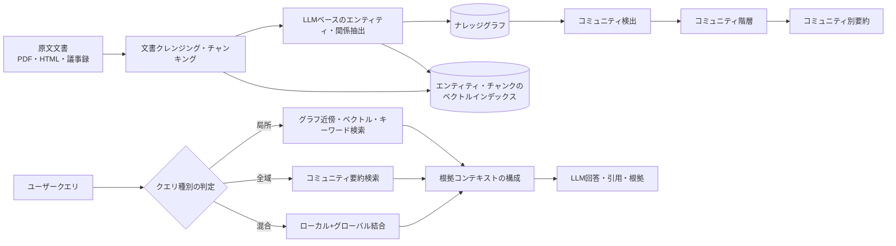
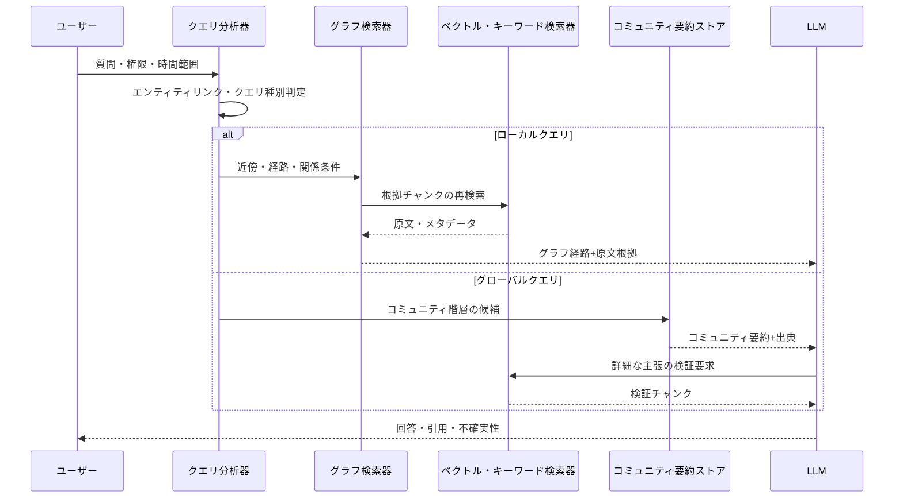

# GraphRAG(グラフ検索拡張生成)

## 1. 概要

### A. 定義

> **GraphRAG(Graph-based Retrieval-Augmented Generation)**とは、非構造化文書からエンティティと関係を抽出してナレッジグラフとコミュニティ要約を作成し、クエリの目的に応じてグラフ構造・原文・要約を検索し、大規模言語モデル(LLM)の回答根拠として提供する検索拡張生成アーキテクチャである。

一般的なRAGは、文書を一定のチャンクに分割したうえで埋め込みベクトルを生成し、クエリに近いチャンクを検索してLLMのコンテキストに投入する。
この方式は特定の事実や一段落の意味を見つけるには効果的であるが、複数の文書に散在する人物・組織・事件の関係を結び付けたり、コーパス全体に共通するテーマを要約したりする質問には限界がある。
検索されたチャンク同士が互いに接続されている保証がないため、LLMが結び付きを推論しなければならず、検索範囲を広げるとトークンコストとノイズが同時に増加する。

GraphRAGは、文書の意味を一つのベクトルだけで保存しない。
文書から抽出したエンティティと関係をグラフのノードとエッジとして表現し、接続されたエンティティの集合をコミュニティにまとめたうえで、コミュニティごとの要約を生成する。
クエリ処理時には、個々のエンティティの周辺をたどるローカル検索と、複数のコミュニティ要約を組み合わせるグローバル検索を区別して使用する。
したがってGraphRAGは、「最も類似した段落」だけでなく、「何が何と接続されており、その接続が全体の文脈においてどのような意味を持つか」を検索対象とする。

### B. 登場背景と必要性

第一に、企業の知識は一つの文書の中で完結していない。
障害報告書には症状が記録され、変更管理文書には原因が記録され、議事録には意思決定と担当組織が記録されるというように、同じ事象の手がかりが複数の文書に分かれている。
ベクトル検索だけを使うと、クエリと表現が似た文書を見つけることはできても、文書間の関係を安定して結び付けることは難しい。

第二に、「全資料で繰り返し現れるリスクは何か」といったグローバルなクエリは、上位のチャンクをいくつか返す方式とは相性が悪い。
すべての文書をLLMに投入するとコストとコンテキスト長の問題が生じ、単純な検索結果をつなぎ合わせても代表性や重複除去を保証することは難しい。
コミュニティの階層と要約をあらかじめ作成しておけば、クエリ時に全資料を読み直すことなく、集団レベルのパターンを探索できる。

第三に、グラフはデータの接続根拠と出典をあわせて管理するのに適している。
エンティティと関係に原文文書、ページ、抽出時点、信頼度といったprovenanceを結び付ければ、回答の根拠を追跡し、人がレビューすべき箇所を示すことができる。
ただし、グラフが自動生成されたという事実だけで正確性が保証されるわけではないため、抽出エラーと要約エラーを品質管理の対象として扱わなければならない。

### C. 特徴と適用範囲

GraphRAGの核心は、グラフデータベースを導入すること自体ではなく、検索単位を文書チャンクから構造化された知識と要約階層へと拡張することにある。
グラフはエンティティ間の経路、所属、依存関係、時間的順序を表現し、ベクトルインデックスは意味的類似度を補完する。
実際の実装では、グラフ検索、ベクトル検索、キーワード検索、原文検索を単一のパイプライン内で混合するハイブリッド構造が一般的である。

適用対象は、社内規程・ポリシーの照会、研究資料の探索、障害と変更の関連分析、サプライチェーンリスク分析、特許・論文調査のように、文書間の接続と集団的な要約が重要な領域である。
逆に、資料が少なく単純な事実を正確に探すサービスには、一般的なRAGのほうが安価で運用しやすい。
GraphRAGの導入は、「グラフを作れるか」よりも「グラフが追加する推論価値が構築・検証コストより大きいか」を基準に判断しなければならない。

## 2. 全体構造と処理フロー

### A. 参照アーキテクチャ

上記の構造は、インデックス作成段階とクエリ段階を分離している。
インデックス作成段階では、原文文書をクレンジングし、チャンクを作成し、LLMまたはルールベースの抽出器でエンティティ・関係・主張を生成する。
この結果は、グラフストア、原文ストア、ベクトルインデックスにそれぞれ異なる形で格納されるが、文書IDとチャンクIDを共通キーとして使用して出典を結び付ける。

グラフのノードは人・組織・システム・製品・事象・概念といったエンティティを表し、エッジは「所属する」「呼び出す」「影響を与える」「発生した」といった関係を表す。
関係には文書上の根拠と時間範囲をあわせて持たせる。
例えば「サービスAがデータベースBを呼び出す」という関係には、その事実が抽出された運用文書、観測日、抽出モデル、レビュー状態を付加属性として記録できる。

### B. インデックス作成段階

第一の段階は収集とクレンジングである。
PDFのヘッダ・脚注・表・スキャン画像が混在すると、その後のエンティティ抽出が誤るため、OCR、レイアウト保持、重複除去、言語検出、アクセス権限の継承を先に処理する。
文書自体のACLを失ったグラフは、検索精度以上に大きなセキュリティ問題を引き起こしうるため、原文チャンクとグラフ上の事実の両方にアクセス範囲を結び付けなければならない。

第二の段階は意味単位のチャンキングである。
固定長で区切るだけでは、条項、事象、表の行と列の関係が途切れる可能性がある。
見出し階層、段落境界、表のヘッダ、時間表現を活用して、「誰が何をいつ実行したか」が一つのチャンク内に保たれるよう設計する。
チャンクが大きすぎると抽出コストとノイズが増加し、小さすぎると関係の主語と目的語が分離するため、ドメインごとの実験が必要である。

第三の段階はエンティティと関係の抽出である。
LLMに許容されるエンティティ種別と関係種別のスキーマを提示してJSON構造で出力させつつ、形式検証と原文spanの検証を別途設ける。
同一の対象を「韓国電力」「韓電」「KEPCO」としてそれぞれ作成しないよう、正規化・同義語・識別子マッピングを適用する。
抽出結果が原文に実際に根拠を持つかを確認しなければ、グラフの接続がもっともらしい虚偽の事実を拡散させる経路となる。

第四の段階はコミュニティ検出と階層化である。
グラフのすべてのノードを個別に要約するのではなく、接続密度の高いノード集合をコミュニティとしてまとめ、下位コミュニティを上位コミュニティへと階層化する。
このとき、コミュニティのサイズと解像度(resolution)は、クエリコストと要約の凝集度との間の妥協点である。
大きすぎるコミュニティは要約が一般論に流れ、小さすぎるコミュニティはグローバルな質問に必要な文脈を失う。

第五の段階はコミュニティ要約の生成である。
要約には、主要エンティティ、関係、事象の流れ、繰り返される主張、例外と出典リストを含めるのが望ましい。
要約文だけを格納すると原文との結び付きが弱くなるため、要約を構成したグラフ要素と原文チャンクのIDをあわせて保存する。
要約モデルの表現が原文より強い断定に変わらないよう、「根拠あり」「推定」「相反」といった状態を分離する。

### C. クエリ段階

クエリが入力されると、まず質問の範囲と意図を分析する。
特定システムの障害原因を問う質問は、当該エンティティの近傍と時間的経路をたどるローカルクエリに近い。
一方、「プロジェクト全体で共通して現れた遅延原因は何か」は、複数のコミュニティを比較するグローバルクエリに近い。
クエリ種別の判定を誤ると、グローバルな質問に特定の文書だけで答えたり、ローカルな質問に不必要に多くの要約を投入したりすることになる。

ローカル検索は、クエリからエンティティを特定し、当該ノードのk-hop近傍、関連チャンク、ベクトル類似文書を組み合わせる。
関係の方向と時間範囲を反映すれば、「AがBに影響を与えた」と「BがAに影響を与えた」を区別できる。
検索結果は、グラフ経路と原文の引用がともに見えるように構成してこそ、LLMが接続を恣意的に補間する可能性を下げることができる。

グローバル検索は、コミュニティ要約を候補とし、複数の要約を部分的に比較・集計して回答コンテキストを作成する。
質問を細かな質問に分解したうえでコミュニティごとの回答を生成し、最後に重複と矛盾を調整する方式が活用される。
ただし、要約の階層を上がるほど詳細な根拠が圧縮されるため、最終回答には必要に応じて原文チャンクを再検索する検証段階を設ける。

## 3. 中核構成要素と設計原理

### A. グラフスキーマとオントロジー

スキーマは、どの対象をノードとし、どの接続を有効な関係として認めるかを定義する。
例えばIT障害のドメインでは、サービス、インフラ資源、デプロイ、障害、原因、担当チームをエンティティ種別とし、「デプロイされた」「呼び出す」「原因と推定される」「担当する」を関係種別とすることができる。
この分類が細かすぎると抽出と正規化のコストが増加し、単純すぎるとクエリにおいて重要な意味の違いが失われる。

初期にはドメイン専門家とともに最小限のスキーマを作成し、実際のクエリ失敗事例を分析しながら拡張していく段階的アプローチが安全である。
スキーマ変更は既存グラフの再抽出と要約の再生成を引き起こしうるため、バージョン、マイグレーションルール、互換性を管理する。
関係の時間性、信頼度、出典、有効期間を属性として表現すれば、現在の状態と過去の状態を区別できる。

### B. エンティティ解決と出典管理

エンティティ解決(entity resolution)とは、異なる表現が同じ対象を指しているかを判定するプロセスである。
名前の類似度だけを使うと、同姓同名や組織再編を誤って統合する可能性があるため、組織ID、システムID、住所、時点といった識別子属性をあわせて使用する。
自動統合は候補を作成し、高リスクの統合は人の承認を得る方式で運用する。

出典(provenance)は、グラフが何を知っているかよりも、なぜそのように知っているのかを説明する。
各ノード・エッジ・要約は、原文文書、ページまたは文字区間、抽出時刻、モデルバージョン、レビュー者、信頼度と結び付いていなければならない。
回答で出典を示す際は、グラフ経路だけを提示するのではなく、ユーザーが原文を開いて確認できる文書単位の引用をあわせて提供する。

### C. 検索の組み合わせとコンテキスト構成

グラフ検索は構造的な接続に強く、ベクトル検索は表現の異なる意味的類似性に強い。
キーワード検索は製品名・コード・法令条項のような正確なトークンに強いため、三つの方式を競わせるよりも、候補生成と再ランキングの段階で組み合わせる。
例えば、まずエンティティをリンクしたうえでグラフの近傍を展開し、各近傍に結び付いたチャンクをベクトル類似度と出典の信頼度で再ランキングすることができる。

コンテキストは、多く入れればよくなるというものではない。
重複したチャンクと異なる時点の矛盾した事実が一緒に入ると、LLMは最ももっともらしい文を選択してしまう可能性がある。
コンテキスト構成段階で、重複除去、時間フィルタ、ACLフィルタ、関係経路の最小化、相反する主張の表示を行い、回答プロンプトには根拠外の推論を禁止するルールを設ける。

## 4. 一般的なRAGとの比較および導入手順

### A. 比較

一般的なRAGとGraphRAGの違いは、ベクトルデータベースの有無ではなく、知識の表現単位と質問の範囲にある。
一般的なRAGはチャンクの意味的近接性を中心とするため、実装が単純でインデックス作成コストが低い。
GraphRAGは、グラフ抽出・正規化・コミュニティ要約という追加段階を通じて、文書間の構造と集団レベルの意味をあらかじめ計算しておく。

グラフベースのアプローチがすべてのクエリで優れているわけではない。
正確なマニュアルの文を探す質問は原文チャンク検索のほうが速く、データが頻繁に変わる環境ではグラフと要約の更新遅延が問題となる。
逆に、マルチホップ推論、全域的な比較、組織・事象・依存関係の接続を要求する質問では、GraphRAGの構造情報が検索候補と回答の説明力を高めうる。

| 比較項目 | 一般的なRAG | GraphRAG | 実務上の含意 |
|---|---|---|---|
| 基本単位 | 埋め込まれた文書チャンク | エンティティ・関係・コミュニティ・チャンク | 質問種別に応じて単位を選択 |
| 強み | 単純な事実検索、迅速な構築 | マルチホップ・グローバルクエリ、接続の説明 | グラフ構築の価値があるドメインを選別 |
| インデックス作成コスト | チャンキング・埋め込み中心 | 抽出・解決・検出・要約が追加 | 初期コストと更新コストを予算化 |
| 最新性 | 原文・ベクトルの更新中心 | グラフ・要約の同期が必要 | 増分更新と有効期間の設計 |
| 根拠表現 | 検索チャンクの引用 | 経路・要約・原文引用の結合 | provenanceを回答契約に含める |
| 主要リスク | 関連チャンクの欠落、断片化 | 抽出エラーの接続・増幅 | 原文検証と品質ゲートが必須 |

### B. 段階的導入手順

第1段階は、クエリと成功基準を定めることである。
代表的な質問をローカル・グローバル・混合の種別に分け、正答性・根拠性・完全性・レイテンシ・コストの目標を定める。
例えば、「特定障害の影響サービスと根拠文書は何か」と「直近1年間の共通障害原因は何か」を別々の評価セットとして構成する。

第2段階は、資料と権限を整備することである。
文書の所有者、保存期間、分類等級、ACL、バージョンを確認し、グラフノードが原文より広い権限を持たないよう、アクセスポリシーを継承させる。
個人情報や営業秘密を含む文書にはマスキング・トークン化・非識別化のポリシーを適用し、モデル提供者に送信される範囲を明確にする。

第3段階は、小規模なドメインでインデックス作成パイプラインを検証することである。
文書数の少ない障害管理や製品設計の領域で、エンティティ種別、関係種別、同義語、時間表現を定め、抽出結果をサンプリングして人がレビューする。
グラフ品質が基準を満たさない場合は、検索プロンプトを修正するよりも、スキーマ・チャンキング・原文クレンジングを先に改善する。

第4段階は、ハイブリッド検索と回答評価を運用に結び付けることである。
一般的なRAGを基本経路とし、グラフ検索が有利な質問だけをルーティングする方式から始めれば、コストとリスクを限定できる。
回答には根拠文書と不確実性を表示し、ユーザーのフィードバックを失敗クエリ・欠落エンティティ・誤った関係・古い要約に分類して、パイプラインの改善に反映する。

## 5. 事例と評価

### A. 障害ナレッジ分析の事例

仮想の大規模ショッピングプラットフォームが、障害報告書、デプロイ記録、モニタリングアラート、議事録を統合すると仮定する。
一般的なRAGは「決済遅延」に類似したチャンクを返すことはできるが、その遅延が特定のデプロイ後に始まり、メッセージキューの再試行急増とデータベース接続プールの枯渇を経て注文サービスへ伝播したという全体の経路を、安定して示すことは難しい。

GraphRAGは、決済サービス、デプロイバージョン、メッセージキュー、データベース、担当チームをノードとし、時系列の関係を記録する。
クエリが「今回の障害の最初の変化と影響範囲は何か」であれば、デプロイノードから障害ノードへつながる経路と関連チャンクをローカル検索する。
クエリが「前四半期の障害で繰り返された共通原因は何か」であれば、障害コミュニティごとの要約を比較し、再試行設定、容量不足、外部決済APIの遅延が繰り返されたかをグローバル検索する。

この事例の核心は、グラフが原因を自動的に確定するのではなく、調査可能な候補と根拠を結び付けてくれるという点である。
因果関係として表現されたエッジは、「観測上の前後関係」「担当者による確認」「実験による検証」といった状態を区別しなければならない。
そうしなければ、単なる時間的前後関係が確定的な原因として要約され、運用上の意思決定を誤らせる可能性がある。

### B. 評価指標とテスト

検索評価は、関連するエンティティ・関係・チャンクが検索結果に含まれているかを測定する。
回答評価は、事実性、根拠引用の正確性、質問のすべての条件を扱う完全性、相反する情報の処理、権限違反の有無をあわせて見る。
単一のスコアだけを最適化すると、引用は多いが質問に答えていない、あるいは回答は滑らかだが根拠がないといった問題が覆い隠される可能性がある。

オフライン評価セットには、正解経路が既知のローカルな質問、複数のコミュニティを総合する必要があるグローバルな質問、意図的に曖昧な質問、古い情報と最新情報が衝突する質問を含める。
オンラインでは、回答受容率のほか、根拠閲覧率、再質問率、誤った権限ブロックの件数、レイテンシとトークンコストを観察する。
新しいスキーマや抽出モデルを適用する際は、既存の評価セットを再実行し、グラフ品質のリグレッションを確認する。

## 6. 深掘り: コスト・最新性・運用の動向

GraphRAGのコストは、クエリ時のコストとインデックス作成時のコストに分けて見なければならない。
エンティティ・関係の抽出とコミュニティ要約は、大規模文書において初期コストを生むが、繰り返されるグローバルな質問に対するクエリコストを下げることができる。
逆に、文書が頻繁に変わる場合、毎回グラフ全体を再生成する方式は非効率であるため、変更された文書と影響を受けるコミュニティだけを更新する増分処理と再要約ポリシーが必要である。

ローカル検索とグローバル検索を一つの巨大なプロンプトで処理するよりも、クエリルータ、グラフ探索、ベクトル検索、要約の再検索を組み合わせるモジュール型設計のほうが運用上有利である。
低コストモデルは候補抽出と形式検証に使用し、高性能モデルは矛盾の調整と最終回答に限定的に使用する階層化も、コスト削減に役立つ。
ただし、モデルを分離するとモデルごとの抽出バイアスや表現の違いが生じるため、モデルバージョンと結果の互換性を記録しなければならない。

Microsoftの公式GraphRAGドキュメントはこのアプローチを構造化された階層型RAGとして説明しており、2026年8月時点の公開リポジトリのREADMEは、当該リポジトリが保守中心の状態であり、セキュリティ脆弱性への対応と依存関係の更新を優先すると案内している。
したがって、特定の実装をそのまま標準プラットフォームとして採用するよりも、グラフスキーマ・出典・評価セット・アクセス権限といった原理を、組織のデータ・LLMプラットフォームに独立して設計することが望ましい。
今後は、グラフとベクトルのハイブリッド検索、動的なコミュニティ選択、遅延要約、エージェントのツール呼び出しが結合する可能性が高いが、機能拡張よりも根拠の追跡可能性と更新の一貫性を優先しなければならない。

## 7. 考慮事項および示唆点

### A. 正確性・ハルシネーションの統制

グラフの構造性が回答の真実性を自動的に保証するわけではない。
LLMが誤って抽出したエンティティや関係が多くの文書と結び付くとエラーが増幅されうるため、原文spanの検証、関係の信頼度、人による承認、相反する主張の表示を品質ゲートとして設ける。
最終回答は根拠のない推論を分離し、確認されていない場合は「推定」や「追加確認が必要」と表現しなければならない。

### B. 最新性・同期

原文が変わったのにグラフとコミュニティ要約が残っていると、古い知識が最新の事実のように検索される。
文書バージョン、変更イベント、グラフへの影響範囲、要約の有効期限を管理し、高リスク業務ではクエリ時の原文再検証を義務化する。
バッチ更新だけでは不十分な領域には変更データキャプチャと増分再インデックスを導入しつつ、部分更新中のグラフをユーザーに露出させない一貫性ポリシーを定める。

### C. セキュリティ・個人情報・権限

グラフは文書に散在していた関係を一目で明らかにするため、原文よりもセンシティブな知識となりうる。
ノードとエッジにも文書のACL、テナント、保存期間、個人情報分類を継承させ、グラフの探索経路を通じて権限のない情報が推論されないかを別途テストする。
プロンプトインジェクションを含む文書がグラフの関係や要約を汚染しないよう、信頼境界、入力のサニタイズ、ツール呼び出し権限、監査ログを適用する。

### D. コスト・性能・スケーラビリティ

エンティティ抽出・関係抽出・要約に必要なLLM呼び出し回数と、グラフの格納・検索コストを、文書量、変更率、クエリ量に応じて見積もる。
コミュニティ要約をすべて最高解像度で作成するよりも、質問の頻度と重要度に応じて階層と更新周期に差をつけることができる。
大規模グラフではk-hop展開の幅、関係フィルタ、キャッシュ、事前計算された要約がレイテンシを左右するため、精度と応答時間をあわせて測定する。

### E. 組織・ガバナンス

グラフスキーマの所有者、ドメインごとのレビュー者、データ管理者、AIサービス運用者の責任を明確にする。
新しい関係種別を追加する際は、定義・例・禁止事例・品質基準を文書化し、モデルやプロンプトの変更を構成管理と評価承認の手続きに含める。
技術士の観点からは、GraphRAGを単なるチャットボット機能としてではなく、データガバナンス、ナレッジマネジメント、セキュリティ、MLOpsを結ぶ情報化アーキテクチャとして評価しなければならない。

## 参考資料

- Microsoft Research, “Project GraphRAG” — https://www.microsoft.com/en-us/research/project/graphrag/
- Microsoft Research, “GraphRAG: New tool for complex data discovery now on GitHub” — https://www.microsoft.com/en-us/research/blog/graphrag-new-tool-for-complex-data-discovery-now-on-github/
- Microsoft, “GraphRAG documentation” — https://microsoft.github.io/graphrag/
- Microsoft GraphRAG GitHub repository — https://github.com/microsoft/graphrag
- Edge et al., “From Local to Global: A Graph RAG Approach to Query-Focused Summarization” — https://arxiv.org/abs/2404.16130

---

> **一言まとめ**: GraphRAGは、エンティティ・関係・コミュニティ要約とハイブリッド検索を組み合わせ、文書間のマルチホップ推論と全資料に対するグローバルなクエリを支援するRAG拡張アーキテクチャであり、導入成功の鍵はグラフそのものよりも、出典・権限・最新性・評価をあわせて運用することにある。
