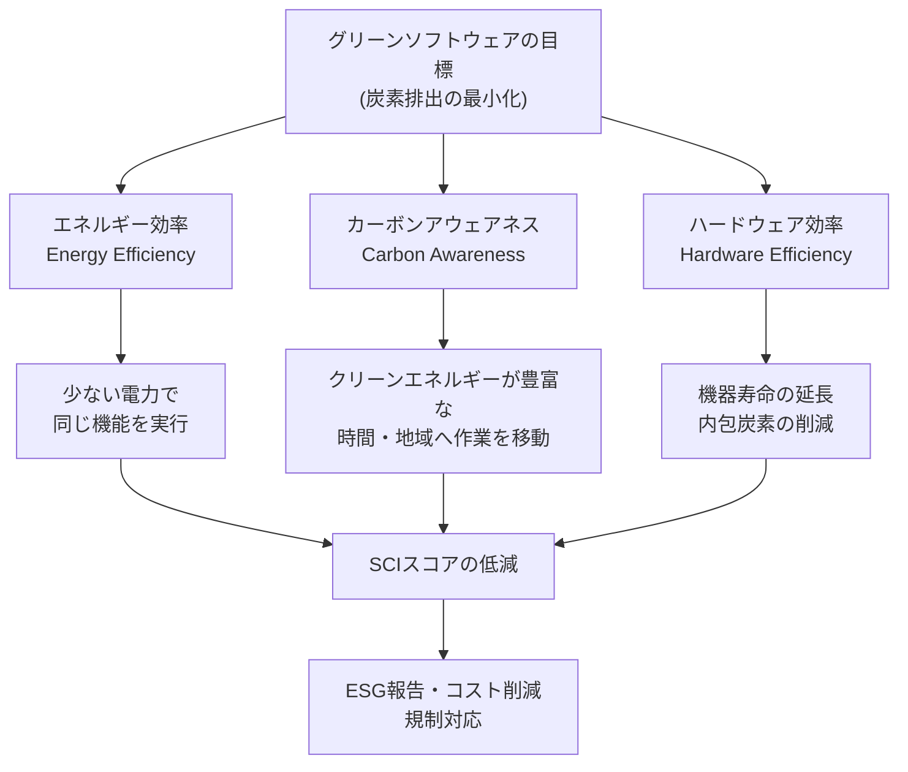
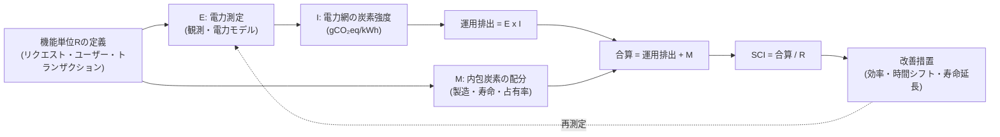

# グリーンソフトウェア(Green Software)と持続可能なソフトウェア工学

## 1. 概要

> **定義**: グリーンソフトウェアとは、設計・開発・デプロイ・運用・廃棄に至るソフトウェアライフサイクル全体において、電力消費と炭素排出を最小化するように作られたソフトウェアであり、持続可能なソフトウェア工学とは、性能・コスト・安定性とともに炭素効率(carbon efficiency)を第一級の品質特性として扱う工学的実践である。

情報システムは電力を消費する物理的なハードウェアの上で動作し、そのハードウェアは製造・輸送・廃棄の過程で再び温室効果ガスを排出する。
したがって、ソフトウェアは自ら煙突を持たないものの、サーバ・ネットワーク・端末の電力需要を決定するという形で、炭素排出を間接的に引き起こす。
かつてはこの排出がデータセンター運用者やハードウェアメーカーの責任とのみ考えられていたが、クラウドと生成AIが普及するにつれ、コード1行、クエリ1回、モデル推論1回がそのまま電力と炭素に換算される時代となった。
ソフトウェアエンジニアの設計上の選択が排出量を左右するという認識が、グリーンソフトウェアの出発点である。

グリーンソフトウェアが台頭した背景には、三つの圧力が重なっている。
第一に、ESG経営と各国のカーボンニュートラル(2050 Net-Zero)規制により、企業はScope 1・2だけでなく、協力会社・クラウドまで含むScope 3の排出を報告しなければならなくなった。
第二に、生成AIの学習・推論が急増し、データセンターの電力需要が国家の電力網を圧迫するレベルにまで大きくなり、電力コストが運用コスト(FinOps)に直結するようになった。
第三に、ISO/IEC 21031:2024(SCI)のような国際標準が制定され、「環境に優しい」という曖昧なスローガンが測定可能な指標へと転換された。
これら三つの圧力は、グリーンソフトウェアを道徳的な選択ではなく、規制対応・コスト削減・技術競争力が結合した経営課題へと変えた。

それゆえ、持続可能なソフトウェア工学は、単に「コードを軽く書こう」という節約キャンペーンではない。
それは、アーキテクチャ決定、デプロイ戦略、運用スケジューリング、ハードウェアの寿命管理、さらには組織の測定・報告体制までを包括する総合的な管理体系である。

## 2. グリーンソフトウェアの中核原則と全体構造

グリーンソフトウェア財団(Green Software Foundation、2021年にLinux Foundation傘下で発足)は、排出削減を三つの原則に整理している。
これらの原則は互いに補完的であり、一つだけを適用すると別の箇所で排出が増える風船効果が生じうるため、統合的に考慮しなければならない。

### A. エネルギー効率(Energy Efficiency)

エネルギー効率とは、同じ機能をより少ない電力で実行できるようにする原則である。
アルゴリズムの計算量を下げ、不要な演算・ネットワークのラウンドトリップ・重複レンダリングを除去し、遊休資源の消費を減らすことが核心である。
例えば、O(n²)のソートをO(n log n)に変えたり、N+1クエリをバッチ参照に統合したりすれば、CPU占有時間が減り、ただちに電力が削減される。
サーバレス・オートスケーリングによって遊休インスタンスをなくすことも、エネルギー効率の代表的な事例である。

注意すべき点は、エネルギー効率が常に性能と一致するわけではないということである。
高速な応答のために資源を過剰にプロビジョニングすると、性能は向上するが遊休電力が増える。
逆に、過度な圧縮・遅延処理は、かえってCPU使用量を増やすことがある。
したがって、エネルギー効率は「処理量あたりの電力(watt per request)」のような単位指標で測定し、性能とのバランス点を見出さなければならない。

実務では、プロファイリングによって電力のホットスポット(hotspot)を見つけ、キャッシュ・インデックス・バッチ化によって反復演算を除去し、コードレベルではコンパイル言語・軽量ランタイムの選択まで検討する。
韓国のある大手EC事業者は、商品レコメンデーションのバッチを夜間の一括実行から増分処理へと変更し、演算量を大幅に削減した事例を報告している。

### B. カーボンアウェアネス(Carbon Awareness)

カーボンアウェアネスは、「いつ・どこで」演算を行うかによって、同じ電力でも排出量が異なるという点を利用する。
電力網の炭素強度(gCO₂eq/kWh)は、時間帯と地域によって大きく変動する。
太陽光の強い日中や風力の多い時間帯にはクリーン電力の比率が高いため排出係数が低く、火力発電が主力となる深夜のピーク時間帯には高くなる。

この原理を利用した二つの実践が、時間シフト(demand shifting)と場所シフト(demand shaping)である。
時間シフトは、急を要しないバッチ作業(バックアップ、レポート生成、モデル再学習)を炭素強度の低い時間帯にスケジューリングすることである。
場所シフトは、レイテンシ制約が許容する範囲で、クリーン電力の比率が高いリージョンにワークロードを配置することである。
例えば、MicrosoftやGoogleは、リアルタイムの電力網炭素シグナルを受け取って学習ジョブの実行時点を調整するcarbon-awareスケジューリングを運用していると公表している。

カーボンアウェアネスは総電力使用量を削減しないため、必ずエネルギー効率と併用しなければならない。
また、レイテンシに敏感なオンライントランザクションには適用しにくく、移動可能な遅延許容(deferrable)ワークロードに限定されるという限界がある。

### C. ハードウェア効率(Hardware Efficiency)と内包炭素

ハードウェア効率とは、機器を製造・廃棄する際に発生する内包炭素(embodied carbon)を削減する原則である。
サーバやスマートフォンの炭素排出の相当部分は、使用中の電力ではなく、製造段階ですでに確定している。
したがって、機器の寿命を延ばし、古いハードウェアでもソフトウェアが円滑に動作するよう維持し、サーバの利用率(utilization)を高めて必要な物理機器の台数を減らすことが核心である。

ソフトウェアの観点から、ハードウェア効率は二つの方向で実現される。
第一に、頻繁な強制アップグレードによって旧型端末を早期に廃棄させないよう、後方互換性と軽量クライアントをサポートすることである。
第二に、コンテナの集積度(bin-packing)とマルチテナンシーによって物理サーバの利用率を高め、遊休機器をなくすことである。
仮想化・コンテナオーケストレーションがグリーンITの基盤技術として挙げられる理由はここにある。

## 3. 測定標準: SCI(Software Carbon Intensity)とSCI算定プロセス

「測定できなければ改善できない」という原則に従い、グリーンソフトウェアの中心には標準化された測定指標がある。
グリーンソフトウェア財団が開発し、2024年3月に国際標準**ISO/IEC 21031:2024**として制定されたSCI(Software Carbon Intensity)がその代表である。
SCIは総量やオフセット(offset)を扱わず、機能単位あたりの炭素排出の**比率(rate)**を算出する点が特徴である。

SCIの基本算式は次のとおりである。

> **SCI = ((E × I) + M) / R**
> - E: ソフトウェアが消費したエネルギー(kWh)
> - I: 当該電力網のロケーションベースの限界炭素強度(gCO₂eq/kWh)
> - M: ハードウェアの製造・廃棄から配分された内包炭素(gCO₂eq)
> - R: 機能単位(functional unit) — ユーザー1人、API呼び出し1回、トランザクション1件など

ここで(E × I)は使用段階の運用排出を、Mはハードウェアの内包排出を表し、これを機能単位Rで割ることで「リクエスト1件あたり何グラムのCO₂を排出するか」を定量化する。
比率として定義されるため、サービスが成長して総排出量が増えても、SCIが低下していれば単位効率が改善したと解釈できる。
これは、成長と脱炭素をあわせて追跡しようとする組織に特に有用である。

SCIの算定は、機能単位の定義 → 境界の設定 → E・I・Mの算出 → 機能単位による正規化 → 改善・再測定という循環プロセスで進める。
最も難しい段階は、M(内包炭素)の配分とE(電力)の正確な計測である。
電力は、直接計測が困難なクラウド環境では、CPU使用率ベースの電力モデルやクラウド事業者の排出ダッシュボードで推定し、推定方法と境界を透明に公開することが標準の要求事項である。

## 4. グリーンITとの関係および比較

グリーンソフトウェアは、より広いグリーンIT(Green IT)の一翼である。
グリーンITがデータセンターの冷却、再生可能エネルギーの調達、ハードウェアのリサイクルなど物理インフラ中心であるのに対し、グリーンソフトウェアはそのインフラの上で動くコードと運用方式を扱う。
両者の違いは、改善のてこが異なる点にある。
インフラ効率はPUE(電力使用効率)のような施設指標で管理されるが、いかにPUEが低くても、非効率なコードが不要な演算を引き起こせば総排出量は減らない。

| 区分 | グリーンIT(ハードウェア・インフラ) | グリーンソフトウェア | カーボンアウェア・コンピューティング |
|------|--------------------------|------------------|-------------------|
| 焦点 | データセンター・機器の効率 | コード・アーキテクチャ・運用 | 実行時点・場所 |
| 代表指標 | PUE, WUE | SCI, watt/request | 電力網の炭素強度 |
| 主体 | 施設・インフラチーム | 開発・アーキテクト | 運用・スケジューラ |
| 限界 | コードの無駄を統制できない | 施設の排出を統制できない | 総量は減少しない |

この表が示すように、三つの領域は代替財ではなく補完財である。
例えば、再生可能エネルギー100%のデータセンターであっても、世界的に電力が不足していれば、節約されたクリーン電力を他所が使えるため、ソフトウェアの効率化は依然として社会的価値を持つ。
結局、持続可能性は、施設・ソフトウェア・運用がSCIという共通言語で協働するときに実現される。

## 5. 深掘り: 生成AI時代の持続可能性と最新動向

生成AIの普及は、グリーンソフトウェアを選択ではなく必須の議題へと押し上げた。
大規模言語モデルの学習では数千基のGPUを数週間稼働させ、推論もまたサービス規模が大きくなると累積電力が学習を上回る。
したがって最近の議論は、学習よりも**推論段階の炭素効率**と、それを企業の温室効果ガスインベントリ(特にScope 3)に反映する方法論へと移りつつある。

AIの持続可能性の実践は、前述の三原則と結び付いている。
エネルギー効率の面では、モデルの軽量化(量子化・プルーニング・知識蒸留)、小型特化モデル(sLLM)の採用、バッチ推論とKVキャッシュの再利用が電力を大きく削減する。
カーボンアウェアネスの面では、遅延許容な学習・再学習をクリーン電力の時間帯・リージョンにスケジューリングする。
ハードウェア効率の面では、GPU利用率を高めるマルチテナンシーと推論専用アクセラレータの採用が、内包炭素あたりの処理量を改善する。

標準・政策の動向も急速に動いている。
ISO/IEC 21031(SCI)の国際標準化(2024)に続き、クラウド事業者は顧客別の炭素ダッシュボード(例: AWS Customer Carbon Footprint Tool、Microsoft Emissions Impact Dashboard、Google Cloud Carbon Footprint)を提供し、SCI・GHGプロトコルとの整合を強化している。
CNCFなどのオープンソース陣営でも、ワークロードの炭素・電力を観測するツール(Keplerなど)やgreen-reviewsのようなベンチマーキングが広がっており、オブザーバビリティ(Observability)の範囲が性能・コストを超えて炭素へと拡張される傾向にある。

情報管理技術士の観点から予想される出題方向は次のとおりである。
概念型としては「グリーンソフトウェアの3大原則とSCI算式の説明」、論述型としては「生成AIサービスの炭素効率改善戦略」または「SCIに基づく持続可能なアーキテクチャの設計方策」が有力である。
答案構成の際は、原則→測定(SCI)→アーキテクチャ/運用への適用→トレードオフ→ガバナンスの流れで展開し、ESG・FinOps・Observabilityとの連携に必ず言及することが高得点の戦略である。

## 6. 考慮事項および示唆点

第一(測定の信頼性とグリーンウォッシングの防止)に、炭素指標は推定に依存する場合が多く、境界・前提・データの出典を透明に公開しなければ、グリーンウォッシング(green-washing)の批判にさらされる。
技術士は、SCIの機能単位と算定境界を明確に定義し、オフセット(offset)に頼るよりも実際の削減(abatement)を優先するよう組織を設計しなければならない。

第二(トレードオフの管理)に、炭素効率は性能・可用性・コスト・開発生産性と衝突しうる。
過度な時間シフトはSLAを脅かし、行き過ぎた軽量化は品質低下を招く。
したがって、炭素を単一の目標として押し進めるよりも多目的最適化問題として扱い、遅延許容ワークロードとリアルタイムワークロードを区別して差別的に適用する判断が必要である。

第三(ガバナンスと組織への内在化)に、持続可能性は一過性のキャンペーンではなく、アーキテクチャレビュー・CIパイプライン・SRE運用にカーボンバジェット(carbon budget)とSCIゲートを組み込むことで持続する。
FinOpsのコストガバナンス体系を拡張し、コストと炭素をあわせて管理するグリーンオプス(GreenOps)へと発展させるアプローチが効果的である。

第四(連携技術と展望)に、グリーンソフトウェアは、クラウドネイティブ(オートスケーリング・サーバレス)、Observability(Kepler・OpenTelemetry)、FinOps、ESG開示(ISSB・CSRD)と密接に噛み合っている。
今後は、SCIがSBOMのようにソフトウェアサプライチェーンの標準成果物として定着し、調達・契約要件に炭素指標が含まれる方向へ発展すると予想される。
技術士は、こうした規制・標準の変化を先取りしてアーキテクチャと組織プロセスに反映する役割を果たさなければならない。

## 参考資料

- Green Software Foundation, "SCI — Software Carbon Intensity" — https://greensoftware.foundation/standards/sci/
- Software Carbon Intensity (SCI) Specification — https://sci.greensoftware.foundation/
- ISO/IEC 21031:2024, Information technology — Software Carbon Intensity (SCI) specification — https://www.iso.org/standard/86612.html
- Green-Software-Foundation/sci (GitHub) — https://github.com/Green-Software-Foundation/sci
- CNCF green-reviews-tooling, SCI測定ドキュメント — https://github.com/cncf-tags/green-reviews-tooling/blob/main/docs/measurement/sci.md

---

> **一言まとめ**: グリーンソフトウェアは、エネルギー効率・カーボンアウェアネス・ハードウェア効率の3大原則によってソフトウェアライフサイクルの炭素排出を削減する工学であり、ISO/IEC 21031(SCI)で機能単位あたりの排出を測定し、ESG・FinOps・Observabilityと連携して持続可能性をガバナンスとして内在化する。
