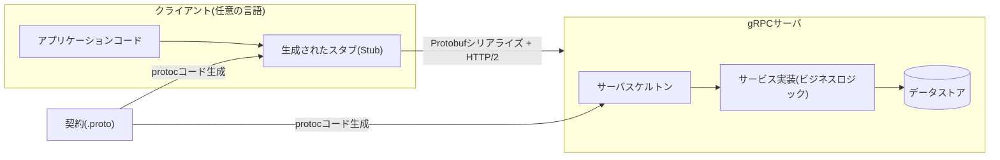
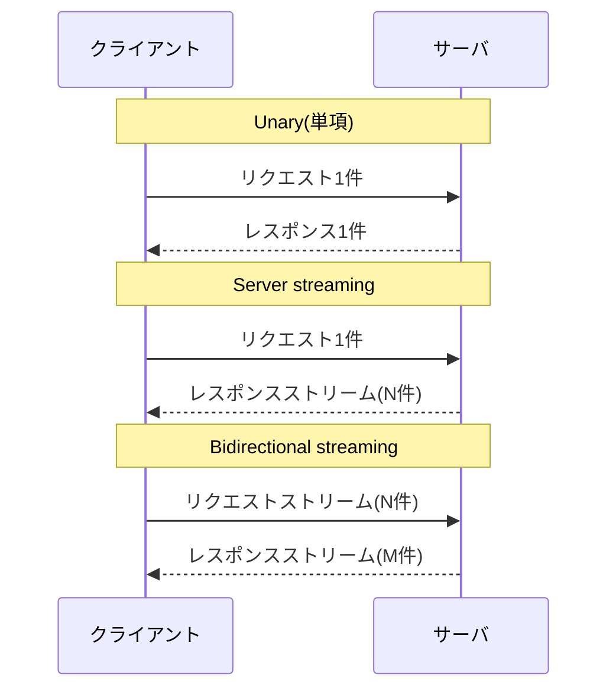

# gRPC(GoogleのRPCフレームワーク)

## 1. 概要

### A. 定義

> **gRPC**とは、異なるプロセス・サーバが、あたかもローカル関数を呼び出すかのようにリモートの関数を呼び出せるようにする**高性能なリモートプロシージャコール(RPC、Remote Procedure Call)フレームワーク**である。インタフェースを**Protocol Buffers(プロトバフ)**という言語中立のIDLで定義し、その定義からクライアント・サーバのコードを自動生成し、伝送は**HTTP/2**上でバイナリ(binary)シリアライズによって行う。2015年にGoogleが社内RPC体系(Stubby)を再設計して公開し、現在はCNCF(Cloud Native Computing Foundation)が管理している。

gRPCの中核的な発想は、「ネットワーク呼び出しをローカル関数呼び出しのように扱おう」というRPCの伝統を、現代的なインフラの上に蘇らせたことにある。RESTが「リソース(resource)をURLで表現し、HTTPメソッドで操作する」リソース指向であるのに対し、gRPCは「何をするか」という**振る舞い(メソッド)指向**である。開発者は`GetUser(UserRequest) returns (UserReply)`のようなサービス契約を先に宣言し、ツールがその契約から双方の言語(Go・Java・Python・C++など)のスタブ(stub)を生成してくれる。その結果、クライアントはネットワーク・シリアライズの詳細を知らなくても、生成されたメソッドを呼び出すだけでよい。

このためgRPCは、単なる通信プロトコルではなく、**IDL(契約)・コード生成・シリアライズ・伝送・認証**を一つに束ねた統合仕様として理解すべきである。`.proto`ファイルがそのままAPIの唯一の信頼できる情報源(single source of truth)となり、多言語のマイクロサービスがこの契約を共有しながら、独立して開発・デプロイできるようになる。

### B. 登場背景と必要性

gRPCは、大規模マイクロサービスアーキテクチャ(MSA)の普及という具体的な問題意識から生まれた。数百〜数千のサービスが毎秒膨大な回数で互いを呼び出す環境では、テキストベースのJSON/RESTは三つの慢性的なコストを引き起こす。第一は**シリアライズ・ペイロードのコスト**であり、JSONは人が読みやすい反面、フィールド名がメッセージごとに繰り返され、パースが遅い。第二は**接続のコスト**であり、HTTP/1.1はリクエスト-レスポンスが一つの接続上で逐次的であるため、大量の内部通信ではラウンドトリップ(round-trip)の遅延が累積する。第三は**契約の脆弱性**であり、RESTのJSONはスキーマの強制が弱く、フィールド名の誤記や型の不一致が実行時になって初めて明らかになる。

gRPCはこれに対し、①Protobufのバイナリシリアライズでペイロードを大幅に削減し、②HTTP/2の単一接続多重化(multiplexing)で多数の呼び出しを同時に処理し、③強い型付けのIDLでコンパイル時点に契約の不一致を捕捉する、という方法で正面から対応する。特にストリーミング(streaming)をプロトコルレベルで第一級の機能としてサポートし、リアルタイムのデータフィード・双方向通信のようにRESTが扱いにくいパターンを自然に表現する。

整理すると、gRPCは①低レイテンシ・高スループットの内部通信、②多言語(polyglot)サービスの契約ベースの統合、③ストリーミングを含む多様な呼び出しモデル、④コード生成による開発生産性、という四つのニーズを同時に狙っている。ただし、バイナリ形式であるため人がすぐに読むことが難しく、ブラウザから直接呼び出しにくいという代償を伴うため、導入は利用文脈(内部か外部公開か)に対する判断を前提とする。

## 2. gRPCのアーキテクチャと呼び出しフロー

gRPCシステムは、`.proto`契約をコンパイラ(`protoc`)で処理して**クライアントスタブ**と**サーバスケルトン**を生成し、実行時にこの二つがHTTP/2チャネルで接続されてメッセージをやり取りする構造である。クライアントはスタブのメソッドを呼び出し、gRPCランタイムが引数をProtobufでシリアライズしてHTTP/2フレームで送信し、サーバはそれをデシリアライズして実際の実装を実行した後、応答を同じ経路で返す。



上記の構造の要諦は、**契約(.proto)が双方のコードを同時に規定する**という点である。クライアントとサーバが異なる言語・チームであっても同じ`.proto`を共有するため、フィールドの追加・型の変更といった契約の変化がコード生成段階で双方に一貫して反映される。これは「文書と実装の不一致」というAPI運用の慢性的な病を構造的に減らしてくれる。

gRPCの呼び出しは、伝送層において**HTTP/2**に強く依存する。HTTP/2が提供する①一つのTCP接続上で複数のリクエストを同時に運ぶストリーム多重化、②ヘッダ圧縮(HPACK)、③サーバプッシュ・フロー制御が、gRPCの低レイテンシ・ストリーミングを可能にする土台である。以下の表は、REST(HTTP/1.1・JSON)と比較した伝送・シリアライズの特性を概念的に比較したものであるが、実際の性能差はメッセージサイズ・言語・ネットワークによって異なるため、絶対的な数値ではなく傾向として理解すべきである。

| 区分 | gRPC | 従来のREST(HTTP/1.1) |
|------|------|------------------------|
| 契約(IDL) | `.proto`(強い型付け、必須) | OpenAPI(任意、緩い) |
| シリアライズ | Protobuf(バイナリ) | JSON(テキスト) |
| 伝送 | HTTP/2(多重化) | 主にHTTP/1.1 |
| ストリーミング | 4種を標準サポート | 別途(SSE/WebSocket) |
| 可読性 | 低い(バイナリ) | 高い(人が読める) |
| ブラウザからの直接呼び出し | 限定的(gRPC-Webが必要) | 容易 |

## 3. 中核構成要素 — Protobuf・サービス契約・4つの呼び出しモデル

gRPCの骨格は、**Protocol Buffers**で記述する強い型付けのメッセージ・サービス定義である。`.proto`ファイルでメッセージ(データ構造)とサービス(呼び出し可能なメソッドの集合)を宣言し、各フィールドには**フィールド番号(tag)**を付与する。この番号はバイナリエンコーディングのキーとなるため、一度デプロイした番号は再利用しないことが後方互換性の中核ルールである。例えば次のように定義する。

```protobuf
syntax = "proto3";
message UserRequest { int32 id = 1; }
message UserReply { int32 id = 1; string name = 2; }
service UserService {
  rpc GetUser(UserRequest) returns (UserReply);
}
```

ここでフィールド番号(1, 2)は順序・名前が変わっても維持されるため、**新しいフィールドを大きな番号で追加する**進化的な変更は既存のクライアントを壊さない。この「番号ベースの後方互換性」が、RESTのJSONよりも契約の進化を安全にする中核的な仕組みである。逆に、フィールド番号を再利用したり型を変えたりすると、バイナリの解釈がずれてサイレント(silent)なデータ破損が生じうるため、組織レベルでの`.proto`変更規律が必ず必要である。

gRPCが規定する呼び出しモデルは四つであり、これはストリーミングをプロトコルの第一級機能に引き上げたgRPCの差別化要素である。**Unary(単項)**は1リクエスト-1レスポンスであり、RESTに類似する。**Server streaming(サーバストリーミング)**は1リクエストに対してサーバが複数のレスポンスを順次送信するもので、大容量の参照・購読に用いる。**Client streaming(クライアントストリーミング)**はクライアントが複数のメッセージを送り、サーバが一つで応答するもので、アップロード・集計に適している。**Bidirectional streaming(双方向ストリーミング)**は双方が独立してストリームをやり取りするもので、チャット・リアルタイム協業のような対話型に用いる。



## 4. 比較と適用 — REST・GraphQLとどのように分かれるか

gRPCをREST・GraphQLと分ける基準は、「誰が・どこから呼び出すか」という利用文脈である。gRPCの強み(バイナリ効率・強い型付け・ストリーミング)は**サービス間の内部通信**で最大化されるが、バイナリ形式であるため人がブラウザの開発者ツールですぐに読むことは難しく、ブラウザはHTTP/2フレームを直接扱えないため、**gRPC-Web**というプロキシ層を経由しなければならない。このため、実務で支配的なパターンは「外部公開APIはREST/GraphQL、内部マイクロサービス間はgRPC」という役割分担である。

違いが生じる根本的な理由は、最適化の目標が異なるためである。RESTは**汎用性と可読性**(Webエコシステム・キャッシュ・人の理解)を、GraphQLは**クライアント主導のデータ組み合わせ**(オーバー/アンダーフェッチの解消)を、gRPCは**マシン対マシンの低レイテンシ・高スループット**をそれぞれ優先する。したがって、いずれか一つが絶対的に優れているのではなく、トラフィックの性格(内部/外部)、利用者(人/マシン・ブラウザ/サーバ)、データパターン(単件/ストリーム)に応じて選択しなければならない。以下の表はこの判断を要約したものである。

| 観点 | gRPC | GraphQL | REST |
|------|------|---------|------|
| 最適な用途 | 内部サービス間通信 | 多様なクライアントの組み合わせ参照 | 公開・汎用Web API |
| 利用者 | サーバ・マイクロサービス | Web・モバイルのフロントエンド | 広範な外部 |
| 性能(内部) | 非常に高い | 中程度 | 中程度 |
| ストリーミング | 強い(双方向) | Subscription | 別途必要 |
| 学習・運用の負担 | 高い(ツール・バイナリ) | 中程度 | 低い |

具体的な適用事例として、Netflix・Googleなどの大規模事業者は、数千の内部サービス間の呼び出しをgRPCで処理してレイテンシと帯域幅を削減し、サービスメッシュ(Istio・Linkerd)と組み合わせて観測・セキュリティ・トラフィック制御を上乗せしている。また、**Kubernetes**自体がコントロールプレーンのコンポーネント間通信と状態ストア(etcd)へのアクセスにgRPC系の通信を広範に使用しているという点は、gRPCがクラウドネイティブインフラの事実上の標準的な内部通信手段として定着したことを示している。

## 5. 深掘り — エラー処理・認証・gRPC-Webと最新動向

gRPCは、成功/失敗をHTTPステータスコードではなく**独自のステータスコード(status code)**で表現する。`OK`、`NOT_FOUND`、`INVALID_ARGUMENT`、`DEADLINE_EXCEEDED`、`UNAVAILABLE`などの標準コードにメッセージ・詳細(detail)を載せて返すため、多言語のクライアントがエラーを一貫して処理できる。また、**デッドライン/タイムアウト(deadline)**を呼び出し単位で伝播(propagation)させ、上流の呼び出しが定めた締め切り時刻を下流のサービスまで引き継がせることで、大規模な呼び出しチェーンにおける無限待機と資源枯渇を構造的に防ぐ。セキュリティ面では、**TLSを基本前提**としてチャネルを暗号化し、トークン・相互TLS(mTLS)・インターセプタ(interceptor)による認証・認可・ロギングを標準的に組み合わせる。

ブラウザの制約を回避するための**gRPC-Web**は、ブラウザが送るHTTP/1.1互換のリクエストを、プロキシ(Envoyなど)がgRPCに変換する方式である。ただし、ブラウザの制約によりクライアントストリーミング・双方向ストリーミングは完全にはサポートされない場合があるため、フロントエンド向けにはREST/GraphQLを、フロント-バックエンドのゲートウェイ以降の内部ではgRPCを使う階層的構成が一般的である。関連して、**gateway**ツールで一つの`.proto`からREST(JSON)とgRPCを同時に公開する二重インタフェース戦略も広く使われている。

最新動向としては、サービスメッシュとの組み合わせによって**オブザーバビリティ(トレーシング・メトリクス)**をアプリケーションコードの外で確保する流れ、負荷分散をクライアント側で行う**クライアントサイドロードバランシング**、そしてステートレスなイベント処理との組み合わせが目立つ。ただし、こうした機能・バージョン・実装の詳細は進化し続けているため、実際の採用時にはその時点の公式ドキュメントでサポート範囲を確認することが望ましい。

## 6. 考慮事項および示唆点

技術士の観点から、gRPCの導入は次の戦略・トレードオフをあわせて判断しなければならない。

- **適用境界の明確化**: gRPCは万能の代替手段ではなく、「内部サービス間の低レイテンシ通信」という強みの領域が明確である。外部公開・ブラウザで利用されるAPIまで無理にgRPCへ統一すると、gRPC-Webプロキシ・可読性の低下によって、かえって総所有コストが増えうる。**外部はREST/GraphQL、内部はgRPC**という階層的標準をアーキテクチャ原則として確定させるのが現実的である。

- **契約(.proto)のガバナンス**: フィールド番号の再利用禁止、後方互換性ルール、スキーマレジストリ(schema registry)・CI検証など、`.proto`の変更を組織レベルで規律しなければならない。契約はそのまま複数チームの共有資産であるため、変更レビュー・バージョンポリシー・互換性テストをパイプラインに内在化することが安定運用の鍵である。

- **オブザーバビリティ・運用成熟度**: バイナリプロトコルは、人が目でデバッグすることが難しい。分散トレーシング(OpenTelemetry)・構造化ロギング・メトリクスをインターセプタ/サービスメッシュで確保し、デッドライン・リトライ(retry)・サーキットブレーカ(circuit breaker)のポリシーを標準化してこそ、大規模な呼び出しチェーンにおける障害伝播を統制できる。

- **組織の能力と学習曲線**: コード生成・ツールチェーン・HTTP/2の理解など、参入障壁がRESTよりも高い。パイロットサービスで検証し、社内標準のスキャフォールディング・テンプレート・教育を並行して段階的に導入することがリスクを下げる。

- **展望と連携技術**: gRPCはクラウドネイティブ(Kubernetes・サービスメッシュ)の事実上の内部標準として定着しており、オブザーバビリティ・ゼロトラスト(mTLS)・イベント駆動アーキテクチャとの結合が拡大する傾向にある。APIゲートウェイ・BFF層でプロトコル変換(gRPC↔REST)を吸収する設計が、人とマシンの双方の利用者を同時に満足させる実務上の解決策として定着しつつある。

---

> **一言まとめ**: gRPCは、`.proto`の強い型付け契約とコード生成、Protobufのバイナリシリアライズ、HTTP/2の多重化・ストリーミングを組み合わせて**マイクロサービス間の低レイテンシ・高スループット通信**を実現するRPCフレームワークであり、外部公開用のREST/GraphQLと役割を分担し、「内部はgRPC」という階層的API戦略の軸をなす。
