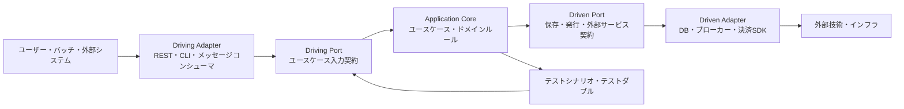
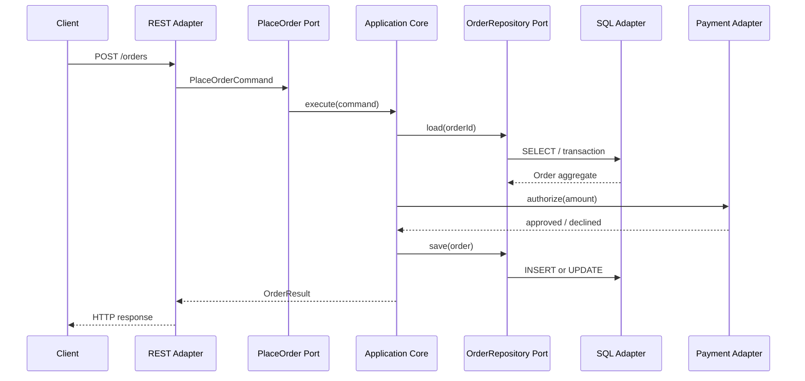

# ヘキサゴナルアーキテクチャ(Hexagonal Architecture, Ports and Adapters)

## 1. 概要

> ヘキサゴナルアーキテクチャとは、アプリケーションの業務の中核を外部技術から分離し、目的を表現するポートと技術を変換するアダプタを通じて、ユーザー・データベース・メッセージ・外部システムと接続するアーキテクチャスタイルである。

企業向けソフトウェアは、業務ルールよりも、Webフレームワーク、ORM、メッセージブローカー、クラウドSDKの呼び出し方式によって構造が決定されることが多い。
最初は画面とテーブルを素早く作ることができるが、時間が経つとコントローラに業務ルールが入り込み、ドメインオブジェクトが特定のORMに縛られ、テストのために実際のデータベースを起動しなければならないという問題が発生する。
この現象は、技術への従属と業務ロジックの汚染と見なすことができる。

ヘキサゴナルアーキテクチャは、アプリケーションを中央に置き、外部世界を複数の方向の接続点として表現する。
六角形という形自体は六つの固定レイヤーを意味するものではなく、多様な対話(conversation)を表現するために長方形の代わりに用いた視覚的な比喩である。
重要なのは外部がどの方向にあるかではなく、中核がポートという抽象的な契約を通じてのみ外部と対話するという点である。

ポートとは、アプリケーションが提供する、または必要とする意味のある対話の契約である。
例えば`注文を作成する`、`在庫を予約する`、`決済承認結果を保存する`といった業務目的をポートとして表現できる。
アダプタは、HTTP、SQL、Kafka、ファイル、テストダブルといった技術的な入出力を、ポートの呼び出しとデータに変換する。
したがって、同じポートにRESTアダプタとCLIアダプタを同時に接続でき、保存ポートにPostgreSQLアダプタとメモリアダプタを差し替えて接続できる。

このスタイルの目標は、単にフォルダを`domain`、`application`、`infrastructure`に分けることにあるのではない。
中核的な目標は、依存関係の方向を内側に向けることで、業務ルールがUI、データベース、フレームワークの存在を知らなくても実行・検証できるようにすることである。
外部技術が変更される理由と業務ポリシーが変更される理由を分離すれば、要件の変化がコード全体に伝播する範囲を狭めることができる。

適用するかどうかは、流行ではなく変化の方向で判断する。
決済手段・ストレージ・メッセージプラットフォーム・チャネルが変わったり、複数のエントリポイントから同一の業務ルールを再利用する必要があったりする場合には効果が大きい。
逆に、単純なCRUD画面のように業務ルールがほとんどなく寿命の短いシステムに過剰なポートとアダプタを作ると、抽象化のコストばかりが大きくなりうる。
技術士は、期待される変更隔離の効果と、追加構造の運用・教育コストをあわせて比較しなければならない。

## 2. 全体概念図と設計原理

ヘキサゴナルアーキテクチャは、一つの固定されたレイヤーモデルというよりも、中核と外部の境界を説明する方式である。
内側にはドメインルールとユースケースがあり、外側にはそれを呼び出す、あるいはそれから呼び出される技術要素がある。
内側が外側を直接importしないというルールが、構造の核心である。

上の図において、driving adapterは外側から内側へとフローを開始する。
HTTPコントローラ、GraphQL resolver、スケジューラ、CLI、メッセージコンシューマは、リクエストを入力ポートが理解できるコマンドに変換したうえで、アプリケーションコアを呼び出す。
このアダプタは、JSONのパース、認証コンテキストの抽出、プロトコルごとのエラー応答のような技術的な変換を担当し、割引ルールや在庫の不変条件を決定することはない。

Driven portは、コアが外部に要求する能力を抽象化する。
コアは、`OrderRepository`がPostgreSQLなのかドキュメント型データベースなのかを知る必要はなく、`PaymentGateway`が特定のカード会社のSDKなのかモックオブジェクトなのかを知る必要もない。
コアがポートのインタフェースを所有すれば、外部の実装がその契約に合わせて接続されるため、依存性逆転の原則が実際のコードのimportの方向として現れる。

Driven adapterは、コアの呼び出しを技術プロトコルに変換する。
SQLアダプタはドメインオブジェクトと行(row)をマッピングし、メッセージアダプタはドメインイベントをブローカーメッセージにシリアライズし、外部APIアダプタはタイムアウト・リトライ・エラーコードを業務コアが使用する結果に翻訳する。
この変換責任をコアに混ぜないことで、インフラの障害様態を業務ポリシーから分離できる。

### 2.1 内部と外部の境界

アプリケーションコアは、ドメインモデルとアプリケーションサービスに分けて考えることができる。
ドメインモデルは金額・状態・権限・在庫といった業務ルールと不変条件を保護し、アプリケーションサービスは一つのユースケースを実行する順序を調整する。
両要素とも、Webフレームワークのrequestオブジェクトや、ORMのlazy loadingのような外部の概念を直接受け取ってはならない。

業務の中核と技術的な外部の境界を定める際は、変更理由を問う。
`注文キャンセル可能時間`はポリシーの変更によって変わるが、`HTTPステータスコード`はAPI契約の変更によって変わる。
二つのルールが同じクラスにあると、一方の変更がもう一方のテストとデプロイを揺るがすため、変更原因の異なる要素をポートとアダプタの境界で分ける。

| 区分 | 中核となる問い | 代表的な構成 | 外部依存の許容 |
|---|---|---|---|
| ドメインの中核 | 業務において何が常に真でなければならないか? | エンティティ・値オブジェクト・ドメインサービス | フレームワーク・DBへの直接依存は禁止 |
| アプリケーションの中核 | ユースケースをどのような順序で調整するか? | コマンド・ハンドラ・トランザクション境界 | ポートインタフェースのみに依存 |
| Driving port | 外部はどのような業務機能を要求するか? | `PlaceOrderUseCase` | 技術用語よりも業務用語を使用 |
| Driven port | コアはどのような外部能力を必要とするか? | `OrderRepository`, `PaymentPort` | 実装ではなく契約に依存 |
| Driving adapter | 外部入力をどのようにコア呼び出しに変えるか? | REST・CLI・コンシューマ | プロトコル・認証・デシリアライズ |
| Driven adapter | コア呼び出しをどのように外部技術に変えるか? | SQL・Kafka・SDK | マッピング・リトライ・タイムアウト |

表の区分はデプロイ単位を意味するものではない。
小さなモノリスの中にもすべてのポートとアダプタが存在しうるし、逆にマイクロサービスであっても、コアが外部技術に汚染されていればヘキサゴナルの原則を守れていない。
アーキテクチャの判断では、プロセスの分離よりも、依存関係・責任・変更境界の分離を優先する。

### 2.2 ポートの意味と方向

ポートは、あらゆるCRUDメソッドの単なる寄せ集めではなく、目的を持った対話の境界である。
`save()`、`find()`、`update()`を無差別に公開すると、アダプタがコアの内部データ構造を操作することになるため、ユースケースの意図とドメインの不変条件を保持する名前と入力を用いる。
例えば`reserveStock(productId, quantity)`は在庫予約というポリシーを明らかにするが、`updateInventoryRow()`はストレージの構造を明らかにしてしまう。

Driving portは、コアが外部に提供する入力契約である。
RESTとメッセージコンシューマは異なる方式で同じユースケースを呼び出すことができるが、コアの観点からは`PlaceOrderCommand`を渡す同一の対話として統一できる。
ポートがHTTPヘッダやブローカーのoffsetを知ってしまうと技術境界が内側に侵入するため、認証主体・トレースIDのように業務処理に必要な意味だけを別途のコンテキストとして渡す。

Driven portは、コアが外部から得たい結果を宣言する。
保存ポートは永続化の意味と同時実行条件を表現し、通知ポートは「注文受付の事実を通知する」という目的を表現する。
ポートの戻り値とエラーも業務の観点で設計しなければならず、`SQLException`や特定SDKの例外をコアまでそのまま伝播させず、リトライ可能・不可能、重複・拒否などの意味に変換する。

一つのポートに複数のアダプタが接続されることは、このスタイルの重要な特性である。
`PaymentPort`に実際の決済アダプタ、サンドボックスアダプタ、障害シミュレータを接続すれば、運用・検証・開発環境の技術を差し替えることができる。
しかし、すべての外部システムごとにポートを作る必要はなく、差し替え可能性・テストの隔離・業務上の意味がある境界から抽象化しなければならない。

### 2.3 依存性逆転と組み立て

依存性逆転は「抽象化しよう」というスローガンではなく、依存関係の所有権を変える設計である。
従来の構造では、サービスがDBの実装を呼び出し、DBが提供するAPIに合わせて業務コードが書かれることがある。
ヘキサゴナル構造では、コアが必要とする契約であるポートを宣言し、外側のアダプタがそのポートを実装する。

組み立て(composition)とは、ポートと実装アダプタを実行環境で接続する段階である。
依存性注入コンテナを使用することもできるが、コンテナ自体がヘキサゴナル構造を保証するわけではない。
本番の起動点では`PostgresOrderRepository`、`RealPaymentAdapter`、`RestController`を接続し、テストでは`InMemoryOrderRepository`、`StubPaymentAdapter`を接続する。

組み立てコードが環境ごとの違いを一か所で管理すれば、コアが設定ファイルやグローバルシングルトンを直接読むことを減らせる。
開発環境でのみ動作するインメモリアダプタを誤って本番に接続しないよう、起動時の設定検証と依存関係リストをあわせて管理する。
アダプタの接続に失敗した場合に、アプリケーションを部分的に起動するのか、即座に失敗させるのかも、サービスの可用性要件に合わせて決定しなければならない。

## 3. 構成要素ごとの設計と実装手順

### 3.1 ユースケース中心のアプリケーションコア

ユースケースは、ユーザー画面ではなく業務目的を基準に定義する。
注文画面の「保存ボタン」よりも、`注文を受け付ける`、`決済を取り消す`、`配送先を変更する`のほうがコアのユースケース名として適している。
そうすれば、REST、モバイルアプリ、バッチが同じ業務機能を呼び出す際に表現だけが異なり、ルールは重複しない。

アプリケーションサービスは、入力を検証し、必要な集約を参照し、ドメインの振る舞いを呼び出し、保存とイベント発行の境界を調整する。
ただし、割引率の計算や注文状態の遷移のように業務上の意味があるルールをすべてサービスに入れると、ドメインモデルが貧弱になる。
サービスはオーケストレーションを担当し、不変条件はドメインオブジェクトが保護するように責任を配置する。

ユースケースの入力は外部DTOと分離する。
外部APIが`customer_id`を使用していても、コアがJSONの命名規則を知る理由はなく、アダプタが`CustomerId`や`Money`のような意味型に変換する。
逆に、応答もドメインエンティティをそのまま返さず、ユースケース結果DTOに変換して、内部属性の漏洩とシリアライズへの依存を防ぐ。

### 3.2 ドメインモデルと不変条件

ドメインエンティティは識別性とライフサイクルを持ち、値オブジェクトは値と検証ルールによって意味が完結する。
`Order`が`CANCELLED`状態で決済を再度承認できないようにするルールは、ドメインの内部になければならない。
コントローラのif文にしかこのルールがないと、バッチアダプタやメッセージアダプタが迂回した際に不正な状態が生まれる。

ドメインモデルはデータベーステーブルのコピーではない。
一つのテーブルのすべてのカラムを公開属性にすると、誰でも状態を直接変更できるため、不変条件が弱まる。
状態変更を`cancel(reason)`、`confirmPayment(reference)`のような意味のある振る舞いに限定し、無効な遷移は明示的なドメインエラーとして拒否する。

ドメインイベントは、コア内部の意味のある事実を表現する。
`OrderPlaced`は「在庫・通知・精算が反応できる出来事が発生した」という意味であり、コンシューマに特定の実装コマンドを強制するものではない。
イベントを外部ブローカーに発行する際には、シリアライズアダプタがスキーマバージョン・トレースID・重複処理キーを追加するが、ドメインモデルにKafkaのヘッダを知らせてはならない。

### 3.3 リポジトリポートと永続化アダプタ

リポジトリポートは、ドメインが必要とする参照と保存の意味を表現する。
集約を復元するポートと分析画面の大量参照ポートは、要求される性能・形・一貫性が異なるため、一つの万能リポジトリにすべてを入れないほうがよい。
読み取りモデルが単純な射影であれば、別途のquery portとすることで、書き込み側ドメインモデルの複雑さから分離できる。

SQLアダプタは、行とドメインオブジェクトの間のマッピングを担当する。
ORMのエンティティアノテーションをドメインオブジェクトに直接付ける方式は初期の生産性を高めうるが、遅延ロード・プロキシ・永続化ライフサイクルが業務ルールに侵入する可能性がある。
組織の技術力と性能要件に応じてORMを使用する場合でも、ドメインモデルとマッピング戦略の結合度を意識的に決定する。

トランザクション境界は、ユースケースの一貫性要件と結び付ける。
`注文の保存`と`決済承認`を一つのローカルトランザクションにまとめられない場合は、承認失敗時の補償・リトライ・冪等性・状態照会をユースケースとポートに明示する。
アダプタがデータベーストランザクションを提供していても、外部決済システムの原子性まで自動的に保証されるわけではない。

### 3.4 外部システムアダプタの変換責任

アダプタは単なる受け渡しのコードのように見えるが、境界において意味を保持する翻訳者である。
外部の決済会社が`AUTHORIZED`、`PENDING`、`DECLINED`を返す場合、コアはこの文字列をそのまま使わず、承認済み・処理中・拒否済みといった内部状態に変換する。
外部システムの名称やエラー体系が内部モデルを汚染しないよう、マッピング表と契約テストを管理する。

ネットワークアダプタは、タイムアウトとリトライのポリシーを持つ。
リトライが安全な参照と、二重決済を引き起こしうる承認リクエストには、同じポリシーを適用できない。
冪等キー、リトライ可能なエラー、指数バックオフ、サーキットブレーカ、補償照会を、ポート契約と運用指標に結び付けなければならない。

メッセージアダプタは、技術的なメッセージと業務イベントを分離する。
ブローカーのoffsetがコミットされたからといって業務処理が完了したわけではなく、処理失敗時の再処理と隔離キューを考慮しなければならない。
コンシューマは同じイベントを二度受け取りうると仮定し、イベントIDや業務キーを基準に冪等性を確保する。

### 3.5 段階的な導入手順

第一に、変更が頻繁で業務リスクの大きいユースケースを選定する。
システム全体を一度に書き直すよりも、決済、権限、注文キャンセルのようにテストと差し替えの効果が明確なフローを対象に、現在の依存関係と障害ポイントを図示する。
導入対象の成功基準には、テスト実行時間、変更ファイルの範囲、外部技術の差し替え可能性、障害隔離の程度を含める。

第二に、ドメイン言語とユースケースを整理する。
業務担当者と状態・振る舞い・エラー・例外について合意し、技術的なテーブル名や画面名だけでポートを設計しない。
定義された用語が、コード・API・テスト・運用ダッシュボードで一貫して使われているかを確認する。

第三に、入力ポートと出力ポートを分離して宣言する。
各ポートの呼び出し元・所有者・入出力・エラー・時間制限・一貫性要件を文書化する。
ポートが大きすぎるとすべての変更が同じインタフェースに集中し、小さすぎると意味のない抽象化が増えるため、ユースケースと差し替え可能性を基準に適切な粒度を見出す。

第四に、コアを外部技術なしで実行する単体テストを作成する。
インメモリストレージとテスト用決済アダプタを使用して、正常・失敗・境界条件を検証し、テストが高速に繰り返せるかを確認する。
その後、実際のDB・メッセージ・外部APIを使用するアダプタ統合テストと契約テストを追加する。

第五に、組み立てとオブザーバビリティを運用レベルに仕上げる。
環境ごとのアダプタ接続、設定検証、トレースID、ポートごとのレイテンシ、外部エラー率、リトライ回数、隔離キューを運用ダッシュボードで確認できなければならない。
構造を分離しても測定できなければ、障害時に境界が実際に役立ったかを判断することは難しい。

## 4. テスト・品質・運用設計

### 4.1 テストピラミッドとポートテスト

ヘキサゴナル構造の最も直接的な利点は、中核の業務ルールを技術環境から分離してテストできる点である。
ドメイン単体テストはDBやHTTPサーバなしで状態遷移と不変条件を確認し、ユースケーステストはポートのテストダブルを通じて呼び出し順序・失敗処理・トランザクションの意味を確認する。
テストが速いからといって実際のアダプタのマッピングエラーがなくなるわけではないため、レベルごとの目的を分離する。

| テストレベル | 対象 | 主なダブル・環境 | 確認すべき問い |
|---|---|---|---|
| ドメイン単体テスト | 値オブジェクト・エンティティ・ポリシー | 外部依存なし | 不正な状態を拒否するか? |
| ユースケーステスト | アプリケーションサービス | インメモリポート・スタブ | 入力と出力、エラーフローは正しいか? |
| アダプタ統合テスト | SQL・HTTP・メッセージアダプタ | 実際のまたは互換インフラ | マッピング・タイムアウト・シリアライズは正しいか? |
| 契約テスト | ポートと外部契約 | コンシューマ・プロバイダ契約 | 変更時に双方が互換性を保つか? |
| エンドツーエンドテスト | 主要な業務シナリオ | 本番類似環境 | 組み立てられたシステムが目標フローを完遂するか? |

テストダブルは便利であるが、実際のインフラの同時実行性・制約条件・遅延を再現できない場合がある。
例えば、インメモリストレージはSQLのunique制約や分離レベルを自動的に模倣しない。
したがって、コアのルールは高速なテストで保護しつつ、アダプタの現実的な障害はコンテナベースの統合テストと障害試験で補完する。

### 4.2 契約とエラーの設計

ポート契約は、成功結果だけを定義するのでは不十分である。
外部決済の遅延、保存時の競合、認証の期限切れ、メッセージの重複、スキーマバージョンの不一致が発生したときに、コアがどのような業務状態を作り、アダプタがどのような復旧経路を選ぶかを定義しなければならない。
エラーは、ユーザーに表示するメッセージ、リトライ可能性、監査対象、運用アラームのレベルに分けて管理できる。

APIアダプタは、HTTP 400・409・429・500のような応答を業務エラーと技術エラーに区別する。
同じ500応答であっても、一時的な外部障害なのか恒久的な契約違反なのかによって、リトライ戦略が異なる。
コアがHTTPの数値を直接判断せず、意味のあるエラー型を返せば、RESTアダプタ・メッセージアダプタ・バッチアダプタがそれぞれに適した表現に変換できる。

### 4.3 セキュリティとオブザーバビリティ

境界が増えると、セキュリティ上の責任も増える。
入力アダプタは認証・認可情報を検証し、コアは呼び出し主体がユースケースを実行する権限を持っているかを業務の文脈で確認する。
外部アダプタは秘密情報をログに残さず、機微なリクエスト・レスポンスをマスキングし、ポート呼び出しごとに必要最小限の権限の資格情報を使用する。

オブザーバビリティは、コアとアダプタの境界に沿って設計する。
ユースケース名、ポート名、外部呼び出し先、リトライ回数、相関IDを追跡すれば、「注文受付」自体が遅いのか「決済アダプタ」が遅いのかを区別できる。
ただし、業務上の個人情報をトレースIDに入れてはならず、データの保存期間とアクセス権限をあわせて定める。

## 5. 類似アーキテクチャとの比較

### 5.1 レイヤードアーキテクチャとの比較

従来のレイヤードアーキテクチャは、プレゼンテーション・サービス・データアクセスのレイヤーを垂直に配置する。
構造が理解しやすくCRUDシステムに素早く適用できるが、上位のサービスが下位のORMやDBモデルに直接依存すると、業務ルールが保存方式に引きずられる可能性がある。
また、一つのエントリポイントだけを前提に設計すると、バッチやメッセージ処理でルールが複製されうる。

ヘキサゴナルアーキテクチャもレイヤーを使用できるが、レイヤー名よりもコアの独立性とポートの所有権を強調する。
レイヤード構造でサービスがリポジトリの実装を呼び出すなら、依存関係は外側に向かいうるが、ヘキサゴナル構造ではコアがポートを定義し、アダプタが実装する。
したがって、両者は相互排他的というよりも、レイヤード構造を依存性逆転と入出力境界で補強した関係として理解できる。

### 5.2 クリーンアーキテクチャ・オニオンアーキテクチャとの比較

クリーンアーキテクチャとオニオンアーキテクチャも、ドメインと外部技術を分離し、依存関係が内側に向かうべきだという原則を共有する。
用語や図の層数は異なりうるが、三つのアプローチはいずれもフレームワーク・UI・DBをポリシーより外側に置く。
ヘキサゴナルは、入力と出力の対称性、ポートの目的、複数のアダプタの差し替え可能性を直感的に強調する。

実務では、三つのアプローチを組み合わせて使用できる。
例えば、ドメイン中心のオニオン構造の中でヘキサゴナルのポートを定義し、クリーンアーキテクチャのユースケースインタラクタとエンタープライズルールを使用する。
重要なのは名称を揃えることではなく、テスト可能なコア、明確な境界、制御可能な依存関係、運用可能な組み立てを確保することである。

| 比較項目 | レイヤード | ヘキサゴナル | クリーン・オニオン系 |
|---|---|---|---|
| 中心的関心 | 責任ごとのレイヤー | ポートとアダプタの境界 | 内側のポリシーと依存ルール |
| 入出力の観点 | 主にUI→サービス→DB | driving・drivenを対称に扱う | 境界・ユースケースで表現 |
| 主な利点 | 単純さ・習得の容易さ | 技術の差し替え・テストの隔離 | ポリシーの独立性と拡張性 |
| 主なリスク | DB・フレームワークの侵入 | 過剰なインタフェース・ボイラープレート | 構造の複雑さとレイヤーの誤解 |
| 適した状況 | 単純なCRUD・短い寿命 | 複雑なルール・多数の連携 | 長期的な製品・変化の多いシステム |

### 5.3 マイクロサービスとの関係

ヘキサゴナルアーキテクチャとマイクロサービスは、異なる次元の決定である。
前者は一つのアプリケーション内部の依存関係と境界を扱い、後者はデプロイ・運用・所有権を分離するシステム構成方式である。
一つのモノリスもヘキサゴナルでありうるし、複数のマイクロサービスのそれぞれもヘキサゴナルでありうる。

マイクロサービス内でヘキサゴナルの原則を適用すると、外部API・メッセージ・DBがサービスの業務コアを直接共有しなくなる。
しかし、サービス境界を誤って分割すると、ポートとアダプタをいくら整理しても、サービス間の呼び出しが増えて分散モノリスになってしまう。
ドメイン境界、データの所有権、独立デプロイの可能性、障害の隔離を先に判断し、内部構造はその目的を支援するように設計する。

## 6. 適用事例

### 6.1 オンライン注文・決済システムの事例

オンライン注文システムでは、`PlaceOrder`をdriving portとして定義し、REST・モバイル・バッチのアダプタが注文コマンドを渡すように設計できる。
コアは、在庫確認、割引適用、注文状態の遷移、決済承認リクエストの順序を調整するが、HTTPヘッダやカード会社のSDKを直接扱わない。
`PaymentPort`に実際のカード会社アダプタとテスト用決済アダプタを接続すれば、決済承認の成功・拒否・遅延を独立して検証できる。

例えば、ピーク時に注文APIが毎秒2,000件のリクエストを受けるという前提において、コアのテストはサーバ台数やデータベース接続数とは無関係に高速に実行されなければならない。
実際の負荷試験はSQL・キャッシュ・決済アダプタを含む組み立て環境で実施し、ポート境界はテスト速度と障害の位置を区別するのに役立つ。
決済承認が外部で非同期に完了する場合は`PAYMENT_PENDING`状態を明示し、同一の決済キーが再送されても二重承認されないよう冪等性ポリシーを設ける。

この事例で最も重要なトレードオフは、抽象化の数と決済失敗の正確性である。
すべてのSDKメソッドをポートで包むと、コアは複雑になり、外部実装の利点が失われうる。
一方、承認・取消・照会のように業務リスクの大きい機能はポートで包み、単純なロギングライブラリのように差し替え効果の低い技術は、外部レイヤーで限定的に直接使用する。

### 6.2 製造設備モニタリングの事例

工場設備のモニタリングアプリケーションでは、MQTTコンシューマ、ファイル収集器、シミュレータが同一の`ReceiveTelemetry`入力ポートを呼び出すようにできる。
コアは、センサー値の単位変換、異常兆候の判定、アラーム条件、設備状態の遷移を管理し、特定の設備メーカーのメッセージ形式を知らない。
時系列データベースアダプタと現場の一時保存アダプタを`TelemetryStore`ポートに接続すれば、ネットワーク断絶時のバッファリングポリシーを差し替えることができる。

例えば、温度の摂氏値が80度を超え、3回連続で観測されたらアラームイベントを生成するというルールは、ドメインテストで検証する。
MQTTの再接続間隔、QoS、メッセージの重複、時系列保存の遅延は、アダプタ統合・障害試験で検証する。
このようにルールと通信障害を分ければ、センサーの交換がアラームポリシーの回帰テストを不必要に揺るがすことはない。

ただし、現場システムではリアルタイム性・安全性が中核であるため、単純なポート分離だけでは十分ではない。
オフライン動作、時間順序の逆転、デバイス認証、コマンドの再送、安全停止といった運用条件を、ポート契約と状態モデルに含めなければならない。
アダプタの抽象化が実際のデバイスの障害特性を隠して安全判断を妨げないよう、障害モードと保守的なデフォルト値を明示する。

### 6.3 公共の行政手続きサービスの事例

公共の行政手続き(民願)サービスでは、Webポータル、モバイル、相談員画面、夜間バッチが同じ`SubmitApplication`ユースケースを呼び出すことができる。
入力アダプタはチャネルごとの認証とファイルアップロードを処理し、コアは申請資格・書類の状態・処理期限・担当機関の割り当てルールを管理する。
電子文書の保管、メッセージ通知、行政情報連携は、それぞれdriven portのアダプタとして置き、特定のチャネルや機関システムの変更を隔離する。

例えば、申請受付後24時間以内に担当機関が割り当てられなければならないというポリシーは、コアの時間ルールとバッチアダプタのスケジューリングを分離して扱う。
実際の行政連携が一時停止した場合は、申請を失わずに`連携待ち`状態として保存し、再処理と担当者への通知によって業務の継続性を維持する。
申請者の個人情報はポートDTOとログで最小化し、アダプタごとの保存・マスキングポリシーを適用する。

## 7. 深掘り: DDD・イベント駆動・クラウドネイティブとの連携

### 7.1 DDDとの結合

ヘキサゴナルアーキテクチャは外部接続の方向と技術の隔離を説明し、DDDはコア内部のモデルと境界を説明する。
したがって、複雑な業務システムでは、境界づけられたコンテキスト(バウンデッドコンテキスト)をアプリケーション境界とし、各コンテキストのユースケースをdriving portとして、外部統合をdriven portとして表現できる。

しかし、ポートとアダプタを導入したからといって、ドメインモデルが自動的に良くなるわけではない。
テーブルとAPIをそのままインタフェースにコピーすれば、内部モデルは依然として技術中心のままである。
ユビキタス言語、集約の不変条件、コンテキスト間のイベントと翻訳ルールをあわせて設計してこそ、外部技術の隔離が業務上の意味の保護につながる。

### 7.2 イベント駆動の統合と結果整合性

イベントアダプタを使用すると、コアとコンシューマの時間的結合を下げることができるが、即時の一貫性は弱まりうる。
注文コアが`OrderPlaced`を発行し、在庫・通知・精算がそれぞれ処理する場合、コンシューマの失敗、重複、順序の逆転、スキーマの進化に対応しなければならない。
アウトボックスと再処理キューは保存と発行の間の欠落を減らす方法であり、コンシューマの冪等性は重複の影響を減らす方法である。

イベントを選択する際は、すべてのメソッド呼び出しをイベントに置き換えるのではない。
他のコンテキストが知る必要のある業務上の事実と単なる内部状態の変更を区別し、事実の所有者とスキーマバージョンのポリシーを定める。
同期ポートが適した即時承認業務を無理に非同期化すると、ユーザー体験と補償ロジックが複雑になりうる。

### 7.3 クラウドネイティブな運用

コンテナやサーバレスの環境では、外部インフラがより頻繁に差し替えられ、障害が部分的に発生する。
ヘキサゴナル構造は、DB・メッセージ・外部APIのアダプタを運用構成から分離し、開発・テスト・ステージング・本番の接続の違いを明確にするのに役立つ。
ただし、ネットワーク呼び出しが増えることに伴い、タイムアウト、サーキットブレーカ、レート制限、トレースの伝播、コスト計測をポートの非機能契約として扱わなければならない。

アダプタの差し替え可能性は、そのままマルチクラウドの移植性を意味するわけではない。
データ移行、マネージドサービスの機能差、規制と地域性、運用チームの能力が、実際の移行コストを決定する。
技術士は、「差し替え可能」という構造上の可能性と、「経済的に移行できる」という事業上の可能性を区別して評価する。

### 7.4 予想される出題方向と答案構成戦略

試験の答案では、定義だけを書くのではなく、問題状況と解決原理を結び付ける。
まず、Web・DB・外部システムに業務ロジックが従属する問題を提示し、コア・ポート・アダプタ・依存性逆転の構造を全体概念図で示す。
次に、drivingとdrivenの区別、ポート設計、アダプタによる変換、テストと運用の効果を事例とともに展開すれば、論述型としての流れが自然になる。

比較問題では、レイヤード・クリーン・オニオンアーキテクチャとの共通原則と違いを説明し、単純なCRUDに対する過剰設計のリスクに必ず言及する。
事例では、決済・IoT・公共サービスのいずれかを選び、入力アダプタと出力アダプタ、中核となる不変条件、障害対応、テスト戦略を具体化する。
最後に、技術士の観点からの考慮事項として、組織の能力、オブザーバビリティ、セキュリティ、コスト、段階的導入を提示すれば、技術選択のバランスを示すことができる。

## 8. 考慮事項および示唆点

### 8.1 抽象化のコストと適切な境界

すべての外部クラスにインタフェースを一つずつ追加することが目標なのではない。
差し替え可能性、テストの必要性、業務上の意味、障害隔離の効果が低い要素までポートにすると、コードの探索と保守のコストが増える。
中核的なユースケース・高リスクの外部連携・変化が予想される境界を優先的に抽象化し、繰り返し発生する実際の問題を根拠として境界を拡張する。

### 8.2 ポートの安定性と契約の進化

ポートは内部実装を隠すが、誤って設計すると、外部DTOと技術用語をそのまま固定する別の結合点となる。
ポートの名前・入力・出力・エラー・時間制限・冪等性条件を業務言語で文書化し、バージョンの変化と後方互換性のポリシーを契約テストで管理する。
契約を頻繁に変更しなければならない場合は、ポートがあまりに低レベルの技術呼び出しを公開していないかを再検討する。

### 8.3 データの一貫性とトランザクション

保存ポートと外部サービスポートを分離したからといって、分散トランザクションの問題が解決するわけではない。
ローカルトランザクション、補償トランザクション、結果整合性、重複処理、読み取り時点の状態を、ユースケースごとに明示しなければならない。
ユーザーに表示する状態と内部の再処理状態を区別し、整合性違反を検知する突合・補正作業を運用プロセスに含める。

### 8.4 セキュリティ・個人情報保護

アダプタは外部入力と資格情報が入ってくる境界であるため、入力検証、証明書検証、秘密情報管理、最小権限、出力マスキングを適用する。
ドメインオブジェクトをそのままログに出力すると、個人情報が境界を越えて漏洩しうるため、安全なログDTOとフィールド分類体系を使用する。
外部連携が国外リージョンに保存したり第三者の処理者に渡したりする場合は、技術構造だけでなく、法的根拠と保存ポリシーも検討する。

### 8.5 障害・性能・運用性

アダプタごとにタイムアウトとリトライのデフォルト値をコピーすると、障害の暴走が発生しうる。
呼び出しごとの予算、同時実行数の制限、サーキットブレーカ、隔離プール、代替経路、アラーム基準を、システムのサービスレベル目標と結び付ける。
ポートごとのレイテンシ・エラー・リトライ・キューの滞留を測定してどの境界がボトルネックかを確認し、抽象化が性能問題を隠さないよう実際の負荷で試験する。

### 8.6 段階的移行と組織の能力

レガシーシステムを全面的に書き直す方式は、業務知識と運用の安定性を同時に失うリスクがある。
変更の多いユースケースからポートで包み、既存機能をアダプタで囲んだうえでテストを確保しながら、段階的にコアを整理していく方式が安全である。
開発者だけでなく、運用・セキュリティ・データの担当者がポートの失敗契約と観測指標を理解してこそ、構造が実際の運用で維持される。

## 参考資料

- Alistair Cockburn, [Hexagonal Architecture](https://alistair.cockburn.us/hexagonal-architecture)
- AWS Prescriptive Guidance, [Hexagonal architecture pattern](https://docs.aws.amazon.com/prescriptive-guidance/latest/cloud-design-patterns/hexagonal-architecture.html)
- Martin Fowler, [Microservices](https://martinfowler.com/articles/microservices.html)

---

> **一言まとめ**: ヘキサゴナルアーキテクチャは、業務の中核がポートという目的中心の契約だけを見るようにし、アダプタによって技術を差し替え・隔離することで、テスト容易性、変更容易性、障害対応力を高める設計方式である。
