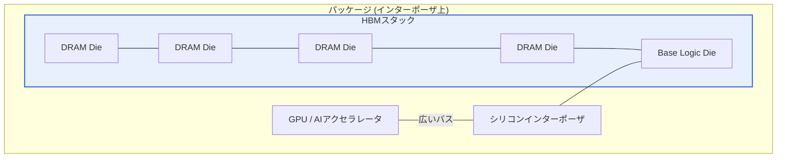

# 広帯域超高速メモリ(HBM、High Bandwidth Memory)

## 1. 概要

### A. 定義
> DRAMダイを**垂直に積層(3D Stacking)**し、**TSV(Through-Silicon Via、シリコン貫通電極)**で接続することで、非常に広いI/O幅(1024bit以上)によって**超広帯域・低消費電力**を実現したメモリ。AI・HPC・GPUのメモリボトルネックを解消するために、プロセッサとともにパッケージングされる。

HBMの発想は、「**メモリをより速く動かす(周波数↑)**代わりに、**一度により広く運ぶ(バス幅↑)**」というものである。信号周波数を上げ続けると電力・発熱が急増するが、バス幅を広げれば、低いクロックでも総帯域幅を大きく増やすことができる。積層とTSVは、まさにこの広いバスを物理的に可能にする手段である。

### B. 登場背景および必要性
AIモデルとHPC演算が大規模化するにつれ、演算ユニット(GPU)の処理速度は急速に向上したが、**データをメモリから演算器へ運ぶ速度**がこれに追いつかない、いわゆる**メモリウォール(Memory Wall)**がボトルネックとして浮上した。GPUがいかに速くても、必要なデータが適時に届かなければ演算器は遊んでしまう。従来のGDDRはバス幅と電力の面で限界があり、広いI/Oを短い配線で確保できる3D積層メモリが求められ、その結果として生まれたのがHBMである。

## 2. 構造



構造の核心は三つである。第一に、**TSV**は積層されたDRAMダイを垂直に貫通して接続するため、横に長く引き回す配線の代わりに、短い垂直経路で信号を伝達する。配線が短くなると抵抗・寄生成分が減り、**より低い電圧でも信号が安定**し、これが低消費電力の根拠となる。第二に、このように垂直接続されたスタックは数千本のI/Oピンを確保し、**1024bit以上の超広幅バス**を形成する。第三に、HBMスタックとGPUは**シリコンインターポーザ**の上に並べて載せられ(2.5Dパッケージング)、超広幅バスで接続される。一般的なPCBではこれほど多くの配線を収容できないため、微細配線が可能なインターポーザが必須である。

- **TSV**で積層ダイを垂直貫通接続 → 短い配線・広いI/O
- **インターポーザ(2.5D)**でGPUと近接配置 → 広幅バスを物理的に実現

## 3. 特徴

| 項目 | 内容 | 原理(なぜ) |
|---|---|---|
| **超広帯域** | GDDR比で数倍の帯域幅 | 広いバス幅(1024bit+)により低クロックでも総量↑ |
| **低消費電力** | ビットあたりのエネルギー↓ | 短いTSV配線・低電圧駆動 |
| **小型フォームファクタ** | 面積削減、プロセッサへの近接配置 | 垂直積層により平面面積を最小化 |
| **高コスト・発熱** | 単価・歩留まり・放熱の負担 | 複雑な2.5Dパッケージング・積層ダイの熱密度↑ |

特に**発熱**がなぜHBM最大の難題であるかといえば、複数のダイを垂直に積むと、下層ダイの熱が上層を通過して抜け出なければならず、積層構造は熱がこもりやすいためである。熱密度が高まると性能・寿命が低下するため、アドバンスドパッケージングと放熱設計が量産の中核的な鍵となる。

## 4. 世代別の帯域幅推移 (スタックあたり、概算値)

```chart
{
  "type": "bar",
  "data": {
    "labels": ["HBM2", "HBM2E", "HBM3", "HBM3E"],
    "datasets": [{
      "label": "帯域幅 (GB/s、スタックあたり)",
      "data": [307, 460, 819, 1230],
      "backgroundColor": ["#a9c5f5", "#7aa5f3", "#4d86ef", "#2f6fed"]
    }]
  },
  "options": {
    "plugins": { "legend": { "display": false }, "title": { "display": true, "text": "HBM世代別の帯域幅 (概算値)" } },
    "scales": { "y": { "title": { "display": true, "text": "GB/s" }, "beginAtZero": true } }
  }
}
```

世代が上がるにつれて帯域幅が階段状に跳ね上がるのは、積層段数の増加(例: 8段→12段)とピンあたりの速度向上がともに作用するためである。HBM2からHBM3Eにかけてスタックあたりの帯域幅は約4倍に増えており、これはAIの学習・推論において超大規模パラメータをメモリとやり取りする処理量を、それだけ引き上げてくれる。ただし、段数を高めるほど前述の発熱・歩留まりの負担もともに大きくなるという点が、世代移行の制約である。

## 5. 考慮事項および示唆点
- **AI半導体の中核的なボトルネック部品**: HBMはGPU・NPUの性能を実質的に左右し、供給能力がそのままAIインフラの競争力に直結する。実際に、HBMの供給がAIアクセラレータ出荷のボトルネックとして指摘されるほど、戦略部品となった。
- **メモリ中心コンピューティングへの進化**: データ移動そのものが電力・遅延の主因であるため、メモリ内で直接演算する**PIM(Processing-in-Memory)**や、メモリプーリングをサポートする**CXL**と組み合わせ、データをあまり移動させない方向へとアーキテクチャが進化している。
- **量産の鍵はパッケージング・歩留まり**: ダイ積層・TSV・インターポーザ結合の難度が高く、歩留まりの確保が難しいため、アドバンスドパッケージングの能力が競争優位の源泉となる。
- **トレードオフ**: 超広帯域・低消費電力を得る代償として、単価と発熱・設計の複雑度が大きく上がるため、帯域幅が性能を左右するAI・HPC領域に集中的に採用され、一般消費者向けには依然としてGDDRが使われている。

---

> **一言まとめ**: HBMは、*DRAMをTSVで3D積層し、インターポーザでプロセッサに近接配置*することで、超広幅バスによる超広帯域・低消費電力を実現したメモリであり、**AI・HPCのメモリウォール(Memory Wall)**を解消する中核部品である。発熱・歩留まり・パッケージングが量産の鍵であり、PIM・CXLへと拡張されつつある。
