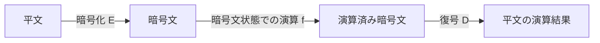

# 準同型暗号(Homomorphic Encryption)

## 1. 概要

### A. 定義
> **暗号文を復号しないまま演算**した結果が、平文を演算した後に暗号化したものと同一になる暗号技術。データを**暗号化状態のまま処理**できるため、処理主体に原文を開示することなく分析・活用が可能となる。

準同型暗号の名前は、代数学の**準同型写像(homomorphism)**に由来する。暗号化関数が平文空間の演算構造を暗号文空間へ「保存したまま移す」という意味であり、平文における加算・乗算が暗号文における対応する演算にそのまま対応するため、復号することなく計算が成立する。

### B. 登場背景および必要性
従来の暗号は、保存中・伝送中(at rest, in transit)にのみデータを保護するにすぎず、**演算するには必ず復号**しなければならないため、処理時点(in use)には原文が露出する。クラウドや外部に演算を委託した瞬間、データ所有者は処理主体を信頼せざるをえないが、医療・金融のような機微なデータでは、この露出自体が規制・プライバシー上のリスクとなる。準同型暗号は「**活用のために保護を放棄する**」というこのジレンマを打破し、データを暗号化した状態でクラウドに上げて演算まで任せ、結果だけを復号することで、**活用と保護を同時に**達成する。このため、プライバシー保護データ分析の根本技術として注目されている。

## 2. 動作原理

核心は準同型性`Dec(f(Enc(m1), Enc(m2))) = f(m1, m2)`である。データ所有者が`m1, m2`を暗号化してサーバに送ると、サーバは平文をまったく知らないまま暗号文同士で`f`(加算・乗算)を実行し、所有者だけが結果を復号して`f(m1, m2)`を得る。任意の計算は結局、加算と乗算の組み合わせ(ブール回路/算術回路)で表現されるため、**加算・乗算の二つの演算をともに準同型でサポート**すれば、理論上はどのような関数でも暗号文の状態で計算できる。ただし、格子ベース暗号では安全性のために暗号文に**ノイズ(誤差)**を混ぜるが、演算を重ねるほどこのノイズが累積し、一定の限界を超えると復号が不可能になる。このノイズ管理が、準同型暗号の実装における中核的な難題である。

## 3. 類型

サポートする演算の種類と回数によって三段階に分かれ、この発展はそのまま「ノイズをどこまで制御できるか」の歴史である。

| 類型 | サポートする演算 | 代表的な方式 |
|---|---|---|
| **部分準同型(PHE)** | 加算**または**乗算の**いずれか一種類のみ**、無制限 | RSA(乗算), Paillier(加算), ElGamal |
| **やや準同型(SWHE)** | 加算・乗算の両方、ただし**限られた回数** | BGN |
| **完全準同型(FHE)** | 任意の演算・**任意の回数** | Gentry(2009), CKKS・BFV・BGV |

部分準同型(PHE)は一種類の演算しかできないため、電子投票(Paillierの加算で票を合算)のような特定用途に限られる。やや準同型(SWHE)は二つの演算をサポートするが、ノイズの限界により回路の深さが浅い計算しかできない。2009年にGentryが**ブートストラッピング(Bootstrapping)** — 暗号文を復号せずに、その中のノイズを再暗号化によって「リセット」する手法 — を提示したことで、ノイズの累積なしに無限に演算できる**完全準同型(FHE)**が初めて実現された。その後、実数の近似演算に強いCKKSなどが登場し、機械学習の推論への活用度が高まった。

## 4. 長所と短所

準同型暗号の強力なプライバシーは、膨大な演算コストと引き換えに得られたものである。このトレードオフを理解することが、実務適用の出発点である。

| 長所 | 短所 |
|---|---|
| 暗号化状態で分析 → 原文非開示・強力なプライバシー | **演算量・性能の負担**が非常に大きい(FHEは平文比で数千〜数万倍) |
| クラウド・外部委託演算を安全に実行 | **暗号文の膨張**(容量の急増)、ノイズ管理が必要 |
| データ3法(韓国)・プライバシー規制への対応(匿名化の代替) | 実装の難易度が高く、標準化が進行中 |

## 5. 活用および示唆点
準同型暗号は**PET(プライバシー強化技術)**の中核であり、複数の機関がそれぞれのデータを開示せずに共同で演算する**MPC(秘密計算、マルチパーティ計算)**、原本を集めずにモデルだけを学習する**連合学習(Federated Learning)**と相互補完の関係にある。具体的には、暗号化状態での統計算出、暗号文に対する機械学習推論(例: 病院が患者データを暗号化し、クラウドAIから診断補助の結果だけを受け取るシナリオ)、金融業界におけるプライバシー保護型の信用評価などに適用される。最大の障害である性能は、**GPU・専用ハードウェアによる高速化**と、SEAL(Microsoft)・HElib・OpenFHEといったオープンソースライブラリの発展によって急速に改善されている。技術士の観点からは、準同型暗号を万能の解決策と見るよりも、遅延・コストを考慮して**機微度が高く演算頻度の低い領域に選別して適用**し、MPC・連合学習・差分プライバシーと組み合わせて全体アーキテクチャを設計することが現実的である。

---

> **一言まとめ**: 準同型暗号は、*復号せずに暗号文の状態で演算*できる技術であり、PHE・SWHE・FHEへと発展(ブートストラッピングによりFHEを実現)した。性能の負担は大きいが、クラウド・AI時代のプライバシー保護型データ活用を可能にする中核的なPET技術である。
