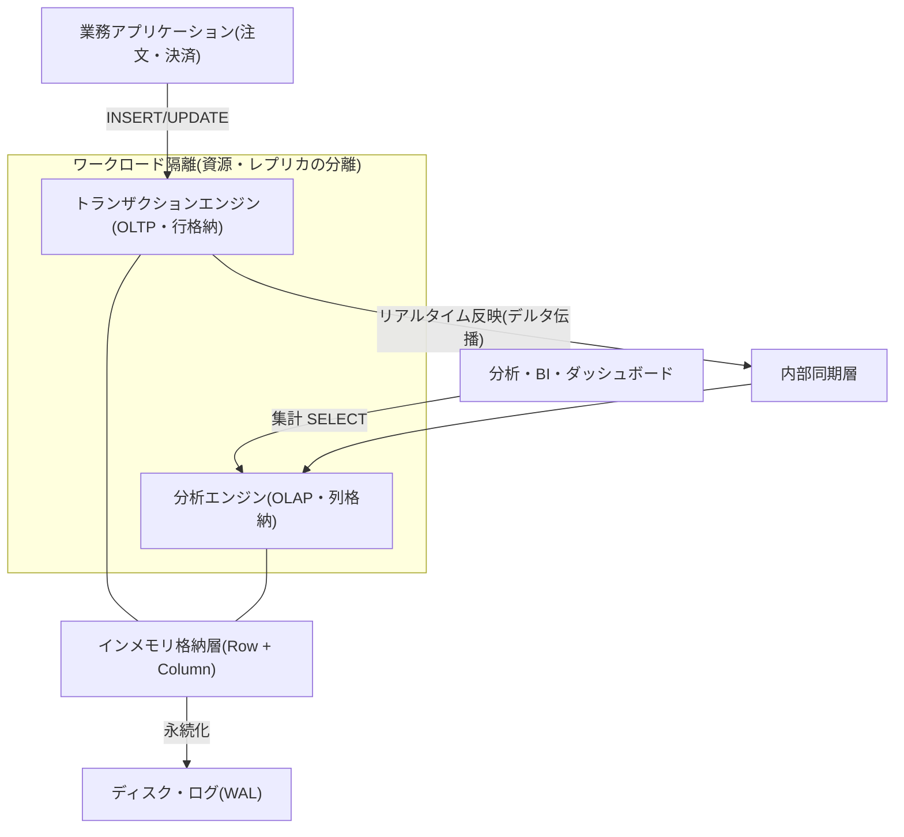
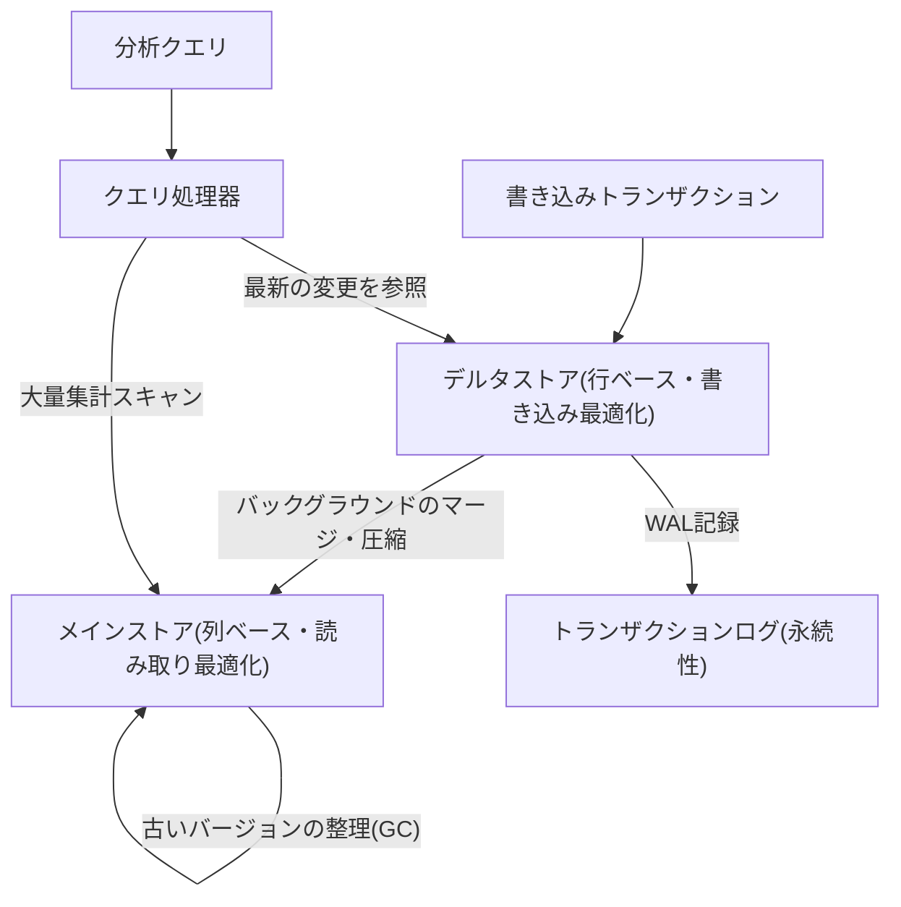

# HTAP(Hybrid Transactional/Analytical Processing)

## 1. 概要

> **HTAP(Hybrid Transactional/Analytical Processing)**とは、一つのデータベースシステムにおいて、トランザクション処理(OLTP)と分析処理(OLAP)を別途のETLによる移送なしに同時に実行し、発生したばかりの業務データに対して遅延のない(near-real-time)分析を提供するデータアーキテクチャである。2014年にガートナー(Gartner)が命名した概念であり、「業務と分析の境界を取り払うインメモリベースの統合処理」を志向する。

伝統的に、企業のデータ処理は目的が相反する二つの世界に分かれていた。
一方は、注文・決済・在庫更新のように短く頻繁な書き込みトランザクションを正確に処理する**OLTP(Online Transaction Processing)**の世界であり、正規化された行(row)ベースの格納と強い一貫性(ACID)を特徴とする。
もう一方は、数億件をスキャン・集計して傾向を読み取る**OLAP(Online Analytical Processing)**の世界であり、列(column)ベースの格納と大規模な並列読み取りを特徴とする。
この二つはデータ構造・インデックス・資源使用パターンが根本的に異なり、一つのエンジンで一緒に動かすと互いの性能を蝕み合う。

そのため、過去数十年間の標準的な解決策は**分離と移送**であった。
業務DBのデータを夜間バッチで抽出・変換・ロード(ETL)してデータウェアハウス(DW)に移し、分析はDWで実行した。
しかし、この構造は二つの本質的な限界を抱えている。
第一に、**データ鮮度(freshness)の遅延**である — バッチ周期が1日であれば、分析結果は常に1日遅れの過去を見ることになる。
第二に、**パイプラインの複雑性とコスト**である — 別途のストレージ、ETLツール、二重のスキーマ、整合性検証がすべて運用負担として残る。
リアルタイムのパーソナライズ推薦、不正取引検知(FDS)、ダイナミックプライシングのように「今この瞬間のデータで即座に判断」しなければならない要求が大きくなるにつれ、この遅延と複雑性がビジネスのボトルネックとなった。

HTAPはまさにこの隔たりを埋めるものである。
論述答案においてHTAPを単に「OLTPとOLAPを合わせたもの」に矮小化してはならず、(1)インメモリコンピューティングと列/行ハイブリッド格納という**技術的土台**、(2)ワークロード隔離(isolation)とデータ鮮度という**中核的な設計課題**、(3)ETLの除去によるアーキテクチャの単純化という**価値命題**の三つの軸で記述しなければならない。

### A. 登場背景と必要性

第一に、**リアルタイム意思決定(Real-time Decision)の需要**が決定的である。
電子商取引において顧客がカートに商品を入れた直後の行動を反映して推薦を変えたり、カード会社が承認要求を受けた瞬間に過去のパターンと照合して不正取引をブロックしたりするには、データの発生と分析の間の遅延が秒単位でなければならない。
1日遅れのDW分析では、こうした要求を満たすことはできない。

第二に、**ハードウェアの進化**がHTAPを現実のものとした。
かつてはメモリが高価で小さく、大容量のデータをインメモリで扱うことはできなかったが、大容量DRAM・多数のコア・SIMDベクトル演算・NVMeが普及したことで、数TB級のデータをメモリに載せてトランザクションと分析をあわせて処理するハードウェア基盤が整った。
SAP HANA(2011)が、インメモリの列ストアによってこの流れを切り開いた。

第三に、**データパイプラインの総所有コスト(TCO)削減**の要求である。
ETLパイプラインは、開発・運用・障害対応に継続的な人員とコストを消費する。
業務系と分析系を一つに統合すれば、移送層そのものがなくなり、アーキテクチャが単純になり、整合性検証の負担が減り、格納の重複も減少する。

## 2. HTAPの全体アーキテクチャ

HTAPシステムは、同一のデータに対してトランザクションエンジンと分析エンジンが共存しつつ、互いの資源を侵害しないよう隔離する構造を持つ。
核心は、**書き込みは行ベースで素早く受け入れ、読み取り・集計は列ベースで高速に処理**しつつ、二つの表現の間をシステムが自動的に同期することである。

上記の構造において、業務アプリケーションの書き込みはトランザクションエンジンが行形式で素早く受け入れ、分析クエリは分析エンジンが列形式で大量にスキャンする。
二つのエンジンは論理的には同じデータを見ているが、物理的にはそれぞれに最適化された表現を維持し、内部同期層がトランザクションの結果を分析側に遅延なく伝播する。
鍵となるのは、この伝播が**分析負荷によってトランザクションのレイテンシ(latency)が揺らがないよう**隔離されていなければならないという点であり、そのために資源スケジューリングを分離したり、分析専用のレプリカを置いたりする方式が用いられる。

### A. データフローとデルタマージの詳細構造

HTAPの格納内部は、多くの場合、**書き込みに最適化されたデルタストア(Delta Store、行ベース)**と、**読み取りに最適化されたメインストア(Main Store、列ベース)**に分かれる。
新しいトランザクションはまず小さなデルタ領域に行単位で素早く記録され、その後バックグラウンドで列形式に圧縮・ソートされてメインストアにマージ(merge)される。
分析クエリはメインストアとデルタストアをあわせて参照し、常に最新の状態を反映する。

この構造が重要である理由は、列格納は大量集計には卓越しているものの、個々の行の頻繁な更新には非効率だからである。
デルタ-メインの分離は、「書き込みは行で安価に、読み取りは列で高速に」という相反する要求を時間軸で分離して同時に満たす、典型的なトレードオフ解消の手法である。
マージ周期とデルタのサイズは性能チューニングの中核パラメータであり、マージが遅れるとデルタが肥大化して分析クエリが遅くなり、頻繁すぎるとマージのコストがトランザクションに負担を与える。

### B. HTAP実装アーキテクチャの類型

HTAPを実装する方式は、データを一つの格納エンジンに置くか分離するかによって、大きく二つに分かれる。
この区分は、アーキテクチャ選択時に鮮度と隔離性の間のトレードオフを決定するため、答案で必ず指摘しなければならない。

**単一格納方式(Single-store / Unified)**は、一つの格納エンジンの中に行・列の表現をあわせて維持する(SAP HANA、Oracle In-Memory、MemSQL/SingleStore)。
データが一か所にあるため鮮度が最も高く遅延がないが、トランザクションと分析が同じ資源を奪い合うため、精緻な隔離が必須である。

**分離格納方式(Dual-store / Disaggregated)**は、行ベースのトランザクションノードと列ベースの分析ノードを物理的に分離し、内部レプリケーション(Raftなど)で同期する(TiDBのTiKV+TiFlash、Google AlloyDB)。
分析ノードが別であるため隔離性に優れ、トランザクションの遅延は安定するが、レプリケーションの伝播にわずかな遅延が生じるため、鮮度は単一方式よりやや劣る。

| 区分 | 単一格納(Single-store) | 分離格納(Dual-store) |
|------|------------------------|----------------------|
| 格納構造 | 一つのエンジンに行+列が共存 | 行ノード・列ノードを物理的に分離 |
| データ鮮度 | 非常に高い(遅延ほぼ0) | 高い(レプリケーション遅延あり) |
| ワークロード隔離 | 資源スケジューリングによる論理的隔離 | ノード分離による物理的隔離 |
| スケーラビリティ | 垂直スケール中心 | 水平スケールが容易 |
| 代表製品 | SAP HANA, SingleStore, Oracle In-Memory | TiDB, Google AlloyDB, ClickHouse+OLTP |

## 3. 中核技術要素

HTAPを支える技術は、ハードウェアの活用と格納構造、そして同時実行制御にまたがっている。
各要素は、「トランザクションと分析という相反するワークロードを、いかにして一つのシステムで共存させるか」という一つの問題を、それぞれ異なる角度から解決する。

第一に、**インメモリコンピューティング(In-Memory Computing)**である。
データを主メモリに常駐させてディスクI/Oのボトルネックを除去し、列データをCPUキャッシュに親和的に配置して、SIMDベクトル演算で一度に複数の値を処理する。
ディスク比で数百〜数千倍速いアクセス速度が、トランザクションと分析を同時に担う性能上の余裕を生み出す。

第二に、**ハイブリッド格納(Hybrid Row/Column Store)**である。
行格納は「一つの注文のすべての列をまとめて読み書きする」トランザクションに、列格納は「数億行の特定の列だけを集計する」分析に最適である。
HTAPは二つの表現をあわせて維持し、クエリの特性に応じて自動選択するとともに、列格納には辞書圧縮(dictionary encoding)・ランレングス(run-length)圧縮を適用してメモリを節約し、スキャンを高速化する。

第三に、**MVCC(多版型同時実行制御)とスナップショット分離**である。
分析クエリは通常長時間実行されるため、その間に進行する書き込みトランザクションとロックで衝突すると、互いをブロックしてしまう。
MVCCは各トランザクションに一貫したスナップショットを提供し、分析が読み取っている間も書き込みが妨げられずに進行するようにすることで、二つのワークロードの共存を可能にする。

第四に、**資源隔離とワークロード管理(Workload Management)**である。
分析クエリがCPU・メモリを独占すると、決済トランザクションの応答が揺らぐ。
リソースグループ(resource group)でCPU・メモリの上限を分離したり、分析専用の読み取りレプリカで物理的な隔離を設けたりして、トランザクションのSLAを保証する。

## 4. 比較 — Lambdaアーキテクチャ・従来型DWとの違い

HTAPの位置付けを理解するには、既存のリアルタイム分析のアプローチと対比しなければならない。
かつては、リアルタイム性と正確性を同時に得るために**ラムダアーキテクチャ(Lambda Architecture)**が用いられた — バッチ層で正確な過去を、スピード層で近似的なリアルタイムを処理し、両者をサービング層で統合した。
しかし、ラムダはバッチ・ストリームの二つのコードベースを二重に維持しなければならない複雑さが大きいことが、根本的な弱点であった。

HTAPは、この二重構造そのものを除去する。
同じデータ・同じエンジンでトランザクションと分析を処理するため、別途のストリームパイプラインや結果のマージロジックが不要となる。
この違いが生じる理由は、HTAPが「データを移して分析する」代わりに「データがある場所で分析する」ためであり、実務的にはパイプラインの障害ポイントが減り、指標の整合性の問題がなくなるという含意を持つ。

| 項目 | 従来型OLTP+DW(ETL) | ラムダアーキテクチャ | HTAP |
|------|-------------------|----------------|------|
| データ鮮度 | 時間〜日単位の遅延 | 近似的リアルタイム | リアルタイム(秒以内) |
| アーキテクチャの複雑性 | 中(ETLパイプライン) | 高い(二重コードベース) | 低い(単一エンジン) |
| 格納の重複 | 高い(業務+DW) | 高い | 低い |
| 分析の正確性 | 高い | バッチによる補正が必要 | 高い |
| 主な用途 | 定型的な定期レポート | ストリーム+バッチの統合 | リアルタイム業務分析 |

ただし、HTAPは万能ではない。
ペタバイト級の長期履歴に対する複雑な多次元分析や、多様なソースを包括する全社データ統合には、依然としてデータウェアハウス・レイクハウスが有利である。
HTAPのスイートスポットは「業務データに対するリアルタイム〜準リアルタイムの分析」であり、大規模な履歴分析とは相互補完の関係と見るのが正しい。

## 5. 産業適用事例

**金融業界の不正取引検知(FDS)**が代表的である。
国内外のカード会社は、承認要求を受けてから数十ms以内に、当該カードの最近の取引パターン・地域・金額を集計・照合し、異常の有無を判断しなければならない。
従来の構造では業務DBと分析DBが分離されており、「発生したばかりの取引」を即座に分析に反映することが難しかったが、HTAPは承認トランザクションとパターン分析を同じエンジンで処理し、リアルタイムのブロックを可能にする。

**電子商取引のリアルタイムパーソナライズ**もある。
アリババは、セールの繁忙期に毎秒数十万件の注文を処理しながら、同時に在庫・需要・推薦をリアルタイムで集計する必要があり、そのために自社のHTAPデータベースを導入して注文トランザクションと分析を統合した。
注文が発生すると即座にそのデータが推薦・在庫ダッシュボードに反映され、バッチの遅延なしに販売の流れに対応する。

**製造・物流の業務分析**では、SAP HANAベースのS/4HANAが広く使われている。
かつてはERPの業務系とは別のBW(Business Warehouse)でレポートを抽出していたが、インメモリHTAPで統合したことで、月末締めのレポートを数時間から数分に短縮した事例が報告されている。
業務トランザクションと経営分析が一つの最新データを共有するため、在庫・原価・売上をリアルタイムでまとめて見ることができる。

## 6. 深掘り — 最新動向と標準の変化

HTAPの概念は近年、**「ゼロETL(Zero-ETL)」**と**レイクハウスのリアルタイム化**という流れへと拡張されている。
AWSは、Aurora(OLTP)とRedshift(OLAP)を自動レプリケーションで接続するZero-ETL統合を発表し、ユーザーがパイプラインを自ら構築しなくても業務データを準リアルタイムで分析できるようにした。
これは単一エンジンのHTAPとは異なり、「異なる特化型エンジンを移送なしで接続する」アプローチであり、HTAPの価値(鮮度・単純化)をクラウドのマネージドサービスとして再解釈したものである。

また、**分散HTAP(Distributed HTAP)**がオープンソースを中心に成熟しつつある。
TiDBは、行格納のTiKVと列格納のTiFlashをRaft合意で同期し、水平スケール可能な分散環境でHTAPを実装している。
Google AlloyDB(PostgreSQL互換)は列エンジンを内蔵し、分析クエリを最大数十倍高速化すると公表しており、SingleStore・ClickHouse系もリアルタイム分析市場で競合している。

一方、最近では**LLM・ベクトル検索との結合**も注目されている。
業務データに対するリアルタイムの埋め込み・類似度検索を同じエンジンで処理しようとする試み(HTAP+ベクトル)が増えており、これはリアルタイム推薦・RAGパイプラインにおけるデータ鮮度を高める方向へとつながっている。
ただし、この領域は標準化が進行中であるため、答案では「特定製品の性能数値」を断定するよりも、方向性として記述するほうが安全である。

## 7. 考慮事項および示唆点

第一に、**ワークロード隔離とSLAの保証が最優先の設計課題**である。
HTAPの最大のリスクは、重い分析クエリが決済・注文のような中核トランザクションの応答時間を侵害することである。
リソースグループ・優先度スケジューリング・分析専用レプリカなどの隔離手段を必ず備え、トランザクション遅延のSLAを常時モニタリングしなければならない。

第二に、**鮮度と隔離性のトレードオフ**を、ワークロードの特性に合わせて選択しなければならない。
遅延がゼロに近くなければならないFDSには単一格納方式が、トランザクションの安定性が絶対的な大規模決済系にはレプリケーションベースの分離格納方式が有利である。
「すべてをリアルタイムで」ではなく、どの程度の鮮度がビジネスに実際に必要かを定義することが先行しなければならない。

第三に、**コスト・資源に対する効果(TCO)を冷静に評価**しなければならない。
インメモリHTAPは大容量メモリを必要とするためインフラコストが高く、すべての分析がリアルタイムを要求するわけでもない。
定期レポート・長期履歴分析は低コストのDW・レイクハウスに任せ、リアルタイム性が中核となるワークロードにのみHTAPを選別して適用するハイブリッド戦略が現実的である。

第四に、**既存アーキテクチャとの連携・移行戦略**が必要である。
すでにDW・ETL・BIが構築されている組織がHTAPへ全面移行するのは非現実的であり、リアルタイム分析が必要な業務から段階的に導入し(Strangler方式)、DWは全社統合・ガバナンスのハブとして維持する共存設計が望ましい。

第五に、**データガバナンスと一貫性の検証**を見落としてはならない。
業務と分析が同じデータを共有する以上、分析目的のアクセス権限・マスキング・監査が業務系のセキュリティと衝突しないよう統制しなければならず、デルタ-メインのマージ遅延による微細な不一致が指標に影響を与えていないかを定期的に検証しなければならない。

## 参考資料

- Gartner, "Hybrid Transaction/Analytical Processing Will Foster Opportunities for Dramatic Business Innovation" (2014): https://www.gartner.com/en/documents/2657815
- SAP HANA In-Memory Platform概要: https://www.sap.com/products/technology-platform/hana.html
- TiDB HTAPアーキテクチャ(TiKV・TiFlash)ドキュメント: https://docs.pingcap.com/tidb/stable/tidb-storage
- Google Cloud AlloyDB for PostgreSQL: https://cloud.google.com/alloydb
- AWS Zero-ETL integration概要: https://aws.amazon.com/what-is/zero-etl/

---

> **一言まとめ**: HTAPは、インメモリ・行/列ハイブリッド格納とワークロード隔離を基盤に、OLTPとOLAPを一つのエンジンでETLなしに処理し、業務データに対するリアルタイム分析を可能にするアーキテクチャであり、鮮度・隔離性・コストのトレードオフをワークロードに合わせて選別適用することが核心である。
