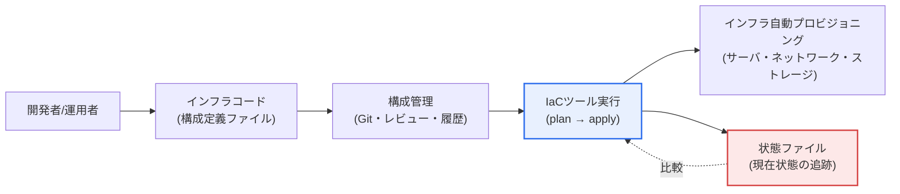
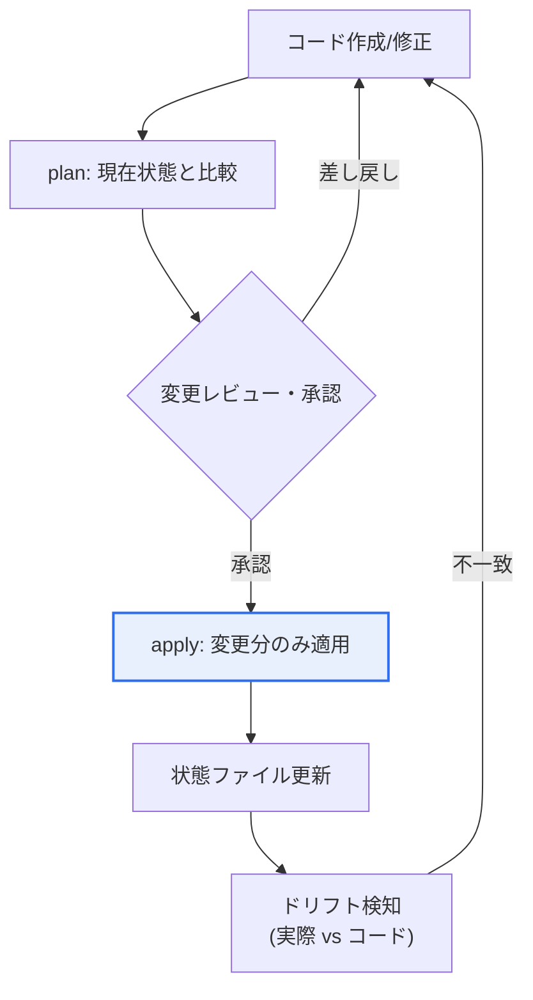

# コードとしてのインフラ(IaC, Infrastructure as Code)

## 1. 概要

### A. 定義
> **IaC(Infrastructure as Code)**とは、サーバ・ネットワーク・ストレージ・セキュリティポリシーなどITインフラの**望ましい状態をコード(構成ファイル)として宣言し、そのコードを実行してインフラを自動的にプロビジョニング・変更・管理**する方式である。コンソールでの手作業による設定を、バージョン管理可能なコードに置き換える。

IaCの本質は「**インフラをソフトウェアのように扱うこと**」である。かつてはサーバを増やしたりファイアウォールルールを変更したりする際、担当者が管理コンソールで一つひとつクリックしコマンドを入力していた。この方式は遅くミスが多く、何よりも「なぜこのサーバはあのサーバと設定が異なるのか」を誰も正確に把握していない状態を生む。時間の経過とともに手作業で少しずつ修正した痕跡が蓄積し、実際のインフラが文書・意図と乖離する現象を**構成ドリフト(configuration drift)**といい、これは障害原因の追跡と復旧を困難にする代表的な運用リスクである。

IaCはインフラの望ましい状態をコードとして宣言し、そのコードを実行してインフラを作る。するとインフラが**コードとして文書化**され、Gitのような構成管理によってバージョン追跡・コードレビュー・再利用が可能になり、同じコードで開発・テスト・本番環境を**まったく同じように再現**できる。「自分の環境では動くのに」という古典的な問題の相当部分は環境構成の差異に起因するが、IaCはその構成自体をコードで固定して差異をなくす。クラウドAPIと組み合わせれば、数百台のサーバを数分で同一構成にし、不要になればコード一行で回収することも可能になる。すなわちIaCは単なる自動化ツールではなく、インフラ運用を「手作業の技芸」から「**検証可能なエンジニアリング**」へと変えるパラダイム転換である。

### B. 登場背景と必要性
IaCが必須となった背景には三つの圧力がある。第一に、**クラウドの弾力性**である。クラウドはリソースをAPIで即座に増減できるようにしたが、この柔軟性に人が手作業で追随することは不可能である。自動化された定義がなければ、弾力性はむしろ混乱となる。第二に、**マイクロサービス・コンテナによる規模・変更頻度の爆発的増加**である。数百のサービスがそれぞれ異なるインフラを要求し、一日に何度もデプロイされる環境では、手作業管理では速度・一貫性・再現性を担保できない。第三に、**DevOps文化**である。開発と運用の境界を取り払いデプロイを自動化するには、インフラもアプリケーションコードと同様にパイプラインに乗せられなければならない。これら三つの圧力が噛み合い、IaCをクラウドネイティブ運用の基本技術とした。

## 2. 動作方式: 宣言型 vs 命令型

IaCのアプローチには二つの方式があり、両者の違いは「**何を記述するか**」にある。**宣言型(Declarative)**は「望ましい最終状態(what)」を記述すれば、ツールが現在の状態と比較し、その状態に到達するために必要な変更のみを自動的に適用する(Terraform・CloudFormation・Pulumi)。利用者は「サーバ3台がこのような設定で存在すべきである」とだけ宣言し、「現在2台あるので1台を追加せよ」という手順はツールが計算する。**命令型(Imperative)**は「何をどの順序で行え(how)」という手順を記述する(伝統的なシェルスクリプト、見方によってはAnsibleプレイブック)。

概して宣言型が好まれるのには明確な理由がある。宣言型は現在の状態を追跡するため、**冪等性(idempotency)** ― 同じコードを何度実行しても結果が同じであること ― を自然に保証する。命令型スクリプトは、二度実行するとサーバがさらに二台作られるといった副作用が生じやすい。また宣言型は「現在の状態 → 望ましい状態」の差分(diff)を事前に示すことができ(Terraformの`plan`)、適用前に何が変わるかをレビュー・承認する安全装置を作る。ただしツールごとの境界は絶対的ではない。Ansibleは手順を記述するが、各タスクを冪等に設計して宣言型に近い形で使われるなど、実務では両者の性格が混在する。

| 方式 | 記述対象 | 特徴 | 代表ツール |
|---|---|---|---|
| **宣言型** | 望ましい最終状態 | 冪等性・状態追跡・diffレビュー | Terraform, CloudFormation, Pulumi |
| **命令型** | 実行手順 | 細かな制御、副作用の管理が必要 | シェルスクリプト、Ansible(見方による) |

一方、プロビジョニング(インフラ作成)と構成管理(インストール・設定)は階層が異なる。Terraformはサーバ・ネットワークなどのリソースを「作る」プロビジョニングに、Ansible・Chef・Puppetは作られたサーバ上にソフトウェアを「設定する」構成管理に強みがあり、実務では両者を組み合わせることが多い。

### ツールエコシステムと選定基準
ツール選定は「どれが優れているか」ではなく、「組織のクラウド戦略・人材の能力に合っているか」で判断すべきである。**Terraform**は特定クラウドに依存しない(マルチクラウド)宣言型の標準として幅広いプロバイダーエコシステムを持つが、別途状態管理が必要である。**CloudFormation**はAWSに特化しており状態をサービスが管理してくれる利便性があるが、移植性は低い。**Pulumi**はPython・TypeScriptなどの汎用プログラミング言語でインフラを記述でき開発者に親和的であるが、言語・ランタイムの複雑さが伴う。**Ansible**はエージェントなし(agentless)でSSHにより構成管理を行うため、導入障壁が低い。このように各ツールは移植性・学習曲線・状態管理方式において異なるトレードオフを持つため、既に利用しているクラウドとチームの言語能力を基準に選定するのが現実的である。

## 3. 状態管理と実行フロー

宣言型IaCの心臓部は**状態(state)**である。ツールは「コードが望む状態」と「実際のインフラの現在の状態」を比較し、その差分だけを操作しなければならないため、現在の状態を記録した状態ファイルを維持する。状態ファイルはすなわち実際のインフラの地図であるため、このファイルが破損したり実態と乖離したりすると、ツールは誤った判断(既存のリソースを再作成する、必要なリソースを削除する)を下しうる。したがって状態ファイルをチームで共有・ロック(locking)できるリモートストレージ(例: オブジェクトストレージ+ロック)に置き、同時に二人がapplyして状態が壊れることを防ぐのが運用の基本である。

実行は通常、**plan → レビュー・承認 → apply**のフローに従う。`plan`段階でツールは「このサーバを新規作成し、あのルールを変更し、このボリュームを削除する」という変更計画を人が読める形で提示する。インフラ変更は削除・再作成がサービス停止に直結しうるため、この事前レビューが事故を防ぐ決定的な関門となる。承認後、`apply`で変更分のみを反映し状態を更新する。運用中には誰かがコンソールで手動でリソースを変更し、コードと実態が乖離するドリフトが発生しうるため、定期的にこれを検知してコードに戻す管理が必要である。

## 4. 期待効果と実務適用

IaCの効果は単に「便利になる」ことではなく、組織の運用成熟度を引き上げる複数の軸として現れる。下表の各効果は、前述した「状態・冪等性・構成管理」という原理から派生した結果であることを併せて理解すべきである。

| 効果 | 内容 | 原理的根拠 |
|---|---|---|
| **一貫性・再現性** | 同一コードで複数環境を同一構成、ドリフト除去 | 状態追跡・冪等性 |
| **速度・自動化** | 大規模インフラの迅速なプロビジョニング・回収 | クラウドAPI + 宣言型 |
| **バージョン管理・協業** | コードレビュー、履歴追跡、ロールバック可能 | 構成管理(Git) |
| **文書化** | コード自体が最新のインフラ仕様 | 宣言型定義 |
| **コスト最適化** | 未使用リソースをコードで回収、再利用のモジュール化 | 自動化 + 再利用 |

具体的な事例を見ると、第一に、大規模サービス企業は新規リージョン(region)へサービスを拡張する際、既存のインフラコードを再利用して**数百のリソースで構成された環境を数時間以内に複製**する。手作業であれば数週間かかり、リージョン間の微妙な設定差異により障害が発生していたであろう作業である。第二に、災害復旧(DR)シナリオにおいてIaCコードがそのまま「復旧手順書」となり、災害発生時に別リージョンへ同一インフラをコードで再構築することで復旧時間(RTO)を短縮する。第三に、開発チームが機能ごとに隔離されたテスト環境を必要時にコードで生成し、テスト後に自動削除することで、常時維持していた遊休リソースのコストを大幅に削減した事例が多い。このようにIaCの価値は初回の自動化よりも、**反復・再現・回収**の局面で際立つ。

これらの効果を組織の観点から見ると、IaCは個人の熟練度に依存していたインフラ運用をチームの資産へと転換する。特定の担当者だけが知っていた「設定の暗黙知」がコードとして明示化されることで、人員交代やオンコール(on-call)対応時にもインフラの構造と意図をコードから即座に読み取ることができる。また監査(audit)の観点では、誰がいつ何をなぜ変更したかが構成管理の履歴に残り、規制・コンプライアンス対応が容易になる。これは金融・公共のように変更統制が厳格な産業において特に重要な利点である。

## 5. 深化 — GitOpsへの発展とセキュリティ(Policy as Code)

IaCの最新動向は**GitOps**への拡張である。GitOpsとは「Gitリポジトリをインフラ・アプリケーション状態の唯一の信頼できる情報源(Single Source of Truth)とする」という原則である。運用者がツールを直接実行する代わりに、**Gitに変更をマージ(merge)すると自動化エージェントがその宣言を実際のクラスタへ継続的に同期**する(例: Kubernetes環境のArgo CD・Flux)。この方式の強みは三つある。すべての変更がPull Requestで行われるためレビュー・承認・監査追跡が標準的な開発ワークフローに組み込まれ、実際の状態がGitの宣言から外れるとエージェントが自動的に戻して(self-healing)ドリフトを根本から遮断し、ロールバックが「Gitのリバート」と同程度に単純になる。

もう一つの軸は**セキュリティ・ガバナンスのコード化**である。インフラがコードになったことで、そのコードが組織のポリシーを遵守しているかを自動検証することもコードで可能になった。**Policy as Code(例: OPA/Rego, Sentinel)**によって「パブリックに公開されたストレージの禁止」「暗号化されていないボリュームのデプロイ禁止」といったルールをパイプラインで強制し、tfsec・Checkovのような**IaC静的スキャン**でデプロイ前に誤ったセキュリティ設定を検出する。ただしインフラコードにアクセスキー・パスワードがハードコードされると構成管理の履歴に永久に残り深刻な漏えいとなるため、シークレットをコードの外(Vaultなどのシークレット管理システム)に置く原則を必ず併用しなければならない。このようにIaCは「自動化」から出発し、「GitOps(運用モデル)」と「Policy as Code(ガバナンス)」へと外延を広げながら、クラウドネイティブ運用の根幹として定着しつつある。

従来型IaC(ツールの直接実行)とGitOpsの違いを整理すると次のとおりである。

| 区分 | 従来型IaC | GitOps |
|---|---|---|
| 変更トリガー | 運用者がツールを直接実行(push) | Gitマージ → エージェントが同期(pull) |
| 信頼できる情報源 | コード + 状態ファイル | Gitリポジトリ |
| ドリフト処理 | 定期的な検知・手動調整 | 自動検知・self-healing |
| 監査追跡 | 実行ログ | Pull Request履歴 |

### 予想出題方向と答案構成戦略
技術士試験においてIaCは、単独テーマよりもクラウド・DevOps・コンテナと絡めて出題される傾向がある。答案を構成する際は次の軸を念頭に置くとよい。

- **概念・必要性**: 構成ドリフト・手作業の限界 → IaCの定義と登場背景へとつなげる。
- **方式比較**: 宣言型 vs 命令型を、冪等性・状態管理の「理由」まで記述する。
- **動作原理**: plan → レビュー → applyと状態ファイルの役割を図で提示する。
- **連携技術**: DevOps・CI/CD・GitOps・コンテナ(Kubernetes)・プラットフォームエンジニアリングとの関係へ展開する。
- **セキュリティ・ガバナンス**: シークレット管理、Policy as Code、IaCスキャンをリスク管理の観点から扱う。
- **結論**: 導入戦略(段階的・モジュール化)と組織成熟度、展望(Everything as Code)で締めくくる。

## 6. 考慮事項および示唆点 (技術士の観点)

1. **状態管理がIaC運用の急所である。** 宣言型ツールのすべての判断は状態ファイルに基づくため、状態のリモート保存・ロック・バックアップ・暗号化は選択ではなく必須である。状態ファイル自体に機微情報が含まれうるため、アクセス制御と暗号化を併せて設計すべきであり、状態が壊れればインフラ全体が危険にさらされるという前提で運用体制を整えなければならない。

2. **「コードこそが権限である」というセキュリティ観点が必要である。** IaCはインフラを自動的に変更できる強力な権限をコードに付与する。したがってコードレビュー・最小権限の原則・シークレット分離・Policy as Code・IaCスキャンをパイプラインに内在化し、誤ったコードや乗っ取られたパイプラインが大規模事故へ拡大しないよう防御しなければならない。

3. **段階的導入とモジュール化戦略が成否を分ける。** 既存の手作業インフラを一度にコードへ移行するのは難しい。新規リソースからIaCで管理し、繰り返される構成を再利用可能なモジュールとして標準化し、チーム全体のコードレビュー・テスト文化を併せて育てる段階的アプローチが現実的である。ツール導入そのものよりも組織の運用成熟度が鍵となる。

4. **ドリフト管理と変更規律が継続運用の核心である。** コンソールでの緊急の手動変更を完全に防ぐことは難しいが、これを放置するとIaCの再現性が崩れる。ドリフトを定期的に検知・調整し、変更は原則としてコード(GitOpsであればPR)を経由するという規律を確立してこそ、IaCの利点が持続する。

5. **展望: クラウドネイティブ運用の標準基盤。** IaCは既にDevOps・GitOps・プラットフォームエンジニアリング(社内開発者プラットフォーム、IDP)の共通基盤となった。さらにポリシー・セキュリティ・コストまでコードで管理する「Everything as Code」へと拡張し、インフラ運用の信頼性・監査性・コスト効率を併せて高める方向へ発展すると見込まれる。

## 参考資料
- HashiCorp — What is Infrastructure as Code?: https://developer.hashicorp.com/terraform/intro
- AWS — Infrastructure as Code: https://aws.amazon.com/what-is/iac/
- OpenGitOps Principles: https://opengitops.dev/
- Open Policy Agent (OPA): https://www.openpolicyagent.org/

---

> **一言まとめ**: IaCは*インフラの望ましい状態をコードとして宣言し自動的にプロビジョニング・管理*する方式であり、宣言型(冪等性・状態追跡)と命令型があって一貫性・再現性・速度・バージョン管理・コスト最適化を提供し、状態管理とセキュリティ(シークレット分離・Policy as Code)を備えてGitOps・プラットフォームエンジニアリングへと拡張される、クラウドネイティブ運用の標準基盤である。
