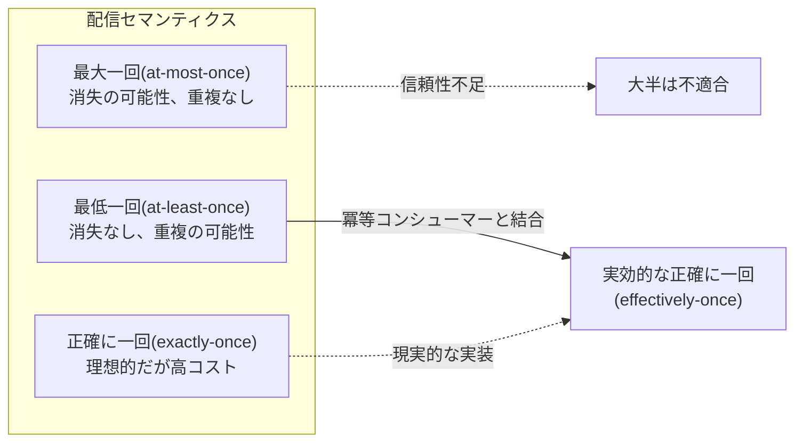
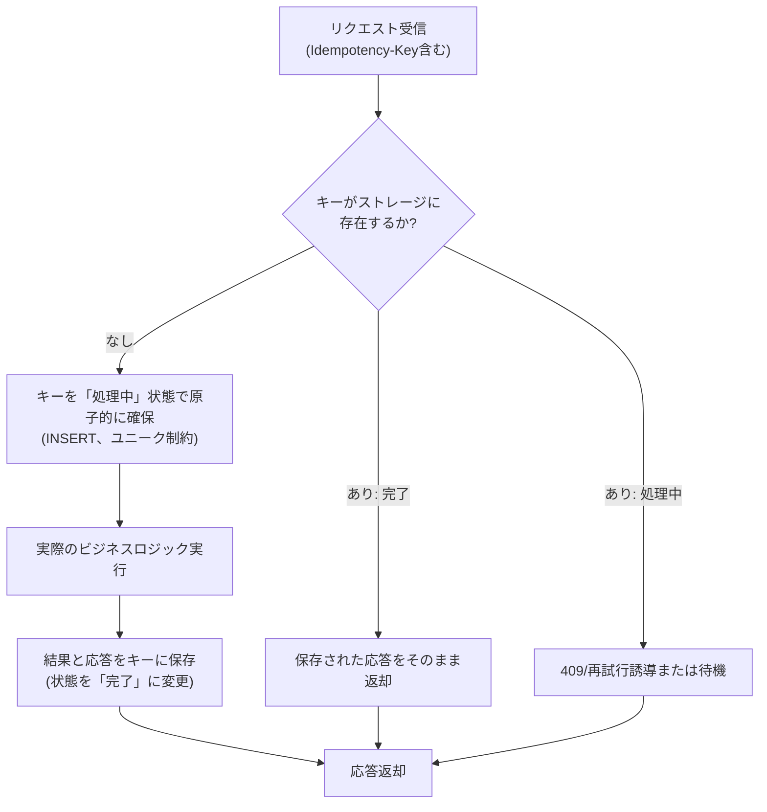

# 冪等性(Idempotency)設計と分散システムの信頼性

## 1. 概要

### A. 定義

> **冪等性(Idempotency)**とは、同一の演算を一回実行しても複数回繰り返し実行しても、システムの最終状態と観測可能な結果が変わらない性質をいう。数学的には関数fについてf(f(x)) = f(x)が成り立つことと同じである。

冪等性はもともと代数学において、ある元に演算を繰り返し適用しても値が変わらない性質を指す概念であった。
ソフトウェアではこの概念が、「リクエストを何度送っても副作用(side effect)が一度だけ反映される」という安定性の属性へと拡張された。
例えば「口座残高を100,000ウォンに設定する」という演算は何度実行しても結果が同じであるため冪等であるが、「口座から10,000ウォンを出金する」という演算は実行回数だけ残高が減るため冪等ではない。

冪等性はしばしば「安全性(Safety)」と混同されるが、区別しなければならない。
安全な演算(例: 参照)は状態をまったく変えないため自動的に冪等であるが、冪等な演算が必ずしも安全であるとは限らない。
例えば「リソースを削除する」という演算は状態を変えるが(安全ではない)、二度実行してもリソースが存在しないという最終状態は同じであるため冪等である。
このように冪等性は「副作用の有無」ではなく、「繰り返しが最終状態に及ぼす影響」を基準として定義される。

### B. 登場背景と必要性

冪等性が分散システム設計の中核原則として浮上した背景には、ネットワークの不確実性がある。
分散環境においてクライアントがサーバにリクエストを送り応答を受け取れなかったとき、クライアントは「リクエストがサーバに到達しなかった」のか「サーバは処理したが応答が失われた」のかを区別できない。
これこそが**二将軍問題(Two Generals' Problem)**として形式化される根本的な不確実性であり、いかなる通信プロトコルによっても完全には解消できない。
したがってクライアントは失敗とみなして再試行(retry)するしかないが、もし元のリクエストが既に処理されていれば、再試行は重複処理を引き起こす。

この問題は特に金銭がやり取りされるシステムにおいて致命的である。
例えばオンライン決済において、利用者が「決済」ボタンを押した後に応答が3秒以上遅延すると、利用者は再読み込みするか再度ボタンを押す。
冪等性が保証されていなければ同一の注文が二度決済される二重請求(double charge)が発生し、これは返金処理コストと顧客信頼の低下に直結する。
実際にStripe、PayPalなどの主要決済ゲートウェイは、クライアントが発行した冪等性キー(Idempotency-Key)を必須または推奨ヘッダとして採用し、この問題を構造的に防止している。

また、メッセージブローカーベースの非同期アーキテクチャの普及も冪等性の重要性を高めた。
Kafka、RabbitMQ、AWS SQSのようなメッセージシステムは、性能と可用性のために大半が**最低一回配信(at-least-once delivery)**を基本保証として採用している。
これはメッセージが失われない代わりに重複配信されうることを意味するため、コンシューマー(consumer)が冪等に設計されていなければ同一イベントが複数回処理され、データ整合性が崩れる。
すなわち冪等性は、「正確に一回(exactly-once)」という理想を、現実の「最低一回 + 冪等コンシューマー」の組み合わせで実現する実用的な鍵である。

### C. 適用目標と範囲

冪等性設計の目標は、第一に再試行の安全性確保(ネットワーク障害時に安心して再試行)、第二に重複リクエスト・重複メッセージの無害化、第三に障害復旧時の再処理の安定化、第四にユーザー体験の保護(二重請求・重複注文の防止)である。
適用範囲は、REST/gRPC APIの書き込み演算、メッセージコンシューマー、バッチ再処理ジョブ、分散トランザクションの補償処理、決済・精算・在庫引当のような状態変更ドメイン全般である。
逆に純粋な参照やストリーミング集計のように副作用がない、または既に冪等な演算には、別途の設計負担は大きくない。

## 2. 冪等性の類型と判断基準

### A. 演算自体の冪等性

最も望ましい形態は、演算の定義そのものが冪等である場合である。
「フィールド値をXに設定(SET)」したり「集合に要素を追加(冪等な集合演算)」したりすることは、繰り返しても結果が同じである。
データベースでは`INSERT ... ON CONFLICT DO UPDATE`(UPSERT)や条件付き更新を活用すれば、自然に冪等な書き込みを構成できる。
一方、「カウンタの増加(INCREMENT)」「残高の減算」「リストへのappend」のような相対的(relative)演算は本質的に冪等ではないため、別途の重複防止装置が必要である。

この区分はAPI設計段階において非常に重要である。
可能であれば、相対的演算を絶対的(absolute)演算へと再設計することが根本的な解決策である。
例えば「在庫を3個減少」というリクエストの代わりに、「在庫を47個に設定する、ただし現在値が50のときのみ」という条件付き絶対演算(Compare-And-Set)に変えれば、再試行しても条件が合わず二度反映されることはない。
このようにドメインモデリングのレベルで冪等性を確保すれば、インフラ層の複雑性を減らすことができる。

### B. HTTPメソッドの冪等性規約

Web標準(RFC 9110)は、HTTPメソッドごとの冪等性と安全性を明確に規定している。
この規約はプロキシ・キャッシュ・ブラウザ・クライアントライブラリが失敗したリクエストを自動再試行するかどうかを判断する根拠となるため、API設計者はこれを正確に遵守しなければならない。
下表は主要メソッドの性質を整理したものであり、各性質が「なぜ」そのように規定されるかは副作用の反復影響によって説明される。

| メソッド | 安全(Safe) | 冪等(Idempotent) | 説明 |
|--------|:---:|:---:|------|
| GET | O | O | 参照のみのため状態変更なし |
| HEAD | O | O | ヘッダのみ参照 |
| PUT | X | O | 全体置換(SETの意味)のため繰り返しても同一状態 |
| DELETE | X | O | 繰り返し削除しても「存在しない」状態に収束 |
| POST | X | X | リソース生成(appendの意味) — 繰り返すと重複生成 |
| PATCH | X | △ | 実装による(絶対更新は冪等、相対更新は非冪等) |

ここで特にPOSTが非冪等と規定されている点が、実務の中核的な難題である。
注文作成、決済リクエスト、コメント登録のような大半の「生成」演算がPOSTで実装されるからである。
したがってPOSTを冪等にするにはプロトコル規約だけでは不十分であり、後述する冪等性キーのようなアプリケーション層の仕組みを導入しなければならない。
PATCHが条件付き(△)である理由も同様で、`{"balance": 100}`のように絶対値を指定すれば冪等であるが、`{"balance": "+10"}`のように増分を指定すれば冪等ではないためである。

### C. 配信セマンティクスと冪等性の関係

メッセージ配信保証は大きく三つに分かれ、冪等性はそのうち「最低一回」保証を実質的な「正確に一回」へと引き上げる橋渡しの役割を果たす。

上図が示すとおり、純粋な「正確に一回」配信は分散環境では極めて高コスト(二相コミットなど)であるか、不可能に近い。
そのため成熟したシステムの大半は、「最低一回配信 + 冪等コンシューマー」という組み合わせによって事実上正確に一回の効果(effectively-once)を達成する。
例えばKafkaはプロデューサー側の冪等性(enable.idempotence)とトランザクション機能を提供するが、コンシューマーアプリケーションが外部システム(DB、決済API)に副作用を及ぼす場合には、結局コンシューマーレベルでの冪等処理が必要となる。
この点こそが「インフラが冪等性を代わりに保証してくれる」という誤解が崩れるところであり、副作用の境界を越えた瞬間にアプリケーションが責任を負う。

## 3. 実装アーキテクチャと手順

### A. 冪等性キー(Idempotency-Key)ベースの処理

POSTのように本質的に非冪等な演算を冪等にする標準的な方法は、クライアントがリクエストごとに固有の冪等性キーを付与し、サーバがこのキーを基準に重複を判別することである。
クライアントは論理的に「同じ試行」については再試行時にも同一のキーを維持し、「新しい試行」には新しいキー(例: UUID v4)を発行する。
サーバはキーと処理結果をストレージに記録しておき、同じキーが再び来た場合は実際の処理を省略し、保存された結果をそのまま返す。

以下は冪等性キー処理の典型的なフローである。

このフローで決定的に重要なのは、「キーの確保」が原子的でなければならないという点である。
二つの同一キーのリクエストがほぼ同時に到着する競合状態(race condition)において、データベースのユニーク制約(unique constraint)や`INSERT ... ON CONFLICT`を利用し、ただ一つだけが確保に成功するようにしなければならない。
確保に失敗したリクエストは進行中の処理を待つか、409 Conflictで応答してクライアントにしばらく後の再照会を促す。
もしこの原子性がなければ、同時の重複リクエストがすべて実際のロジックを実行し、冪等性が崩れる。

また、保存されたキーと結果は無限に保管できないため、保存期間(TTL)を設ける。
決済ゲートウェイは通常24時間〜数日のTTLを設け、その期間内の再試行のみを冪等に処理し、それ以降は新しいリクエストとみなす。
TTLが短すぎると遅延した再試行が重複処理される危険があり、長すぎるとストレージコストとキー衝突の可能性が大きくなるため、ドメインの再試行特性に合わせてバランスを取らなければならない。

### B. 自然キー・ビジネスキーを用いた重複排除

別途の冪等性キーがなくても、ビジネス上一意であるべき属性を制約条件として重複を防ぐことができる。
例えば「同一の注文番号に対しては決済が一つだけ存在すべきである」というルールを決済テーブルのユニークインデックス(order_id UNIQUE)で強制すれば、重複した決済リクエストはデータベースレベルで拒否される。
メッセージコンシューマーにおいても、メッセージの固有ID(event_id)を「処理完了ログ」テーブルに一意に記録し、既に存在すればスキップする方式で冪等性を確保する。

この方式は、別途のインフラなしに既存のデータモデルの制約だけで実装できるため単純であるという利点がある。
ただし副作用が複数のストレージや外部システムにまたがる場合、一つのユニーク制約だけで全体を保護するのは難しい。
このような場合には、処理状態を記録する別途の冪等性ストレージと、副作用を一つのローカルトランザクションにまとめるトランザクショナルアウトボックスパターンなどを併用しなければならない。

### C. 冪等コンシューマーと再処理の安定化

非同期パイプラインにおいてコンシューマーは、「このメッセージは既に処理したか」をまず確認した上で副作用を実行しなければならない。
最も堅牢な形態は、副作用を伴う保存と「処理完了の印」を同じトランザクションでコミットすることである。
例えば在庫の減算とevent_idの記録を一つのDBトランザクションにまとめれば、処理後に応答(ack)する前に障害が発生してメッセージが再配信されても、二回目の処理ではevent_idの重複によりスキップされる。
このとき副作用の保存と完了の印が別々のトランザクションにあると、その間に障害が発生した場合に副作用は反映されたのに完了の印が付かず、再処理時に重複が生じるため、原子性の境界設定が核心となる。

## 4. 類似概念との比較

冪等性は整合性に関連する複数の概念とともに使われるため、違いを明確にしなければならない。
下表は比較であり、違いが生じる理由と実務的な含意を文章で補足する。

| 区分 | 焦点 | 繰り返し時の効果 | 代表的な手法 |
|------|------|------|-----------|
| 冪等性(Idempotency) | 繰り返し実行の最終状態が同一 | 一回のみ反映 | 冪等性キー、UPSERT |
| 原子性(Atomicity) | 演算の全部または皆無 | 部分反映の防止 | トランザクション、2PC |
| 一貫性(Consistency) | ルール・不変条件の維持 | — | 制約条件、検証 |
| 正確に一回(Exactly-once) | 配信・処理回数の制御 | 正確に1回処理 | 最低一回 + 冪等 |

冪等性と原子性はしばしば一緒に言及されるが、異なる問題を解決する。
原子性は「一つの演算が中間状態なしに完結するか」を扱い、冪等性は「完結した演算を何度繰り返してもよいか」を扱う。
実務では両者を組み合わせてこそ安全であり、例えば冪等性キーの確保とビジネス処理を一つのトランザクションにまとめ(原子性)、再試行しても重複が生じないように(冪等性)する。

「正確に一回」は理想的な目標であるが、前述のとおり純粋に達成しようとするとコストが大きい。
したがって現場で「exactly-onceをサポートする」という文言は、多くの場合「最低一回配信を冪等処理で包み、事実上一回の効果を生む」という意味に解釈するのが正確である。
この解釈の違いを理解していないと、インフラ設定だけで重複が消えると誤判断しやすい。

## 5. 深化: 実務適用事例と最新動向

### A. 決済ゲートウェイにおける冪等性キーの標準化

Stripeは2017年頃からすべての書き込みAPIに`Idempotency-Key`ヘッダを導入し、クライアントがUUIDを生成して渡せば、ネットワークエラーによる再試行が重複請求につながらないようにした。
Stripeの公開ドキュメントによれば、このキーは基本的に24時間保管され、同じキーで再リクエストすると最初の応答(HTTPステータスコードを含む)をそのまま再現する。
この設計のおかげでクライアントSDKは5xxエラーやタイムアウト発生時に指数バックオフで安全に再試行でき、サーバは決済の正確に一回の反映を保証する。
韓国国内のPG会社やオープンバンキング、Toss・KakaoPayなどの決済連携においても、取引固有番号(トランザクションID)ベースの重複防止が事実上同一の原理で機能している。

### B. クラウド・メッセージングプラットフォームにおける冪等性サポートの強化

Apache Kafkaは0.11バージョンからプロデューサーの冪等性(`enable.idempotence=true`)とトランザクションAPIを提供し、ブローカーの再試行によるメッセージの重複をプロデューサーのシーケンス番号で除去する。
AWSはSQSの標準キューが最低一回配信を保証する一方、FIFOキューに5分単位の重複排除(deduplication)ウィンドウを設け、メッセージIDベースの重複排除をサポートしている。
2023〜2024年に入りサーバーレス・イベント駆動アーキテクチャが普及するにつれ、AWS Lambdaの冪等性ユーティリティ(Powertools Idempotency)のように、関数の実行結果をキーベースでキャッシュして再実行を防止するフレームワークのサポートも標準化されつつある。
ただしこうしたインフラ機能は大抵自プラットフォーム内部の境界でのみ有効であるため、外部の決済・精算システムへ副作用が移る瞬間の冪等性は、依然としてアプリケーションの責任として残る。

### C. 予想出題方向と答案構成戦略

情報管理技術士の観点では、冪等性は単独の用語説明よりも、「分散トランザクション・マイクロサービスの信頼性確保方策」の下位要素として出題される可能性が高い。
答案では、① 冪等性の定義と安全性・原子性との区別をまず確立し、② HTTPメソッド規約と配信セマンティクスを根拠に問題状況(重複リクエスト・重複メッセージ)を提示した後、③ 冪等性キー・自然キー・冪等コンシューマーという実装階層を図とともに展開し、④ 決済・メッセージングの事例で実効性を裏付ける構成が説得力を持つ。
特に「再試行・タイムアウト・サーキットブレーカー・アウトボックスパターン」との連携に言及すれば、レジリエンス設計全般を網羅する深化した答案となる。

## 6. 考慮事項および示唆点

第一に、**冪等性はインフラではなく、ドメイン・アプリケーション層の責任として設計しなければならない。** メッセージブローカーやクラウドが提供する重複排除は自らの境界内でのみ有効であり、副作用が外部システム(決済・精算・メール送信)へと拡張された瞬間、アプリケーションが冪等性キーと処理状態を直接管理しなければならない。アーキテクチャレビューの際には「副作用の境界」を識別し、その地点ごとに冪等の仕組みを配置する戦略が必要である。

第二に、**冪等性と性能・保存コストとの間のトレードオフを管理しなければならない。** すべてのリクエストのキーと結果を保存・参照すると、追加の遅延とストレージ負荷が発生する。トラフィックの大きいAPIではインメモリキャッシュ(Redis)と永続ストレージを階層化し、TTLとパーティショニングで保存コストを統制しつつ、再試行の有効期間を過ぎた遅延リクエストが重複処理されないよう、保存期間をドメインの特性に合わせて定めなければならない。

第三に、**並行性と原子性の確保が冪等性の成否を分ける。** 同一キーの並列リクエストの競合状態においてキーの確保が原子的でなければ、冪等性は崩れる。ユニーク制約、条件付きINSERT、分散ロックのうちドメインに適した原子的確保メカニズムを選択し、副作用と完了の印を一つのトランザクション境界にまとめる設計が不可欠である。この点において、トランザクショナルアウトボックスパターン、Sagaパターンとの結合が自然に求められる。

第四に、**レジリエンスパターンとの統合の観点からアプローチしなければならない。** 冪等性は再試行(retry)を安全にする前提であり、タイムアウト・指数バックオフ・サーキットブレーカーとともに設計されて初めて完全な障害対応体制をなす。再試行を導入しながら冪等性を確保しなければ、かえって重複した副作用を増幅させるため、両手法は必ず対にして検討しなければならない。

第五に、**可観測性(Observability)とテストによって冪等性を検証しなければならない。** 冪等性の失敗は正常フローでは表面化せず、再試行・障害の状況でのみ現れるため、重複リクエスト注入テスト(カオステスト)とキー処理指標(重複検知回数、キャッシュヒット率)のモニタリングを通じて実際の動作を継続的に検証しなければならない。コードレビューだけでは競合状態を見逃しやすいため、負荷状況下での並行性テストが特に重要である。

## 参考資料

- Stripe API Docs, "Idempotent requests": https://docs.stripe.com/api/idempotent_requests
- RFC 9110, "HTTP Semantics" (Method properties: Safe/Idempotent): https://www.rfc-editor.org/rfc/rfc9110
- Apache Kafka Documentation, "Idempotent Producer / Transactions": https://kafka.apache.org/documentation/#semantics
- AWS, "Amazon SQS FIFO queues — message deduplication": https://docs.aws.amazon.com/AWSSimpleQueueService/latest/SQSDeveloperGuide/FIFO-queues.html

---

> **一言まとめ**: 冪等性とは同一の演算を複数回実行しても最終状態が変わらない性質であり、ネットワークの不確実性と最低一回配信の環境において再試行・重複メッセージを無害化する分散システム信頼性の中核原則であって、冪等性キー・自然キー・冪等コンシューマーと原子的確保の設計によって「事実上の正確に一回」を実現する。
