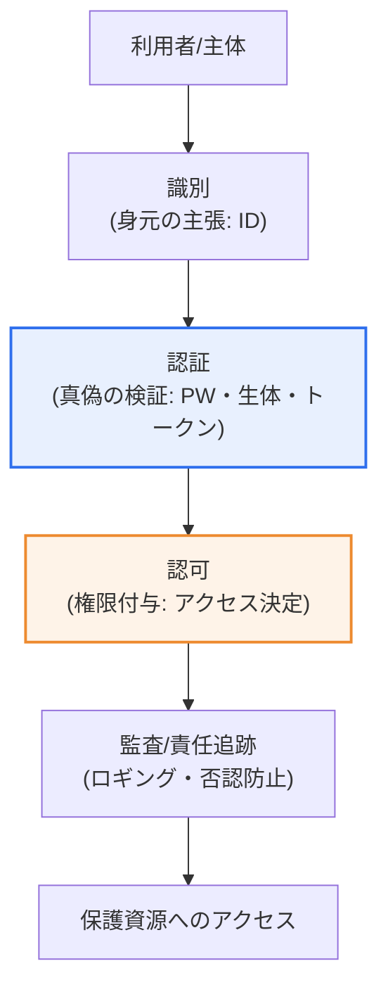
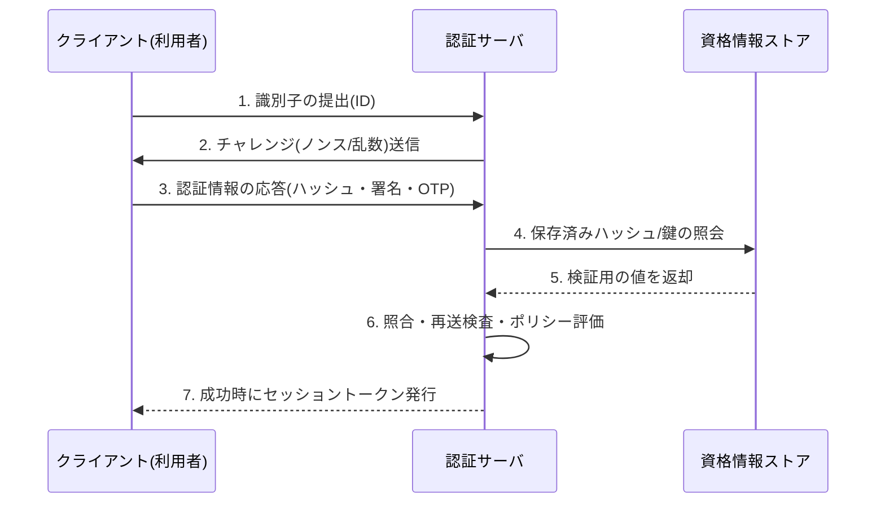

# 識別(Identification)と認証(Authentication)

## 1. 概要

### A. 定義

> **識別(Identification)**とは、システムに対して「私は誰それである」と**主体を主張・区別**する行為であり、**認証(Authentication)**とは、その主張が**本物であることを検証**する行為である。識別が身元を明かすことであるならば、認証はその身元が実際に正しいかを確認することである。

二つの概念を区別する核心は、「**主張(claim)と証明(proof)は異なる**」という点にある。識別は利用者が自分が誰であるかを明かす段階であり、ログイン画面にIDを入力したり、社員証の社員番号を提示したりすることが代表例である。しかしIDはシステム内で主体を一意に特定(unique identifier)するための名札にすぎず、その人が本当にその人であるかはまったく保証しない。他人のIDもいくらでも入力できるからである。

そのため認証が必要となる。認証は「あなたは本当にその人か」を、パスワード・生体情報・所持トークンなどの**認証要素(authentication factor)**によって検証する。銀行窓口にたとえれば、名前を名乗ることが識別であり、身分証を提示して本人であることを証明することが認証である。識別の結果は「主体の特定(誰か)」であり、認証の結果は「真/偽の判定(正しいか)」であるという点で、両段階は生み出すもの自体が異なる。

これら二つに加えて、認証された利用者が何をできるかを定める**認可(Authorization)**と、行為の否認を防ぐ**責任追跡性(Accountability)・否認防止(Non-repudiation)**が続く。一般に**AAA(Authentication・Authorization・Accounting)**と呼ばれるこの体系において、識別→認証→認可→監査(ロギング)はアクセス制御(Access Control)の基本骨格をなす。識別が不十分であれば認証の対象そのものが曖昧になり、認証が不十分であれば認可以降のすべての権限判断が崩れるため、四つの段階は一つの連鎖として理解しなければならない。

### B. 登場背景と必要性

識別・認証が情報セキュリティの出発点として定着した背景には、資源(データ・システム)へのアクセスを「誰が」行うのかを特定できなければ、機密性・完全性・可用性(CIA)のいずれも守れないという根本的な理由がある。アクセス主体を特定できなければ、権限付与も、事故発生時の責任追跡も不可能である。当初はID/パスワード(ID/PW)だけで十分と考えられていたが、フィッシング・クレデンシャルスタッフィング・データ漏えいによってパスワードが大量に露出するにつれ、単一要素認証の限界が明確になった。

特にクラウド・モバイル・在宅勤務の普及によってアクセス経路が「内部ネットワークの中」という境界を越えるにつれ、「ネットワーク内にいるから信頼する」という前提が崩れた。これにより、アクセスのたびに身元を改めて検証する**ゼロトラスト(Zero Trust)**パラダイムが登場し、識別・認証はセキュリティの付随的な手続きではなく、アーキテクチャの中心軸として再評価された。今日、識別・認証は「一度通過すれば終わり」ではなく、「継続的に検証するプロセス」として理解されている。

### C. 個人識別と利用者認証の違い

| 区分 | 識別(Identification) | 認証(Authentication) |
|---|---|---|
| **意味** | 身元を主張・区別 | 主張の真偽を検証 |
| **核心となる問い** | 「あなたは誰か?」 | 「本当にその人か?」 |
| **入力例** | ID・社員番号・メールアドレス | パスワード・指紋・OTP |
| **出力結果** | 主体の特定(固有識別子) | 身元確認(真/偽) |
| **セキュリティ強度** | 公開可能(秘密ではない) | 必ず秘密かつ検証可能でなければならない |

表に見るとおり、識別子は原則として「秘密ではない」。IDやメールアドレスは露出しても、それ自体でアカウントが乗っ取られることはない。一方、認証要素は露出した瞬間にアカウントが破られる。この違いゆえに、識別子と認証情報の管理水準(暗号化・保存方式・伝送保護)は根本的に異なっていなければならない。識別子を認証手段のように扱う設計(例: 住民登録番号や電話番号をそのまま認証とみなす慣行)が危険である理由はここにある。

## 2. 識別・認証・認可の処理フローと全体構造

まずアクセス制御の全体構造を概念図で確認し、続いて認証リクエストが処理される過程を詳細なフロー図に分けて説明する。

上の構造図は、一つのアクセスリクエストが資源に到達するまでに通過する四つの関門を示している。各関門は前段階の結果を信頼の前提とする。認証を通過しなければ認可の判断は無意味であり、監査ログに残る主体情報も、識別・認証が正確であって初めて信頼できる。すなわち後段階のセキュリティ上の価値は、前段階の正確性に従属する。

次は、実際の認証リクエストがサーバで検証される過程を詳細化したフローである。相互認証と再送防止がどのように介在するかを併せて表現した。

この詳細フローの核心は、**パスワードの原文がネットワーク上を流れないように**チャレンジ・レスポンス(challenge-response)方式で検証するという点である。サーバが毎回異なるノンス(nonce)を送り、クライアントがそれを含めて応答すれば、攻撃者が応答を傍受して再送(Replay)してもノンスが異なるため失敗する。6段階目の「ポリシー評価」では、単純な一致の有無を超えて、接続場所・機器・時間などのコンテキストも併せて確認する。これが後述する適応型認証との接点である。

## 3. 利用者認証時のセキュリティ要件

認証システムが安全であるためには、個々の要素の強度だけでなく、システム全体が複数の要件を同時に満たさなければならない。要件は互いに独立しておらず、相互補完的に機能する。

| 要件 | 内容 | 代表的な統制 |
|---|---|---|
| **機密性** | 認証情報(パスワード)の露出防止 | ソルト付きハッシュ(bcrypt・Argon2)・TLS |
| **完全性** | 認証情報・メッセージの偽造・改ざん防止 | MAC・電子署名 |
| **再利用防止** | 再送(Replay)攻撃の防御 | OTP・ノンス・タイムスタンプ |
| **相互認証** | サーバ・利用者の双方向検証 | サーバ証明書・チャネルバインディング |
| **強固さ** | 推測・総当たり攻撃への耐性 | 複雑性ポリシー・MFA・アカウントロック |

**機密性**は保存と伝送の両局面で守らなければならない。パスワードは原文ではなく、アカウントごとに異なるソルト(salt)を加えた上でbcrypt・scrypt・Argon2のような低速ハッシュで保存してこそ、漏えいしてもレインボーテーブル・大量クラッキングに耐えられる。伝送区間はTLSで暗号化し、中間者(MITM)が平文を見られないようにする。かつてMD5・単純なSHAで保存していたサービスが大規模漏えい事故の後にクラッキングされた事例は、保存方式が認証セキュリティの最後の防衛線であることを示している。

**相互認証**はしばしば見落とされるが、フィッシング防御の核心である。利用者だけが自らを証明しサーバが証明しなければ、偽サイトが正規サーバを装って利用者の認証情報を窃取できる。HTTPSのサーバ証明書検証、FIDO2のドメインバインディング(オリジン確認)が相互認証を強制し、フィッシングサイトでは資格情報が機能しないようにする。**再利用防止**は一度使った認証応答が再利用されないようにすることであり、OTPの30秒の有効時間やノンスがこの役割を果たす。

これらの要件は、どれか一つだけを満たせばよいものではない。例えば強固なパスワード(強固さ)を使っても平文で伝送すれば(機密性違反)無意味であり、機密性を守ってもサーバを検証しなければ(相互認証違反)フィッシングで破られる。セキュリティは最も弱い環で崩れるからである。

## 4. 認証方式による4つの類型と多要素認証

認証は「何によって証明するか」によって四つの要素に分けられる。各類型は原理が異なるため強みと弱みも相反し、この相反性こそが組み合わせ(MFA)の根拠となる。

| 類型 | 根拠 | 例 | 強み | 弱み |
|---|---|---|---|---|
| **知識ベース** | 知っているもの(know) | パスワード・PIN | 実装が簡単・低コスト | 漏えい・推測・使い回しに脆弱 |
| **所持ベース** | 持っているもの(have) | OTP・スマートカード・セキュリティキー | 物理的な所持が必要 | 紛失・盗難・複製の危険 |
| **生体ベース** | 存在(are) | 指紋・虹彩・顔 | 便利・固有・紛失なし | 変更不可・誤認識(FAR/FRR) |
| **行動・位置ベース** | 行うもの/位置 | 署名・タイピング・GPS | 無自覚な認証が可能 | 精度が低く補助用 |

**知識ベース**は最も古く広く使われているが、根本的な弱点が多い。人が記憶できるパスワードには複雑性の限界があり、複数のサイトで使い回され、一か所が漏えいするとクレデンシャルスタッフィングによって他のアカウントまで破られる。統計的に大規模なアカウント乗っ取り事故の相当数がパスワードの使い回しに起因するという点は、この類型の生来の限界を示している。

**所持ベース**は、攻撃者が物理媒体を入手しなければならないため、遠隔からの大量攻撃に強い。OTPは時刻(TOTP)やイベント(HOTP)に同期したワンタイム値を生成し、再送を無力化する。ただしSMS OTPはSIMスワッピング(SIM swapping)・中継型フィッシングに脆弱であるため、近年はハードウェアセキュリティキー(FIDO2)や認証アプリが推奨される。**生体ベース**は便利で紛失の危険がないが、漏えいした場合にパスワードのように「再発行」できないという致命的な特性がある。そのため生体情報はサーバへ送らず、機器内のセキュア領域(例: TEE・Secure Enclave)に保存・照合する方式が標準となった。

各類型の弱点が互いに異なるため、異なる類型を組み合わせた**多要素認証(MFA, Multi-Factor Authentication)**がセキュリティを飛躍的に高める。核心は「異なる類型」であるという点である。パスワードを二つ要求することは依然として知識ベース一つであるためMFAではない。パスワード(知識)とOTP(所持)を併用すれば、パスワードが漏えいしても攻撃者はOTP機器を持っていないため阻止される。実際にMFAは自動化された大量のアカウント乗っ取りの試みを大幅に遮断すると報告されており、これが金融・公共・企業システムにおいてMFAが義務化されている理由である。

一方、生体認証を評価する際には二つの誤り率を併せて見なければならない。**他人受入率(FAR, False Acceptance Rate)**は他人を本人として誤って受け入れる割合でセキュリティリスクに直結し、**本人拒否率(FRR, False Rejection Rate)**は本人を拒否する割合でユーザビリティに直結する。両者は閾値を厳しくすると一方が下がり他方が上がるトレードオフの関係にあり、両者が等しくなる点を**等価エラー率(EER, Equal Error Rate)**と呼んで生体システムの性能比較指標として用いる。高セキュリティ環境はFARを下げるよう(厳格に)、一般向けサービスはFRRを下げるよう(寛容に)閾値を調整するのが一般的であり、この調整自体がセキュリティと利便性のトレードオフを示す代表例である。

## 5. 深化 — パスワードレス認証(パスキー)と適応型認証への転換

近年の認証技術の最大の潮流は二つである。一つは知識ベース認証(パスワード)を完全になくす**パスキー(Passkey)**であり、もう一つはコンテキストを反映して認証強度を動的に調整する**適応型・リスクベース認証(Adaptive/Risk-based Authentication)**である。

**パスキー**は、FIDO2/WebAuthn標準に基づくパスワードレス認証である。利用者の機器が公開鍵/秘密鍵のペアを生成し、秘密鍵は機器のセキュア領域に置き、公開鍵のみをサーバに登録する。ログイン時にはサーバが送ったチャレンジに秘密鍵で署名し、サーバは公開鍵で検証するため、サーバには窃取して再利用できる「秘密」が保存されない。さらに署名は登録されたドメイン(オリジン)でのみ有効であるため、フィッシングサイトでは機能しない。すなわちパスキーは「漏えいする秘密がなく、フィッシングが根本的に遮断される」構造であり、パスワードの二つの根本問題(漏えい・フィッシング)を同時に解決する。主要プラットフォーム(OS・ブラウザ)がパスキーを標準サポートし始めたことで、普及が加速している。

**適応型認証**は、「すべてのアクセスを同じように扱わない」という発想である。普段使っている機器・場所・時間帯からの接続は低い摩擦で通過させ、新しい国からのログインや異常な行動パターンが検知された場合には追加認証(ステップアップ)を要求する。これは前述のフロー図の「ポリシー評価」段階において、接続コンテキスト(デバイスフィンガープリント・IPレピュテーション・行動分析)をスコア化してリアルタイムに判断する。ゼロトラストの「明示的に検証せよ(verify explicitly)」原則と結びつき、セキュリティ強度と利用者の利便性を同時に引き上げる方向へ発展している。

両者の潮流は互いに排他的ではない。パスキーで認証要素そのものを強固にし、適応型ポリシーでいつ再検証するかを知的に決定すれば、「強固でありながら煩わしくない」認証が可能になる。実際の予想出題方向としては、「パスキーと従来のMFAのセキュリティ・ユーザビリティ比較」「ゼロトラストにおける識別・認証の役割」「生体情報保護のための保存・処理方式」などが論述テーマとして扱われうる。

## 6. 考慮事項および示唆点

技術士の観点から識別・認証体系を設計・評価する際には、次の点を総合的に考慮しなければならない。

1. **多要素認証(MFA)の義務化と要素の組み合わせ戦略。** 単一要素(特にパスワード)は漏えい・窃取に対して生来脆弱であるため、異なる類型を組み合わせ、一つが破られてもアカウントが保護されるようにしなければならない。ただしSMS OTPのように弱体化した要素は避け、ハードウェアセキュリティキー・認証アプリ・パスキーを中心に要素を選択することがトレードオフ上有利である。

2. **パスワードからパスキー(FIDO2)への移行ロードマップ。** 知識ベース認証の根本的な脆弱性(漏えい・使い回し・フィッシング)を克服するにはパスキーへの移行が必要であるが、機器紛失・アカウント復旧・レガシーシステムとの互換性という現実的な制約がある。したがって全面移行よりも「パスキー優先、パスワードによるフォールバックの縮小」という段階的アプローチと、安全なアカウント復旧手順の設計が鍵となる。

3. **状況・リスクベースの適応型認証への進化。** 接続場所・機器・行動を分析し、危険な場合にのみ追加認証を要求する適応型認証は、ゼロトラストの中核的な実装である。セキュリティと利便性のバランスを取りつつ、誤検知(正常利用者の遮断)と見逃し(攻撃の通過)の閾値を継続的にチューニングする運用能力が併せて求められる。

4. **生体情報の保護とプライバシー遵守。** 生体情報は変更不可能であるため、漏えいした場合の被害は永続的である。原本をサーバへ送信・保存せず機器内のセキュア領域で処理する設計、そして個人情報保護法上の機微情報の処理要件の遵守が不可欠である。利便性だけを追求して生体情報を中央集中で保存する設計は、規制・セキュリティの両面で危険である。

5. **識別子と認証情報の分離原則。** 住民登録番号・電話番号のように公開・再利用される識別子を認証手段として兼用する慣行は危険である。識別子は公開可能な名札として、認証情報は秘密として明確に分離管理しなければならず、事故時に再発行が可能な形で設計しなければならない。

## 参考資料

- NIST SP 800-63 Digital Identity Guidelines — https://pages.nist.gov/800-63-3/
- FIDO Alliance, Passkeys / FIDO2 & WebAuthn — https://fidoalliance.org/passkeys/
- W3C, Web Authentication (WebAuthn) — https://www.w3.org/TR/webauthn-2/
- NIST, Zero Trust Architecture(SP 800-207) — https://csrc.nist.gov/pubs/sp/800/207/final

---

> **一言まとめ**: 識別は*身元を主張(誰か)*し、認証は*その真偽を検証(正しいか)*するものであり、識別→認証→認可→監査というアクセス制御の連鎖をなし、知識・所持・生体・行動の4つの認証要素を組み合わせたMFAを経て、漏えい・フィッシングを根本から遮断するパスキー(FIDO2)とコンテキストを反映する適応型認証へと進化している。
