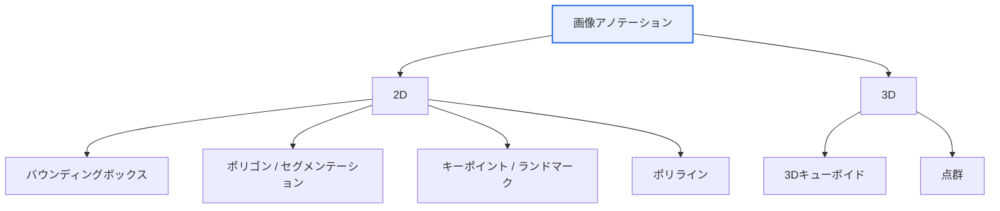

# 画像データアノテーション(Image Data Annotation)

## 1. 概要

### A. 定義
> コンピュータビジョンモデルの教師あり学習のために、画像に**物体・領域・属性などの正解ラベル(Ground Truth)を付与**する作業。

アノテーションは、モデルが「何が正解か」を学ぶための**教科書を作る過程**である。教師あり学習モデルは人が付与した正解を基準に予測誤差を減らしていくため、ラベルがそのまま学習の基準点となる。したがってアノテーションの正確性・一貫性は、アルゴリズムそのものに劣らずモデル性能を左右する。

### B. 登場背景および必要性
「ゴミを入れればゴミが出てくる(Garbage In, Garbage Out)」という言葉のとおり、モデル性能は**ラベル品質**に直接左右される。同じアルゴリズムであっても、正解が不正確であったり作業者ごとに基準が異なりばらついていたりすると、モデルは誤ったパターンを学習する。特に自動運転(歩行者の誤認識が事故に直結)・医用画像(病変の見落としが誤診に直結)・不良検査のように**精密な認識**が求められる分野が拡大するにつれ、大量の高品質ラベルを体系的に確保することがAI開発の中核的なボトルネックとなった。

## 2. アノテーション類型の分類

アノテーション類型は、**表現の精密度とコストのトレードオフ**として理解することが核心である。上に行くほど(バウンディングボックス)作業は速く安価であるが形状表現が粗く、下に行くほど(セグメンテーション・3D)ピクセル・空間単位で精密であるが作業時間とコストが急増する。したがって目標とするタスクが要求する精密度に合わせて類型を選ぶことが原則である。

## 3. 類型別の特徴

各類型は対応するコンピュータビジョンのタスクが異なる。**バウンディングボックス**は「何がどこにおおよそあるか」さえ分かればよい物体検出に用いられ、**ポリゴン・セマンティックセグメンテーション**は物体の正確な輪郭・ピクセル境界が必要な形状認識・医用画像に用いられる。**キーポイント**は関節・ランドマークの位置関係が重要な姿勢推定・顔認識に、**ポリライン**は車線のように細長い線状の物体に、**3Dキューボイド/点群**は距離・深度が必要な自動運転のLiDARに用いられる。

| 類型 | 説明 | 代表的な活用 |
|---|---|---|
| バウンディングボックス(Bounding Box) | 物体を矩形で表示 | 物体検出 |
| ポリゴン(Polygon) | 輪郭を多角形で精密に表示 | 形状認識・インスタンスセグメンテーション |
| セマンティックセグメンテーション | ピクセル単位のクラス分類 | 道路・背景の分割、医用画像 |
| キーポイント(Keypoint) | 関節・ランドマークを点で表示 | 姿勢推定・顔認識 |
| ポリライン(Polyline) | 線状の物体を表示 | 車線・道路境界 |
| 3Dキューボイド | 3次元の直方体で表示 | 自動運転LiDAR・深度認識 |

例えば自動運転において前方車両との衝突を回避するには、対象が画面のどこにあるか(ボックス)だけでなく**何メートル先にあるか**が必要となるため、LiDARの3Dキューボイドが求められる。このように類型の選択は、タスクの物理的な要求から決定される。

## 4. アノテーション手法

手作業によるラベリングは正確であるが遅く高コストであるという根本的な限界があるため、手法は**人の介入を減らす方向**へと進化してきた。ただし完全自動化には誤りのリスクがあるため、現在はAIが下書きを作り人が検品する**ヒューマン・イン・ザ・ループ(Human-in-the-loop)**が主流である。

| 手法 | 説明 |
|---|---|
| 手動(Manual) | 人が直接ラベリング — 正確だが高コスト・低速 |
| 半自動(Semi-auto) | AIが事前予測した後に人が検品・補正(HITL) |
| 自動(Auto-labeling) | 事前学習モデルで自動生成した後にサンプル検証 |
| 能動学習(Active Learning) | モデルが不確実とするサンプルを優先的にラベリング |

特に**能動学習**は効率化の中核戦略である。すべてのデータを同じようにラベリングする代わりに、モデルが**最も迷っている(予測確信度が低い)サンプル**を選び、優先的に人にラベリングを任せる。情報量の大きいデータに労力を集中させるため、同じ予算でより大きな性能向上を得ることができる。

## 5. 考慮事項および示唆点
技術士の観点での核心は、**品質と効率のバランス**をいかに設計するかである。品質面では、明確なラベリングガイドライン、クロスチェック、作業者間一致度(IAA, Inter-Annotator Agreement)の測定によって一貫性を担保しなければならず、効率面では半自動化・能動学習によってコストを下げなければならない。また、データにおいて特定の集団が過小・過大に表現されるとモデルがバイアスを学習するため**データバイアス**を管理しなければならず、顔・車両ナンバープレートなど個人情報が含まれる場合は**プライバシー(非識別化)**を必ず考慮しなければならない。近年はSAMのような基盤モデルを活用した自動セグメンテーションが発展するにつれ、人の役割がラベリングから**検品・品質管理**へと移りつつある。

---

> **一言まとめ**: 画像アノテーションは、*バウンディングボックス・ポリゴン・セグメンテーション・キーポイント・3D*などタスクの精密度に合わせて正解を付与する作業であり、ラベル品質がモデル性能を左右し、手動→半自動→能動学習によって品質と効率を同時に追求するとともに、バイアス・プライバシーを管理しなければならない。
