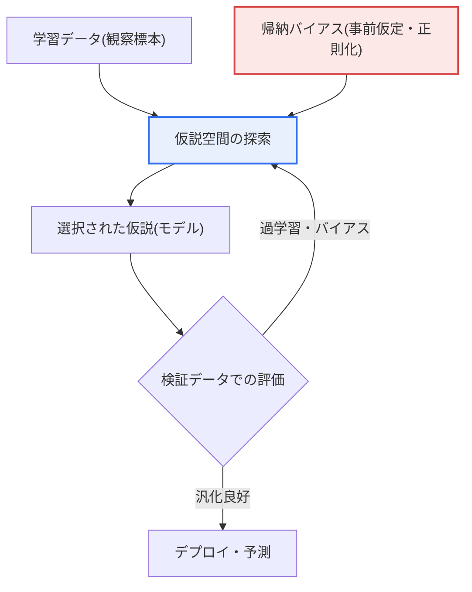

# 帰納的思考(Inductive Reasoning)と機械学習(Machine Learning)

## 1. 概要

### A. 定義
> **帰納的思考**とは、個別の事例・観察から一般的な規則・パターンを導出する推論方式であり、**機械学習**とは、データ(事例)から規則・モデルを学習する技術であって、**本質的に帰納的推論を自動化・計算化したもの**である。

二つの概念を併せて理解する核心は、「**機械学習とはすなわちコンピュータが行う帰納的思考である**」という洞察である。帰納とは、「カラスを100羽見たらすべて黒かった → カラスは黒い」のように、具体的な観察から一般法則を導き出す思考である。これは絶対的な真を保証できず(次のカラスは白いかもしれない)、確率的・経験的であるという特徴がある。機械学習もまったく同じように機能する。多数のデータ(事例)を見てその中のパターン・規則を一般化したモデルを作り、新しいデータを予測する。すなわち人が経験から規則を学ぶように、機械がデータから規則を学ぶのである。

この対応は単なる比喩ではなく、学習理論(Learning Theory)において数学的に裏付けられている。統計的学習理論において学習器(learner)は、入力・出力の組の有限標本から未知の目標関数を近似する仮説(hypothesis)を選ぶが、これはまさに「有限の観察から無限の事例を支配する一般規則を推定する」という帰納の定義と一致する。例えばスパムフィルタは、過去に人が「スパム/正常」とマークした数十万通のメールから単語・送信者・リンクのパターンを学習し、一度も見たことのない新しいメールを分類する。観察(ラベル付きメール)から規則(分類境界)を立て、新しい事例に適用する典型的な帰納の過程である。

この帰納的本質ゆえに、機械学習モデルは学習データになかった状況で誤ることがあり(汎化誤差)、学習データのバイアスをそのまま受け継ぐという限界を持つ。「黒いカラスしか見ていないので白いカラスを想像できない」という帰納の根源的な脆弱性が、データになかった少数事例・エッジケースでモデルが崩れる現象として再現されるのである。したがって機械学習を理解する際には、「どれだけうまく学習したか」ではなく、「**見たことのないデータにどれだけうまく汎化するか**」が本質的な評価基準となる。

### B. 登場背景と必要性
ルールベース(rule-based)アプローチの限界が、機械学習(帰納的アプローチ)の必要性を生んだ。1980年代のエキスパートシステムは、人がIF-THENルールを一つひとつコーディングする演繹的な方式であったが、現実の例外・曖昧さの多い問題(手書き文字認識、自然言語理解、画像分類)では、ルールを手作業ですべて記述することは事実上不可能であった。逆にデータはインターネット・センサー・モバイルによって爆発的に増加した。「ルールを人が書くのではなく、データから機械に帰納させよう」という転換こそが機械学習の台頭であり、ディープラーニングの成功(2012年ImageNet)は、この帰納的パラダイムがルールベースを圧倒することを実証した。

### C. 演繹との対比
帰納と対比されるのが演繹(Deductive)である。演繹は一般法則から個別の結論を導き出し(大前提→小前提→結論)真を保証するが、前提になかった新しい知識を生み出すことはできない。「すべての人間は死ぬ、ソクラテスは人間である、ゆえにソクラテスは死ぬ」は論理的に完結しているが、新しい法則を発見するわけではない。従来のルールベースAI(エキスパートシステム)が演繹的であるとすれば、機械学習はデータから新しい規則を発見する帰納的なものである。ただし実際の知能は両方式を行き来しており、近年のAIはこの二つを結合する方向(ニューロシンボリック)へと進んでいる。

## 2. 帰納的思考と機械学習の対応構造

まず、観察→一般化→予測へと続く帰納の骨格が、機械学習パイプラインとどのように1対1で重なるかを全体構造図で見る。

このフローの各段階は、帰納的思考の認知過程と正確に対応する。**観察(データ収集)**段階では、人は複数の事例を目で集め、機械はラベル付きの学習データを収集する。ここで観察の数と多様性がその後の一般化の信頼度を決定するという点は同じである。カラスを3羽しか見ていない人の一般化が危険であるように、少量・偏ったデータで学習したモデルも危険である。

**一般化(学習)**段階では、人は観察間の共通パターンを抽象化し、機械は損失関数(loss)を最小化するようにパラメータを調整する。例えば線形回帰は観測点を最もよく通る直線の傾き・切片を求めるが、これは「複数の事例から一つの傾向法則を抽出する」帰納の計算的実装である。ニューラルネットワークの勾配降下法(gradient descent)は誤差を減らす方向へ重みを繰り返し調整し、人が何度も試行錯誤して規則を磨き上げる過程に似ている。

**一般法則(モデル)**段階で導出されたモデルは、人の「経験則」に相当する。ただし人の経験則が言語で表現されるのに対し、機械の法則は数百万個のパラメータという数値の形であるため、人が直接読むことは難しい(説明可能性問題の根源)。**予測(適用)**段階ではこの法則を新しい事例に適用し、予測誤差を再び学習にフィードバックして法則を更新する循環(再学習)が、帰納的知識の自己修正過程をなす。

| 帰納的思考 | 機械学習 | 共通の本質 |
|---|---|---|
| 個別の観察の収集 | 学習データの収集 | 標本が結論の信頼度を左右 |
| パターン・規則の一般化 | モデル学習(パラメータ推定) | 有限の事例→一般規則への抽象化 |
| 一般法則の導出 | 学習済みモデル | 明示的な法則 vs 数値パラメータ |
| 新しい事例への適用 | 新しいデータの予測 | 未観測事例への外挿 |
| 確率的・経験的(誤りうる) | 汎化誤差・バイアスの可能性 | 絶対的な真は保証不可 |

## 3. 帰納的学習の内部メカニズムと帰納バイアス

機械が有限のデータからどのように一つの規則を「選び出す」のかを理解するには、仮説空間(hypothesis space)と帰納バイアス(inductive bias)の概念が必要である。以下は、学習器がデータとバイアスを組み合わせてモデルを選択する詳細なプロセス図である。

仮説空間とは、学習器が選びうるすべての候補規則の集合である。問題は、同じデータを説明する規則が無数に存在するという点である。例えば3つの点を通る曲線は、直線であることも、2次・10次の多項式であることもありうる。観察だけではどれが正しいかを決定できず、これがヒューム(Hume)が指摘した「**帰納の問題**」である。したがって学習器は必ずデータ以外の追加的な仮定、すなわち**帰納バイアス**を導入して候補を絞り込まなければならない。

帰納バイアスとは、「他の条件が同じであれば、どの規則を好むか」についての事前知識である。代表的なものに「単純な規則を好め」というオッカムの剃刀(Occam's Razor)があり、これは正則化(regularization)として実装される。例えばL2正則化は重みを小さく保ち、複雑な曲線よりも緩やかな曲線を好むようにする。畳み込みニューラルネットワーク(CNN)の「局所結合・重み共有」は「画像は局所パターンの組み合わせである」という空間的バイアスを、再帰型ニューラルネットワーク(RNN)の構造は「データには時間的順序がある」という逐次的バイアスを内蔵した例である。バイアスが問題の構造とよく合っているほど、少ないデータでもよく汎化する。

帰納バイアスは諸刃の剣である。バイアスがなければ(仮定がまったくなければ)、学習器は学習データを丸ごと暗記するだけで、新しいデータには何の汎化もできない(「ノーフリーランチ」定理、No Free Lunch)。逆にバイアスが問題と食い違えば、いくらデータが多くても誤った方向へ汎化する。実務においてモデル・アーキテクチャ・正則化の強度を選ぶことは、結局「この問題にはどのような帰納バイアスが適切か」を選ぶことであり、これがデータサイエンティストの中核的な判断である。

この帰納的本質から生じる特性を整理すると次のとおりである。

| 特性 | 内容 | 実務的な含意 |
|---|---|---|
| **確率的** | 絶対的な真ではない経験的推定 | 予測に信頼区間・確率を併せて提示 |
| **汎化誤差** | 学習になかったデータで誤りうる(過学習) | 交差検証・ホールドアウトで常時測定 |
| **データ依存** | データの量・質・バイアスが結果を左右 | データ品質管理がモデル性能の上限 |
| **帰納バイアス** | モデルが仮定する事前知識が汎化の方向を決定 | 問題に適したモデル・正則化の選択 |

## 4. 事例に見る帰納の成功と失敗

帰納的機械学習がうまく機能した事例と崩れた事例を比較すると、その本質が鮮明になる。成功事例として**AlphaGo**は、人間の棋譜16万局と自己対局データから「良い手」のパターンを帰納し、明示的な囲碁のルールなしに世界チャンピオンに勝利した。人が言語で定義しにくい「手の良さ」をデータから一般化した代表的な成功である。

失敗事例として、Amazonが2014〜2017年に開発し廃棄した**AI採用システム**は、過去10年分の合格履歴書を学習したが、そのデータに男性応募者が圧倒的に多かったため、「女性(women's)」という単語を含む履歴書を減点する規則を帰納してしまった。データのバイアスをそのまま法則として固定したものであり、「観察したものからのみ規則を抽出する」帰納の限界が差別として現実化した事例である。また自動運転において、学習データに稀であった夜間・逆光・異常物体の状況(エッジケース)で認識が失敗することも、観察していない事例への外挿は危険であるという帰納の原理をそのまま示している。

この対比の実務的含意は明確である。帰納的機械学習の性能の上限は結局データが決定し、「**データにない知恵はモデルにもない**」。したがって代表性のあるデータの確保とバイアスの点検が、モデル精度のチューニングよりも優先される課題となる。

## 5. 学習類型別に見る帰納の様相

機械学習の三つの系統(教師あり・教師なし・強化)はいずれも帰納であるが、「何から何を一般化するか」がそれぞれ異なる。これを区分してみると、帰納的思考との対応がより鮮明になる。

**教師あり学習(Supervised)**は、入力と正解(ラベル)の組から入力→出力の写像規則を帰納する。「これらの写真は猫、あれらの写真は犬」というラベル付きの観察から分類境界を一般化するものであり、人が例と正解を併せて見ながら規則を学ぶ教師あり的な帰納と正確に対応する。ラベルがそのまま観察の「正解の標識」であるため、ラベル品質が汎化の上限を決定する。

**教師なし学習(Unsupervised)**は、正解なしにデータの構造・クラスタ・分布だけから潜在的なパターンを帰納する。ラベルのない顧客購買履歴から類似顧客群をクラスタリング(clustering)することが例であり、人が明示的な正解なしに物事の共通点を自らカテゴリ化する概念形成の過程に似ている。何が「正しいパターン」かについての外部基準がないため、発見した規則の妥当性の解釈がより難しい。

**強化学習(Reinforcement)**は、試行錯誤によって得た報酬信号から「良い行動方策」を帰納する。正解を直接与えず結果の良し悪し(報酬)のみをフィードバックするため、人が経験の成功・失敗を通じて行動規則を体得する経験的な帰納に近い。観察が静的なデータではなく「行動→結果」の相互作用から生成されるという点が特徴であり、それだけに探索(exploration)と活用(exploitation)のバランスが汎化の鍵となる。

| 学習類型 | 観察(入力) | 一般化の対象 | 認知的な対応 |
|---|---|---|---|
| 教師あり学習 | 入力+正解ラベル | 入力→出力の写像 | 例と正解から学ぶ |
| 教師なし学習 | ラベルのないデータ | 潜在構造・クラスタ | 自ら概念をカテゴリ化 |
| 強化学習 | 行動・報酬信号 | 最適な行動方策 | 試行錯誤で体得 |

## 6. 深化 — 帰納の限界を乗り越えようとする最新動向

純粋な帰納的機械学習の限界(説明力不足、データバイアス、エッジケースへの脆弱性)を補完しようとする研究が、近年のAIの大きな潮流をなしている。第一に、**ニューロシンボリックAI(Neuro-Symbolic AI)**は、データから学ぶ帰納的なニューラルネットワークと、論理・規則を扱う演繹的なシンボリック推論を結合し、データから学びつつ人が検証可能な規則で推論するようにする。これは「帰納で仮説を立て、演繹で検証する」という科学的方法をAIに移植しようとする試みである。

第二に、**RAG(検索拡張生成)**は、大規模言語モデルの帰納的知識(学習パラメータ)に外部ナレッジベースの検索を組み合わせ、モデルが確率的に作り出すハルシネーション(hallucination)を根拠文書で補正する。帰納だけでは最新かつ正確な事実を担保しにくいという限界を、演繹的な根拠提示で補完する構造である。第三に、**基盤モデル・転移学習**は、膨大なデータで一般的な表現をまず帰納した後、少量のデータで特定のタスクに適応(fine-tuning)させることで、少ない観察でもよく汎化するよう帰納のデータ依存性を緩和する。第四に、**説明可能AI(XAI)**は、数値パラメータとして固定された帰納的法則を人が理解できる根拠へと逆解釈し、帰納の「ブラックボックス」的性格を補完する。

技術士の観点から見たこれらの潮流の共通点は、「**純粋な帰納の確率的・不透明な性格を、演繹的な規則・根拠・説明によって制御可能にすること**」である。すなわちAIの発展方向は帰納を捨てることではなく、帰納と演繹を結合して信頼性を高めることにある。

## 7. 考慮事項および示唆点 (技術士の観点)

1. **汎化こそが最終目標であり、評価の本質である。** 機械学習の成否は学習データを暗記することではなく新しいデータにうまく適用される汎化にあるため、学習精度ではなく検証・テストの性能で判断し、交差検証・ホールドアウトによって汎化誤差を常時測定しなければならない。学習性能だけが高く検証性能が低い過学習は、帰納が失敗したシグナルである。
2. **データバイアスはすなわちモデルバイアスであり、これはガバナンスの課題である。** 帰納は観察したデータからのみ規則を導くため、学習データが偏ればモデルも偏る。代表性のあるデータの確保、バイアスの検知・緩和、データの出所・ラベル品質の管理が信頼の前提であり、これはAI倫理・公平性の規制(EU AI Actなど)に直結する。
3. **帰納バイアス(モデル選択)はアーキテクトの中核的な判断である。** どのモデル・正則化・アーキテクチャを用いるかは、すなわちどのような事前仮定を導入するかの問題である。問題の構造に合ったバイアス(画像→CNN、逐次→Transformer)を選択してこそ少ないデータでもよく汎化するのであり、これはやみくもに大きなモデルが答えではないことを意味する。
4. **帰納と演繹の結合によって信頼性を確保する。** データから学ぶ帰納的機械学習に知識・規則を結合したニューロシンボリックAI、RAG、XAIが登場し、帰納の限界(説明力・正確性・ハルシネーション)を補完している。ミッションクリティカルな領域ほど、純粋な帰納よりも検証可能なハイブリッド構造を志向すべきである。
5. **不確実性を明示する運用が必要である。** 帰納的予測は本質的に確率的であるため、点予測のみを提示するのではなく信頼区間・確信度(confidence)を併せて提供し、確信度が低い場合には人に判断を委ねるヒューマン・イン・ザ・ループ(Human-in-the-loop)を設計して、誤りの波及を制御しなければならない。

---

> **一言まとめ**: 機械学習は*データ(事例)から規則を一般化する帰納的思考を自動化・計算化*した技術であり、仮説空間を帰納バイアスで絞り込んでモデルを選択する確率的な過程であって、その本質上、汎化誤差・データバイアス・不透明性という限界を持つため、交差検証・データ品質管理・帰納と演繹の結合(ニューロシンボリック・RAG・XAI)によって信頼性を補完しなければならない。
