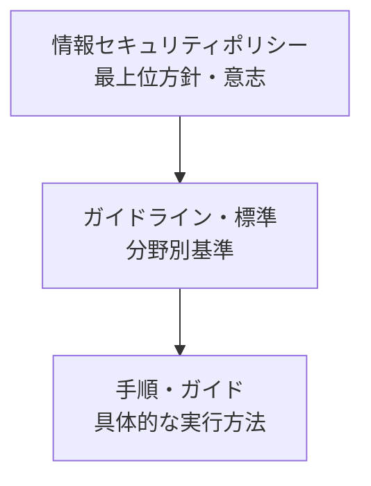

# 情報セキュリティポリシーとセキュリティ活動・専門家

## 1. 概要

### A. 定義
> 組織の**情報セキュリティに対する経営陣の意志と方向性を明文化した最上位文書**であり、これを頂点としてガイドライン・標準・手順が階層的に派生し、組織全体のセキュリティ活動を規律する基準。

### B. 登場背景および必要性
組織が大きくなり情報資産が増えると、セキュリティ統制を個人の裁量や担当者の慣行に委ねることはできなくなる。部署ごとに異なる基準でアクセス権限を付与し、インシデント対応が場当たり的に行われれば、統制に穴が生じる。そこで**一貫したセキュリティ基準と責任体系**を文書で確定し、全構成員に遵守させるのが情報セキュリティポリシーである。また、ISMS-P・個人情報保護法のような法令・認証はポリシーの策定を義務化しているため、ポリシーは**法規制の遵守(コンプライアンス)**と**リスク管理**の出発点でもある。ポリシーがなければ、インシデント発生時に責任の所在が不明確となり、対外的な信頼の確保も難しい。

## 2. 情報セキュリティポリシーの概念と階層

ポリシー文書は、**抽象的な方向性(ポリシー)→具体的な実行(手順)**へと下るほど詳細になるピラミッド構造を持つ。最上位の**ポリシー**は「我々は情報をこのように保護する」という原則と経営陣の意志を示し、めったに変わらない。その下の**ガイドライン・標準**はアクセス制御・暗号化・パスワードのような分野別の基準を定め、最下位の**手順・ガイド**は「このシステムでアカウントをどのように発行するか」のような実務上のステップを規定し、状況の変化に応じて頻繁に更新される。このように階層を分ける理由は、頻繁に変わる詳細な手順のために最上位の原則まで揺らがないよう、**変更の影響範囲を分離**するためである。

| 項目 | 内容 |
|---|---|
| 定義 | 情報セキュリティの意志・方向性を明文化した最上位文書 |
| 階層 | ポリシー → ガイドライン・標準 → 手順・ガイド |
| 要件 | 経営陣の承認・支持、全社適用、定期的な見直し・更新 |
| 内容 | 目的・範囲、役割・責任、遵守・罰則、セキュリティ原則 |

ポリシーが実効性を持つためには、**経営陣の正式な承認・支持**が不可欠である。ポリシーは予算・人員・組織上の権限を伴うが、これらは経営陣にしか配分できないからである。また脅威環境は絶えず変化するため、少なくとも年1回以上**定期的に見直し・更新**しなければならない。

## 3. 時点別のセキュリティ活動(Security Action Cycle)

セキュリティは一度きりの措置ではなく、インシデントの発生時点を基準に**事前・発生中・事後**を包括する循環として捉えなければならない。この観点が重要である理由は、いかに予防を強化しても侵害を100%防ぐことはできないという現実があるためである。したがって予防だけに投資するのではなく、検知・対応・復旧にもリソースを分散しなければならない。

- **抑止(Deterrence)**: 罰則規定・監視している事実を告知し、攻撃・内部者による違反の試みそのものを心理的に防ぐ。最も低コストな統制である。
- **予防(Prevention)**: アクセス制御・暗号化・セキュリティ教育によって侵害を事前に遮断する。最も理想的であるが、完璧にはなりえない。
- **検知(Detection)**: IDS・SIEM・ログ監視によって、既に発生した侵害を迅速に発見する。予防が突破された後の防衛線である。
- **対応(Response)**: 侵害を確認した際に隔離・遮断・原因調査によって被害の拡大を防ぐ。
- **復旧(Recovery)**: バックアップによってシステムを正常化し、BCP/DRPによって業務継続性を確保するとともに、再発防止策を反映する。

| 時点 | 活動例 |
|---|---|
| 抑止 | ポリシー・罰則の告知、監視の公示 |
| 予防 | アクセス制御・暗号化・教育 |
| 検知 | IDS/SIEM・ログ監視 |
| 対応 | インシデントの隔離・遮断・調査 |
| 復旧 | バックアップからの復旧・BCP・再発防止 |

## 4. 情報セキュリティ専門家の役割・能力

情報セキュリティ専門家(例: CISO・セキュリティ担当者)は、上記のポリシーと活動の循環を実際に設計・運用する主体である。特に今日のセキュリティは技術だけでは完結しない。インシデント発生時には経営陣・法務・広報と連携し、規制当局へ届け出なければならないため、**技術・管理・ソフト面の能力**が併せて求められる。

| 区分 | 能力 |
|---|---|
| 役割 | ポリシー策定、リスク管理、インシデント対応、セキュリティ運用・監査、意識向上教育 |
| 技術的能力 | システム・ネットワーク・暗号・クラウドセキュリティ、デジタルフォレンジック |
| 管理的能力 | ガバナンス・コンプライアンス(ISMS-P)、リスク管理 |
| ソフト面の能力 | コミュニケーション、職業倫理、最新脅威の継続的学習 |

例えばランサムウェアのインシデントが発生すると、専門家は技術的には感染経路をフォレンジックで分析し、管理的には届出・報告手順を履行し、ソフト面の能力によって役職員に状況を説明し再発防止教育を実施する。

## 5. 考慮事項および示唆点
- **成功要件**: ポリシーは文書化だけで終わるものではない。**経営陣の意志 + 全社的な実行(教育・点検)**に裏打ちされて初めて実効性を持つ。
- **バランスと進化**: 技術・管理・物理セキュリティをバランスよく整えつつ、境界型防御の限界を越えて「**決して信頼せず常に検証する**」**ゼロトラスト(Zero Trust)**へと進化している。
- **継続性**: セキュリティは一度きりのプロジェクトではなく、抑止〜復旧の**循環(Action Cycle)**を回し続ける継続的な活動であり、脅威インテリジェンスによってポリシーを絶えず更新しなければならない。

---

> **一言まとめ**: 情報セキュリティポリシーは*経営陣の意志を明文化した最上位文書(ポリシー→ガイドライン→手順)*として一貫したセキュリティ基準を確立し、セキュリティ活動は*抑止・予防・検知・対応・復旧*の循環として遂行され、セキュリティ専門家は技術・管理・倫理の能力によってこれを設計・運用し、ゼロトラストへと進化させる。
