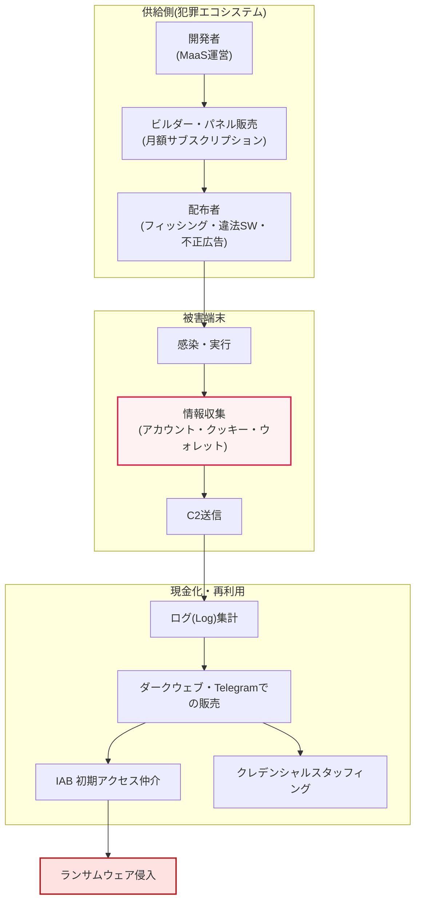
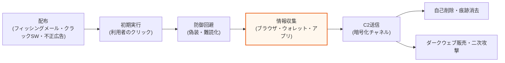

# インフォスティーラー(InfoStealer)

## 1. 概要

### A. 定義
> インフォスティーラーとは、感染したシステムから**アカウント・パスワード・セッションクッキー・暗号資産ウォレット・自動入力情報などの機微データを密かに収集・窃取**し、攻撃者のサーバ(C2)へ送信する情報窃取型マルウェアである。窃取されたデータはログ(Log)という単位にまとめられてダークウェブ市場で取引されるか、アカウント乗っ取り・ランサムウェア侵入などの二次攻撃の原料として再利用される。

インフォスティーラーが他のマルウェアと区別される根本的な性格は、「**破壊ではなく窃取**」という点にある。ランサムウェアがファイルを暗号化して即時かつ可視的な被害を引き起こし身代金を要求するのに対し、インフォスティーラーは正反対に、できる限り静かに侵入して資格情報をかき集めた後、痕跡を消して姿を消す。被害者は感染の事実そのものを認識していないことが多く、数か月後にアカウントが乗っ取られたり会社のシステムがランサムウェアに感染したりして初めて、最初の原因がインフォスティーラーであったことを遡って突き止めることになる。この「遅延した被害」と「低い可視性」が、インフォスティーラーを特に危険なものにしている。

二つ目の核心は、**セッションクッキー(Session Cookie)の窃取**が認証体系の最後の防衛線を無力化するという点である。利用者がWebサービスにログインすると、サーバは認証状態を維持するためのセッショントークンをクッキーに格納してブラウザに保存する。インフォスティーラーがこのクッキーを窃取すると、攻撃者は被害者のパスワードや多要素認証(MFA)のコードをまったく知らなくても、「既にログイン済みのセッション」をそのまま再現できる。すなわちMFA・パスキーのような強力な認証手段を導入しても、認証後に発行されたセッションを丸ごと盗まれれば認証手続きを飛ばされてしまうのである。このためインフォスティーラーは、「MFAを回避する現実的な脅威」としてしばしば取り上げられる。

三つ目は、**犯罪エコシステムにおける位置づけ**である。インフォスティーラーはそれ自体が最終目的というよりも、後続の攻撃に必要な資格情報を大量に供給する「原料供給役」であり、初期侵入の手段である。窃取された企業のVPN・SSOアカウントはIAB(Initial Access Broker)を経てランサムウェア組織に販売され、大量の個人アカウントはクレデンシャルスタッフィングに利用される。近年はサービスとしてのマルウェア(MaaS, Malware-as-a-Service)の形で月額サブスクリプション方式により販売されるようになり、技術力の乏しい攻撃者でも容易に利用できるようになったことで、参入障壁が大きく下がった。

### B. 登場背景と必要性
インフォスティーラーが産業化した背景には、三つの環境変化が噛み合っている。第一に、ブラウザやアプリケーションにID・パスワードを保存する習慣が一般化したことで、一台の端末に数十〜数百の資格情報が集中して保管される構造が生まれた。第二に、窃取情報を売買するダークウェブ市場とTelegramベースの販売チャネルが成熟し、「盗んだデータの現金化」の経路が確立された。第三に、MaaSのビジネスモデルが定着したことで、開発者・配布者・購入者が分業する精巧なサプライチェーンが形成された。

防御の観点からインフォスティーラーを独立したテーマとして扱うべき理由は、従来の境界防御(ファイアウォール・アンチウイルス)だけでは対応が難しいためである。インフォスティーラーは正常なプロセスを装い、収集直後に自己削除(self-delete)することが多いため、検知の機会が短い。したがって感染の予防だけでなく、「窃取を前提とした」認証強化と事後の漏えい監視までを包含する多層的な戦略が求められる。

### C. 主な特徴
インフォスティーラーの技術的特徴は次のように整理される。第一に、収集対象が広範である — ブラウザに保存されたパスワード・クッキー・自動入力、メール・メッセンジャーのアカウント、FTP/VPN/SSHの設定、暗号資産ウォレットファイル、特定の拡張子の文書までを対象とする。

第二に、短い実行時間(fire-and-forget)という特性を持つ。常駐型のバックドアとは異なりシステムに長く留まらず、一度実行して情報をかき集めて送信した後、自ら終了・削除することが多い。このため検知可能な時間枠(window)が極めて短く、シグネチャベースのアンチウイルスよりも振る舞いベースのEDRが有利である。

第三に、モジュール化・結合性が高い。クリッパー(暗号資産の送金先アドレスを攻撃者のアドレスに密かに置き換える)、ローダー(追加ペイロードのダウンロード)、ボットネットクライアントなど他のマルウェアと結合して機能を拡張する。すなわちインフォスティーラーへの感染は単一の事件で終わらず、追加のマルウェア流入の経路にもなる。

### D. 代表的なファミリーと進化
インフォスティーラーは特定の一つではなく、絶えず浮き沈みを繰り返す複数のファミリーの総称である。RedLine・METAは長らく市場を主導していたが2024年の摘発で縮小し、その空白をLummaC2が急速に埋めた。その後もVidar・StealC・Rhadamanthys・Meduzaなどが活発に流通し、摘発・再登場・代替が繰り返される非常に流動的な構図を形成している。防御側は特定のファミリー名を追いかけるよりも、それらが共通して狙う「資格情報・セッション」という資産を中心に対応体制を設計するほうが持続可能である。

## 2. 全体構造および脅威の流れ

インフォスティーラーの脅威を理解するには、個々のマルウェアの動作だけでなく、それを取り巻く犯罪エコシステム全体の構造を併せて見なければならない。以下の構造図は、開発・配布・収集・現金化・二次攻撃へと続く循環の連鎖を示している。

上記の構造で注目すべき点は、**役割の分業**である。マルウェアを作る開発者、それを購読してばら撒く配布者、窃取ログを買い取って侵入するIAB、最終的にランサムウェアを実行する組織が、それぞれ異なる主体である。この分業構造のため、特定のマルウェアファミリーを摘発(takedown)してもエコシステム全体は容易には崩れない。実際に2024年10月のRedLine・METAを標的とした国際共同作戦(Operation Magnus)と2025年5月のLummaC2摘発にもかかわらず、市場は数週間以内に代替ファミリーへ移行して回復する弾力性を示した。

## 3. 攻撃手順(Kill Chain)

個々の感染端末で起こることを段階別に細分化すると、次のとおりである。

### A. 配布と初期実行
インフォスティーラーの最初の侵入は、大半が「利用者のクリック」を誘導するソーシャルエンジニアリングに依存している。代表的な経路は、(1) 請求書・履歴書・契約書を装ったフィッシングメールの添付ファイル、(2) 違法コピーソフトウェア・ゲームのチート・クラックなど信頼できない実行ファイル、(3) 検索結果の上位に表示される不正広告(malvertising)および偽のダウンロードサイトである。近年は正規サイトを装い、「セキュリティ認証のため以下のコマンドを貼り付けてください」と利用者自身にPowerShellコマンドを実行させるClickFix方式も広がっている。共通点は、技術的な脆弱性の攻撃よりも**人の判断を欺く方式**が主流であるという点であり、これは技術的統制だけでは防ぎにくく、利用者教育を併用しなければならないことを示唆している。

### B. 防御回避と情報収集
実行されたインフォスティーラーは、アンチウイルス・EDRの検知を避けるために、正常プロセスへの偽装、コードの難読化、短時間の実行後の自己削除などの回避手法を用いる。続く中核段階である情報収集では、ブラウザがローカルに保存した資格情報データベース(例: Chromium系の`Login Data`、クッキーストア)を直接読み込む。ここで決定的なポイントは、ブラウザのローカル暗号化をいかに回避するかである。GoogleはChromeにApp-Bound Encryptionを導入し、クッキーストアを特定のアプリケーションに結び付けて他のプロセスが復号できないよう保護レベルを高めたが、攻撃者は数週間以内にこれを回避する手法を開発した。セキュリティ業界の報告によれば、Lumma・Vidar・StealC・Rhadamanthys・Meduzaなど多数のファミリーがApp-Bound Encryptionの回避に成功したとされ、防御と回避が繰り返される「矛と盾」の様相を呈している。

### C. C2送信と現金化
収集されたデータは圧縮・暗号化され、攻撃者のC2サーバへ送信される。このとき検知を避けるため、正規のクラウドサービスやTelegram APIをC2チャネルとして悪用する事例が増えており、トラフィックだけで悪性か否かを見分けることはますます難しくなっている。送信が終わるとマルウェアは自らを削除して痕跡を消す。窃取されたデータは「ログ」単位に整理され、ダークウェブマーケット・Telegramチャネルで1件あたり数ドル〜数十ドル程度で取引され、企業のVPN・管理者アカウントのように価値の高いログはIABを通じてはるかに高値で販売される。

## 4. 対応策(情報セキュリティ担当者の観点)

インフォスティーラー対応の中核命題は、「**感染を100%防げないのであれば、窃取されても被害が拡大しないよう設計する**」である。これに基づき、予防・認証強化・検知・事後管理の4重の防御を階層的に構築する。

| 区分 | 目標 | 詳細な対応 |
|---|---|---|
| **予防(感染遮断)** | 最初の侵入を遮断 | 違法SW・出所不明ファイルの遮断、添付ファイル・マクロの統制、継続的なフィッシング訓練、ブラウザへのパスワード保存の回避 |
| **認証強化(窃取の無力化)** | 盗まれても使えなくする | MFA・パスキー(FIDO2)への移行、セッションの短い有効期限・デバイスバインディング・再認証、漏えいアカウントの強制リセット |
| **検知(早期発見)** | 感染・送信の捕捉 | EDR/XDRによる異常行動検知、C2通信・異常なアウトバウンドの遮断、異常ログイン(場所・機器)の監視 |
| **事後管理(被害最小化)** | 拡大の抑制 | 最小権限の原則、資格情報ボールト・シークレット管理(Secret Manager)、ダークウェブ漏えい監視、インシデント対応手順(IR) |

表に列挙した統制は、個別にではなく**連鎖的に**機能して初めて意味を持つ。予防が突破されても認証強化が窃取された資格情報を無力化し、それさえセッションクッキーで回避されれば検知が異常ログインを捉え、それでも漏れ出た情報は事後の監視によって早期にリセットする、という具合である。特にセッションクッキーの窃取を前提とするならば、MFAの導入だけで安心してはならず、セッション寿命の短縮・デバイスバインディング・継続的なセッション再検証を併用しなければならない。

一つ留意すべき点は、インフォスティーラーの被害が個人端末から始まり組織の資産へと広がるという点である。在宅勤務環境において従業員が個人PCに会社のSSO・VPNアカウントを保存していて感染すると、管理されていない(unmanaged)端末が組織侵害の入口となる。したがってBYOD・在宅勤務ポリシーと端末衛生(endpoint hygiene)の管理が、対応の死角として残らないようにしなければならない。

## 5. 深化 — 最新動向と実務上の示唆

インフォスティーラーの脅威は、2024〜2025年にかけて規模と精巧さの両面で拡大した。業界の報告によれば、2025年の1年間に窃取・流通した資格情報は数十億件規模と集計され、侵害インシデントの相当数が資格情報の窃取と関連していると分析されている(数値は調査機関によって差があるため、傾向として理解するのが適切である)。市場構造の面では、2024年10月のOperation MagnusでRedLine・METAが打撃を受けた後、利用者が代替品へ移行したことでLummaC2が急浮上し、2025年5月にLummaが摘発を受けたにもかかわらず数週間で活動を再開するなど、**摘発は一時的な撹乱にすぎず恒久的な解決ではない**という点が繰り返し確認された。

技術的進化の代表例は、前述したChromeのApp-Bound Encryptionの回避である。Googleがクッキーストアの保護を強化すると、インフォスティーラーの開発者はブラウザの復号鍵を窃取したり正規プロセスのコンテキストを借用したりする方式で対抗し、結果として最新のChromeでもクッキーが再び流出する状況が報告された。もう一つの潮流は、セッショントークン・2FAのバックアップコード・パスワードマネージャーのデータベースまでを標的とするなど、収集対象が認証の核心へと移りつつあるという点である。これは防御側が「何が漏えいしたか(資格情報の件数)」だけでなく、「**どのマルウェアファミリーを通じて、何が(セッション・2FAを含む)漏えいしたか**」まで追跡して初めて正確な対応が可能になることを意味する。

予想出題方向(技術士の観点)としては、① インフォスティーラーの攻撃手順(Kill Chain)と段階別の統制のマッピング、② セッションクッキーの窃取がMFAを回避する原理とセッション管理対策、③ MaaSエコシステム・ダークウェブ流通構造とIAB・ランサムウェアとの連携、④ ゼロトラスト・ダークウェブ監視・EDRを組み合わせた総合的な対応アーキテクチャの設計を、記述式で問われる可能性が高い。答案構成の際には、「窃取を前提とした多層防御」という観点を軸とし、予防・認証・検知・事後管理を有機的に結び付けて記述するのが効果的である。

## 6. 考慮事項および示唆点(技術士の観点)

1. **セッションクッキーの窃取はMFAを回避する — 認証の後を防御せよ。** 強力な認証を導入しても、認証後に発行されたセッションが丸ごと窃取されれば無力化される。セッション寿命の短縮、デバイスバインディング(トークンと機器の結合)、再認証トリガー、異常ログイン検知を組み合わせ、「認証の後」まで防御範囲を拡張しなければならない。
2. **資格情報の衛生(Credential Hygiene)が根本的な対策である。** パスワードの使い回し禁止、ブラウザへの保存の最小化、パスキー(FIDO2)への移行、シークレット管理ボールトの使用は、窃取が発生しても再利用・被害拡大を抑制する中核的な統制である。技術的統制とともに利用者の習慣改善を併せて進めなければならない。
3. **インフォスティーラーは終着点ではなく初期侵入(入口)である。** 感染はそのままランサムウェア・アカウント乗っ取りへと続くキルチェーンの始まりであるため、EDR・ダークウェブ監視によって早期に検知・遮断し、連鎖的な被害を断ち切らなければならない。侵害指標(IOC)と漏えいログを脅威インテリジェンスとして常時収集・活用する体制が必要である。
4. **摘発だけでは脅威は消えない — レジリエンスを前提とせよ。** MaaSの分業構造により、特定のファミリーが摘発されても市場は速やかに代替される。特定のマルウェアへの対応ではなく、ゼロトラスト・最小権限・継続的監視に基づく構造的な防御へと転換してこそ持続可能である。
5. **個人端末が組織侵害の入口となる — 境界を再定義せよ。** 在宅勤務・BYOD環境において、管理されていない端末に保存された会社のアカウントが侵害の出発点となるため、端末衛生の管理・条件付きアクセス(Conditional Access)・SSOセッションの統制によって管理の死角をなくさなければならない。

## 参考資料
- Recorded Future, "2025 Identity Threat Landscape Report: Inside the Infostealer Economy" — https://www.recordedfuture.com/blog/identity-trend-report-march-blog
- SpyCloud, "How Infostealer Malware Bypassed Chrome's App-Bound Cookie Encryption" — https://spycloud.com/blog/infostealers-bypass-new-chrome-security-feature/
- CSO Online, "Infostealer malware poses potent threat despite recent takedowns" — https://www.csoonline.com/article/3951147/infostealer-malware-poses-potent-threat-despite-recent-takedowns.html
- Deepstrike, "Infostealer Malware & Credential Theft Trends in 2025" — https://deepstrike.io/blog/infostealer-malware-credential-theft-2025

---

> **一言まとめ**: インフォスティーラーは*アカウント・セッションクッキー・ウォレットなどの機微情報を密かに窃取*する情報窃取型マルウェアであり、セッションクッキーの窃取によってMFAまで回避し、MaaSエコシステムを通じてランサムウェア・アカウント乗っ取りの初期侵入の入口となるため、「窃取を前提とした」予防・認証強化・EDR検知・ダークウェブ監視の多層防御と資格情報の衛生によって対応しなければならない。
