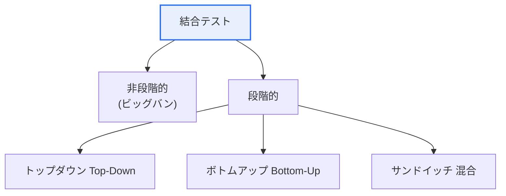

# 結合テスト(Integration Test)

## 1. 概要

### A. 定義
> 単体テストを終えた**モジュールを結合したときに、インタフェースと相互作用が正しいか**を検証するテスト。モジュール間のデータ受け渡し・連携において発生するエラーを見つけることが目的である。

結合テストが単体テストとは別に必ず必要となる理由は、「**各部品が正常でも組み立てると問題が生じる**」という点にある。個々のモジュールがそれぞれのテストを完全に通過していても、いざ結合するとインタフェース規約の微細な不一致、データ形式・単位の違い、呼び出し順序やタイミングの問題によってエラーが発生する。単体テストが「部品検査」であるならば、結合テストは「組立検査」である。例えばAモジュールが日付を'YYYYMMDD'で渡すのに対しBモジュールが'YYYY-MM-DD'を期待している場合、それぞれは正常であっても結合すると失敗する。このような欠陥は、結合してみて初めて明らかになる。

### B. 必要性
欠陥は発見が遅れるほど修正コストが大きくなる。モジュール間のインタフェースエラーを結合段階で早期に捉えられなければ、システムテストや運用段階で発見されてコストが急増するため、体系的な結合テストが不可欠である。

## 2. 結合方式: 非段階的 vs 段階的

結合方式は、モジュールを一度にまとめて結合するか、段階的に結合するかによって分かれる。**非段階的(ビッグバン)**はすべてのモジュールを一度に結合してテストする方式であり、準備は簡単であるが、エラーが発生するとどのモジュール間の問題なのか原因の切り分けが非常に難しい。**段階的**はモジュールを一つずつ追加しながらテストする方式であり、時間はより多くかかるが、新たに追加したモジュールで問題が明らかになるためエラーの切り分けが容易である。そのため実務では段階的方式が好まれる。

| 方式 | 説明 | 特徴 |
|---|---|---|
| **非段階的(ビッグバン)** | すべてのモジュールを一度に結合 | 準備が簡単、原因把握が困難 |
| **段階的** | モジュールを段階的に追加 | エラーの切り分けが容易、時間を要する |

## 3. トップダウン vs ボトムアップ

段階的結合は、結合の方向によってトップダウンとボトムアップに分かれる。**トップダウン(Top-Down)**は最上位モジュールから始めて下位へと降りながら結合するが、まだ完成していない下位モジュールの位置に偽の応答を返す**スタブ(Stub)**が必要である。上位の制御・設計上の欠陥を早期に発見できるという利点がある。**ボトムアップ(Bottom-Up)**は最下位モジュールから始めて上へと上がりながら結合するが、まだ存在しない上位モジュールの代わりに下位を呼び出す**ドライバ(Driver)**が必要である。下位モジュールを徹底的に検証できるという利点がある。

| 区分 | トップダウン(Top-Down) | ボトムアップ(Bottom-Up) |
|---|---|---|
| **順序** | 上位 → 下位 | 下位 → 上位 |
| **必要なツール** | スタブ(Stub) | ドライバ(Driver) |
| **利点** | 上位設計の欠陥を早期発見 | 下位モジュールの徹底検証 |
| **欠点** | 下位が未完成の場合スタブが多数必要 | 上位の欠陥の発見が遅れる |

## 4. テストドライバとテストスタブ

二つの補助モジュールの違いは方向である。**ドライバ**は、まだ作られていない上位モジュールの代わりに下位モジュールを呼び出し、テストデータを投入して結果を確認する「偽の上位」である。**スタブ**は、まだ作られていない下位モジュールの代わりに、上位モジュールの呼び出しに対して最小限のダミー応答を返す「偽の下位」である。ボトムアップは下位から検証するためドライバを、トップダウンは上位から検証するためスタブを使用する。

| 区分 | テストドライバ | テストスタブ |
|---|---|---|
| **役割** | 下位を呼び出す「偽の上位」 | 呼び出しに応答する「偽の下位」 |
| **使用** | ボトムアップ | トップダウン |
| **機能** | テストデータの入力・結果の確認 | ダミー応答の返却 |

## 5. 考慮事項および示唆点

1. **実務ではサンドイッチ(混合)結合**が一般的である。トップダウンとボトムアップを同時に進めて中間で合流させる方式であり、双方の利点を取り入れる一方で、ドライバ・スタブの両方が必要となる。
2. **CIパイプラインに結合テストの自動化**を組み込む。コードの変更ごとに自動的に結合テストを実行し、リグレッションを早期に捉える。
3. **MSAでは契約テスト(Contract Test)へと拡張**される。サービス間のAPI規約を契約として定義し、各サービスがそれを遵守しているかを独立して検証することで、分散環境における結合エラーを管理する。

---

> **一言まとめ**: 結合テストはモジュール結合時のインタフェースエラーを検証するものであり、*非段階的(ビッグバン)・段階的(トップダウン・ボトムアップ)*方式で実施し、トップダウンはスタブを、ボトムアップはドライバを使用し、実務ではサンドイッチ混合とCI自動化・契約テストへと発展している。
