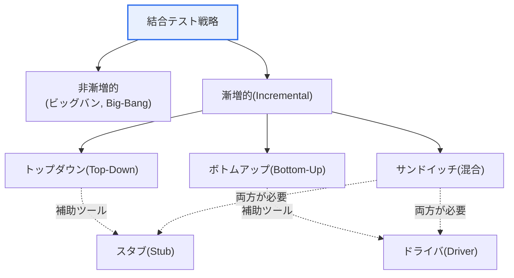
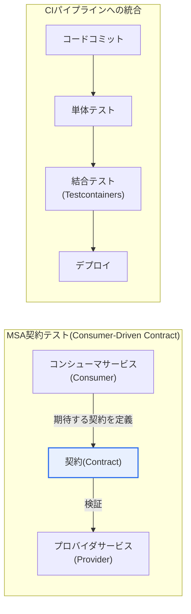

# 結合テスト(Integration Test)

## 1. 概要

### A. 定義
> 単体テストを終えた**モジュール(コンポーネント・サービス)を結合したときに、そのインタフェースと相互作用が仕様どおり正しいか**を検証するテスト段階。個々のモジュールの内部ロジックではなく、モジュールがやり取りするデータ・呼び出し規約・状態遷移といった「境界(boundary)」で発生する欠陥を見つけることが目的である。

結合テストが単体テストとは別に必ず必要となる理由は、「**各部品が正常でも組み立てると問題が起きる**」というソフトウェア結合の本質にある。個々のモジュールがそれぞれの単体テストを100%通過していても、実際に組み合わせると、インタフェース規約の微妙な不一致、データ形式・単位・エンコーディングの違い、呼び出し順序やタイミング(競合状態)、例外の伝播経路のずれによってエラーが発生する。単体テストが「部品の個別検査」だとすれば、結合テストは「組立状態の検査」である。部品が規格どおりでも組立公差が累積すれば完成品が狂うように、ソフトウェアでも結合点で新たに欠陥が生まれる。

最もよくある例が、データ契約(contract)の不一致である。Aモジュールが日付を`YYYYMMDD`の文字列で渡すのに、Bモジュールが`YYYY-MM-DD`を期待していれば、二つのモジュールはそれぞれ自分の単体テストを通過していても、結合するとパースエラーで失敗する。金額をAは「ウォン」単位の整数で、Bは「千ウォン」単位の実数で扱っているとすれば、値は渡されるものの1,000倍の誤差が静かに生じ、はるかに危険である。こうした欠陥は二つのモジュールを実際につないでみて初めて表面化するため、単体テストでは原理的に捉えられない。

この観点から、結合テストは単なる「テストの種類」ではなく、ソフトウェアを徐々に大きく組み立てていく**漸増的な検証活動**として理解すべきである。Vモデルにおいて結合テストはアーキテクチャ設計(構造設計)段階に対応する検証活動として配置されるが、これは結合テストが「設計したとおりにモジュールがかみ合うか」を確認する作業であることを意味する。したがって良い結合テストは、コードの完成後に遅れて作るのではなく、インタフェース設計の時点でその検証方法まで併せて設計されるべきである。

### B. 必要性と背景
欠陥は発見が遅れるほど修正コストが指数関数的に増大するというのが、ソフトウェア工学の長年の経験則である。要求・設計段階で捉えれば安価だが、インタフェースの誤りを結合段階で見逃し、システムテストや運用段階で発見すれば、原因追跡・回帰テスト・再デプロイまで重なりコストが急増する。結合テストは、この「コスト急増区間」の手前で欠陥をふるい落とす防波堤の役割を果たす。

背景として、結合テストの重要性は、システムがモノリシックから分散・サービス指向へと進化するにつれてむしろ高まった。かつては一つの実行ファイルの中で関数呼び出しによってモジュールが結合されていたが、今日ではREST/gRPC API、メッセージキュー、外部SaaS連携など、「ネットワーク境界を越える結合」が支配的である。境界が増えるほど契約の不一致・部分障害・遅延の問題が増えるため、結合検証の難度と比重が共に大きくなったのである。

## 2. 結合方式: 非漸増的 vs 漸増的

結合方式は、「モジュールを一度にまとめるか、段階的にまとめるか」という根本的な選択で分かれる。この選択は単なる好みではなく、欠陥が発生したときに**原因をどれだけ早く切り分けられるか**という実務上のコストに直結する。

**非漸増的(ビッグバン)**方式は、すべてのモジュールをそれぞれ完成させた後に一度に結合し、全体をテストする。準備手順が単純で、ドライバ・スタブのような補助コードをほとんど作らなくてよいという長所がある。しかし結合後にエラーが発生すると、数十のモジュールの相互作用のうちどこで問題が生じたのか、原因の切り分けが極めて難しい。欠陥Aが欠陥Bを覆い隠したり、二つの欠陥が相殺されて症状を歪めたりすることもある。そのためビッグバンは、モジュール数が非常に少ない場合や、すでに検証済みのライブラリを組み合わせる小規模な状況に限られる。

**漸増的**方式は、モジュールを一つ(または少数)ずつ追加し、そのたびにテストする。新たに追加したモジュールで問題が表面化するため、「今入れたものが原因」という強い手がかりが得られ、エラーの切り分けが容易である。その代わり、各段階でまだ存在しないモジュールを模倣する補助コード(スタブ・ドライバ)が必要となり、時間と労力が余計にかかる。実務で漸増的方式が圧倒的に好まれるのは、欠陥の切り分けにかかるデバッグコストが、補助コードの作成コストをはるかに上回るからである。

| 方式 | 結合方法 | 長所 | 短所 | 適した状況 |
|---|---|---|---|---|
| **非漸増的(ビッグバン)** | すべてのモジュールを一度に結合 | 準備が簡単、補助コードが最小 | 原因の切り分けが困難、欠陥の相殺 | モジュール数の少ない小規模 |
| **漸増的** | モジュールを段階的に追加 | エラーの切り分けが容易、早期検証 | スタブ・ドライバ作成の負担 | 大半の実務プロジェクト |

## 3. トップダウン(Top-Down)とボトムアップ(Bottom-Up)

漸増的結合は、結合をどの方向から始めるかによってトップダウンとボトムアップに分かれる。二つの方式の根本的な違いは、「**何を先に確信したいか**」という優先順位にある。

**トップダウン(Top-Down)**は、最上位の制御モジュールから始め、呼び出し構造に沿って下位へと降りながら結合する。まだ完成していない下位モジュールの位置には、決められたダミー応答を返す**スタブ(Stub)**を差し込む。この方式の強みは、システムの大きな骨格・制御フロー・主要シナリオをプロジェクトの初期に実行してみられる点である。上位設計や画面遷移の欠陥を早く発見でき、経営陣・顧客に動作する骨組みを早期にデモできる。一方、実際の演算・データ処理を担う下位モジュールがずっとスタブで代替されるため、肝心の下位ロジックの検証が後回しになり、現実的なスタブを多数作らなければならない負担がある。

**ボトムアップ(Bottom-Up)**は、最も低いユーティリティ・演算モジュールから始め、上へと上がりながら結合する。まだ存在しない上位モジュールの代わりに下位を呼び出し、テストデータを与える**ドライバ(Driver)**が必要である。この方式はシステムの基盤となる低水準モジュールを先に徹底して検証するため、DBアクセス・計算エンジンのように信頼性が中核となる部分をしっかり固められる。その代わり、全体を統括する上位の制御ロジックとユーザーシナリオは結合の後半になってようやく実行されるため、設計レベルの欠陥が遅れて発見されるリスクがある。

この違いが実務上重要なのは、プロジェクトのリスクがどこにあるかによって選択が変わるためである。UI・ワークフローのリスクが大きいプロジェクトではトップダウンで先に流れを固め、複雑な計算・データ整合性が中核のプロジェクトではボトムアップで先に基盤を固めるのが合理的である。

| 区分 | トップダウン(Top-Down) | ボトムアップ(Bottom-Up) |
|---|---|---|
| **結合順序** | 上位 → 下位 | 下位 → 上位 |
| **必要な補助ツール** | スタブ(Stub) | ドライバ(Driver) |
| **先に検証されるもの** | 制御フロー・全体の骨格 | 基盤となる演算・データ処理 |
| **長所** | 上位設計の欠陥を早期発見、早期デモ | 下位モジュールの徹底検証 |
| **短所** | 下位が未完成だとスタブが多数 | 上位の欠陥の発見が遅い |

## 4. テストドライバとテストスタブ

二つの補助モジュールは「まだ存在しない隣接モジュールを模倣する偽物」という共通点を持つが、その方向は正反対である。この概念を正確に区別することは、結合テストの問題で頻出する要点である。

**テストドライバ(Driver)**は、まだ作られていない**上位モジュールの代わりとなる「偽の上位」**である。下位モジュールを実際に呼び出し、あらかじめ準備したテストデータを引数として渡したうえで、戻り値が期待と一致するかを確認する。ボトムアップは下位から上へと検証するため、その下位を呼び出す上位がまだ存在せず、ドライバが必ず必要となる。今日ではJUnit・pytestのようなテストフレームワークのテストランナーが、事実上ドライバの役割を自動化している。

**テストスタブ(Stub)**は、まだ作られていない**下位モジュールの代わりとなる「偽の下位」**である。上位モジュールからの呼び出しに対し、実際のロジックなしに、あらかじめ決めた最小限のダミー応答(固定値)を返す。トップダウンは上から下へと検証するため、上位が呼び出す下位がまだ存在せず、スタブでその位置を埋める。スタブが状況に応じて異なる値を返したり、呼び出しの有無を記録したりするよう発展したものが、モック(Mock)・フェイク(Fake)といった**テストダブル(Test Double)**であり、今日では外部の決済・認証API連携をテストする際に幅広く使われている。

| 区分 | テストドライバ(Driver) | テストスタブ(Stub) |
|---|---|---|
| **代替対象** | 上位モジュール(「偽の上位」) | 下位モジュール(「偽の下位」) |
| **動作** | 下位の呼び出し・データ入力・結果確認 | 呼び出しにダミー応答を返す |
| **使用方式** | ボトムアップ(Bottom-Up) | トップダウン(Top-Down) |
| **現代的な拡張** | テストランナー(JUnit/pytest) | モック(Mock)・フェイク(Fake) |

## 5. 比較と実際の事例

前述の方式は排他的ではなく、実務ではリスクに応じて組み合わされる。代表例が**サンドイッチ(混合)結合**であり、上位はトップダウンで、下位はボトムアップで同時に進め、中間層で合流させる。UIの流れと基盤演算を並行して検証してスケジュールを短縮できる長所があるが、ドライバとスタブの両方を作る必要があり、中間層の結合が複雑になるという代償がある。すなわち「速度と複雑さ」のトレードオフを受け入れる選択である。

具体例として、大規模ECサイトの「注文 → 決済 → 配送」パイプラインを考えてみよう。決済ゲートウェイ(外部PG)は実際の決済を毎回呼び出すことができないため、成功/失敗/タイムアウトを返すスタブ(モック)で代替し、注文モジュールはこのスタブを相手にトップダウンで結合を進める。逆に、在庫引当・精算計算のような下位モジュールは、ドライバで多様な境界値(在庫0、負数、大量注文)を注入し、ボトムアップで先に固める。このように方向を組み合わせれば、外部依存と中核演算を同時に安全に検証できる。

数値的な観点からも、結合テストの位置付けは明確である。広く引用される「テストピラミッド」は、高速で安価な単体テストを多数(例: 全体の70%前後)、結合テストを中間層(20%前後)、低速で高価なE2E(UI)テストを最上段の少数(10%前後)に置くよう勧めている。結合テストが少なすぎれば結合欠陥を見逃し、多すぎれば実行時間が長くなってCIが遅くなるため、この均衡点をチームの状況に合わせて調整することが要点である。

## 6. 深掘り: 現代アーキテクチャにおける結合テスト

MSA(マイクロサービスアーキテクチャ)が普及するにつれ、結合テストの重心は「モジュール間の関数呼び出しの検証」から「**サービス間のネットワーク契約の検証**」へと移った。サービスが数十・数百に増えると、すべての組み合わせを同時に立ち上げてテストすることは事実上不可能となるため、各サービスのインタフェースを独立して検証する手法が発展した。

代表例が**契約テスト(Contract Test)**、特にコンシューマ駆動契約(Consumer-Driven Contract, CDC)である。APIを利用する側が「このような応答を期待する」という契約を定義すると、提供する側がその契約を満たしているかを自らのCIで検証する。Pactのようなツールがこれを自動化する。この方式の長所は、プロバイダとコンシューマを同時に立ち上げなくても、双方のデプロイ前に契約違反(例: フィールドの削除、型の変更)を早期に捉え、「壊れたデプロイ」を防げる点にある。

もう一つの軸は**テスト環境の再現性**である。かつては共有の結合テストサーバを複数人で使い回すうちに状態が汚染され、「他人のテストのせいで自分のテストが壊れる」という問題が頻発した。今日では、Testcontainersのように実際のDB・メッセージブローカーをコンテナとしてその場で起動・破棄する手法により、実行のたびにクリーンで本番に近い環境で結合テストを回す。これにより、結合テストをCIパイプラインに常時組み込み(コード変更のたびに自動実行)、回帰欠陥を早期に遮断することが標準的な実務となった。

## 7. 考慮事項および示唆

1. **戦略はリスクに従属させる。** トップダウン・ボトムアップ・ビッグバン・サンドイッチは優劣ではなく、状況への適合性の問題である。UI・ワークフローのリスクが大きければトップダウン、中核演算・データ整合性が鍵であればボトムアップ、スケジュールの圧力が大きければサンドイッチを選び、原因切り分けのコストが大きいビッグバンは小規模に限定する。アーキテクトは「何を先に確信すべきか」を基準に結合順序を設計しなければならない。

2. **インタフェース設計の時点でテストを併せて設計する。** 結合欠陥の大半はデータ契約の不一致から生じるため、API仕様(OpenAPI/gRPC IDL)と契約テストをコードより先に確定する契約ファースト(contract-first)のアプローチが、欠陥を根本から遮断する。これは結合テストを「後で作るもの」から「設計成果物」へと格上げする。

3. **テストダブルの使いすぎに注意する。** スタブ・モックで外部依存を代替するとテストは高速かつ安定するが、偽物が実物とずれていると「テストは通ったのに本番で障害が起きる」という錯覚が生じる。契約テストでダブルと実サービスの一致を定期的に検証し、重要な経路はTestcontainersなど本番に近い結合で補完する二重の安全装置が必要である。

4. **CI/CDパイプラインへの組み込みと実行時間のバランスが鍵である。** 結合テストを自動化してコミットのたびに実行すれば回帰を早期に捉えられるが、重い結合テストが増えるとパイプラインが遅くなり、開発速度が落ちる。テストピラミッドの原則に従って結合テストの範囲・数を管理し、並列実行・選択的実行(影響範囲ベース)によってフィードバックの遅延を減らさなければならない。

5. **分散環境の部分障害・非決定性まで検証範囲に含める。** MSAでは遅延・タイムアウト・リトライ・部分的失敗が日常的であるため、正常経路だけでなく、依存サービスが遅い・失敗する場合のレジリエンス(サーキットブレーカー・フォールバック)まで結合テストで確認して初めて、運用の安定性を確保できる。

## 参考資料
- ISTQB Foundation Level Syllabus — Integration Testing (https://www.istqb.org/)
- Martin Fowler, "Testing Strategies in a Microservice Architecture" (https://martinfowler.com/articles/microservice-testing/)
- Pact — Consumer-Driven Contract Testing (https://docs.pact.io/)
- Testcontainers公式ドキュメント (https://testcontainers.com/)

---

> **一言まとめ**: 結合テストはモジュール結合時のインタフェース・相互作用の誤りを検証する活動であり、*非漸増的(ビッグバン)・漸増的(トップダウンはスタブ、ボトムアップはドライバ)*の戦略をリスクに合わせて選択し、MSAの時代には契約テスト(CDC)とCIへの組み込み(Testcontainers)へと進化して、分散環境における結合の信頼性を確保する。
