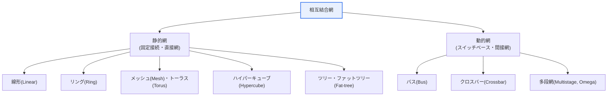
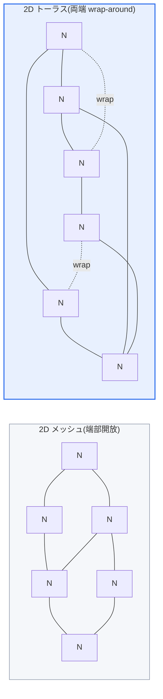

# 並列処理システムの相互結合網(Interconnection Network)

## 1. 概要

### A. 概念

> **相互結合網**とは、並列処理システムにおいて**多数のプロセッサ・メモリ・ノードを相互に接続し、データを交換させる通信構造**であり、並列システムの性能を左右する中核要素である。ノードをどのようなトポロジ(topology)で結び、どのような方式で経路を決め(ルーティング)、どのようにスイッチングするかが、相互結合網設計の三つの軸である。

相互結合網が並列処理の成否を分ける根本的な理由は、「**いくらプロセッサが多くても、それらがデータをやり取りできなければ意味がない**」という点にある。並列処理は複数のプロセッサが仕事を分担して同時に実行し、速度を高める。しかしプロセッサ同士は絶えずデータをやり取りしなければ協調できない。このデータ交換が遅かったりボトルネックが生じたりすると、プロセッサを増やしても性能は上がらない(通信オーバーヘッド)。アムダールの法則が示すように、逐次区間と通信遅延が並列化の利得の上限を決めるが、その通信遅延の物理的実体こそが相互結合網である。

相互結合網は、このプロセッサ間およびプロセッサ・メモリ間の通信を担う。どのように接続するかによって、通信速度(遅延)・同時通信能力(帯域幅)・拡張性・コストが大きく変わる。すべてを直接接続すれば高速だが接続数が爆発し(完全グラフではノード数の二乗に比例)、コスト・複雑さが手に負えなくなる。一本のバスで接続すれば単純だが、すべての通信が一つの経路を奪い合いボトルネックが生じる。そこで、性能・コスト・拡張性のバランスをとった多様な接続構造(トポロジ)が考案されてきた。相互結合網の設計とは、まさにこのトレードオフをどう取るかの問題である。今日この問題は、スーパーコンピュータ・GPUクラスタ・チップ内部(NoC, Network-on-Chip)に至るまで、規模だけを変えて同じように繰り返されている。

### B. 評価要素

相互結合網の性能はいくつかの定量指標で評価する。これらの指標は互いに相反するため、いずれか一つを最大化すると他が悪化するという点を理解することが設計の出発点である。

| 指標 | 定義 | 意味 |
|---|---|---|
| **遅延時間(Latency)** | ノード間のデータ伝達にかかる時間 | 応答性。距離が遠いほど増加 |
| **帯域幅(Bandwidth)** | 単位時間当たりの転送データ量 | スループット |
| **直径(Diameter)** | 最も遠い2ノード間の最短距離(ホップ数) | 最悪遅延の上限 |
| **二分帯域幅(Bisection BW)** | 網を半分に切ったときに切断されるリンク数 | 大域通信能力・ボトルネックの尺度 |
| **次数(Degree)** | 1ノードが持つリンク数 | ハードウェアコスト・ピン数 |
| **耐障害性** | リンク・ノード故障時の代替経路の有無 | 信頼性 |

**直径**は、最悪の場合に通信が何ホップを経由するかを表すため、遅延の上限を規定する。直径は小さいほど良いが、直径を縮めるにはノードごとにリンクを増やさねばならず、次数(コスト)が上がる。**二分帯域幅**は網を半分に分けたときに両半分を結ぶリンク数であり、大域的にデータが混ざり合う通信(例:行列転置、all-to-all)において実質的なボトルネックを決定する。二分帯域幅が大きければ大域通信に強いが、やはりリンクと配線が増えてコストが大きくなる。要するに、良い相互結合網とは「小さい直径・大きい二分帯域幅・低い次数」を同時に追求するものだが、この三つをすべて満たすことはできず、アプリケーションの特性に合わせて折衷するのである。

## 2. 相互結合網の種類

相互結合網は、接続が固定された**静的網(直接網)** と、スイッチで接続をその都度切り替える**動的網(間接網)** に分けられる。静的網はノード同士が直接リンクで結ばれており、通信パターンが一定の科学技術計算に有利である。動的網はスイッチを介して任意の2ノードを接続するため柔軟だが、スイッチ自体がコスト・遅延の要因となる。

| 類型 | 例 | 直径 | 特徴 |
|---|---|---|---|
| **バス(動的)** | 共有バス | 1 | 単純・低コスト、ボトルネック・拡張性の限界 |
| **クロスバー(動的)** | 格子スイッチ | 1 | 完全接続・高性能、コスト O(n²) |
| **多段網(動的)** | Omega 網 | log n | バスとクロスバーの折衷 |
| **リング(静的)** | 環状接続 | n/2 | 単純、直径が大きい |
| **メッシュ(静的)** | 2D 格子 | 約 2√n | 拡張性に優れ、局所通信が効率的 |
| **トーラス(静的)** | 格子+wrap | 約 √n | メッシュ比で距離短縮・対称 |
| **ハイパーキューブ(静的)** | n次元キューブ | log₂ n | 短い直径、次数が増加 |

**A. バスとクロスバー — 両極端。** バスは一つの共有媒体にすべてのノードを接続した最も単純な構造である。配線が一本だけなので安価で直径も1だが、同時に1組しか通信できず、ノードが増えるとすぐにボトルネックとなる。逆にクロスバーは、すべての入力・出力を格子スイッチで完全接続し、どのノード対も同時に衝突なく通信できる。性能は理想的だが、スイッチ数がノード数の二乗(O(n²))で増えるため、大規模システムではコストが見合わない。この二つは「安くて遅いもの」と「高くて速いもの」の両極端であり、残りのトポロジはおおむねその間のどこかに位置する。

**B. 多段相互結合網(MIN) — 折衷。** Omega 網のような多段網は、log n 段の小さなスイッチ(通常 2×2)を積み重ね、クロスバーの O(n²) コストを O(n log n) に下げつつ、バスよりはるかに優れた並行性を得る。ただし特定の通信パターンでは内部経路が重なるブロッキングが生じうるため、完全なノンブロッキング(non-blocking)を求めるなら Clos/Benes のようなより複雑な構造が必要となる。これは「コストを下げると競合のリスクが生じる」というトレードオフの典型である。

**C. 格子系(メッシュ・トーラス・ハイパーキューブ) — 拡張性志向。** 大規模並列コンピュータは、ノードを規則的な格子で結ぶ静的網を好む。配線が局所的(隣接ノード同士)であるため物理的に実装しやすく、ノードを追加する際も構造を維持したまま拡張できるからである。この系統の代表がメッシュ・トーラス・ハイパーキューブであり、次節ではトーラスを中心に詳しく見る。

## 3. トーラス(Torus)構造の詳細

**トーラス**は、格子状の**メッシュ(Mesh)** 構造の両端(周縁)を互いに接続し、環状(wrap-around)にした構造である。メッシュは格子でノードを接続するため拡張性が良いが、周縁のノードは片側にしか接続されないため通信距離が長くなり、負荷が一方に偏るという短所がある。n×n メッシュの直径は約 2(n−1) であり、規模が大きくなるほど最悪遅延が大きく増える。トーラスは両端をつなぐことでこの短所を補う。

| 区分 | メッシュ | トーラス |
|---|---|---|
| **構造** | 格子状(周縁開放) | 格子+両端接続(環状) |
| **直径** | 約 2(n−1) | 約 n(半分程度) |
| **通信距離** | 周縁で長い | 平均距離を短縮(対称的) |
| **対称性** | 非対称 | 対称的(均等な負荷) |
| **配線** | 単純 | wrap リンクによりやや複雑 |

トーラスがメッシュより優れる理由は三つに整理される。第一に、**直径の短縮**である。wrap-around リンクが周縁を反対側へつなぐため、最悪の場合でも格子の半分の距離で到達でき、直径がおよそ半分に縮まる。これは遅延に敏感な通信で直接的な性能利得となる。第二に、**負荷の対称的分散**である。メッシュでは周縁と中央のノードで接続数が異なりトラフィックが不均衡になるが、トーラスではすべてのノードが同じ接続数(2次元なら4本)を持つため、どのノードも特にボトルネックにならない。第三に、**良好な二分帯域幅**である。対称構造のおかげで網をどこで切っても切断リンク数が均等に保たれ、大域通信に強い。

こうした特性から、トーラスは大規模並列コンピュータ・スーパーコンピュータで広く用いられる。具体的には、IBM Blue Gene/L・P は3次元トーラスを、Blue Gene/Q は5次元トーラスを採用し、Cray の SeaStar/Gemini インターコネクトも 3D トーラスベースである。日本の「京」とその後継「富岳」は、6次元 mesh/torus である Tofu インターコネクトを使用した。次元を上げれば(k-ary n-cube への一般化)同じノード数で直径はさらに縮まるが、ノード当たりのリンクと配線の複雑さが増すというトレードオフがある。なお wrap-around 配線は物理的に反対側まで長いケーブルを必要とするため、実際の実装ではノードを折り返して配置(folding)し、ケーブル長を均等化する手法を併用する。

## 4. ハイパーキューブ・ファットツリーとの比較

トーラスの位置づけを理解するには、ハイパーキューブ・ファットツリーと比べることが有用である。三つの構造は、大規模システムで競合・共存する代表的なトポロジである。

**ハイパーキューブ**は n 次元キューブであり、ノード数 2ⁿ に対して直径が log₂(2ⁿ)=n にすぎず、非常に短い。大域通信が頻繁なアプリケーションに有利である。しかし、ノード当たりの次数が n でノード数とともに増加するため、規模が大きくなるとノードごとにポートを増やし続けねばならず、ハードウェアの拡張が難しい。つまりハイパーキューブは「直径は小さいが次数が大きい」構造である。

これに対してトーラスは、次元 n を固定したまま各次元のサイズ k だけを大きくするため(k-ary n-cube)、ノード当たりの次数が 2n で一定に保たれる。その代わり直径はハイパーキューブより大きい。結局、**トーラスは「次数を一定に保って拡張性を得る」代わりに直径をやや犠牲にした構造**であり、ハイパーキューブはその逆である。ノードが数万〜数十万に及ぶ超大規模システムにおいてノード当たりのポートを固定できるという点が、トーラスがスーパーコンピュータで広く採用された実務的な理由である。

**ファットツリー(Fat-tree)** は、ツリー構造において上位ほどリンク帯域幅を太くし、上位のボトルネックを解消した構造であり、今日のデータセンター・HPCクラスタの InfiniBand ネットワークで標準のように使われている。ファットツリーはどのノード対にも均一な帯域幅(full bisection)を提供し、通信パターンに鈍感であるという長所があるため、通信が不規則な汎用クラスタに適している。一方トーラスは、隣接通信の多い定型的な科学技術計算に強い。つまり「規則的な局所通信ならトーラス、不規則な大域通信ならファットツリー」がおおよその選択基準となる。

## 5. 深掘り — AI・データセンターへの拡張

相互結合網はスーパーコンピュータの専有物ではなく、今日の大規模AI学習インフラの成否を分ける要素として浮上している。数千基のGPUで巨大モデルを学習する際、各ステップごとにすべてのGPUの勾配を集約する all-reduce 通信が発生し、この集団通信(collective communication)の効率がそのまま学習速度を左右する。通信が遅ければ高価なGPUがデータを待って遊休状態となるため、インターコネクト設計が全体のコスト効率を決定する。

この文脈では、先に見たトポロジの概念がそのまま再現される。NVIDIA の NVLink/NVSwitch は GPU 群をクロスバーに近い完全接続で束ね、ノード内部の高帯域通信を提供し、ノード間では InfiniBand のファットツリーやトーラス型トポロジを用いる。Google の TPU Pod は明示的に 2D/3D トーラスでチップを接続し、隣接間の高速通信に最適化された all-reduce を実装している。つまり「局所通信の多い定型ワークロードにはトーラスが有利」という古典的原理が、AI学習でもそのまま適用されているのである。

さらにチップ内部でも同じ問題が繰り返される。マルチコア・メニーコアプロセッサで数十〜数百のコアを結ぶ **Network-on-Chip(NoC)** は、多くの場合 2D メッシュ・トーラスのトポロジを採用する。チップ面積・電力の制約下で、局所的な配線で拡張可能な構造が必要だからである。このように相互結合網は、スーパーコンピュータ→データセンター→チップ内部へと規模だけを変えながら同一のトレードオフ(直径・帯域幅・次数・コスト)を扱う、並列コンピューティングの普遍原理である。[[multi-gpu]]

## 6. 考慮事項および示唆(技術士の観点)

1. **性能・コスト・拡張性のバランスが設計の核心である。** クロスバーは高速だが O(n²) で高価であり、バスは安価だがボトルネックがあるため、システム規模・通信パターンに合ったトポロジを選択しなければならない。直径・二分帯域幅・次数が互いに相反する以上、単一の最適解ではなく、目的関数(コスト制約下での性能最大化)に応じた選択問題としてアプローチすべきである。

2. **通信パターンとの整合性が重要である。** 局所通信(隣接格子演算)が多ければメッシュ・トーラスが、大域・不規則通信が多ければハイパーキューブ・ファットツリーが有利である。アプリケーションのデータ交換特性(ステンシル演算、all-to-all、all-reduce)をプロファイリングしてトポロジを整合させてこそ、実効性能が出る。

3. **ルーティング・耐障害性を併せて設計しなければならない。** トポロジだけでなく、経路決定アルゴリズム(例:次元順ルーティング)とデッドロック(deadlock)回避(仮想チャネル)、リンク故障時の迂回経路が備わってこそ、大規模システムは安定して動作する。ノード数が多いほど部品故障の確率が高まるため、耐障害性は選択ではなく必須である。

4. **大規模AI学習インフラにより重要性が増している。** GPUクラスタの集団通信効率が学習コストを左右するようになり、トーラス(TPU Pod)・ファットツリー(InfiniBand)・完全接続(NVLink)の階層的組み合わせが標準となりつつある。インターコネクトこそがAI競争力であるという認識の下、通信と演算の重畳(overlap)・トポロジ認識型集団通信アルゴリズムが中核的な最適化対象となる。

5. **光接続・チップレットなど物理技術との連携が展望である。** ノード間距離・電力の限界を超えるため、シリコンフォトニクス(光インターコネクト)とチップレット(chiplet)ベースのパッケージングが台頭しており、これは相互結合網の物理的実装の限界を緩和し、より大きな二分帯域幅と低遅延を可能にすると見られる。

## 参考資料

- Oregon State Univ., "Interconnection Networks: Direct/Indirect, Shared Memory" 講義資料 — https://web.engr.oregonstate.edu/~bose/cs572/InterconnectionNetworks.ppt
- "Fully twisted torus interconnection network for parallel systems", Discover Computing (Springer, 2025) — https://link.springer.com/article/10.1007/s10791-025-09891-w

---

> **一言まとめ**: 相互結合網は*並列システムのプロセッサ・メモリを接続する通信構造*であり、直径・帯域幅・次数のトレードオフの中で性能を左右する。バス・クロスバー・メッシュ・ハイパーキューブ・ファットツリーなどがあり、トーラスはメッシュの両端をつないで直径を半分に縮め、負荷を対称に分散することで、スーパーコンピュータ・TPU Pod などの大規模並列処理で広く用いられている。
