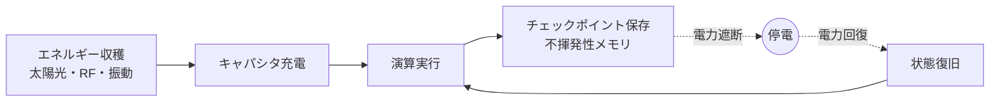

# インターミッテントコンピューティング(Intermittent Computing)

## 1. 概要

### A. 定義
> バッテリーを持たず**周囲環境からのエネルギーハーベスティング(Energy Harvesting)** のみで動作するデバイスが、電力が不安定に供給・遮断される環境においても**演算状態を保存・復旧しながら処理を途切れなく継続する**超低電力コンピューティング方式。

一般的なコンピュータは電源が切れると RAM の状態がすべて失われ、最初からやり直さなければならない。インターミッテントコンピューティングは、電源が**頻繁に切れたり入ったりすることを正常状態として前提**とし、停電直前までの演算の進捗を保存しておき、電力が戻ればその地点から続けて実行する。すなわち「停電を例外ではなく日常として扱う」コンピューティングパラダイムである。

### B. 登場背景および必要性
数十億個の超小型IoTセンサが普及するにつれ、**バッテリーの交換・廃棄・寿命の限界**が現実的な障害となった。構造物内に埋め込まれたり人体に装着されたりしたセンサは、バッテリーを交換すること自体が不可能か不経済である。代替として太陽光・RF・振動・熱などの周囲エネルギーを収穫すれば、バッテリーなしで半永久的に動作できるが、こうした収穫エネルギーは本質的に**間欠的・不規則**であり、いつでも電力が途切れうる。したがって頻繁な停電の中でも演算を完遂させる手法が必ず必要であり、これがインターミッテントコンピューティングの存在理由である。

## 2. 動作原理

動作の骨子は**収穫→蓄積→実行→保存→復旧**の循環である。収穫した微弱なエネルギーをキャパシタに蓄え、一定電圧に達すると演算を実行し、その間に演算状態(レジスタ・変数)を**不揮発性メモリにチェックポイントとして保存**する。電力が途切れると揮発性データは消えるがチェックポイントは残るため、電力が回復すれば最後のチェックポイントから状態を復旧して継続する。鍵となるのは「**いつ、どれくらいの頻度で保存するか**」である。頻繁に保存すれば停電時の損失は少ないが保存オーバーヘッドで進行が遅くなり、まれにしか保存しなければ停電のたびに多くの作業を再実行しなければならない。

## 3. 中核技術要素

各要素は停電という前提の上で、「状態をいかに安全に守り復旧するか」という一つの目標を分担する。

| 要素 | 説明 |
|---|---|
| **エネルギーハーベスティング** | 太陽光・RF・熱・振動などの周囲エネルギーを収集・蓄積 |
| **不揮発性メモリ(NVM)** | FRAM・MRAM などにより電源遮断時にも状態を保持 |
| **チェックポインティング(Checkpointing)** | 演算の途中状態を周期的/適応的に NVM に保存 |
| **冪等性(Idempotency)** | 再実行されても結果が変わらないことを保証 |
| **電力認識スケジューリング** | 利用可能なエネルギー量に合わせて処理を分割・実行 |

特に**冪等性**が重要な理由がある。チェックポイント以後に停電が起きると、その地点からコードが再実行されるが、もしその間に外部状態を変更する演算(例:センサカウンタの増加、通信送信)があった場合、**再実行によって同じ副作用が二度発生**し、データが汚染される。そのため再実行しても結果が一貫するよう冪等に設計するか、状態更新をアトミックに処理しなければならない。

## 4. 主要課題

| 課題 | 内容 |
|---|---|
| **進行保証(Forward Progress)** | チェックポイントのオーバーヘッド vs 再実行損失のバランス |
| **一貫性** | 停電時点でのメモリ不整合(非アトミックな更新)の防止 |
| **性能** | 頻繁な保存/復旧による処理遅延 |
| **デバッグ** | 非決定的な停電によりエラーの再現・検証が困難 |

最も根本的な課題は**進行保証**である。キャパシタに蓄えたエネルギーで実行可能な区間よりも二つのチェックポイント間の距離が長いと、毎回その区間を完了する前に停電が起き、**永遠に先へ進めない(非進行)状態**に陥りうる。そのため、利用可能なエネルギーで必ず完走できる大きさに処理を分割することが設計の核心である。

## 5. 適用分野

| 分野 | 活用 |
|---|---|
| **バッテリーレスIoT** | 環境・構造物モニタリングセンサ(橋梁のひび割れ、室内空気質など) |
| **ウェアラブル・ヘルス** | 体温・心拍などの超低電力生体センサ |
| **エッジAI** | TinyML と組み合わせた超低電力オンデバイス推論 |

例えば、橋梁に埋め込まれた振動収穫センサが、平常時の微細な振動で電力を蓄えてひび割れデータを計測・保存し、電力が十分なときにのみ無線で送信するといった形である。バッテリー交換なしに構造物の寿命期間中ずっと動作することが目標である。

## 6. 考慮事項および示唆
性能の鍵は**チェックポインティングの最適化**であり、毎回全状態を保存する代わりに変更分のみを保存する差分チェックポインティングや、エネルギー残量に応じて保存タイミングを調整する適応型手法が活発に研究されている。インターミッテントコンピューティングは、バッテリー廃棄物をなくし保守を最小化する**持続可能(Green)・メンテナンスレスコンピューティング**を実現するという点で意義が大きい。技術士の観点では、FRAM のような低電力 NVM と超低電力 MCU の発展、そして開発者が停電を意識しなくて済むようにするランタイム・コンパイラ支援が商用化の鍵であり、TinyML と結びついて「電源なしに自ら判断するセンサ」へと拡張されつつある。

---

> **一言まとめ**: インターミッテントコンピューティングは、*エネルギーハーベスティングに基づく間欠電力*を正常状態として前提とし、**チェックポインティング・不揮発性メモリ・冪等性**によって状態を保存・復旧しながら処理を完遂させる超低電力コンピューティングであり、進行保証と一貫性が中核課題で、バッテリーレスIoT・エッジAIに活用される。
