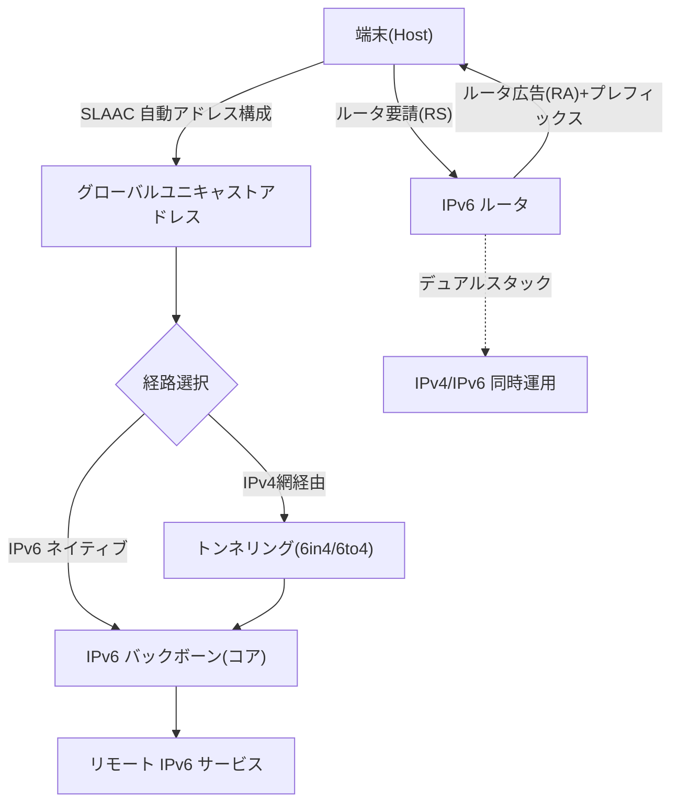
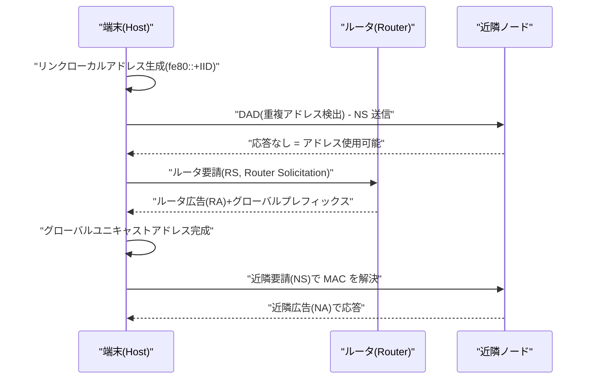

# IPv6 と IPv4→IPv6 移行技術

## 1. 概要

> **IPv6(Internet Protocol version 6)** とは、従来の32ビット IPv4 アドレスの枯渇を根本的に解消するために IETF が RFC 8200(2017、旧 RFC 2460)として標準化した128ビット体系の次世代インターネットプロトコルであり、拡張されたアドレス空間・簡素化されたヘッダ・内蔵セキュリティ・自動アドレス構成(SLAAC)によって大規模接続環境を支援する。

IPv6 が登場した根本的背景は**アドレス枯渇(IPv4 Address Exhaustion)** である。IPv4 は約43億個(2³²)のアドレスしか提供せず、インターネット初期の設計当時は十分と考えられていたが、PC・スマートフォン・IoT端末の爆発的増加によって限界に突き当たった。実際に IANA の最上位 IPv4 アドレスプールは2011年2月に枯渇し、地域インターネットレジストリ(RIR)のうち APNIC(アジア太平洋)、RIPE(欧州)、ARIN(北米)も順次新規割当てが事実上停止した。その間、NAT(Network Address Translation)と CIDR が枯渇時期を遅らせる応急策として用いられたが、NAT はエンドツーエンド(End-to-End)通信の原則を損ない、P2P・VoIP・サーバ開設に制約を与えるという構造的な副作用を生んだ。

第二の背景は、**ネットワークの性能・拡張性・セキュリティに対する新たな要求**である。IPv4 ヘッダは可変長のオプションフィールドや、ルータでのチェックサム再計算・フラグメンテーション処理によってルーティング負荷が大きかった。IPv6 は40バイトの固定ヘッダ、オプションの拡張ヘッダへの分離、ルータでのフラグメンテーション禁止という設計によって、コアルータの処理負担を軽減した。また IPsec を標準構成要素として定義(推奨)し、セキュア通信の基盤をプロトコルレベルで整え、IoT・5G・スマートシティのように膨大な端末に固有アドレスを付与しなければならない環境で必須インフラとして定着しつつある。情報管理技術士の観点では、IPv6 は単なる「アドレス拡張」ではなく、**アドレス・ルーティング・セキュリティ・モビリティ・自動化**を包括するアーキテクチャの転換として理解すべきである。

第三の背景は、**エンドツーエンド(End-to-End)接続性の回復**である。IPv4 時代の NAT は多数の端末に一つのグローバルアドレスを共有させることでアドレス枯渇を遅らせたが、外部から内部端末へ直接到達できなくし、P2P・リアルタイム通信・ホームサーバ運用を困難にした。アプリケーションはこれを回避するため STUN/TURN のような複雑な補助装置を導入せざるを得なかった。IPv6 はすべての端末にグローバルアドレスを付与できるため、インターネット本来のエンドツーエンド原則を回復し、これは IoT・5G・リアルタイム協業のように端末間の直接通信が重要なサービスの基盤となる。ただしエンドツーエンドの到達性はセキュリティ上の露出面を広げるため、ファイアウォールポリシーと併用しなければならない点も併せて考慮すべきである。

IPv6 の中核的特徴をまず整理すると次のとおりである。

| 区分 | IPv4 | IPv6 |
|------|------|------|
| アドレス長 | 32ビット(約43億) | 128ビット(約3.4×10³⁸) |
| 表記法 | ドット10進(192.0.2.1) | コロン16進(2001:db8::1) |
| ヘッダ | 可変(20〜60B)、チェックサムあり | 固定40B、チェックサムなし |
| フラグメンテーション | ルータ・送信者の双方 | 送信端のみ(PMTUD) |
| アドレス自動設定 | DHCP が必要 | SLAAC 内蔵 + DHCPv6 |
| セキュリティ | 別途(IPsec は任意) | IPsec 統合設計 |
| ブロードキャスト | あり | なし(マルチキャスト・エニーキャストで代替) |

## 2. IPv6 の全体構造とアドレス体系

以下は IPv6 が適用されたネットワークの全体構造を示した概念図である。端末はルータ広告(RA)を通じてプレフィックスを受け取って自らアドレスを構成し、デュアルスタック区間とトンネルを経由して IPv6 バックボーンと通信する。

**A. アドレス表記と種類。** IPv6 アドレスは128ビットを16ビットずつ8グループに分け、コロンで区切った16進数で表記する(例:`2001:0db8:0000:0000:0000:0000:0000:0001`)。各グループの先頭の0は省略でき、連続する0のグループは `::` で一度だけ圧縮できるため、上記アドレスは `2001:db8::1` と短縮される。アドレスは目的に応じて**ユニキャスト(1:1)、マルチキャスト(1:多、ff00::/8)、エニーキャスト(最も近い一つへ)** に分けられ、IPv4 のブロードキャストは廃止されてマルチキャストがその役割を代替する。この設計により不要なブロードキャストストームがなくなり、リンク効率が改善される。

**B. アドレススコープ(Scope)。** ユニキャストはさらに、**グローバルユニキャスト(2000::/3、グローバルルーティング対象)**、**リンクローカル(fe80::/10、同一リンク内でのみ有効)**、**ユニークローカル(fc00::/7、プライベートネットワーク用)** に区分される。特にリンクローカルアドレスはインタフェースが有効化されると自動生成され、近隣探索・ルータ通信の基本チャネルとして用いられる。例えば社内網でルータを再起動すると、各インタフェースは別途の設定なしに `fe80::` で始まるアドレスを即座に確保して初期通信を開始する。これは IPv4 で DHCP サーバの応答を待たねばならなかったことと対比される実務上の利点である。

**C. ヘッダ簡素化の原理。** IPv6 ヘッダは40バイト固定であり、IPv4 のチェックサム・ヘッダ長・識別子など13個のフィールドを8個に減らした。ルータがホップごとにチェックサムを再計算しなくてもよい理由は、上位層(TCP/UDP)とリンク層がすでに誤り検出を行っているため、IP 層での重複検査を除去して性能を確保したからである。代わりにオプションは**拡張ヘッダ(Hop-by-Hop、Routing、Fragment、IPsec など)** に分離し、必要なときだけチェーン形式で挿入する。これにより一般パケットは最小ヘッダで高速に処理され、特殊機能が必要なパケットだけが追加コストを払う「負担の局所化」が実現される。

参考までに、IPv6 基本ヘッダ(40バイト)の主要フィールドは次のように構成される。

| フィールド | サイズ | 役割 |
|------|------|------|
| Version | 4ビット | プロトコルバージョン(=6) |
| Traffic Class | 8ビット | 優先度・DSCP(QoS) |
| Flow Label | 20ビット | 同一フローの識別・経路固定 |
| Payload Length | 16ビット | ペイロード+拡張ヘッダの長さ |
| Next Header | 8ビット | 次の拡張ヘッダ/上位プロトコル |
| Hop Limit | 8ビット | IPv4 TTL に相当(ホップ制限) |
| Source/Destination | 各128ビット | 送信元・宛先アドレス |

また IPv6 ヘッダには**フローラベル(Flow Label、20ビット)** フィールドが新たに導入され、同一フロー(Flow)に属するパケットをルータが詳細検査なしに識別し、同一経路・同一 QoS で処理できる。例えばリアルタイムのビデオ会議トラフィックに一つのフローラベルを付与すれば、コアルータはパケットごとに5タプルを再解析しなくても遅延に敏感なフローであると認識して優先処理でき、大規模トラフィック環境でルーティング効率と QoS の精度を同時に高める。

**D. フラグメンテーション処理の移動。** IPv4 では経路上のどのルータでも、パケットがリンク MTU より大きければそれを分割して転送していたが、これはコアルータの負荷と再組立の脆弱性(Teardrop など)を招いた。IPv6 は**中間ルータでのフラグメンテーションを禁止**し、送信端のみが**経路 MTU 探索(PMTUD, Path MTU Discovery)** によって経路全体の最小 MTU を把握し、あらかじめ適切なサイズで送るように変更した。この設計はルータを軽量化する一方、PMTUD が依存する ICMPv6 の "Packet Too Big" メッセージがファイアウォールで遮断されると通信が止まるという副作用を生むため、実務では ICMPv6 をむやみに遮断しないようポリシーを精緻に設計しなければならない。

**E. アドレス計画の実際。** IPv6 はアドレスが膨大であるがゆえに、かえって体系的な計画が重要である。通常、組織は ISP から **/48**(65,536個の /64 サブネット)の割当てを受け、部門・支社・用途別に **/56** や **/64** を階層的に分けて割り当てる。例えば `2001:db8:aced::/48` を本社に割り当て、フロア・部門を `2001:db8:aced:0010::/64`、`2001:db8:aced:0020::/64` のように区画すれば、プレフィックスを見るだけで場所・用途を識別でき、ルート集約とセキュリティポリシーの適用が単純になる。IPv4 でアドレスを節約するためにサブネットを細かく分割していた慣行とは異なり、IPv6 ではサブネットごとに /64 をゆとりをもって使いつつ、上位ビットで構造を表現するのがベストプラクティスである。

## 3. 自動アドレス構成と近隣探索のプロセス

IPv6 の代表的な進歩は、サーバなしでも端末が自らアドレスを生成する **SLAAC(Stateless Address Autoconfiguration、RFC 4862)** である。以下は端末が起動後に通信可能な状態に至るまでの手順を示した詳細フロー図である。

**A. リンクローカル生成と DAD。** 端末はまずインタフェース識別子(IID)を結合してリンクローカルアドレスを作成した後、同じリンクに同一アドレスが存在しないかを **DAD(Duplicate Address Detection)** で確認する。応答がなければ一意性が保証されたと判断し、そのアドレスを確定する。これは IPv4 で IP 衝突を事後に発見していた方式より予防的である。当初は IID を MAC ベースの EUI-64 で生成していたが、MAC が露出して端末の追跡が可能になるというプライバシー問題から、**RFC 8981(一時アドレス)** と **RFC 7217(安定した乱数 IID)** の方式が導入され、現在のスマートフォン・PC は周期的に変わる一時アドレスを併用している。

**B. ルータ広告(RA)に基づくプレフィックスの受信。** 端末が RS を送ると、ルータは RA で**ネットワークプレフィックス(/64 が慣例)** とデフォルトゲートウェイの情報を通知する。端末はプレフィックスに自らの IID を付加してグローバルアドレスを完成させる。RA の M/O フラグに応じて、純粋な SLAAC、DHCPv6 併用(アドレスは SLAAC、DNS などの付加情報は DHCPv6)、またはステートフル DHCPv6 のいずれかで動作する。実際の通信事業者・企業網では、アドレス追跡・監査の要求から SLAAC だけでは不十分であり、DHCPv6 を併用するハイブリッド構成が一般的である。

**C. ARP を代替する NDP。** IPv4 の ARP・ICMP リダイレクト・ルータ探索の機能は、IPv6 では **NDP(Neighbor Discovery Protocol、ICMPv6 ベース)** に統合される。NS(Neighbor Solicitation)/NA(Neighbor Advertisement)で MAC アドレスを解決し、マルチキャストを用いるため、リンク全体にブロードキャストを撒いていた ARP より負荷が低い。ただし NDP は認証が弱く、**NS/NA スプーフィング、RA スプーフィング(偽のルータ広告)** のような脅威にさらされるため、スイッチの **RA Guard・ND Inspection・SEND(Secure Neighbor Discovery)** で補完しなければならない。

**D. SLAAC と DHCPv6 の役割分担。** SLAAC はサーバなしでアドレスを配布するため管理負担が低いが、「どの端末がいつどのアドレスを使ったか」を中央で管理・監査しにくいという弱点がある。このため、セキュリティ・コンプライアンスが重要な企業・公共環境では、**ステートフル DHCPv6** でアドレスを中央割当て・記録するか、アドレスは SLAAC のままとし DNS・NTP のような付加情報のみを**ステートレス DHCPv6** で配布する折衷案を採る。実際に金融機関の内部網では、端末の追跡性と事故対応(フォレンジック)の要求から DHCPv6 ログを必ず残す事例が一般的であり、これは IPv6 設計が技術的な利便性と運用・監査要求の間のバランスの問題であることを示している。

## 4. IPv4→IPv6 移行技術の比較

IPv4 と IPv6 はヘッダ構造が異なり直接相互運用できないため、二つの体系が長期間共存する現実において**移行(Transition)技術**が中核となる。移行方式は大きくデュアルスタック、トンネリング、アドレス変換に区分され、それぞれ適用の文脈が異なる。

| 方式 | 原理 | 長所 | 短所・含意 |
|------|------|------|-----------|
| デュアルスタック(Dual Stack) | 端末・ルータが IPv4/IPv6 を同時搭載 | 互換性が高く段階的移行が容易 | 二つのアドレス体系の同時運用・管理負担、IPv4 アドレスが依然として必要 |
| トンネリング(6in4・6to4・6rd・ISATAP) | IPv6 パケットを IPv4 にカプセル化 | 既存 IPv4 網の上で IPv6 の島を接続 | カプセル化オーバーヘッド・MTU 問題、エンドツーエンド遅延 |
| 変換(NAT64/DNS64・464XLAT) | IPv6 端末が IPv4 サーバと通信できるようアドレス・DNS を変換 | IPv6 単独網から IPv4 資源へアクセス | 状態保持の負担、一部アプリ(IP リテラル)の非互換 |

**A. デュアルスタックの実務的意味。** デュアルスタックは一台の機器が IPv4 と IPv6 の両方を処理するため、相手がどちらの体系でも対応できる。ブラウザは **Happy Eyeballs(RFC 8305)** アルゴリズムで IPv6・IPv4 接続を並行して試行し、速い方を採用することでユーザの体感遅延を減らす。しかしデュアルスタックは IPv4 アドレスが依然として必要であり、ファイアウォール・監視ポリシーを二重に維持しなければならないため、移行期の過渡的解法という限界がある。

**B. トンネリングと変換のトレードオフ。** トンネリングは IPv4 インフラをそのままにして IPv6 トラフィックを通過させるが、カプセル化によって MTU が減少し、フラグメンテーション・経路 MTU 探索の問題が発生する。一方、NAT64/DNS64 とそれを補完する 464XLAT は移動通信網で広く使われている。実際に **T-Mobile US や韓国国内通信事業者の LTE/5G モバイルコア**は、端末に IPv6 のみを付与し、IPv4 サービスは 464XLAT で変換して接続させる「IPv6 単独+変換」構造を運用しており、これは管理すべき IPv4 アドレスを劇的に削減する代表的な産業適用事例である。

**C. 韓国国内の普及状況(動向)。** 科学技術情報通信部・KISA の統計によれば、韓国国内の IPv6 商用化は移動通信3社を中心に着実に拡大してきており、無線(モバイル)トラフィックにおける IPv6 利用比率が有線より先行する傾向を示している。ただし詳細な数値は時点によって変動するため、政策・投資判断の際には KISA の IPv6 統計など最新の資料を確認することが望ましい。グローバル指標としては Google の IPv6 採用率統計が広く引用され、世界平均の採用率は40%前後の水準まで上昇したと報告されている(時点により変動あり)。

**D. 選択基準の整理。** 三つの方式は排他的ではなく、階層的に組み合わされる。組織内部網はデュアルスタックで段階的に移行し、IPv4 インフラを越えてリモートの IPv6 の島を接続する際にはトンネリングを、端末に IPv6 のみを付与するモバイル・クラウド環境では NAT64/464XLAT を用いるといった形である。選択の中核基準は、① 保有する IPv4 アドレスの余裕、② レガシーアプリケーションの IPv6 対応の成熟度、③ エンドツーエンド性能(トンネルオーバーヘッドの許容可否)、④ セキュリティ・監査要求の水準であり、この四つの軸を定量化して方式を配置することが移行設計の要諦である。

## 5. 深掘り:セキュリティ・モビリティの観点と予想出題方向

**A. IPv6 セキュリティの両面性。** IPv6 は IPsec を統合設計したが、これが即ち「IPv6 は安全である」ことを意味するわけではない。膨大なアドレス空間のおかげで総当たりのポートスキャンは困難になったが、前述の **RA スプーフィング、NDP キャッシュ枯渇攻撃、拡張ヘッダを悪用したファイアウォール回避、トンネルを介した検知回避**など、IPv6 固有の脅威が存在する。特にデュアルスタック環境で IPv4 ポリシーだけを強化し IPv6 経路を放置すると、「隠れた通路」となってセキュリティの死角が生じる。したがって IPv6 導入時には、ファイアウォール・IPS・ログ収集を IPv4 と同等の水準で二重に適用することが原則である。

代表的な IPv6 固有の脅威と対策を整理すると次のとおりである。

| 脅威 | 原理 | 対策 |
|------|------|------|
| RA スプーフィング | 偽のルータ広告でトラフィックを横取り | RA Guard、SEND |
| NDP キャッシュ枯渇 | 大量の NS で近隣キャッシュを消耗(DoS) | ND レートリミット、ND Inspection |
| 拡張ヘッダの悪用 | 多段の拡張ヘッダでファイアウォールを回避 | 拡張ヘッダの検査・フィルタリング |
| トンネル隠蔽 | 6to4/Teredo トンネルで検知を回避 | 不要なトンネルの遮断・監視 |

**B. モビリティと IoT への拡張。** Mobile IPv6 は、端末がネットワークを移動してもホームアドレスを維持できるよう設計されており、膨大なアドレスによって各 IoT センサにグローバルアドレスを直接付与できるため、エンドツーエンド通信を回復する。低電力無線環境では IPv6 ヘッダを圧縮する **6LoWPAN(RFC 6282)** が活用され、スマートホーム・産業 IoT の標準スタックとして定着した。これは IPv6 が 5G・スマートシティ・車車間/路車間通信(V2X)の基盤プロトコルとして挙げられる理由でもある。

**C. クラウドネイティブと IPv6。** コンテナオーケストレーション環境でも IPv6 が台頭している。Kubernetes は各 Pod に固有の IP を付与するが、大規模クラスタではプライベート IPv4(RFC 1918)アドレスがオーバーレイネットワーク・マルチクラスタ相互接続の際に衝突・枯渇するという問題がある。Kubernetes の**デュアルスタック(v1.21+ で安定化)** は Pod・Service に IPv4・IPv6 を同時に付与してこの問題を緩和し、IPv6 単独クラスタはアドレス衝突なしに事実上無限の Pod 拡張を可能にする。これは IPv6 がレガシー通信網だけでなく、最新のプラットフォームインフラにおいても実質的な価値を持つことの根拠である。

**D. 予想出題方向と答案戦略。** 技術士試験において IPv6 は、① IPv4 とのヘッダ・アドレス体系の比較、② SLAAC/NDP の動作手順の説明、③ 移行技術(デュアルスタック・トンネリング・NAT64)の比較と選択基準、④ IPv6 のセキュリティ脅威と対策、といった形で頻繁に出題される。答案作成時には単なる羅列よりも、「なぜその設計を採ったのか(性能・拡張性・セキュリティのバランス)」と「組織はどの移行戦略を選択すべきか(既存資産・コスト・セキュリティ成熟度の考慮)」を論証することが高得点のポイントである。特に移行技術の問題では、デュアルスタック・トンネリング・変換を表で比較したうえで、組織の状況(レガシー資産・アドレスの余裕・セキュリティ成熟度)に応じた選択ロジックを結論で提示すれば差別化できる。

## 6. 考慮事項および示唆

- **移行戦略の選択(トレードオフ):** 新規のグリーンフィールドネットワークは IPv6 優先(IPv6-only+NAT64)で設計して管理の複雑さを減らすのが有利だが、レガシー資産の多い組織はデュアルスタックで段階的に移行する現実的な折衷が必要である。完全移行までの運用コスト(二重ポリシーの維持)を総所有コスト(TCO)の観点から算定しなければならない。
- **セキュリティの同等性の確保:** IPv6 経路に対してファイアウォール・IPS・SIEM ロギングを IPv4 と同様に適用し、RA Guard・DHCPv6 Snooping・SEND でリンク層の脅威を統制しなければならない。「IPv6 はまだ使っていないから大丈夫」という放置が最も危険である。
- **アドレス計画(Addressing Plan)とガバナンス:** /48・/56・/64 など階層的なプレフィックス割当てポリシーを事前に策定し、アドレスの浪費とルーティングテーブルの肥大化を防ぎ、組織標準として文書化して監査・追跡性を確保しなければならない。
- **アプリケーション・運用の成熟度:** DNS AAAA レコードの登録、アプリケーションの IPv6 リテラル処理、監視ツールの IPv6 対応状況を事前に点検すべきであり、IP アドレスのハードコーディングや IPv4 専用ロジックのような技術的負債も併せて整備しなければならない。
- **展望と連携技術:** IPv6 は 5G SA コア、大規模 IoT、クラウドネイティブ(Kubernetes デュアルスタック)、Zero Trust(端末ごとの固有識別)などと結びついて拡散する見通しであるため、組織は IPv6 を個別プロジェクトではなくインフラロードマップの定数として反映することが望ましい。
- **段階的移行のリスク管理:** 移行は一度では終わらず数年間 IPv4・IPv6 が併存するため、パイロットドメインから段階的に適用し、ロールバック手順と監視指標(IPv6 トラフィック比率、エラー率)を事前に定義して移行リスクを統制しなければならない。特に DNS AAAA 登録直後から Happy Eyeballs によって IPv6 経路が優先使用されるため、IPv6 経路の品質を検証する前に AAAA を性急に公開しないことが安全である。

## 参考資料

- RFC 8200, "Internet Protocol, Version 6 (IPv6) Specification" — https://www.rfc-editor.org/rfc/rfc8200
- RFC 4862, "IPv6 Stateless Address Autoconfiguration (SLAAC)" — https://www.rfc-editor.org/rfc/rfc4862
- RFC 4861, "Neighbor Discovery for IP version 6 (NDP)" — https://www.rfc-editor.org/rfc/rfc4861
- RFC 6146(NAT64)/RFC 6147(DNS64), RFC 8305(Happy Eyeballs v2)
- RFC 8981(一時アドレス)/RFC 7217(安定した乱数 IID), RFC 6282(6LoWPAN)
- KISA IPv6 統計・普及状況 — https://www.vsix.kr / Google IPv6 Statistics — https://www.google.com/intl/en/ipv6/statistics.html

---

> **一言まとめ**: IPv6 は128ビットアドレス・固定ヘッダ・SLAAC/NDP・IPsec 統合によって IPv4 の枯渇と拡張性・セキュリティの限界を解消した次世代プロトコルであり、デュアルスタック・トンネリング・NAT64 の移行技術と、IPv6 固有のセキュリティ脅威に対する同等水準の統制を併せて設計してこそ、導入を成功させることができる。
