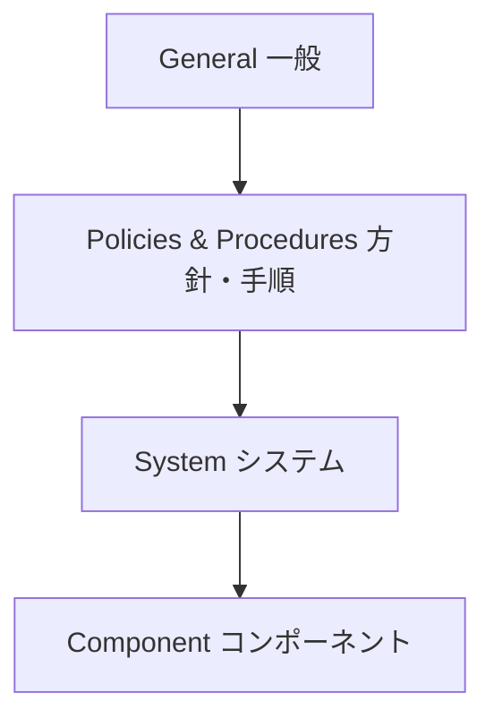

# ISA/IEC 62443(産業制御システムセキュリティ)

## 1. 概要

### A. 定義
> **産業オートメーション・制御システム(IACS/ICS・OT)** のサイバーセキュリティを確保するため、アセットオーナー(Asset Owner)・システムインテグレータ(System Integrator)・製品サプライヤ(Product Supplier)など利害関係者ごとの役割と要求事項を階層的に体系化した国際標準。

ISA/IEC 62443 は、もともと米国の国際自動制御学会(ISA)の ISA-99 として出発し、国際電気標準会議(IEC)と共同で国際標準化された規格である。中核となる思想は、セキュリティを一つの製品機能ではなく、**アセットオーナーの運用・システムインテグレータの設計・製品サプライヤの開発**というサプライチェーン全体が共に責任を負う**ライフサイクル(Lifecycle)の観点**の問題とみなす点にある。すなわち特定のファイアウォールを一台うまく購入することではなく、誰がどのようなセキュリティ責任を負い、どの水準(Security Level)まで達成すべきかを、契約・設計・運用の全過程で明確に定めるフレームワークである。

### B. 登場背景および必要性
伝統的に、発電所・石油精製・製造ラインのような OT 環境は、外部網と物理的に分離(air-gap)されているという信念のもとで、セキュリティがほとんど考慮されていなかった。しかし2010年にイランの遠心分離機を破壊した **Stuxnet** は、USB・内部網を経由して閉域網にまで侵入可能であることを実証し、その後ウクライナの電力網停電(2015)・ドイツの製鉄所溶鉱炉の損傷など、物理的被害につながる事故が相次いだ。IT セキュリティがデータ漏えい(機密性)を懸念するのに対し、OT 事故は**設備破損・人命被害**に直結するという点で、リスクの性格が根本的に異なる。スマートファクトリー・基盤施設の IT/OT 融合によって閉域網の前提が崩れるなか、IT セキュリティ標準(ISO 27001)だけでは扱いきれない**可用性・安全(Safety)中心の専用標準**が必要となり、62443 がその事実上の国際準拠となった。

## 2. 標準構造(4階層)

62443 は文書群が上記の4階層に分かれており、各階層は異なる利害関係者を対象とする。**General(1-x)** は用語・概念・モデルを定義し、以降のすべての文書の共通言語を提供する。**Policies & Procedures(2-x)** は主に**アセットオーナー**が備えるべきセキュリティプログラム・パッチ管理・サービス提供者の要件を扱う。**System(3-x)** は**システムインテグレータ**がシステムを設計・構築する際に守るべきセキュリティ要求(3-3)とリスクアセスメント・ゾーン設計(3-2)を規定する。**Component(4-x)** は**製品サプライヤ**が個別製品(PLC・センサ・ゲートウェイ)を安全に開発するための開発ライフサイクル(4-1)と技術要求(4-2)を定める。このように責任が階層で分離されているため、セキュリティ事故の際に「誰の責任範囲だったのか」を契約基準で判別できる点が実務上の強みである。

| 階層 | 対象利害関係者 | 内容 |
|---|---|---|
| **General** | 共通 | 用語・概念・モデル(共通言語) |
| **Policies & Procedures** | アセットオーナー | セキュリティプログラム・パッチ管理・運用手順 |
| **System** | システムインテグレータ | システムセキュリティ要求(SL)・ゾーン/コンジット設計 |
| **Component** | 製品サプライヤ | 製品開発のセキュリティライフサイクル・技術要求 |

## 3. 中核概念

62443 の防御哲学は、いくつかの中核概念によって実装される。最も根幹となるのは **Zone & Conduit** であり、制御網をリスク特性が似た資産同士でまとめて**セキュリティゾーン(Zone)** に分割し、ゾーン間の通信は必ず統制された経路である**コンジット(Conduit)** のみを通過するよう強制する。これは一つのゾーンが突破されても隣のゾーンへ感染が広がらないようにする**隔壁(bulkhead)** の概念であり、例えば事務網・制御網・安全計装システム(SIS)を互いに異なるゾーンに分離する。各ゾーンには脅威水準に応じて **Security Level(SL 1〜4)** の目標を付与する。SL 1 は偶発的な侵害、SL 2 は低リソースの意図的攻撃、SL 3 は中程度の専門的攻撃、SL 4 は国家レベルの高度な攻撃を防ぐことを目標とし、段階が上がるほど要求される統制が強化される。

この目標を実際の統制に落とし込んだものが **7つの基本要求(Foundational Requirements, FR)** であり、すべてのセキュリティ要求はこの7つに帰属する。**多層防御(Defense in Depth)** はこれらすべてを貫く原則であり、いずれか一つの統制に依存せず、物理・ネットワーク・システム・コンポーネントの複数階層に防御を重ねる。

| 概念 | 説明 |
|---|---|
| **Zone & Conduit** | 資産をセキュリティゾーン(Zone)に隔離し、ゾーン間通信は統制経路(Conduit)のみで行う |
| **Security Level(SL 1〜4)** | 脅威水準別の目標セキュリティ等級(偶発→国家級攻撃) |
| **7つの基本要求(FR)** | ①識別・認証制御 ②使用制御 ③システム完全性 ④データ機密性 ⑤データフロー制限 ⑥適時対応 ⑦資源可用性 |
| **多層防御(Defense in Depth)** | 物理・網・システム・コンポーネントに防御を重畳 |

## 4. IT セキュリティとの違い(比較)

IT と OT のセキュリティ優先順位が分かれる根本的な理由は、**保護対象の価値が異なるから**である。IT では情報(データ)が資産であるため、漏えいを防ぐ**機密性(C)** が最優先だが、OT では工程が止まればそれが直ちに生産損失・安全事故となるため、**可用性(A)・安全(Safety)** が最優先となる。そのため IT では当然の「脆弱性発見後即座にパッチ適用」が、OT ではかえって危険である。稼働中の発電設備を再起動しなければならないパッチは工程停止を引き起こしうるため、保守停止期間(shutdown window)まで待つか、補償統制(仮想パッチ)で代替する。また IT 機器は3〜5年で交換されるが、制御設備は20〜30年使用されるため、すでにサポートが終了した(EoL)OS が現場に残っているのが普通であり、これを前提として防御を設計しなければならない。

| 区分 | IT | OT(62443) | 違いが生じる理由 |
|---|---|---|---|
| **優先順位** | 機密性(C) | **可用性・安全(A・S)** | 事故がデータ漏えいではなく設備破損・人命に直結 |
| **パッチ** | 迅速に適用 | 慎重(停止リスク) | 再起動が工程停止を誘発し、保守期間が必要 |
| **寿命** | 3〜5年 | 20〜30年 | 設備が資本財であり、EoL OS が常在 |

## 5. 考慮事項および示唆(技術士の観点)
- **IT/OT 融合ガバナンス**: 閉域網の前提が崩れた以上、IT セキュリティチームと OT 現場チームの責任境界を再定義し、スマートファクトリー導入時にはゾーン分割・一方向ゲートウェイ(Data Diode)を設計段階から反映する。
- **Safety と Security の統合**: 安全計装システム(SIS)がサイバー攻撃で無力化されると安全機能そのものが崩壊するため、機能安全(IEC 61508/61511)と 62443 を併せて管理することが中核的なトレンドである。
- **サプライチェーンセキュリティ**: 製品サプライヤ認証(62443-4-1/4-2)を調達要件として要求し、セキュリティが内在化された製品のみを導入する **Security by Design** を契約によって強制する。
- **国家基盤防護との連携**: 重要情報通信基盤施設の保護やスマート工場セキュリティガイドの国際準拠として活用され、規制対応と実質的な防御を同時に満たすベースラインとなる。

---

> **一言まとめ**: ISA/IEC 62443 は*アセットオーナー・インテグレータ・サプライヤごとの責任を4階層で体系化した OT セキュリティ国際標準*であり、Zone/Conduit による隔離・SL 等級・7つの基本要求・多層防御を通じて、IT とは異なり**可用性・安全を最優先**とする産業制御システムセキュリティを提示する。
