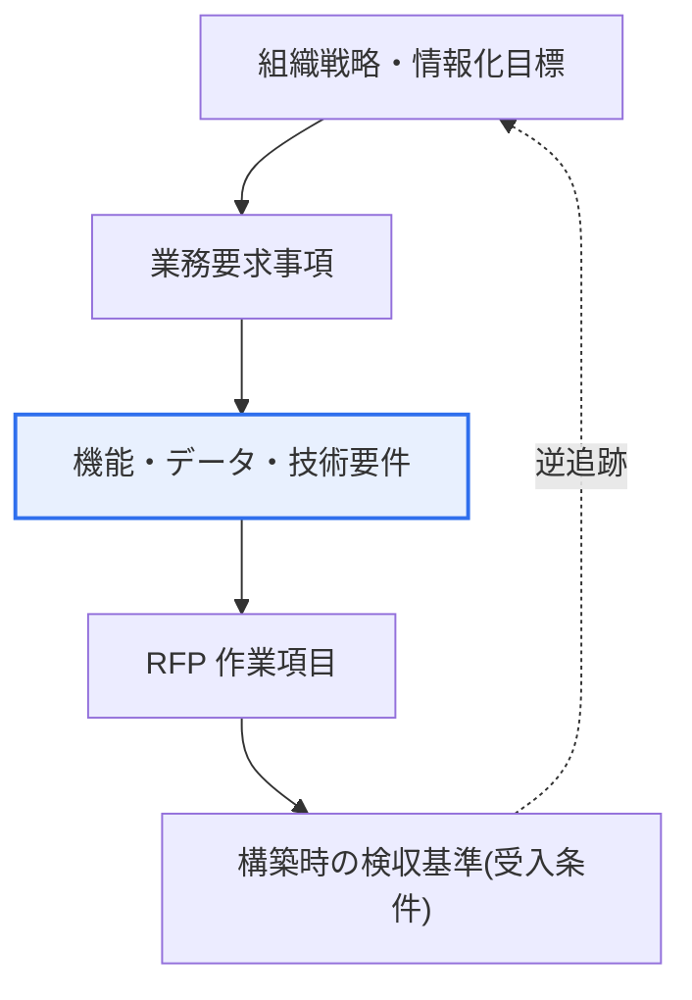

# 情報システムマスタープラン(ISMP)

## 1. 概要

### A. 定義
> **ISMP(Information System Master Plan)** とは、特定の情報システム**構築事業の要求事項を発注(契約)前に詳細に導出・分析・企画**し、事業発注に必要な提案依頼書(RFP)と実行計画を精緻に策定する活動である。組織全体の中長期情報化戦略を扱う ISP が「どこへ向かうか」を定めるとすれば、ISMP は**個別事業の単位で「何をどのように作るか」を発注前に具体化**する詳細企画である。

ISMP が制度として導入された根本的な背景は、「**曖昧な要求で発注されたソフトウェア事業の繰り返される失敗**」であった。要求事項が不明確な状態で事業を開始すると、開発途中で要求が変わり続けて作業変更が累積し、コストが超過し、スケジュールが遅延し、品質が低下するという悪循環が発生する。何よりも「何を作ることにしたのか」が契約書に明確に記載されていないため、発注者と受注者の間で「これは元々の範囲だった/そうではない」をめぐる紛争が絶えない。

ISMP はこの問題を、**「発注前に要求を十分に分析・確定する」** という単純だが強力な原理で解決する。家を建てる前に詳細設計図と見積りを確定してから施工契約を結ぶように、ソフトウェア事業も発注前に何を作るかを具体化しておけば、事業リスクを大きく減らし発注品質を高めることができる。韓国では、ソフトウェア振興法(旧ソフトウェア産業振興法)の体系のもとで、一定規模以上であるか要求事項が複雑で事前企画が必要な公共情報化事業に対して、ISMP または要求事項詳細化の手続きを推奨・適用してきた。(具体的な対象基準・金額は関連告示・指針の改正によって変わりうるため、最新の規定を確認しなければならない。)

### B. 登場背景と必要性
情報化事業は、要求が不明確であるほど失敗リスクが指数関数的に大きくなる。特に大型・公共事業は予算規模が大きく、利害関係者が多く、社会的波及も大きいため、発注段階で要求を確定しなければ統制自体が困難になる。過去の多くの公共情報化事業が「低価格受注後の作業変更の急増」というパターンで失敗した経験が、ISMP 制度化の直接的な動因となった。

ISMP が必要な理由は大きく三つに整理される。第一に、**発注品質の向上**である。要求事項が明確で検証された RFP は、受注者が正確に提案し公正に競争できる土台となる。第二に、**適正対価の確保**である。何を作るかが具体化されてはじめて規模(ファンクションポイントなど)とコストを適切に算定でき、これは無理な低価格発注がもたらす品質低下や下請けへのしわ寄せを予防する。第三に、**紛争予防と責任の明確化**である。契約前に範囲を確定しておけば、開発中の「これもやってほしい」という要求が契約範囲外であることを明確に判別でき、発注者と受注者の双方を保護する。要するに ISMP は「安く速く発注」ではなく「きちんと準備して発注」することで、事業の成功確率そのものを引き上げる事前投資である。

## 2. ISP との比較

ISMP を正確に理解するには、上位概念である ISP(Information Strategy Planning)との関係を押さえる必要がある。両者は対立概念ではなく、**戦略 → 事業企画へとつながる階層**をなす。ISP が全社レベルで「わが組織は今後3〜5年間、どのような情報システムをどのような優先順位で整備するか」という全体像を描くとすれば、ISMP はその全体像の中の個別課題を一つ取り出し、「このシステムを実際に発注するには何が必要か」を詳細化する。

以下の表は二つの活動の違いを整理したものである。ただし表の項目の羅列にとどまらず、この違いが「なぜ」生じるのかを理解することが重要である。ISP は**複数の事業を包括する戦略**であるため、成果物は方向性・優先順位を中心とするマクロな計画であるのに対し、ISMP は**単一事業の実行準備**であるため、成果物はその事業一つを発注できるほど具体的な要求事項定義書と RFP である。すなわち抽象化の水準と目的が異なるため、成果物の詳細度と形態が異なってくるのである。

| 区分 | ISP | ISMP |
|---|---|---|
| **範囲** | 全社的な情報化戦略 | 個別システム構築事業 |
| **目的** | 中長期の情報化方向・優先順位の決定 | 事業要求の確定・発注の詳細企画 |
| **視野** | 3〜5年のロードマップ(マクロ) | 特定事業1件(ミクロ・実行) |
| **中核成果物** | 情報化マスタープラン、移行ロードマップ | 要求事項定義書、提案依頼書(RFP) |
| **関係** | 上位戦略 | ISP を具体化した事業企画 |

実務において ISP と ISMP は、必ずしも順次にのみ進められるわけではない。ISP なしに個別事業だけを急いで推進しなければならない場合、ISMP が事実上戦略検討の一部を兼ねることもあり、逆によく策定された ISP があれば、ISMP はその優先順位と方向性をそのまま引き継いで要求の詳細化に集中できる。核心は、**戦略と発注が断絶せず整合性をもって連結される**ようにすることであり、ISMP はその連結環の役割を果たす。

## 3. 段階別の活動と成果物

ISMP は、着手から発注準備まで要求を段階的に具体化していく段階的な手続きである。各段階は前段階の成果物を入力として受け取り、要求をさらに詳細化し、最終段階で発注可能な水準の RFP に到達する。以下のフロー図は五つの段階の進行を示している。

**A. プロジェクト着手・計画**の段階では、ISMP 遂行そのものの範囲と推進体制、スケジュール、参加組織を定める。この段階が不十分だと以後の分析範囲が揺らぐため、経営陣・現業部門・IT 部門の役割と意思決定構造を初期に明確にすることが重要である。成果物は ISMP 遂行計画書である。

**B. 情報システム方向性の策定**の段階では、内外の環境と現行システムの現状(As-Is)を分析し、目標システムの方向(To-Be)と目標モデルを確立する。ここで組織の戦略・業務目標と情報システムがどのように整合すべきかを規定し、ISP があればその方向性を引き継ぐ。この段階の結果が以後の要件分析の羅針盤となる。

**C. 業務・技術要件分析**の段階は ISMP の心臓部である。現業担当者へのインタビュー・ワークショップ・現行プロセス分析を通じて業務要求事項を詳細に導出し、それを支える技術要件(性能・セキュリティ・連携・データ要件など)を併せて分析する。この段階で要求がどれだけ緻密に発掘・検証されるかが事業全体の成否を左右するため、要求事項の完全性・一貫性・追跡性の確保に力を注がねばならない。成果物は要求事項分析書である。

**D. 情報システム構造・要件定義**の段階では、分析された要求をもとに機能・データ・アーキテクチャ(アプリケーション・データ・技術構造)を定義し、要求事項を発注可能な形の定義書として定型化する。各機能要求に優先順位と受入基準を付与し、受注者が何をどの水準で実装すべきかを明確にする。成果物は要求事項定義書である。

**E. 事業移行方策の策定**の段階では、確定した要求に基づいて事業規模(例:ファンクションポイントに基づく規模算定)とコスト・期間を算定し、事業分割・推進戦略を定めたうえで、これらすべてを盛り込んだ提案依頼書(RFP)と移行計画を完成させる。この RFP がそのまま発注の基準文書となり、以後の提案・契約・構築の根拠として機能する。

| 段階 | 詳細活動 | 中核成果物 |
|---|---|---|
| **着手・計画** | 範囲・推進体制・スケジュールの定義 | ISMP 遂行計画書 |
| **方向性の策定** | 環境・現状(As-Is)分析、目標モデル(To-Be) | 方向性定義書 |
| **要件分析** | 業務・技術要求の詳細導出・検証 | 要求事項分析書 |
| **構造・要件定義** | 機能・データ・アーキテクチャの定義、優先順位付け | 要求事項定義書 |
| **移行方策** | 規模・コスト算定、RFP・移行計画の作成 | 提案依頼書(RFP)、移行計画 |

### A. 要求事項の追跡性の確保
ISMP の手続き全般を貫く実務原理は、**要求事項の追跡性(traceability)** である。方向性の策定で導出された上位目標が要件分析の個別要求へ、さらに構造・要件定義の機能・データ項目へ、最終的に RFP の作業条項へと途切れなくつながっていなければならない。以下はこの追跡の連鎖を示した詳細図である。

この追跡の連鎖が確保されれば、開発中にどの要求がなぜ必要か、どの上位目標から生じたかをいつでも逆追跡でき、不要な要求の膨張(スコープクリープ)を抑制し、検収基準を明確にできる。逆に追跡性が途切れると、RFP に根拠のない要求が混入したり、肝心の要求が欠落したりして発注品質が低下する。ISMP の各成果物を別個の文書としてではなく、一つにつながった要求体系として管理しなければならない理由がここにある。

### B. 失敗・成功事例の対比

ISMP の価値は、失敗事例と対比するとはっきりする。要求を確定せずに発注した典型的な公共事業では、着手後に現業部門からの追加要求が殺到し、当初の契約範囲に比べて作業が大きく膨れ上がる。例えば当初100個の機能で契約したが開発中に要求が150個に増えると、受注者は追加対価なしに50%多い仕事を抱え込むか、発注者と紛争に入ることになる。このとき根拠となる要求事項文書が不十分であれば責任の所在を判別しにくく、結局、品質低下・納期遅延・監査指摘へとつながる。

逆に ISMP を忠実に遂行した事業は、発注時点ですでに要求が検証・確定されているため、受注者は正確に提案し、発注者は公正に評価し、開発中の変更は正式な変更管理手続きで統制される。要求が明確なので規模算定が正確になり、正確な規模は適正な予算編成につながって無理な低価格発注を防ぐ。実務的に ISMP は単なる文書作業ではなく、**事業リスクを発注前に先行精算するリスク管理活動**であるという点が中核的な含意である。

また ISMP は、発注者の内部能力の強化にも寄与する。要求を自ら定義した経験のある発注組織は、以後の事業管理・監理段階でも受注者に振り回されず主導権を維持できる。すなわち ISMP は特定の事業一つを越えて、発注機関が情報化事業を統制する成熟度(ガバナンス)を高める契機となる。

ただし ISMP が万能ではないという点も、実務的に留意すべきである。要求を事前に過度に確定すると、開発中に発見される改善余地を反映しにくくなり、アジャイル・反復開発が求められる事業とは緊張関係が生じうる。したがって要求の安定性が高い大型の基幹系システムには ISMP 式の事前確定が適している一方、不確実性の大きい新規サービスには、RFP に変更管理・優先順位調整の余地を明記するなど、柔軟性も併せて設計するバランスが必要である。ISMP を「要求を凍結する手続き」ではなく、「中核要求を確定しつつ変更を統制可能にする手続き」として理解することが成熟した適用である。

## 5. 深掘り — 要求工学・過去問との連携と答案構成戦略

ISMP は本質的に、**要求工学(Requirements Engineering)を発注段階に制度化したもの**とみなすことができる。要求の導出(elicitation)・分析・仕様化・検証という要求工学の手続きが ISMP の各段階にそのまま対応し、要求事項の完全性・一貫性・追跡性・検証可能性という品質特性が ISMP 成果物の品質基準となる。したがって答案では、ISMP を要求工学・RFP・ファンクションポイント(FP)に基づく規模算定・SLA などの隣接テーマと結びつけて記述すれば、深みが増す。

過去問との連携の観点では、ISMP は ISP、RFP、ソフトウェア事業の対価算定、公共 SW 事業制度(作業審議委員会・要求事項詳細化など)とともに頻繁に出題される。近年の公共 SW 事業管理制度は、作業変更の統制と適正対価の保障を強化する方向で改正されてきており(作業審議委員会の運営、要求事項詳細化の義務化の流れなど)、ISMP はこうした制度が目指す「準備された発注」の代表的手段として位置づけられる。具体的な制度名・施行時期・適用基準は継続的に改正されるため、答案では大きな方向性を中心に記述し、断定的な数値の引用は避けるのが安全である。

答案構成戦略としては、① 概要で「ISP との区別」を明確にして採点者に概念理解を印象づけ、② 本論で5段階の手続きと成果物を概念図とともに提示しつつ各段階の「要求の具体化」という流れを強調し、③ ISP・RFP・規模算定との連携へと展開したうえで、④ 結論で発注品質・適正対価・紛争予防という技術士の観点からの含意で締めくくる構成が効果的である。

## 6. 考慮事項および示唆

1. **発注前の要求詳細化によって作業変更・紛争を根本的に予防する。** ISMP の中核価値は、事業開始前に「何を作るか」を確定し、開発中の作業変更の急増と発注者–受注者間の紛争を構造的に減らすことにある。これは事後統制ではなく事前予防であるという点で、リスク管理の定石である。

2. **正確な規模・コスト算定によって適正対価を確保する。** 要求が明確であってはじめてファンクションポイントなどで規模を適切に算定でき、これは無理な低価格発注による品質低下と下請けの不備を予防する。ISMP は「安い発注」ではなく「適正価格での発注」を可能にする根拠を提供する。

3. **ISP–ISMP–構築–監理の連携によって整合性を確保する。** 全社戦略(ISP)から個別事業企画(ISMP)へ、さらに構築・監理・運用へとつながる流れが一貫していてこそ、情報化投資が組織の戦略目標に整合する。ISMP は戦略と実行の間の断絶を埋める連結環である。

4. **発注機関の要求定義能力とガバナンス成熟度を併せて引き上げる。** ISMP は文書作成を越えて、発注組織が要求を自ら統制し事業を主導する能力を育てる契機となる。この能力が蓄積されてこそ、以後の事業でも受注者に従属しない健全な発注エコシステムが形成される。

5. **制度・環境の変化に合わせた継続的な整合化が必要である。** 公共 SW 事業制度は作業変更の統制・適正対価の保障の方向へと進化し続けているため、ISMP の成果物と手続きも最新の法令・告示・指針に合わせて継続的に整合化してこそ実効性を維持できる。

## 参考資料
- 科学技術情報通信部、ソフトウェア振興法および下位告示(ソフトウェア事業関連指針) — https://www.law.go.kr/
- 韓国知能情報社会振興院(NIA)、情報化事業関連の案内・ガイド — https://www.nia.or.kr/

---

> **一言まとめ**: ISMP は*個別情報システム事業の要求事項を発注前に詳細企画*する活動であり、着手→方向性→要件分析→構造定義→移行方策の5段階で要求を段階的に具体化して RFP・要求事項定義書を作成し、作業変更・紛争を予防するとともに、適正対価と発注品質を確保する。
