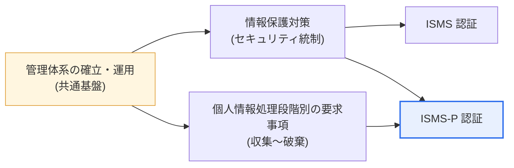

# 情報保護および個人情報保護管理体系(ISMS / ISMS-P)

## 1. 概要

### A. 定義
> **ISMS(Information Security Management System、情報保護管理体系)** とは、情報資産の機密性・完全性・可用性を保護するための管理体系を確立・運用していることを、第三者の審査機関が客観的に検証する認証である。**ISMS-P** はこれに**個人情報保護(Personal information)** の処理ライフサイクルの要求事項までを統合した認証であり、韓国インターネット振興院(KISA)と個人情報保護委員会が運営する。

認証制度の本質的な目的は、組織がセキュリティを「**一回限りの対策ではなく、継続的に管理される体系**」として備えるよう強制し、検証することにある。ファイアウォールを一台購入したからといって安全になるわけではなく、方針を策定し(Plan)、実行し(Do)、点検し(Check)、改善する(Act)という **PDCA サイクル**が組織文化に根づいてこそ、真のセキュリティとなる。認証は、第三者の審査機関がこの管理体系が実際に機能しているかを外部の視点から確認する仕組みである。情報のみを扱う組織には ISMS が、個人情報を大量に処理する組織には個人情報処理の要求事項まで検証する ISMS-P が適している。

ここで強調すべき点は、認証が「文書の束を作ったかどうか」ではなく、「**リスクを識別し統制する手続きが生きて機能しているか**」を見るということである。そのため認証審査では、方針文書だけでなく、実際のアクセス権限付与の記録、ログ点検の履歴、インシデント対応訓練の結果といった運用上の証跡も併せて確認する。これが単なる資格ではなく「管理体系」の認証と呼ばれる理由である。

### B. 登場背景および必要性
個人情報漏えい・ハッキング事故が企業の存亡と社会的信頼に直結するようになり、自主的なセキュリティ努力だけでは社会全体のリスクに対処できないという認識が高まった。数百万人の個人情報を扱う大規模サービスでは、一度の事故が個々の利用者の被害を越えて社会的波及を生むため、一定規模以上の事業者には管理体系認証が**法的義務**となった。すなわち認証は、対外的な信頼確保(マーケティング効果)と規制遵守(法的効果)を同時に達成する手段である。

もう一つの背景は、認証体系の**統合**である。かつては情報保護(ISMS)と個人情報保護(PIMS/PIPL)が別個の認証として運営されており、組織は類似した審査を重複して受けなければならなかった。この負担を減らすため、2018年に二つの体系を一つにまとめた ISMS-P が発足し、組織は自らの処理特性に応じて ISMS または ISMS-P を選択するようになった。

## 2. ISMS と ISMS-P の関係と違い

二つの認証の関係をまず構造として見ると、ISMS-P は ISMS を**包含する**より広い認証である。共通基盤の上に個人情報領域を載せた包含関係であることを理解することが、二つの制度を区別する出発点である。

二つの認証は「管理体系の確立・運用」という共通基盤を共有しつつ、**保護対象と点検範囲**で分かれる。ISMS は情報資産全般のセキュリティ統制、すなわちアクセス制御・暗号化・物理セキュリティ・インシデント対応などが適切に機能しているかを検証する。サーバ・ネットワーク・人員・物理施設といった「情報を入れる器」の安全が焦点である。

一方 ISMS-P は、これに加えて個人情報の**収集 → 利用・提供 → 保管 → 破棄**という処理ライフサイクル全般の要求事項を追加で点検する。例えば、収集段階で同意を適法に得たか、提供段階で委託・第三者提供の手続きが整っているか、破棄段階で保有期間を経過した個人情報を実際に削除したかまでを確認する。すなわち「器の安全(ISMS)」に加え、「器に入った個人情報という中身が全過程で適法に取り扱われているか(P 領域)」を併せて見るのが ISMS-P である。

実務的に、この違いが持つ含意は明確である。個人情報をほとんど扱わないインフラ・B2B 組織は ISMS だけで十分だが、会員の個人情報を大量に処理するコマース・プラットフォーム・フィンテックでは ISMS-P が事実上必須である。個人情報領域を除いて ISMS のみを取得すると、最も大きな法的リスクである個人情報処理手続きが検証されないまま残るからである。

また、認証マークが利用者に与える信頼のシグナルも異なる。個人情報を扱うサービスにおいて「ISMS-P 認証」の表示は、セキュリティだけでなく個人情報を適法に処理するという対外的な約束として受け取られるため、消費者向けのサービスほど P 領域まで含めた認証のマーケティング・信頼効果が大きい。逆に、義務対象となって慌ただしく ISMS のみを取得した後、遅れて個人情報規制の問題が浮上し ISMS-P へ拡張する事例も少なくない。最初に認証を設計する際、組織の個人情報処理の規模と成長方向を併せて考慮して認証範囲を定めることが、手戻りを減らす道である。

| 区分 | ISMS | ISMS-P |
|---|---|---|
| **保護対象** | 情報資産(セキュリティ) | 情報資産 + **個人情報** |
| **認証範囲** | 管理体系 + 情報保護対策 | + 個人情報処理段階別の要求事項 |
| **点検の焦点** | セキュリティ統制(アクセス・暗号・物理) | セキュリティ + 個人情報ライフサイクル(収集〜破棄) |
| **認証マーク** | ISMS | ISMS-P |
| **適合組織** | 情報保護中心・個人情報は少量 | 個人情報を大量処理(コマース・プラットフォームなど) |

## 3. 認証基準の構成(3領域)

ISMS-P 認証基準(2023.11 改正基準)は大きく三つの領域で構成され、ISMS はこのうち前の二つの領域を対象とする。各領域が「何を、なぜ」見るのかを理解すれば、認証の論理構造が見えてくる。

**A. 管理体系の確立および運用(16基準)。** この領域はセキュリティの「骨格」を見る。経営陣の参画と組織構成、情報資産の識別とリスク評価、保護対策の履行と事後管理まで、PDCA サイクルが組織に定着しているかを検証する。いくらツールを多く購入しても、リスクを評価し対策を決定する手続きがなければ管理体系とは言えないため、この領域があらゆる統制の上位に置かれる。

**B. 保護対策の要求事項(64基準)。** この領域は具体的な「筋肉」に相当する。方針・組織・人的セキュリティ、外部者・物理セキュリティ、認証および権限管理、アクセス制御、暗号化、情報システムの導入・開発セキュリティ、システム・サービスの運用セキュリティ、インシデントの予防・対応、災害復旧まで、実際のセキュリティ統制の履行状況を項目ごとに点検する。アクセス制御・暗号化のような技術的統制から、人的セキュリティのような管理的統制まで幅広く網羅する。

**C. 個人情報処理段階別の要求事項(21基準)。** ISMS-P にのみ適用されるこの領域は、個人情報ライフサイクルに沿って、収集時の保護措置、保有・利用時の保護措置、提供時の保護措置、破棄時の保護措置、そして情報主体の権利保護を確認する。前の二つの領域が「セキュリティ一般」であるとすれば、この領域は「個人情報特有の適法性」を見るという点で性格が異なる。

この領域の審査は、技術的統制よりも**手続きの適法性**を深く掘り下げる。例えば収集段階では、必須・任意の同意が区分されているか、最小収集の原則が守られているかを見て、提供段階では、委託時に受託者の管理・監督が行われているか、国外移転時に別途の同意・告知があるかを確認する。破棄段階では、保有期間を過ぎた個人情報が復元不可能な方式で削除されているかを実際のログで検証する。このように「同意を得た」という文書ではなく、「適法に得た同意が処理の全過程で守られているか」を見るため、個人情報を扱う組織にとってはこの領域が最も準備負担の大きい部分でもある。

三つの領域を合わせると認証基準は計 **101個(16+64+21)** であり、各基準には多数の詳細点検項目が付随している。ただし改正時期によって項目数は調整されうるため、実際の審査では最新の告示・案内書を確認するのが原則である。

## 4. ISMS の義務対象と認証手続き

### A. 義務対象の基準
「情報通信網利用促進および情報保護等に関する法律(情報通信網法)」第47条第2項および同法施行令第49条により、一定の要件を満たす情報通信サービス提供者は ISMS 認証が**義務**である。義務対象が規模基準で設定されている理由は、扱う情報・利用者が多いほど事故時の社会的波及が大きく、自主性に委ねることができないためである。これは「リスクの大きいところにより強い規制を」という比例原則の反映である。

具体的には、① ソウルおよびすべての広域市で情報通信網サービスを提供する**基幹通信事業者(ISP)**、② **集積情報通信施設(IDC)** 事業者、③ 情報通信サービス部門の前年度売上高が **100億ウォン以上**、または前年度末基準で直前3か月間の**1日平均利用者数が100万人以上**の事業者、④ 売上・歳入が **1,500億ウォン以上**の上級総合病院・大学などが対象となる。例えば会員数が急増して1日平均利用者が100万人を超えたオンラインサービスは、その時点から義務対象となり認証を準備しなければならない。

| 対象類型 | 基準(例) |
|---|---|
| **基幹通信事業者(ISP)** | ソウルおよびすべての広域市で情報通信網サービスを提供 |
| **集積情報通信施設(IDC)** | データセンターサービス提供事業者 |
| **売上・利用者規模** | 情報通信サービス売上100億ウォン↑または1日平均利用者100万人↑ |
| **病院・大学** | 売上・歳入1,500億ウォン以上の上級総合病院・大学 |

義務対象でありながら認証を受けなければ、情報通信網法により過料が科されうるため、規模の閾値に近づいている成長企業は、事前に認証準備のロードマップを立てておくことが実務的に重要である。

### B. 認証手続きと維持
認証は前述の統制項目を対象に、**申請 → 審査(文書・現場) → 欠陥の是正 → 認証委員会の審議 → 認証書の発行**という手続きを経る。審査では方針文書の存在だけでなく、実際の運用証跡(権限付与の記録、ログ、訓練結果など)も併せて確認し、形式的な準備をふるい落とす。

重要なのは、認証が一回限りではないという点である。認証書の有効期間は3年であり、その間に**毎年の事後審査**で管理体系が継続的に運用されているかを点検し、3年ごとに**更新審査**で再認証を受ける。この周期的な審査構造そのものが、「セキュリティは維持・改善されなければならない」という PDCA の哲学を制度として具現化したものである。

事後審査は初回審査より範囲が狭いが、決して形式的ではない。過去1年間に管理体系が実際に機能していたかを運用証跡で確認するため、認証だけを取得して運用を放置した組織は事後審査で欠陥が明らかになる。例えば、リスク評価を毎年更新していない、退職者のアクセス権限を回収した記録がない、侵害インシデント対応訓練を一度も実施していない、といった場合は欠陥として指摘される。すなわち認証は「一度通過すれば終わり」ではなく「3年間ずっと維持しなければならない状態」であることを、組織全体が理解しなければならない。

欠陥が発見されると、組織は定められた期間内に是正措置を実施し、その結果を証跡として提出しなければならず、重大な欠陥が解消されなければ認証が取り消されることもある。したがって認証取得と同じくらい、取得後の運用ガバナンス(定期的なリスク評価、権限の再レビュー、ログ点検、模擬訓練)を体系化することが実務の中核課題となる。

## 5. 深掘り:他の認証体系との連携と最新動向

ISMS-P は、国内外の他の認証・規制との**連携・相互認定**の観点から理解すると実務的価値が高まる。代表的には、クラウドサービスのセキュリティ認証である **CSAP(クラウドサービスセキュリティ認証)** と統制項目がかなりの部分で重なり、ISMS-P を保有するクラウド事業者は CSAP 対応の負担を減らすことができる。公共クラウド市場への参入を狙う事業者にとって、二つの認証の統制マッピングは実質的なコスト削減につながる。

こうした連携は、統制項目を1:1でマッピングした対応表(Crosswalk)を事前に作成しておくと、はるかに効率的になる。例えば、ISMS-P のアクセス制御・暗号化の項目を ISO/IEC 27001 Annex A の統制とあらかじめマッピングしておけば、一度の証跡収集で二つの認証の要求を併せて満たすことができ、審査対応の工数が大きく減る。

国際的には、情報セキュリティの国際標準である **ISO/IEC 27001** と構造・統制が類似している。ISMS-P の管理体系・保護対策の領域は ISO/IEC 27001 の管理体系要求と附属書の統制(Annex A)に対応するため、グローバル事業を行う企業は二つの認証を併せて準備し、国内規制の遵守と海外での信頼確保を同時に達成する。ただし ISMS-P は、個人情報処理段階別の要求事項という韓国法特有の領域を追加で含んでいるため、ISO/IEC 27001 だけでは国内の個人情報規制を完全には満たせないという点が違いである。

最新動向としては、2023年の個人情報保護法および施行令の改正に合わせて ISMS-P 認証基準が改正されたことが挙げられる。情報主体の権利強化、自動化された決定への対応、マイデータ・AI サービスの拡散に伴う個人情報処理の複雑化が反映される流れであり、認証基準もこうした変化に合わせて継続的に更新される。したがって答案作成時には、特定の項目数を断定するよりも「改正に応じて調整される」という前提の上で、最新の告示を基準とする姿勢が必要である。

AI サービスの拡散は、個人情報処理の観点から特に新たな論点を投げかけている。大規模言語モデル・推薦システムは学習データに個人情報が含まれうるうえ、自動化されたプロファイリングが情報主体に不利な決定を下しうるため、収集の適法性・目的制限・説明要求権といった原則がより精緻に適用されなければならない。管理体系認証も、こうした新技術環境で個人情報がどのように流れ統制されるかを反映する方向へ進化しており、組織は認証準備の過程で AI パイプラインのデータフローまでを資産識別・リスク評価の範囲に含めることが望ましい。

また、サプライチェーン・クラウドのリスクの増大により、自社システムだけでなく委託先・クラウド事業者を含む**外部者セキュリティ**統制の比重が大きくなっている。個人情報処理を外部に委託する構造が一般化するにつれ、受託者の管理・監督と再委託の統制、クラウドの責任共有モデルへの理解が、認証準備の重要な軸として浮上した。

## 6. 考慮事項および示唆(技術士の観点)

1. **認証は目的ではなく手段である。** 認証書の取得そのものではなく、実質的なセキュリティ水準の向上が本質であるため、審査通過だけを目的とした形式的な文書準備(「書類のためのセキュリティ」)にとどまれば、事故発生時に管理体系が機能しない。運用証跡が生きたものとなるよう、日常の手続きに統制を溶け込ませなければならない。

2. **個人情報の比重が大きい組織は、ISMS-P で統合管理するのが効率的である。** セキュリティと個人情報保護を一つの体系で管理すれば、方針・組織・審査の重複を減らし、整合性を高められる。逆に個人情報をほとんど扱わないインフラ組織が無理に P 領域まで認証を受ける必要はなく、処理特性に合った認証の選択が重要である。

3. **他の認証体系との連携戦略によって、認証の負担とコストを最適化する。** クラウドは CSAP、グローバルは ISO/IEC 27001 と統制項目をマッピングして相互認定・再利用することで、重複審査を減らし国内外の信頼を同時に確保できる。統制マッピング表を事前に整備しておくことが実務の核心である。

4. **規模の閾値管理と義務対象か否かの先制的な判断が必要である。** 売上・利用者数が義務基準(100億ウォン・100万人など)に近づいている成長企業は、閾値到達後に慌ただしく対応して過料・評判リスクを被らないよう、事前に認証準備のロードマップと予算を確保しなければならない。

5. **改正対応と継続的改善の体系を内在化する。** 個人情報保護法・認証基準は AI・マイデータなどの環境変化に合わせて周期的に改正されるため、最新の告示・案内書を追跡し、事後・更新審査を管理体系改善の機会として活用する継続運用ガバナンスが求められる。

## 参考資料
- ISMS-P 認証制度案内(KISA): https://isms.kisa.or.kr/main/ispims/target/
- ISMS-P 認証基準案内書(個人情報保護委員会、2023.11): https://www.privacy.go.kr/front/bbs/bbsView.do?bbsNo=BBSMSTR_000000000049&bbscttNo=20677
- 情報通信網法(国家法令情報センター): https://www.law.go.kr/

---

> **一言まとめ**: ISMS は情報保護管理体系の認証、ISMS-P はそれに個人情報の収集〜破棄の処理段階別要求事項を加えた統合認証(包含関係)であり、認証基準は管理体系の確立・運用(16)+保護対策(64)+個人情報処理段階(21)の3領域で構成される。情報通信網法上、売上100億ウォン・利用者100万人などの基準を満たす事業者には ISMS が義務であり、PDCA に基づく実質的なセキュリティ水準の向上こそが認証の本質である。
