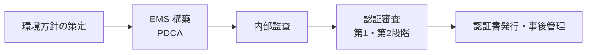

# ISO 14000(環境マネジメントシステム)

## 1. 概要

### A. 定義
> 組織が環境に与える影響を体系的に管理・改善するための**環境マネジメントシステム(EMS, Environmental Management System)** に関する国際規格群であり、その中核は認証対象規格である **ISO 14001**(EMS 要求事項)である。

ISO 14000 は、特定の汚染物質の排出限度値を直接規定する「パフォーマンス規格」ではなく、組織が自ら環境目標を設定し、それを達成するための**管理体系(プロセス)を備えることを要求する「システム規格」** であるという点が核心である。すなわち「どれだけクリーンか」ではなく、「環境を改善する管理構造が機能しているか」を認証する。このため業種・規模を問わず適用でき、継続的改善(PDCA)を内蔵している。

### B. 登場背景および必要性
1990年代以降、気候危機と環境規制が強化され、消費者・投資家・取引先などの利害関係者が企業の環境責任を求めるようになると、各国・各社がそれぞれ用いていた環境管理方式を**国際的に統一された基準**にまとめる必要性が高まった。ISO は品質マネジメント規格(ISO 9000)の成功モデルを環境分野へ拡張し、1996年に ISO 14001 を制定した。今日では **ESG・サステナビリティ経営**が企業存続の条件となり、ISO 14001 は環境リスクを管理し、規制に先制的に対応し、資源・エネルギー効率によって原価を下げる実質的な経営ツールとして定着した。特にグローバルサプライチェーンでは大企業が協力会社に認証を求めることが多く、**輸出・取引の事実上の参入要件**となっている。

## 2. 認証規格(主要)

ISO 14000 は単一の規格ではなく、目的別の規格の集まりである。認証(第三者審査)の対象は **ISO 14001 のみ**であり、その他はこれを支える指針・方法規格である。

- **ISO 14001**: EMS が備えるべき要求事項を規定する認証規格。リーダーシップ・計画・支援・運用・パフォーマンス評価・改善の構造(HLS)に従う。
- **ISO 14004**: ISO 14001 を実際に構築・運用するための実務指針(ガイド)。
- **ISO 14040/44**: 製品の原料採取から廃棄までの環境影響を定量化する**ライフサイクルアセスメント(LCA)** の方法。
- **ISO 14064**: 組織・プロジェクトの**温室効果ガス排出量の算定・報告・検証**の規格であり、カーボンニュートラル・排出権対応の根拠となる。

| 規格 | 性格 | 内容 |
|---|---|---|
| **ISO 14001** | 認証要求事項 | EMS 要求事項(第三者認証の対象) |
| **ISO 14004** | 指針 | EMS 構築・運用ガイド |
| **ISO 14040/44** | 方法 | ライフサイクルアセスメント(LCA) |
| **ISO 14064** | 方法 | 温室効果ガスの算定・検証 |

## 3. 構築および認証手続き

ISO 14001 の骨格は **PDCA(Plan-Do-Check-Act)サイクル**である。環境マネジメントは一度の措置で終わるものではなく、目標を設定し実行・点検・改善するループを繰り返して成果を継続的に向上させるという思想が、規格構造にそのまま反映されている。

計画(P)段階では、トップマネジメントが環境方針を表明し、組織活動が環境に及ぼす**環境側面(environmental aspects)** と遵守すべき法規制を把握して目標を設定する。実行(D)段階では、資源・役割を割り当て、運用を管理し、緊急事態への対応手順を整える。点検(C)段階では、パフォーマンスを監視し、内部監査で不適合を発見して是正する。改善(A)段階では、マネジメントレビューを通じてシステム全般を再評価し、次のサイクルの目標を引き上げる。その後、外部の認証機関が**第1段階(文書審査)** で体制の整備状況を、**第2段階(現地審査)** で実際の実施状況を確認して認証書を発行し、通常は毎年のサーベイランス審査と3年周期の更新審査によって有効性を維持する。

| 段階 | 内容 |
|---|---|
| **計画(P)** | 環境方針、環境側面・法規制の把握、目標設定 |
| **実行(D)** | 資源・役割の割当て、運用管理、緊急事態対応 |
| **点検(C)** | 監視・内部監査・不適合の是正 |
| **改善(A)** | マネジメントレビュー・継続的改善 |
| **認証** | 第1段階(文書)・第2段階(現地)審査 → 発行、サーベイランス・更新審査 |

## 4. 認証の効果

認証の効果は、規制対応という防御的側面と、競争力・コストという攻撃的側面を併せ持つ。例えば製造企業が EMS を導入して廃棄物の分別・リサイクルとエネルギー効率化を推進すると、廃棄物処理費・電力費が実際に削減され、環境パフォーマンスと原価削減が同時に達成される場合が多い。

| 効果 | 内容 |
|---|---|
| **法規制遵守** | 環境規制への先制的対応、違反リスクの低減 |
| **コスト削減** | エネルギー・資源・廃棄物の削減による原価改善 |
| **信頼・競争力** | イメージ向上、輸出・取引要件の充足 |
| **ESG** | サステナビリティ経営・開示の客観的根拠 |

## 5. 考慮事項および示唆
技術士の観点で最も警戒すべき点は、認証を**目的ではなく手段**として捉えることである。認証書の取得そのものよりも、実質的な環境パフォーマンスと継続的改善が本質であり、形式的な文書だけを整えた認証はかえって信頼を損なう。第一に、ISO 14001 を **ISO 50001(エネルギーマネジメント)・ISO 9001(品質)** などと統合運用(IMS)すれば、重複する審査・文書を減らし、相乗効果を生み出せる。第二に、ESG 開示が義務化される流れの中で、ISO 14064(温室効果ガス)・LCA のデータを開示の根拠として連携させなければならない。第三に、実測ではなく推定・誇張によって環境パフォーマンスを水増しする**グリーンウォッシング**を防ぐため、データの測定・検証の信頼性を確保することがますます重要になっている。

---

> **一言まとめ**: ISO 14000 は*環境マネジメントシステム(EMS)の国際規格群*であり、認証対象である ISO 14001 を中心に PDCA に基づく構築と第1・第2段階審査を経て、法規制遵守・コスト削減・ESG 競争力を提供するが、形式的な認証ではなく実質的な環境パフォーマンスと統合運用・グリーンウォッシング防止が鍵となる。
