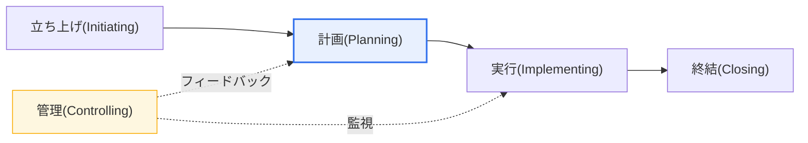
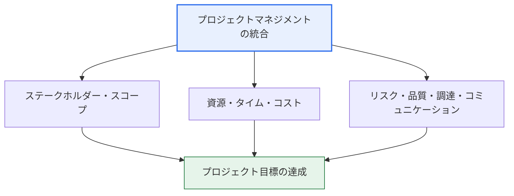

# ISO 21500(プロジェクトマネジメントの手引)

## 1. 概要

### A. 定義
> プロジェクトマネジメントに関する**国際標準ガイド**であり、組織・産業・プロジェクト規模を問わず適用できるプロジェクトマネジメントの概念・プロセス・用語を提示する。米国 PMI の知識体系である PMBOK に類似したプロセス構造を、国際標準化機構(ISO)が中立的な国際標準として確立したことがその出発点である。

ISO 21500 が必要とされる根本的な理由は、「**プロジェクトマネジメントの国際共通言語と準拠**」を提供することにある。組織ごとにプロジェクトマネジメントの方式や用語がばらばらであれば、グローバルな協業や成果評価、知識共有、監査・認証がいずれも困難になる。特定の国・団体の方法論(代表的には米国 PMI の PMBOK)が事実上広く使われてはいたが、それはあくまで一機関の知識体系であった。これを特定の組織に従属しない中立的な国際標準として確立する必要から、2012年に ISO 21500:2012 "Guidance on project management" が制定された。

ISO 21500 が扱う対象は「プロジェクト」という一回的・有期的な取り組みである。定型化された反復業務(運用、operations)とは異なり、プロジェクトは固有の成果物を定められた期間・予算の範囲内で生み出す活動であるため、不確実性と変更が常に存在する。標準が管理–計画のフィードバックやリスクマネジメントを中核要素として強調するのも、こうしたプロジェクトの本質的な不確実性に対応するためである。

ここで注意すべき点は、この標準が「**方法論(methodology)ではなくガイド(guidance)**」という性格を持つことである。すなわち「この順序でこのツールを使え」という処方ではなく、「プロジェクトマネジメントにはこのような概念とプロセスがあり、このように理解せよ」という共通フレームワークを提示する。したがって組織は、自社の方法論(例:社内 PM 標準、PRINCE2、アジャイル)を ISO 21500 という共通の枠組みに照らして整合性を点検・補完する準拠として活用する。異なる国・組織がプロジェクトを「同じ地図」で理解し意思疎通できる共通基盤を提供することが、この標準の本質的な価値である。

### B. 登場背景および必要性
プロジェクトの大型化・国際化により、多国籍チームと協力会社が一つのプロジェクトに共に参加するケースが急増するにつれ、各組織の方法論が相互に互換性を持ち品質を担保できる国際基準の必要性が高まった。例えば、発注者・設計会社・施工会社・監理会社がそれぞれ異なる国にある大型インフラプロジェクトでは、立ち上げ・計画・管理の手順と用語が統一されていなければ、スケジュール・コスト・リスク管理のコミュニケーションコストが爆発的に増大する。ISO 21500 はこうした異質な参加者に共通の準拠を提供し、協業とガバナンスの基盤となる。その後この規格群は2020〜2021年に大幅に改訂・再編されたが、これは後の深掘りの節で扱う。

また標準化は、組織内部にも実益をもたらす。プロジェクトマネジメント能力が特定のスター管理者の暗黙知に依存していると、その人が去ったときに管理品質が急落する。ISO 21500 のような共通標準を組織に内在化すれば、プロジェクトマネジメントが個人技ではなく組織の形式知・プロセス資産として蓄積され、人員の入れ替わりに関係なく一定の品質を維持し、新規人員の学習曲線も短縮できる。これが、標準が対外的な協業だけでなく組織内部の持続可能性の面からも求められる理由である。

## 2. 構成モデル(プロセス群 × 対象群)

ISO 21500(2012)は、プロジェクトを二つの直交する軸で組織化する。この「2次元マトリクス」構造が、PMBOK と発想を共有する中核部分である。

第一の軸は**プロセス群(Process Groups)** であり、プロジェクトが時間の流れに沿って経る五つの段階(立ち上げ・計画・実行・管理・終結)である。この五つは順次的にのみ進行するのではなく、相互に作用する。特に**管理(Controlling)** は実行と並行して計画に対する実績の差異を監視し、偏差が発生すれば計画へ差し戻して計画を更新する**フィードバックループ**を形成する。このフィードバック構造のおかげで、プロジェクトは初期計画に硬直的に固執することなく、進行中に発生する変更を統制された方式で反映できる。

第二の軸は**対象群(Subject Groups、主題領域)** であり、プロジェクトで管理すべき知識領域をまとめたものである。統合(Integration)・ステークホルダー(Stakeholder)・スコープ(Scope)・資源(Resource)・タイム(Time)・コスト(Cost)・リスク(Risk)・品質(Quality)・調達(Procurement)・コミュニケーション(Communication)の10領域で構成される。各対象群はプロジェクトのライフサイクル全体にわたって管理され、個々のプロセスは「プロセス群(いつ)」と「対象群(何を)」が交差する地点に位置する。例えば「コストの見積り」は、計画(プロセス群)× コスト(対象群)の交差点に置かれたプロセスである。

上記の対象群の詳細図が示すように、**統合マネジメント**は残りの九つの領域を調整・連結する中心軸の役割を果たす。個々の領域がいかにうまく管理されていても、互いに相反する(例:スケジュール短縮とコスト削減の衝突)とプロジェクトは失敗するため、統合マネジメントが全体のバランスと優先順位を調整し、一つの目標へと収束させる。ステークホルダー・スコープが「何をなぜ行うか」を定義し、資源・タイム・コストが「どのように、いくらで行うか」を扱い、リスク・品質・調達・コミュニケーションが「いかに安定的に完遂するか」を支える構造として理解すれば、各領域の関係が明確になる。

| プロセス群 | 中核活動 |
|---|---|
| **立ち上げ(Initiating)** | プロジェクト・フェーズの開始、目標・プロジェクト憲章の定義 |
| **計画(Planning)** | スコープ・スケジュール・コストなどの詳細計画の策定 |
| **実行(Implementing)** | 計画に基づく作業の遂行・成果物の生成 |
| **管理(Controlling)** | 進捗の監視、偏差分析、変更・是正処置 |
| **終結(Closing)** | 正式な受入れ・終結、教訓(lessons learned)の整理 |

| 対象群のまとまり | 含まれる領域 |
|---|---|
| **定義・統合** | 統合、ステークホルダー、スコープ |
| **制約(三大)** | 資源、タイム(スケジュール)、コスト(費用) |
| **品質・不確実性・コミュニケーション** | リスク、品質、調達、コミュニケーション |

このマトリクス構造が持つ実務的な含意は、「**漏れなく・重複なく(MECE)管理領域を俯瞰**」できる点にある。プロジェクトマネージャは各段階(プロセス群)ごとに10の対象群をチェックリストのように確認し、例えば実行段階で「リスク対応は更新されているか、ステークホルダーとのコミュニケーションは十分か」を構造的に確認できる。これは管理者の経験や直感に依存していたプロジェクトマネジメントを標準化されたチェックフレームへと転換するという点で、組織全体の管理品質を底上げする効果がある。ただし標準は、「すべてのプロジェクトが10領域を同じ強度で管理しなければならない」とは規定していない。小規模・低リスクのプロジェクトでは、調達・プログラム連携などを簡素化する**テーラリング(tailoring)** がむしろ推奨され、このテーラリングの判断こそが管理者の専門性が発揮される点である。

## 3. PMBOK との比較(違いの理由と含意)

| 区分 | ISO 21500 | PMBOK Guide(PMI) |
|---|---|---|
| **性格** | 国際標準(中立的ガイド) | 特定協会の知識体系 |
| **詳細度** | 概念・フレームワーク中心(簡潔) | 詳細な技法・ツール・成果物(ITTO)が豊富 |
| **活用** | 標準準拠・整合性・認証の基盤 | 実務遂行の方法論・資格(PMP)の基盤 |
| **改訂の方向** | ガバナンス・ポートフォリオへ拡張(21502 など) | プロセス → 原則・パフォーマンス領域中心へ転換 |

両文書の違いは優劣ではなく、**志向点の違い**に由来する。ISO 21500 が「何を管理すべきか」というフレームワークを中立的な国際標準として簡潔に提示することに焦点を置くのに対し、PMBOK は「どのように管理するか」という具体的なツール・技法・成果物(インプット・ツールと技法・アウトプット、ITTO)を膨大に扱う。このため ISO 21500 は組織の方法論の整合性を点検する「物差し」の役割に、PMBOK は実務者が参照する「実行マニュアル」の役割に、それぞれ強みがある。

実務では両者を競合関係ではなく、相互補完的に併用する。すなわち、組織標準の大枠と用語は ISO 21500(および後継の 21502)に合わせて国際的な整合性を確保し、個々のプロセスの詳細な遂行技法は PMBOK から取り入れる方式である。実際に両文書のプロセス群の名称と知識領域はかなり対応しているため、一方に慣れた実務者が他方を理解するのに大きな困難がないという点も、併用を容易にしている。

違いが生じる根本的な理由は、両文書の「制定主体と目的」が異なるからである。ISO は多様な国家標準機関の合意によって標準を作る組織であるため、特定のツール・技法を規定するよりも、最大公約数的な水準の概念・プロセスの合意にとどまらざるを得ない。一方 PMI は、実務者資格(PMP)と教育事業を併せて運営する専門協会であるため、実務者がすぐに使える詳細なツール・成果物・用語集を膨大に蓄積してきた。この構造的な違いを理解すれば、なぜ ISO 21500 が「簡潔な準拠」であり PMBOK が「分厚い実務書」なのかが自然に説明される。

一方で PMBOK も、2021年の第7版で従来のプロセス・知識エリア中心から**原則(principles)・パフォーマンス領域(performance domains)** 中心へと大きく転換し、アジャイル・ハイブリッドを包含する方向へ進化した。すなわち ISO 系と PMBOK の双方が「手順の羅列」から「価値・原則・ガバナンス」へと重心を移しているという点で、二つの標準の進化の方向は収斂する様相を見せている。

## 4. 規格群の進化(深掘り — 2020〜2021 改訂)

ISO 21500 系は2020〜2021年にかけて大きく再編されており、技術士の観点からこの変化を正確に理解することが重要である。核心は、**プロジェクトマネジメントの詳細な手引が ISO 21500 から新規格 ISO 21502 へ移管され、ISO 21500 自体は上位の「背景と概念(Context and concepts)」文書として再定義された**という点である。

具体的には、**ISO 21502:2020**("Project, programme and portfolio management — Guidance on project management")が、2012年版 ISO 21500 が担っていたプロジェクトマネジメントの実務指針を置き換える主要な参照規格となった。一方 **ISO 21500:2021** は "Project, programme and portfolio management — Context and concepts" として再定義され、プロジェクトだけでなく**プログラム・ポートフォリオ**を包括する管理体系全体の背景・概念・用語と、ISO/TC 258 が策定した関連規格群(21502・21503・21504・21505 など)に対する上位の俯瞰を提供する「傘(umbrella)」規格となった。

この再編の背景には二つの流れがある。第一に、個別プロジェクトを越えて**プログラム(関連プロジェクトの集合)・ポートフォリオ(全社の投資の集合)** の次元での戦略整合が重要になり、標準が単一のプロジェクトマネジメントから組織全体のプロジェクトガバナンスへと視野を広げた。第二に、2020年代の改訂版は**ガバナンス・持続可能性・価値実現(benefits realization)** を強調し、単なる手順遵守を越えて、プロジェクトが組織に実際の価値を創出しているかへと焦点を移した。ただし国内外の組織・教材・過去問では依然として「ISO 21500」を2012年版の5つのプロセス群モデルとして指す場合が多いため、答案作成時には「2012年版のプロセスモデル」と「2020〜2021年の再編(21502 への移管、21500 の背景・概念化)」を区別して記述するのが安全である。

## 5. 適用事例

ISO 21500 系が実際にどのように活用されるかは、組織の類型ごとに具体化される。

**事例1 — 多国籍 EPC(プラント建設)プロジェクト。** 発注者(中東)・設計会社(欧州)・施工会社(アジア)が協業する大型プラントプロジェクトでは、参加組織の PM 用語と手順がまちまちである。このとき契約書上のプロジェクトマネジメントの準拠として ISO 21500/21502 を明記すれば、立ち上げ・計画・管理・終結の段階定義と、リスク・調達・品質管理のプロセスが共通基準で整列される。例えば「変更管理(change control)」の手順と承認ゲートを標準に合わせて統一すれば、異なる組織間の変更要求・承認のコミュニケーションコストが大きく減少する。

**事例2 — 公共機関の情報化事業 PMO。** 韓国の大型公共情報化事業において、PMO は多数の事業者の成果物とスケジュールを統合管理しなければならない。ISO 21500 のプロセス群・対象群マトリクスを事業管理体系の準拠とすれば、各事業者の方法論が異なっていても「何をいつ管理すべきか」を共通の枠組みで点検できる。特に管理プロセスの「監視–フィードバック」ループを EVM(アーンドバリューマネジメント)などの実務技法(PMBOK)と組み合わせ、スケジュール・コストの偏差を定量的に管理する。

**事例3 — 組織の PM 成熟度向上。** 社内 PM 標準がないか非体系的な企業が ISO 21500 を準拠として自社プロセスをマッピングすると、欠落している管理領域(例:ステークホルダーマネジメント、リスクマネジメント)が明らかになる。これを補完して社内標準を整備し、さらにプログラム・ポートフォリオの次元(ISO 21503/21504)へと拡張すれば、全社的なプロジェクトガバナンス体系を段階的に構築できる。

三つの事例に共通するのは、ISO 21500 が「実行方法論」を置き換えるのではなく、異なる方法論・組織を一つの共通座標系に整列させる「準拠の役割」を果たすという点である。

## 6. 考慮事項および示唆(技術士の観点)

1. **国際的な共通準拠としての整合性確保の手段である。** 組織固有の PM 方法論が国際標準と食い違うと、多国籍協業・監査・認証で摩擦が生じる。ISO 21500/21502 を準拠として自社標準のプロセス・用語・成果物をマッピング・点検することが、実務適用の第一歩である。

2. **PMBOK など実務方法論と相互補完的に結合しなければならない。** 標準のフレームワーク(ISO)だけでは具体的な実行が難しく、方法論(PMBOK・PRINCE2)だけでは国際的な整合性・中立性が弱い。大枠は ISO、詳細な技法は方法論から取り入れるハイブリッド戦略が、体系性と実行力を同時に確保する。

3. **ガバナンス・ポートフォリオ・価値中心への進化を反映しなければならない。** 2020〜2021年の改訂はプロジェクト単位の管理を越え、プログラム・ポートフォリオのガバナンスと便益実現を強調している。PMO・戦略企画部門は、個別プロジェクトマネジメント(21502)と全社的俯瞰(21500 の概念・21503/21504)を階層的に連携させ、投資の優先順位と戦略整合を管理しなければならない。

4. **アジャイル・ハイブリッド環境との接合が課題である。** 元の標準は伝統的(予測型)プロジェクトを前提としているが、実際の SW・デジタルプロジェクトはアジャイル・ハイブリッドで遂行されることが多い。プロセス群の「管理–計画のフィードバック」を反復サイクル(スプリント)として解釈するなど、標準の概念をアジャイルの実践と整合的に再解釈する能力が求められる。

5. **標準遵守そのものが目的ではないことに留意しなければならない。** 標準は共通言語・準拠にすぎず、プロジェクトの成功を保証するものではない。組織の成熟度(例:OPM3 などの成熟度モデル)と状況(プロジェクト規模・リスク)に合わせて標準をテーラリング(tailoring)して適用することが、技術士の観点での中核的な判断である。

## 参考資料
- ISO 21500:2021 — Project, programme and portfolio management — Context and concepts — https://www.iso.org/standard/75704.html
- ISO 21502:2020 — Project, programme and portfolio management — Guidance on project management — https://www.iso.org/standard/74947.html

---

> **一言まとめ**: ISO 21500 は*立ち上げ・計画・実行・管理・終結*のプロセス群と、統合・スコープ・資源・リスクなどの対象群で構成されたプロジェクトマネジメントの国際標準ガイド(2012)であり、PMBOK の実務技法と相互補完的に活用される。2020〜2021年の改訂では実務指針が ISO 21502 へ移管され、ISO 21500 はプログラム・ポートフォリオを包括する「背景・概念」の規格へと再編されて、ガバナンス・持続可能性が強化された。
