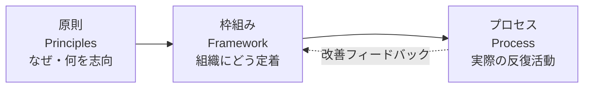

# ISO 31000(リスクマネジメント)

## 1. 概要

### A. 定義
> 組織が直面する**不確かさ(リスク)が目的の達成に及ぼす影響を体系的に管理**するための**原則(Principles)・枠組み(Framework)・プロセス(Process)** を提示する国際規格(ISO 31000:2018)。産業・規模・部門を問わず適用可能な汎用的な指針である。

ISO 31000 においてリスクは単なる「危険」ではなく、「**目的に対する不確かさの影響(effect of uncertainty on objectives)**」と定義される。この定義が重要なのは、リスクを損失をもたらす脅威(threat)としてだけでなく、成果を高めうる**機会(opportunity)** としても捉えさせるからである。すなわちリスクマネジメントは、悪い事態を防ぐ防御活動にとどまらず、不確かさの中で**価値を創造し保護する**経営活動へと格上げされる。

### B. 登場背景および必要性
かつて組織のリスクマネジメントは、財務・安全・情報セキュリティなど**部門ごとに分断(サイロ化)** されていた。その結果、同じリスクに重複して対応したり、部門の境界にまたがるリスクを誰も責任を負わない死角が生じたりした。また、リスク対応が事故が起きてからようやく行われる**事後対応**中心であったため、損失を拡大させた。ISO 31000 はこれを全社的に統合し、**戦略・意思決定のプロセスにリスクマネジメントを内在化**させることで、組織全体が一貫した基準で不確かさを扱えるようにすることを目指す。全社的リスクマネジメント(ERM)を導入しようとする組織に、国際的に通用する共通言語と骨格を提供するという点で必要性が大きい。

## 2. 3大構成要素

ISO 31000 の構造は、「**なぜ(原則) → どう定着させるか(枠組み) → 何を実行するか(プロセス)**」の三層構造として理解すると明確である。三つの要素は階層ではなく互いを支え合う関係であり、プロセスの実行結果が再び枠組みの改善へとフィードバックされる。

- **原則(Principles)**: リスクマネジメントが志向すべき価値と性質を規定する。核心は**価値の創造と保護**であり、そのためにマネジメントは**統合的・体系的・組織に合わせた(カスタマイズ)・包含的**でなければならず、利用可能な最善の情報に基づきつつ人的・文化的要因を考慮し、**継続的に改善**されなければならない。原則は「良いリスクマネジメントとは何か」の判断基準の役割を果たす。
- **枠組み(Framework)**: 原則を組織に実際に根づかせる支援体系であり、**リーダーシップおよびコミットメント(経営陣の関与)** を中心に置き、**統合→設計→実施→評価→改善**の PDCA サイクルで構成される。リスクマネジメントが一回限りのイベントではなく、ガバナンスに常時統合されるようにする。
- **プロセス(Process)**: 実務担当者が反復して遂行する活動であり、リスクアセスメントを中心に次の第3章で詳述する。

## 3. リスクマネジメントプロセス

プロセスは順次的な手順であると同時に、コミュニケーションとモニタリングが全過程を包み込み、必要に応じて前の段階へ戻る**反復的(iterative)** な構造を持つ。

- **適用範囲・状況・基準の確定(Scope, Context, Criteria)**: 管理対象の範囲を定め、組織の内外の状況(規制・市場・ステークホルダー・組織文化)を把握し、**どの水準のリスクを受容するか(リスク基準・許容水準)** を事前に定義する。この基準がなければ、以後の「評価」が主観的判断に左右される。
- **リスクアセスメント(Risk Assessment)**: 三段階に分かれる。**特定(Identification)** は目的を脅かしたり促進したりしうるリスクを漏れなく洗い出し、**分析(Analysis)** は各リスクの起こりやすさと影響を定性・定量的に推定し、**評価(Evaluation)** は分析結果を先に定めた基準と比較して対応の優先順位を決める。
- **リスク対応(Risk Treatment)**: 優先順位の高いリスクに対して、**回避(活動の中止)・低減(統制の強化)・移転(保険・アウトソーシング)・受容(保有)** の中から戦略を選択する。一つのリスクに複数の対応を組み合わせ、対応後に残る**残留リスク(residual risk)** を再評価する。
- **モニタリング・レビュー(Monitoring & Review)**: リスク環境は変化するため、統制の効果とリスク水準を継続的に監視・再評価する。
- **コミュニケーション・協議、記録・報告(Communication & Recording)**: 全段階にわたってステークホルダーと意思疎通し、根拠を文書化して説明責任と学習を確保する。

| 段階 | 中核活動 | 成果・基準 |
|---|---|---|
| 適用範囲・状況・基準の確定 | 状況分析、許容水準の定義 | リスク基準 |
| リスクアセスメント | 特定→分析→評価 | リスク等級・優先順位 |
| リスク対応 | 回避・低減・移転・受容 | 対応計画・残留リスク |
| モニタリング・レビュー | 常時監視・再評価 | 統制の有効性 |
| コミュニケーション・記録 | 意思疎通・文書化 | リスク台帳 |

## 4. 関連規格の比較

リスク関連の規格は目的と焦点が異なるため、相互に排他的ではなく補完的に併用される。ISO 31000 が**汎用的な骨格**を提供するとすれば、COSO ERM は米国系上場企業の財務報告・内部統制の文脈から出発して**戦略・パフォーマンスとの連携**を強調し、ISO 27005 はその骨格を**情報セキュリティ(ISMS)** 領域に特化して、資産・脅威・脆弱性に基づいて具体化する。すなわち情報セキュリティ組織は、27005 で詳細な方法を、31000 で全社的な整合性を合わせるという形で組み合わせる。

| 規格 | 焦点 | 性格 |
|---|---|---|
| **ISO 31000** | 汎用リスクマネジメント指針 | 非認証(ガイド) |
| **COSO ERM** | 全社リスク・戦略・内部統制 | フレームワーク |
| **ISO 27005** | 情報セキュリティリスクマネジメント | ISMS 特化 |

例えば、ある製造企業が新規スマートファクトリーを導入する際、ISO 31000 のプロセスで「設備の誤作動・サプライチェーンの途絶・サイバー侵害」のリスクを併せて特定しつつ、サイバー侵害の部分は ISO 27005 の資産・脅威分析で深掘りし、財務的影響は COSO ERM の観点から取締役会に報告するといった組み合わせが実務的である。

## 5. 考慮事項および示唆
- **認証ではなく指針**: ISO 31000 は認証取得のための要求事項規格ではなく**ガイド**であるため、組織の状況に合わせてテーラリング(tailoring)して適用しなければならず、形式的な文書化にとどまらないよう留意する。
- **ガバナンス・戦略との統合**: リスクマネジメントを別部門の業務としておくと失敗する。意思決定・予算・業績管理のプロセスの中に溶け込ませてこそ実効性が生まれる。
- **トレードオフ**: 統制を強化すればリスクは減るが、コスト・俊敏性が犠牲になる。許容水準を明確にし、過剰統制・過少統制の双方を避けるバランスが鍵である。
- **連携・展望**: ISMS(ISO 27001)・BCP・プロジェクトリスクマネジメント(PMBOK)と連携し、最近では**サプライチェーン・ESG・AI リスク**など新種の不確かさへと適用範囲が拡大している。

---

> **一言まとめ**: ISO 31000 は*原則・枠組み・プロセス*で構成される汎用リスクマネジメントの国際規格であり、状況・基準の確定→リスクアセスメント(特定・分析・評価)→対応→モニタリングの反復プロセスを通じて、不確かさを脅威であり機会でもあるものとして管理する全社的な骨格を提供する。
