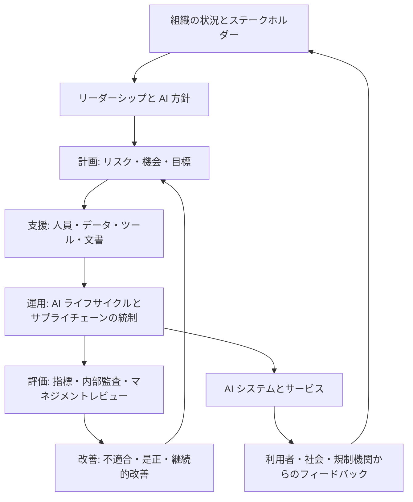
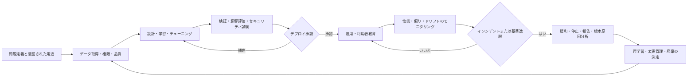

# ISO/IEC 42001:2023 AI マネジメントシステム(AIMS)

## 1. 概要

> **ISO/IEC 42001** は、組織が AI システムを責任をもって開発・提供・利用するために、AI マネジメントシステム(AIMS, Artificial Intelligence Management System)を確立し、実施し、維持し、継続的に改善することを求める国際規格である。

生成 AI と機械学習が顧客審査、医療支援、製造の品質検査、公共サービスなど組織の意思決定に組み込まれるにつれ、モデルの精度だけではシステムの品質を説明することが難しくなった。同じモデルであっても、どのようなデータを使用したか、誰が使用を承認したか、エラーが発生したときに停止できるかによって、実際のリスクと社会的影響は異なる。したがって、AI の技術的性能と組織の責任・手順・監督を併せて管理する体系が必要となる。

ISO/IEC 42001:2023 は、こうした要求に対応するマネジメントシステム規格である。特定のアルゴリズムや製品の性能基準を定める規格というよりも、組織の状況において AI に関するリスクと機会を特定し、方針、目標、プロセス、証跡を結びつける上位のガバナンス体系であるという点が核心である。組織は開発者だけでなく、購買部門、現業ユーザ、法務・個人情報・セキュリティ担当者までを含めて、AI のライフサイクル全体を管理しなければならない。

ISO の公式説明によれば、この規格は AI ベースの製品やサービスを開発・提供・利用する組織を対象とし、産業分野や組織規模を問わず適用できる。規格は2023年12月に発行された第1版であり、ISO/IEC JTC 1/SC 42 が担当している。したがって、大企業の自社モデルだけでなく、外部 API を呼び出す中小企業の業務プロセスも適用範囲に含まれうる。

## 2. 登場背景と必要性

### 2.1 AI リスクの組織的性格

従来のソフトウェアは要求事項とコードが比較的直接的に結びついているが、学習ベースの AI ではデータ分布と学習過程が結果に影響を与える。運用中にデータが変化すると精度が低下しうるし、平均精度が高くても特定の集団に不利なエラーが集中しうる。この問題はテスト段階での欠陥修正だけでは終わらず、デプロイ後のモニタリングと再学習の方針までを必要とする。

また、AI リスクは一つの部門に孤立しない。データ収集の適法性は個人情報と法務の問題であり、モデルの説明可能性は企画・UX の問題であり、提供者モデルの変更通知は調達と契約の問題である。運用者はモデルを自ら作っていなくても、その結果を用いて顧客に不利益を与えうる。AIMS は、この分散した責任を組織の方針と役割、意思決定の記録によって束ねる。

### 2.2 標準化が必要な理由

第一に、AI の利用状況を把握できなければならない。組織がどの部門でどのモデルとデータを使用しているかを知らなければ、リスクアセスメントやインシデント対応の出発点がない。第二に、責任ある利用の基準を業務目標と結びつけなければならない。公平性・透明性・安全性という原則を宣言するだけでは、承認基準と測定指標は生まれない。

第三に、サプライチェーンと第三者モデルを統制しなければならない。外部の LLM やクラウド AI を使用すると、モデルの内部をすべて検証することは難しいが、データ入力の禁止範囲、ログ保存、変更通知、インシデント報告、再委託条件などを契約と運用手順で管理することはできる。第四に、監査と改善が可能でなければならない。方針を作ったという事実よりも、実際にリスクを評価し是正処置を完了したという証拠が重要である。

## 3. AIMS の概念と全体構造

### 3.1 マネジメントシステムとしての AIMS

AIMS は、AI モデル一つを包む別個のセキュリティ製品ではない。組織の目的とステークホルダーを考慮して AI 関連の方針と目標を設定し、その目標を達成するプロセスを運用するマネジメントシステムである。したがって、モデルカードやデータシートのような技術文書も重要だが、承認権者・リスク受容基準・内部監査・マネジメントレビューといった管理要素も同等に重要である。

次の構造において、最も外側の組織の状況は適用範囲とリスク許容水準を決定する。その中でリーダーシップは方針と役割を付与し、計画段階はリスク・機会と目標を定める。実行段階ではデータ・モデル・運用の統制を実施し、点検段階では指標と監査によって結果を確認する。

### 3.2 PDCA と説明責任

ISO/IEC 42001 は、他のマネジメントシステム規格と同様に Plan-Do-Check-Act のサイクルを用いる。Plan では、AI の目的、ステークホルダー、リスク源、機会、目標と対応計画を定める。このとき組織は、何を自動化するかだけでなく、何を自動化しないかも決定しなければならない。

Do では、方針を実際のプロセスへと転換する。データの取得と品質管理、モデルの開発と検証、デプロイ承認、利用者教育、インシデント処理、外部供給者の管理がここに含まれる。Check では、モデル性能だけでなく、公平性、説明可能性、安全性、個人情報、セキュリティ、苦情とインシデントの傾向を定められた周期で確認する。

Act では、不適合の原因を分析し是正処置を実施する。単に問題のあるモデルを再学習するよりも、データの偏り、承認手順の欠落、モニタリング指標の不在といった根本原因を見つけることが重要である。改善結果は再びリスクアセスメントと目標に反映され、次のサイクルの基準となる。

### 3.3 主要なステークホルダーと役割

トップマネジメントは AI 方針と資源を承認し、組織のリスク受容水準を決定する。AI システムオーナーは、業務目的、利用範囲、停止基準と性能目標に責任を負う。データスチュワードは、データの出所、利用権限、品質、代表性と保存期間を管理する。

モデル開発者は、学習・検証の方法、ハイパーパラメータ、限界と再現手順を文書化する。セキュリティ・個人情報担当者は、攻撃、漏えい、目的外利用、再識別のリスクをレビューする。現業ユーザは、意図された用途と禁止された用途を遵守し、異常な結果を報告する。内部監査員は開発成果を評価する者ではなく、AIMS が要求事項どおりに運用されているかを独立して確認する。

これらの役割を一つの肩書に集中させると、利益相反が生じうる。モデルを開発したチームが自らのモデルを承認し性能を宣言すれば、リスクを過小評価する誘因が生まれる。規模の小さい組織では一人が複数の役割を兼ねることもありうるが、承認・検証・運用・監査の分離原則と代替レビュー担当者を文書に残すことが望ましい。

## 4. ISO/IEC 42001 の要求事項と管理策

### 4.1 箇条4〜10の流れ

ISO/IEC 42001 の本文は、組織の状況、リーダーシップ、計画、支援、運用、パフォーマンス評価、改善というマネジメントシステムの流れに従う。箇条4では、組織の内部・外部の状況とステークホルダーの要求を把握し、AIMS の適用範囲を定める。例えば、顧客相談用の LLM のみを対象とするのか、データセンターと外部 API を含む全社の AI 利用を対象とするのかを明確にしなければならない。

箇条5では、トップマネジメントの責任、AI 方針、役割と権限を定める。AI 方針は抽象的な倫理宣言にとどまらず、リスク報告、人間による監督、利用承認、法令遵守、継続的改善を含まなければならない。箇条6では、リスクと機会を評価し、AI 目標と変更計画を策定する。

箇条7は、資源、力量、認識、コミュニケーションと文書化した情報を扱う。モデルを購入する組織も、利用者の力量とデータ入力に関する教育を整備しなければならない。箇条8は AI リスクの対応とライフサイクルの運用を扱い、開発だけでなくデプロイ・利用・モニタリング・廃棄にまで範囲を拡張する。

箇条9のパフォーマンス評価は、運用指標、内部監査、マネジメントレビューで構成される。箇条10は、不適合と是正処置、継続的改善を求める。この構造は単発の AI 影響評価報告書を作成するアプローチとは異なり、反復可能な運用体系を構築するアプローチである。

| 区分 | 中核となる問い | 代表的な成果物 |
|---|---|---|
| 組織の状況 | どの AI をどの範囲で管理するか | 適用範囲、ステークホルダー一覧 |
| リーダーシップ | 誰が方針と責任を承認するか | AI 方針、RACI、委員会議事録 |
| 計画 | どのリスクをどの水準まで対応するか | リスクアセスメント書、目標、対応計画 |
| 支援 | 必要な力量・資源・文書は整っているか | 教育記録、資源一覧、文書管理台帳 |
| 運用 | ライフサイクルと外部供給者をどう統制するか | モデルカード、検証報告書、デプロイ承認 |
| パフォーマンス評価 | 目標と管理策は実際に機能しているか | KPI、内部監査、マネジメントレビュー |
| 改善 | エラーと不適合が再発しないようにしたか | インシデント記録、根本原因、是正処置 |

### 4.2 Annex A と Annex B の活用

Annex A は、AI 関連のリスクと組織の目標を扱うための参照管理目的と管理策を提供する。組織は自らの適用範囲とリスクアセスメントに基づいて必要な管理策を選択し、選択・除外の理由と実装状況を説明する適用宣言書(SoA, Statement of Applicability)の形で管理できる。すべての組織が同じ管理策を機械的に適用することが目的ではない。

管理策の領域は、AI 方針、内部組織、AI システムの資源、影響評価、AI ライフサイクル、AI のためのデータ、ステークホルダーへの情報、AI の利用、第三者および顧客との関係として理解できる。これらの領域を見れば、規格がモデルの精度だけを扱うのではなく、組織・データ・利用者・供給者までを管理していることがわかる。

Annex B は、管理策の実装のための手引として活用される。同じ管理策でも、採用選考 AI と工場設備の異常検知 AI とでは、文書と検証の深さが異なりうる。リスクの大きい領域ではより厳格な人間によるレビューと独立検証が必要であり、影響の小さい社内生産性ツールには比例的な管理策を適用できる。

Annex C は、組織の目標とリスク源を特定する際に考慮できる例を提供するものであり、すべての組織にそのまま適用される一覧ではない。Annex D は、規格の適用の文脈を理解するための補足情報を提供する。したがって、本文の要求事項、リスクアセスメント、組織の法的義務を優先し、附属書の一覧をチェックリストとしてのみ使用してはならない。

### 4.3 AI 影響評価とリスク対応

AI のリスクアセスメントは、単なる確率の掛け算表ではない。まずシステムの意図された目的と禁止された目的を定義し、影響を受ける個人・集団・組織・社会とステークホルダーを特定する。次に、偏り、不正確さ、説明不足、個人情報侵害、セキュリティ攻撃、安全上の失敗、過度な依存、環境・社会的影響の可能性と結果をレビューする。

影響評価はリスクアセスメントと関連するが、同じ文書に混ぜ込まないほうがよい。リスクアセスメントは組織が統制すべき事象の起こりやすさと結果に焦点を当て、影響評価は AI の決定や出力が人と社会にもたらす変化を見る。例えば、信用評価モデルの誤分類はシステムリスクであると同時に、特定集団の金融アクセスに影響を与える社会的影響でもある。

リスク対応の選択肢は、回避、低減、移転・共有、受容に区分できる。リスクが受容水準を超えれば、利用停止や人間による承認で回避し、学習データの改善・閾値の調整・モニタリングで低減する。外部供給者との契約によって一部の責任を配分することはできるが、契約だけで組織の最終責任が消えるわけではない。

### 4.4 AI ライフサイクルと証跡

問題定義の段階では、自動化の目的と意思決定の主体を明確にする。データの段階では、出所、同意・利用権限、代表性、ラベル品質、欠損値と外れ値、保存・廃棄を記録する。学習の段階では、コード・モデル・データセットのバージョンを結びつけ、結果を再現できなければならない。

検証の段階では、全体の平均性能だけでなく、重要なサブグループ別のエラー、閾値の変化、敵対的入力、プロンプトインジェクション、個人情報の露出、説明の適切性を試験する。デプロイ承認には、モデルのバージョン、承認者、適用範囲、ロールバック手順、人間の介入条件を含める。運用中は、データドリフトとコンセプトドリフトを区別してモニタリングしなければならない。

インシデント発生時には、結果を削除するよりも、時系列のイベントログと入力・出力・モデルバージョンを保存することが先である。その後、影響を受けた対象と規制当局・顧客への報告の必要性を判断し、一時的な遮断と再発防止策を分けて管理する。廃棄の際には、モデルだけでなく、キャッシュ、埋め込み、派生データ、アクセス権限と契約上の保存義務までを確認しなければならない。

| ライフサイクル段階 | 主なリスク | 管理策と証跡の例 |
|---|---|---|
| 企画 | 目的の不明確さ、過度な自動化 | ユースケース仕様、禁止用途、影響を受ける集団の一覧 |
| データ | 偏り、違法な収集、品質低下 | データシート、出所・権限、品質指標、代表性分析 |
| 開発 | 再現不能、脆弱なモデル、過学習 | 実験追跡、コード・モデルのバージョン、セキュリティ試験報告書 |
| 検証 | サブグループのエラー、説明不足 | 公平性・性能検証、独立レビュー、承認記録 |
| デプロイ | 過信、設定ミス | 変更管理、ロールバックテスト、利用者教育 |
| 運用 | ドリフト、情報漏えい、誤用・濫用 | モニタリングダッシュボード、アクセスログ、インシデントプレイブック |
| 廃棄 | 残存データと権限 | 保存・削除の証跡、鍵の廃棄、供給者との契約終了の確認 |

## 5. 類似フレームワークとの比較

ISO/IEC 42001 は、組織が監査可能なマネジメントシステムを運用していることを示すことに焦点がある。NIST AI RMF は、AI の信頼性に関するリスクを自主的に管理できるよう案内するリスクマネジメントフレームワークであり、ISO/IEC 23894 は AI に関するリスクマネジメントの指針である。ISO/IEC 27001 は情報セキュリティマネジメントシステムであるため、AI が処理する情報とインフラのセキュリティには強いが、AI の意図された用途・影響評価・モデルライフサイクル全体を直接置き換えるものではない。

この違いを理解せずに ISO 27001 認証だけで AI ガバナンスが完成したと判断すると、モデルの偏りや不適切な自動化といったリスクが残る。逆に AIMS を独立した島として構築すると、セキュリティ・個人情報・品質管理と重複する文書が増える。既存の ISMS、個人情報影響評価、ソフトウェア開発ライフサイクルと共通のリスクレジスタを連携させる統合設計が効率的である。

| 基準 | 性格 | 中心となる問い | 活用方式 |
|---|---|---|---|
| ISO/IEC 42001 | AI マネジメントシステム規格 | 組織は AI を責任をもって管理する体系を備えているか | 方針・リスク・運用・監査・改善、認証可能 |
| NIST AI RMF | 自主的なリスクマネジメントフレームワーク | AI リスクをどのようにガバナンス・特定・測定・管理するか | リスクマネジメント活動と実務指針の補完 |
| ISO/IEC 23894 | AI リスクマネジメント指針 | AI 特有のリスクをどのように特定・対応するか | リスクアセスメント手法と管理策設計の参考 |
| ISO/IEC 27001 | 情報セキュリティマネジメントシステム | 情報の機密性・完全性・可用性をどう守るか | AI のデータ・インフラ・アクセス制御の補完 |
| 個人情報影響評価 | 個人情報保護の手続き | 個人情報処理による権利侵害をどう減らすか | 個人情報を処理する AI の法的・権利上の影響レビュー |

NIST AI RMF の Govern、Map、Measure、Manage といった活動を AIMS のリスクアセスメント・運用・パフォーマンス評価にマッピングすると、実務者にとって理解しやすくなる。ただし、フレームワークの用語をそのままコピーするよりも、組織の AI 一覧とリスク受容基準に合わせて責任者と証跡を定めなければならない。規格間の関係は優劣ではなく、目的と適用の深さの違いとして理解すべきである。

## 6. 適用事例

### 6.1 金融機関の信用評価支援モデル

銀行が融資審査担当者の判断を支援するモデルを導入すると仮定する。まず、意図された用途を審査担当者への参考資料の提供と定義し、モデルが単独で承認・拒否できないよう業務ルールを設ける。適用範囲には、学習データ、モデル API、審査画面、外部データ供給者、顧客の異議申立て手続きを含める。

データスチュワードは、所得・取引・代替情報の出所と利用権限を記録し、特定の地域や年齢層が過小代表されていないかを確認する。検証チームは、全体の AUC だけでなく、集団別の偽陽性・偽陰性の比率と閾値の変化による影響を評価する。審査担当者は推奨結果の根拠と限界を見て最終決定を下し、異議申立てと再審査の経路を提供する。

運用段階では、承認率の急変、サブグループ別のエラー、入力分布の変化、苦情の増加をモニタリングする。閾値やデータ供給者が変更されれば、再検証と再承認を経る。この事例の核心は、公平性指標を一つ満たすことではなく、目的・人間による監督・説明・異議申立て・変更管理のつながりを証明することである。

### 6.2 生成 AI による顧客相談サービス

コールセンターが外部の LLM API で相談の下書きを生成する場合、相談者の氏名・住民登録番号・契約情報がモデル提供者に渡されるかどうかをまず確認する。入力のマスキングと保存期間、学習への再利用禁止の有無、地域別の保存場所、障害時の代替手順を、契約と技術設定によって管理する。

意図された用途はオペレータ支援に限定し、法的判断・返金の確定・医療アドバイスのようにリスクの高い回答は自動送信しないようにする。検索拡張生成を適用する場合は、根拠文書のバージョンと権限を確認し、モデルが出典のない回答を生成したときにオペレータが容易に発見できるよう画面を設計する。

運用指標には、平均処理時間だけでなく、誤回答率、根拠リンクの欠落率、個人情報の含有率、オペレータによる修正率、顧客の不満とインシデント件数を含める。プロンプトインジェクション、悪意のある文書、機微情報の再現、システムプロンプトの露出に関する試験を定期的に実施する。この事例は、AI を購入して利用する組織も AIMS の主体となることを示している。

## 7. 構築ロードマップと監査対応

第一段階は全社の AI インベントリである。開発中のモデル、運用中のモデル、SaaS の機能、個人が使用する外部 LLM、データパイプラインを調査し、オーナーと業務目的を結びつける。発見されていないシャドー AI はリスクアセスメントから漏れるため、ネットワーク一覧・購買記録・費用請求・アンケートを突き合わせて検証する。

第二段階は、適用範囲とリスク等級を定めることである。人の権利・安全・金融・雇用に及ぼす影響、自動化の水準、データの機微性、供給者への依存度を考慮してリスク等級を付与する。等級が高いほど、独立検証、人間による承認、より短いモニタリング周期と強力なインシデント対応を適用する。

第三段階は、既存の管理体系との統合である。ISMS のアクセス制御・インシデント対応、個人情報保護体系の処理目的・保有期間、品質管理の不適合・是正処置、DevOps のデプロイ・変更記録を AIMS の証跡として再利用する。重複した様式を作るよりも、一つのシステム ID とモデルバージョンを複数の管理目的にマッピングする。

第四段階は、中核となる高リスク事例での試行運用である。方針を一度に全社適用するよりも、代表的なモデルの影響評価、データシート、検証、承認、モニタリング、インシデント訓練を最後までやり遂げる。試行結果から役割の衝突と欠落している指標を確認した後、適用範囲を広げる。

第五段階は、内部監査とマネジメントレビューである。監査員は文書が存在するかだけでなく、サンプルモデルのバージョンと運用ログが一致しているか、インシデント時に停止が実際に可能か、目標未達時の措置が完了しているかを確認する。マネジメントレビューでは、モデルの精度だけを報告するのではなく、リスクの傾向、規制の変化、供給者の変更、残留リスクと資源不足を併せて扱う。

| 段階 | 主な活動 | 合格基準 |
|---|---|---|
| 1. 調査 | AI インベントリとオーナーの特定 | 未承認の利用まで一覧化 |
| 2. 設計 | 適用範囲・方針・役割・リスク基準の策定 | 責任者と意思決定権が明確 |
| 3. 試行 | 代表的な AI のライフサイクル全体の統制 | 証跡と運用ログが結びついている |
| 4. 展開 | テンプレート・教育・サプライチェーンへの適用 | 部門間のばらつきとシャドー AI の減少 |
| 5. 検証 | 内部監査・マネジメントレビュー・模擬インシデント | 不適合の是正と再発防止を確認 |
| 6. 改善 | 指標の再設計・範囲の調整・再評価 | リスクの変化が次の計画に反映される |

監査の証跡は、方針文書一つでは不十分である。AI 一覧、適用範囲、ステークホルダーの要求事項、リスクアセスメント、影響評価、SoA、データの出所、モデルカード、検証報告書、デプロイ承認、教育記録、モニタリング結果、インシデント・是正処置とマネジメントレビューの議事録を相互に結びつけなければならない。監査員が特定のモデルを選んだとき、企画から運用まで追跡できなければならない。

## 8. 深掘り:最新動向と出題との連携

ISO の公式ページは、ISO/IEC 42001 を AI マネジメントシステム規格として説明し、AI に関するリスクと機会を組織レベルで管理し PDCA で継続的に改善するよう案内している。これは、AI 倫理原則を宣言する水準から脱し、目標・プロセス・パフォーマンス評価・改善のマネジメント体系へと転換しようとする流れを示している。

NIST AI RMF 1.0 は2023年1月に公開された自主的なフレームワークであり、2024年7月には生成 AI に特化したプロファイルが公開された。したがって答案では、ISO/IEC 42001 を認証可能なマネジメントシステムの観点として、NIST AI RMF をリスクマネジメント実務の観点として区別すると、比較の正確性が高まる。

過去問型の問題では、「AI ガバナンスの構築方策」「信頼できる AI の組織的管理」「生成 AI 導入時のリスクマネジメント」と組み合わされうる。答案は、定義と登場背景だけを書いた後に原則を羅列する方式よりも、① 組織の状況と範囲、② 方針・役割、③ リスク・影響評価、④ ライフサイクル・データ・サプライチェーンの統制、⑤ パフォーマンス評価・改善、⑥ 技術士の観点からの統合ロードマップ、の順で展開するほうが説得力がある。

特に「AI システムの精度を高めれば責任ある AI になるのか」という問いには、そうではないと答えなければならない。精度は必要な指標の一つだが、公平性、説明可能性、安全性、個人情報、セキュリティ、人間による監督、異議申立て、追跡性のバランスが必要である。リスクベースの比例性に基づいて指標と管理策を選択し、すべての組織に同じ閾値を強制しないという点も併せて提示すべきである。

## 9. 考慮事項および示唆

### 9.1 リスクベースの比例性

すべての AI に同一の審査と文書負担を課すと、現業部門が統制を迂回したりイノベーションが遅延したりする。逆に、影響の大きいシステムを単なる生産性ツールと同じ方式で扱えば、権利と安全を保護できない。自動化の水準、影響を受ける対象、元に戻せる程度、データの機微性と供給者への依存度を基準として、統制の強度に差をつけなければならない。

### 9.2 責任ある人間による監督

人間が画面を見ているという事実だけでは、人間による監督は成立しない。監督者はモデルの限界と不確実性を理解し、結果を拒否・修正・停止する権限と時間を持たなければならない。業務量が過大ですべての推奨を自動承認しているのであれば、それは形式的な監督にすぎないため、実際の介入率と再審査の結果を指標として管理しなければならない。

### 9.3 データとモデルの追跡性

データセットのバージョン、ラベル基準、コード、モデル、プロンプト、外部 API のバージョンとデプロイ設定が結びついていなければ、インシデントの原因を説明できない。モデルレジストリとデータカタログを統合し、再現可能な実験追跡と変更承認の手続きを運用しなければならない。ただし、すべての元データを無期限に保管することは個人情報とコストの新たなリスクとなるため、保存の目的と期間を併せて設計する。

### 9.4 サプライチェーンと契約

外部モデルを使用する場合、契約書にデータの学習再利用の有無、保存場所、保存期間、下位処理者、セキュリティインシデントの通知、モデル変更の通知、サービス終了とデータの返却・削除を明記しなければならない。供給者の認証書だけで、組織の利用文脈におけるリスクが解消されるわけではない。実際の入力・出力と利用者権限を組織が統制できるかを別途検証しなければならない。

### 9.5 セキュリティ・個人情報・安全の統合

プロンプトインジェクションとデータ漏えいはセキュリティの問題であると同時に、AI システムの信頼性と業務上の安全の問題でもある。個人情報の最小化、アクセス制御、暗号化、出力フィルタ、サンドボックス、モデル・データの完全性検証をライフサイクルに配置し、インシデント対応体系と結びつけなければならない。医療・製造・交通のように安全が重要な分野では、情報セキュリティインシデントだけでなく、誤った制御と物理的被害までをシナリオに含める。

### 9.6 成果指標のバランス

処理時間とコスト削減だけを KPI とすると、現業部門は不正確な出力を素早く使う方向へ最適化されうる。品質・公平性・苦情・インシデント・再審査・ドリフト・エネルギー使用量を業務成果とともに測定しなければならない。指標間で衝突が発生したときにどのリスクを優先するかを経営陣が事前に定めて記録しておくことが、AIMS の実効性を高める。

### 9.7 継続的改善と組織文化

AI は、データと業務の文脈の変化に応じてリスクが変わる。認証取得日や初回デプロイ日を統制の終点とせず、定期的な再評価・インシデントからの学習・利用者のフィードバック・規制のモニタリングを計画に反映しなければならない。懸念を申告した従業員や顧客を不利益なく保護する文化があってこそ、異常の兆候が早期に発見される。

## 参考資料

- ISO, “ISO/IEC 42001:2023 — AI management systems”, https://www.iso.org/standard/42001
- NIST, “AI Risk Management Framework”, https://www.nist.gov/itl/ai-risk-management-framework
- ISO, “ISO/IEC 23894:2023 — Guidance on risk management”, https://www.iso.org/standard/77304.html

---

> **一言まとめ**: ISO/IEC 42001 は AI モデルそのものの性能だけを評価する規格ではなく、組織の状況・方針・リスク・影響・ライフサイクル・サプライチェーン・パフォーマンス評価を PDCA で結びつけ、責任ある AI を継続的に運用させるマネジメントシステムである。
