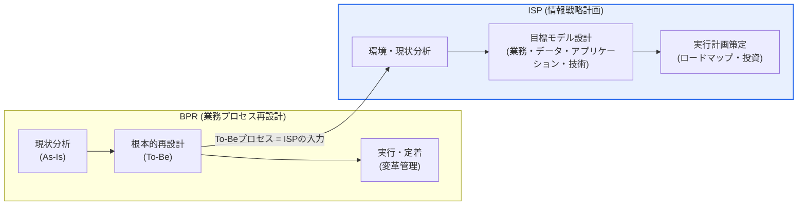
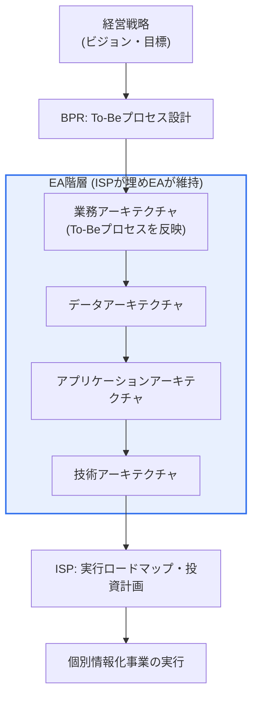

# ISPとBPRの比較および相互補完的活用

## 1. 概要

### A. 定義
> **ISP(Information Strategic Planning、情報戦略計画)** は経営戦略に適合するよう組織の情報化目標・課題・実行計画を策定する活動であり、**BPR(Business Process Reengineering、業務プロセス再設計)** は業務プロセスを根本的に再設計し、コスト・品質・サービス・スピードにおいて劇的(dramatic)な改善を追求する経営革新手法である。

両手法を正しく理解する鍵は「**出発点と対象が異なる**」という点にある。BPRはマイケル・ハマー(M. Hammer)とジェームズ・チャンピー(J. Champy)が1990年代初頭に提唱した概念であり、「**我々の仕事のやり方(プロセス)をいかに根本的に革新するか**」という業務の観点から出発する。中心的な問いは「漸進的改善」ではなく「白紙から考え直すこと(fundamental rethinking)」である。既存の手順を少し速くする程度ではなく、「この仕事そのものをなくせないか、まったく新しい方法で行えないか」を原点から問う。

一方ISPは「**その業務を支援する情報システムをいかに構築・運用するか**」という情報化の観点から出発し、組織全体の情報化の青写真(マスタープラン)を描く。経営戦略を情報化戦略へと翻訳し、それに必要な業務・データ・アプリケーション・技術アーキテクチャと実行ロードマップを導出する。そのため論理的な順序としては、BPRで将来プロセス(To-Be)を先に再設計し、ISPでそれを支える情報化計画を立てるのが自然である。順序が逆転し、古いプロセスをそのままにして情報化だけを進めると、いわゆる「**古い業務の電算化(paving the cow paths)**」にとどまり、投資効果は半減する。

### B. 登場背景および必要性
両手法が生まれた時代的文脈をたどると、その性格がより明確になる。BPRは1990年代初頭、グローバル化と競争激化の中で漸進的改善(TQMなど)だけでは生き残りが難しいという危機意識から生まれ、ISPは情報化投資が急増しているにもかかわらず個別システムが乱立して無駄が拡大していた現実への対応として定着した。前者は「業務の危機」に、後者は「情報化の無秩序」にそれぞれ応えたものである。

BPRとISPは別々に登場したものの、結局は連携せざるを得なかったことには背景がある。1990年代の企業は情報技術に莫大な投資をしながら生産性が向上しない「**生産性のパラドックス(productivity paradox)**」を経験した。その原因の相当部分は、技術は新しいものを導入したものの、その技術が支援する業務手順は数十年前の古いものをそのまま残していた点にあった。BPRはこの問題に対し「技術導入の前にまずプロセスを根本から変えよ」と答えた。

一方、情報化投資が大きくなるほど、個別システムを散発的に構築する方式の限界が明らかになった。部署ごとに別々に作られたシステムが相互に連携せず、データが重複・不整合となるサイロ(silo)問題が深刻化した。ISPは「個別システムを作る前に全社レベルの情報化の見取り図をまず描け」と答えた。結局、両手法はそれぞれ「業務の根本的革新」と「情報化の全社的整合」という異なる問題を解くが、実際のプロジェクトでは将来の業務とそれを支援する情報システムを共に設計しなければならないため、連携が不可欠となる。

### C. 両手法の性格の違い
要するに、BPRは「**何を・どのように働くか(業務)**」を、ISPは「**その仕事を何で支援するか(情報システム)**」を扱う。BPRの成果物が改善された業務フロー(To-Beプロセス)であるならば、ISPの成果物は情報化マスタープランとアーキテクチャである。この性格の違いが、以降の手順・範囲・成果物の違いをすべて生み出す。

言い換えれば、BPRは「**変化(革新)**」に、ISPは「**整合(設計)**」に重心がある。この強調点の違いが、両手法を相反するものではなく補完関係にする。革新された業務を情報システムが支え、整合された情報システムが再び業務革新を持続可能にするという好循環が理想の姿である。

## 2. 実施手順の比較

まず両手法の進行の流れとその接点を俯瞰する。以下はBPRとISPの手順を並べ、BPRの結果がISPの入力へとつながる連結を表した全体構造図である。

BPRは現行プロセスを分析してボトルネックと無駄を診断し、顧客価値の観点から理想的な将来プロセスを設計した後、組織に定着させる。この際の核心はAs-Isに縛られないことである。現状を過度に詳細に分析するとその枠に閉じ込められて「改善」にとどまりやすいため、BPRはAs-Isを問題診断の最小限にのみ活用し、To-Be設計に重点を置く。

ISPは経営戦略と内外の環境(市場・技術動向、現行情報システムの水準)を分析して情報化目標モデルを設計し、段階別の実行ロードマップと投資計画を作成する。両手法はいずれも「As-Is分析 → To-Be設計 → 実行」という大枠を共有するが、BPRのTo-Beが「業務フロー」であるのに対し、ISPのTo-Beは「情報システム構造(アーキテクチャ)」であるという点が決定的に異なる。この違いゆえに、BPRのTo-BeがISPの自然な入力となる。

ここで「As-Is分析の深さ」を両手法で異なる扱いにすべきという点が、実務上の微妙なところである。BPRはAs-Isに長くとどまるほど既存の枠に思考が閉じ込められ急進的な再設計が難しくなるため、現状分析を問題診断に必要な最小限に抑える。一方ISPは、現行の情報システム・データの状態を比較的詳細に把握してこそ正確な実行ロードマップと投資規模を算定できるため、As-Is分析の比重が相対的に大きい。同じ「As-Is分析」でも、BPRでは「脱却するための分析」、ISPでは「継承するための分析」という性格の違いがあるわけである。

| 区分 | ISP | BPR |
|---|---|---|
| **焦点** | 情報化戦略・システムの青写真 | 業務プロセスの根本的革新 |
| **観点** | IT・情報システムの観点 | 業務・顧客価値の観点 |
| **範囲** | 全社情報システム | 業務・組織・職務全般 |
| **手順** | 環境分析 → 目標モデル → 実行計画 | 現状分析 → 根本的再設計 → 実行 |
| **主な成果物** | 情報化マスタープラン・アーキテクチャ・ロードマップ | 改善されたTo-Beプロセス・組織設計 |
| **性格** | 計画策定中心(整合・設計) | 根本的革新中心(破壊的再設計) |
| **改善幅** | 体系的・漸進的な整合 | 飛躍的(dramatic)改善を志向 |

## 3. 各手法の構成要素と中核原理

### A. BPRの中核原理と技法
BPRを表だけで理解すると「プロセス改善」との区別が曖昧になる。BPRのアイデンティティは4つのキーワード — **根本的(fundamental)・急進的(radical)・劇的(dramatic)・プロセス(process)** — にある。「根本的」とは当然視されてきた規則や前提を疑うことであり、「急進的」とは表面を手直しするのではなく根本から新たに設計することであり、「劇的」とは10〜20%ではなく数倍の成果向上を目標とするという意味であり、「プロセス」とは部署・機能ではなく顧客価値を生み出す仕事の流れを単位として捉えるという意味である。

実務上の技法としては、複数段階に分断された手順を一つに統合し、逐次処理を並列処理に変え、意思決定権限を実務担当者に委譲(empowerment)して承認段階を減らし、情報技術によって物理的な移動・仲介を排除する方式が用いられる。例えば、受注-生産-配送が部署ごとに分断されて数日かかっていたプロセスを、一つの統合プロセスと担当者(case manager)に再設計し、処理時間を大幅に短縮するといった具合である。

BPRが失敗する典型は、「革新」を掲げながら実際には既存の組織・権限に手を付けられず、手順を少し手直しするだけの場合である。根本的再設計は必然的に組織・職務・評価体系の変化を伴うため、後述する最高経営層の後援と変革管理が成否を分ける。

ここで情報技術は単なる支援ツールではなく、再設計の「**実現要因(enabler)**」として機能するという点が重要である。例えば共有データベースは「情報は一か所にしか存在できない」という前提を打ち破り、複数の部署が同時に同じ情報を活用できるようにし、通信・ワークフロー技術は「専門家がいなければ処理できない」という前提を打ち破り、一般の担当者でも専門業務を遂行できるようにする。このように技術が切り開く新たな可能性を前提にプロセスを再構想することがBPRの真髄であり、まさにこの地点でBPRは自然にISP・情報化とかみ合う。

### B. ISPの成果物とアーキテクチャ
ISPの成果物は大きく4階層のアーキテクチャに整理される。**業務(ビジネス)アーキテクチャ**は組織が遂行する業務の構造を、**データアーキテクチャ**は管理すべき情報とその関係を、**アプリケーションアーキテクチャ**は業務を支援するシステム機能を、**技術アーキテクチャ**はそれを稼働させるインフラ・標準を規定する。この4階層は相互に整合しなければならず、上位(業務)から下位(技術)へと根拠が流れなければならない。

ISPの価値は、個別システムの構築計画を超えて**全社的な整合性**を確保することにある。部署ごとに散らばった要求を全社目標モデルの中に配置し、優先順位・投資・日程を盛り込んだ実行ロードマップとしてまとめ、「何をいつどの順序で構築するか」を決める。これらの成果物がその後の個別情報化事業のベースライン(baseline)の役割を果たす。

優先順位の決定はISPにおいて特に重要な成果物である。資源は有限であるためすべての課題を同時に推進することはできず、各情報化課題を「経営への貢献度(効果)」と「実装の容易性・緊急性」などの軸で評価し、段階的に配置しなければならない。この過程で、先行・後行の依存関係(例:データ標準化が先行しなければ統合分析は不可能)を考慮した実行順序を定める。優先順位が根拠なく決められると、政治的に力の強い部署の課題が先行して全社最適が損なわれるため、客観的な評価基準を設けることがISPの重要成功要因の一つである。

ISPはしばしば**EA(Enterprise Architecture、エンタープライズアーキテクチャ)** と結合される。ISPが特定時点の情報化計画を立てるプロジェクト型の活動であるのに対し、EAはビジネス–情報–アプリケーション–技術の階層を継続的に管理する常設の体系である。ISPで描いた目標モデルをEAで維持・更新すれば、計画が一過性の文書で終わらず、組織の生きた整合性管理ツールとなる。

### C. 両手法に共通する成功要因と失敗要因
BPRとISPは対象が異なるものの、大規模な変革プロジェクトであるという共通点ゆえに、成功・失敗要因もかなりの部分が重なる。共通の成功要因の第一は**経営戦略との整合**である。プロセス再設計であれ情報化計画であれ、経営目標から根拠が導出されなければ方向を見失う。第二は**現場の参画**である。実際に仕事をする人と情報を使う人が設計に深く参画してこそ、現実性のあるTo-Beが生まれる。第三は**明確な成果指標(KPI)** であり、改善前後をコスト・時間・品質などの数値で測定できてこそ革新の効果が立証され、次の投資が正当化される。

共通の失敗要因も明確である。最も多いのは「**分析麻痺(analysis paralysis)**」— As-Isを過度に詳細に分析してTo-Be設計へと進めないことである。次は「**計画と実行の断絶**」であり、優れた文書を作成しても後続の事業・組織変革につながらない場合である。ISPのマスタープランが引き出しの中の文書として残ったり、BPRの再設計案が組織の抵抗に阻まれて実行されなかったりするのが代表的である。これらの失敗要因は、後述する変革管理とガバナンスによって防御しなければならない。

## 4. 相互補完的活用方策

BPRとISPは競合関係ではなく、互いを必要とする。最も効果的な方式は、**BPRで導出したTo-BeプロセスをISPの入力とし、これをEAの階層構造で整合させる**ことである。以下は、両手法がEAの階層上でどのようにかみ合うかを示す詳細アーキテクチャ図である。

流れをたどると、経営戦略から出発してBPRが将来の業務の姿を定義し、そのTo-Beプロセスが業務アーキテクチャとなってデータ・アプリケーション・技術アーキテクチャへと具体化され、最後にISPの実行ロードマップと投資計画として整理されて個別事業として実行される。こうすることで情報化投資が実際の業務革新を支援する方向に整合され、古い業務を電算化する誤りを避けることができる。

代表的な3つの連携方式を整理すると次のとおりである。第一に、**逐次連携(BPR → ISP)** は、プロセスを先に革新しその要求を情報化計画に反映する定石的な方式である。第二に、**統合実施(BPR/ISP並行)** は、時間的制約が大きい場合や業務と情報化が強く絡み合う場合に、両活動を一つのプロジェクトとして同時に進める方式であり、相互フィードバックは速いが管理の複雑度が高い。第三に、**EAに基づく常時整合**は、一過性のプロジェクトを超えて階層間の整合性を継続的に維持する方式である。

連携を実行する際によく犯す誤りは、BPRのTo-Beを「理想論」としてのみ描き、ISPで実装上の制約に遅れて直面することである。例えば、プロセス上はリアルタイムの統合処理を前提としたが、データ・技術アーキテクチャがそれを支えられなければ、再設計案は現実には機能しない。したがって成熟した組織は、BPR段階から情報化の可能性を併せて検討し、ISP段階で確認された技術的制約をプロセス設計にフィードバックする**双方向フィードバック**を設ける。逐次連携であっても完全な一方向ではなく、接点で反復的に調整するのが実務の定石である。

| 活用方策 | 内容 | 適合する状況 |
|---|---|---|
| **BPR → ISP 逐次連携** | To-BeプロセスをISPの要求・目標モデルに反映 | プロセス革新が明確に先行する場合 |
| **BPR/ISP 統合実施** | プロセス革新・情報化計画を同時進行 | 日程の圧迫・業務と情報化の結合度が高い場合 |
| **EAに基づく整合** | ビジネス–情報–アプリケーション–技術階層の整合性を常時維持 | 大規模・継続的な情報化ガバナンスが必要な場合 |

どの方式を選ぶにせよ、連携の成否は「要求の追跡可能性(traceability)」にかかっている。BPRが定義した各To-Beプロセスがどのようなデータ・機能・システム要求につながり、それがISPのどのアプリケーション・技術アーキテクチャ項目と実行課題として実現されるかを最後まで追跡できなければならない。追跡可能性が途切れると、情報化事業が進むにつれて当初の業務革新の意図から離れ、再び「技術は技術、業務は業務」のサイロへ回帰しやすい。EAの階層モデルと要求マトリクスが、この追跡可能性を担保する実用的なツールとなる。

## 5. 比較および実務事例

両手法の違いが実際の成果でどのように分かれるかは、事例で確認できる。BPRの古典的事例として引用されるフォード(Ford)の購買-代金支払プロセスの再設計は、請求書(invoice)照合中心の手順をデータベースに基づく自動照合方式へと根本的に再設計し、関連人員を大幅に削減したとされている(具体的な数値は資料によって差があるため、「数百人規模の人員を大きく削減」した事例として一般化するのが安全である)。核心は「請求書なし(invoiceless)処理」という発想の転換であり、手順の短縮ではなく手順そのものをなくしたことが劇的な成果を生んだという点である。

逆に、プロセス革新なしに情報化だけを先行させたプロジェクトが失敗するパターンも多い。多くの統合基幹業務システム(ERP)導入の失敗がこれに該当する。標準プロセスを備えたERPを導入しながら、既存の非効率な業務手順をそのままカスタマイズで移植すると、コストは大きく増え効果は低くなる。この場合、ERP導入前にBPRで業務を標準化・簡素化し、ISPでシステムの青写真を整合させた組織のほうがはるかに高い成果を上げる。つまり成否の分かれ目は「技術導入の瞬間」ではなく「プロセスを先に変えたか」にある。

ERP導入時によく引用される原則が「**ベストプラクティスの受容**」である。これはパッケージにすでに組み込まれている検証済みの標準プロセスを可能な限りそのまま受け入れ、組織の業務をそれに合わせて変えよというものである。この原則自体が事実上BPRの一形態であり、カスタマイズを最小化するには、導入前に業務を標準に合わせて再設計するBPRとシステム範囲を定めるISPが先行しなければならない。逆に組織の古い手順を守るためにパッケージを過度に修正すると、保守コストが雪だるま式に膨らみ、将来のバージョンアップも難しくなる。これもまた「プロセス革新が情報化に先行すべきである」という原則を実証している。

公共部門でも情報化事業の前にISPを義務化または推奨する理由がここにある。大規模な予算が投入される事業ほど、個別システムを構築する前に全社目標モデルと実行ロードマップを先に確定しなければ、重複投資と連携失敗を防げないためである。

事例が共通して示唆するのは「情報技術は手段であって目的ではない」という原則である。フォードの事例で成果を生んだのは最新技術そのものではなく「請求書照合」という古い規則を廃棄した発想であり、ERP失敗事例で問題を引き起こしたのは技術の不足ではなく古いプロセスをそのまま移した慣性であった。すなわち、BPRが「何をなくすか」を問い、ISPが「何で支援するか」を定めた後、その順序どおりに実行したときに初めて投資が成果に結びつく。逆にこの順序を飛ばせば、技術投資は増えても成果は伴わない生産性のパラドックスが再現される。

## 6. 深化:DX時代の変化と予想出題方向

近年、両手法はデジタルトランスフォーメーション(DX)戦略と結合して進化している。かつてのBPRが内部効率(コスト・スピード)中心であったとすれば、今日のプロセス革新は**顧客体験(CX)・データに基づく意思決定・プラットフォーム化**を併せて狙う。プロセスの自動化も、人が手順を変えることを超えて、RPA(ロボティック・プロセス・オートメーション)と人工知能によって判断まで自動化する方向へと拡張している。これに伴い近年では、プロセスを発掘・分析する**プロセスマイニング(process mining)** 技法がAs-Is診断の精度を大きく高め、BPRの科学化を後押ししている。

ISPもまた、伝統的な「5か年情報化計画」の形態を超え、クラウド・データ・人工知能を前提とした**デジタル戦略策定(ISP/DX)** へと拡張し、EA・クラウド導入戦略と統合される傾向にある。計画の周期も、長く重い文書から反復的に更新されるアジャイルなロードマップへと移行しつつある。クラウド時代には「何を自社構築し何をサービスとして利用するか」というソーシング戦略がISPの中核的な意思決定として浮上し、データが戦略資産となるにつれてデータアーキテクチャとガバナンスの比重も大きくなった。

出題の観点からは、① ISPとBPRの**概念・手順・成果物の比較**、② **相互補完(連携)方策**とその順序の根拠、③ EA・DXとの**連携**を問う形が繰り返し出題される。答案では単なる項目の羅列を超え、「なぜBPRがISPに先行すべきなのか」「統合実施と逐次実施のトレードオフは何か」まで説明してこそ差別化が生まれる。連携・類似テーマとしては、EA/TOGAF、ERP、デジタルトランスフォーメーション、プロセスマイニング、変革管理(change management)がある。

答案構成戦略の面では、概要で両手法の観点の違い(業務 vs 情報システム)を明確に対比させ、本文中盤に手順・成果物の比較表と連携アーキテクチャの概念図を配置した後、後半で「先行順序の根拠」と「トレードオフ」を記述する流れが効果的である。特に結論でDX・EAとの統合の展望を示せば、最新性と洞察を併せて示すことができる。

## 7. 考慮事項および示唆点

1. **プロセス革新の情報化先行原則**: 情報化が古い業務を固定化しないよう、BPRで将来プロセスを先に定義した後にISPで情報システムの青写真を描いてこそ、投資効果が最大化される。順序を守れなければ「古い業務の電算化」という典型的な失敗に陥る。
2. **最高経営層の後援と変革管理**: BPRは組織・権限・職務の根本的な変化を伴うため抵抗が大きい。トップダウンの強力な後援と体系的な変革管理(コミュニケーション・教育・評価体系の整備)がなければ、再設計案は文書のままで終わる。ISPも全社的な優先順位の調整を要するため、ガバナンスの裏付けが必要である。
3. **トレードオフに基づく連携方式の選択**: 逐次連携は安定的だが時間がかかり、統合実施は速いが管理の複雑度とリスクが大きい。組織の緊急性・成熟度・業務と情報化の結合度を考慮して方式を選択しなければならない。
4. **EAを通じた継続的な整合性管理**: ISP・BPRを一過性のプロジェクトで終わらせず、EAでビジネス–情報–アプリケーション–技術階層の整合性を常時維持してこそ、環境変化に応じて計画が生きて動く。一過性のマスタープランは策定直後から陳腐化し始める。
5. **DX・データ・AIとの結合の展望**: 今後のプロセス革新は、プロセスマイニングで診断を科学化し、RPA・人工知能で判断まで自動化し、顧客体験とプラットフォーム戦略までを包括する方向へと拡張する。技術士はISP・BPRを個別の手法ではなく、デジタルトランスフォーメーション戦略の構成要素として統合的に設計できなければならない。
6. **成果測定と継続的改善の体系**: 革新は一度のプロジェクトで終わらない。再設計の前後をコスト・処理時間・エラー率・顧客満足などの指標で測定して効果を立証し、その結果を次の改善サイクルにフィードバックする管理体系を備えなければならない。測定なき革新は成果を証明できず、後続投資の推進力を失う。

## 参考資料

- M. Hammer, "Reengineering Work: Don't Automate, Obliterate," Harvard Business Review, 1990 — https://hbr.org/1990/07/reengineering-work-dont-automate-obliterate
- The Open Group, TOGAF Standard(Enterprise Architecture) — https://www.opengroup.org/togaf

---

> **一言まとめ**: BPRは*業務プロセスを白紙から根本的に再設計*し、ISPは*それを支援する全社情報化戦略・アーキテクチャを策定*する手法であり、BPRでTo-Beプロセスを先に導出してISPの入力とし、EAでビジネス–情報–技術階層を整合させる相互補完的活用が、「古い業務の電算化」を防ぎ情報化投資の効果を最大化する。
