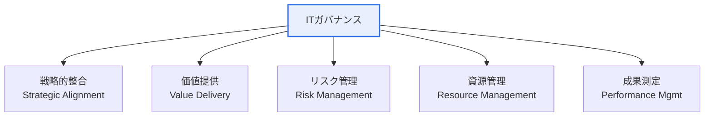

# ITガバナンス(IT Governance)

## 1. 概要

### A. 定義
> ITが組織の**戦略・目標に適合**し価値を創出するよう、取締役会・経営陣がIT資源とリスクを**評価(Evaluate)・指示(Direct)・モニタ(Monitor)** する意思決定・責任の体系であり、COBITとISO/IEC 38500が代表的なフレームワークである。

ITガバナンスの核心は、**ガバナンス(方向付け・統制)とマネジメント(実行)の分離**にある。経営陣が「ITは何に向かって進むべきか」を定め統制するのがガバナンスであり、その方向に合わせて実際のシステムを構築・運用するのがマネジメントである。この区分がなければ、ITはビジネスと切り離された技術部門に転落しやすい。

### B. 登場背景および必要性
IT投資の規模が大きくなり、企業活動全般がITに依存するようになるにつれて、「ITに資金を投じているが、それに見合う事業価値が生まれているのか」という問いが経営の中心的な議題となった。かつてのITは成果の測定が難しく意思決定の責任が曖昧であったため、投資の失敗・重複・セキュリティ事故が頻発した。ITガバナンスは、IT投資とビジネス戦略を**整合**させ、リスク・コンプライアンスを管理し、IT意思決定の**説明責任と透明性**を確保するために登場した。特に規制遵守(内部統制)とデジタルトランスフォーメーションが重なり、その重要性はさらに高まっている。

## 2. 構成要素 (A)

ITガバナンスは相互に連結された5つの領域で構成される。**戦略的整合**がITの進むべき方向をビジネスに合わせる出発点であるならば、**価値提供**はその方向どおりに実際の事業価値を実現する結果であり、この二つを**リスク管理と資源管理**が支える。最後に**成果測定**が目標に対する結果を計量し、再び戦略にフィードバックすることで循環が完成する。いずれか一つの要素が欠ければ(例:成果測定の不在)、ガバナンスはスローガンにとどまる。

| 構成要素 | 内容 | 中核となる問い |
|---|---|---|
| **戦略的整合** | IT戦略とビジネス戦略の一致 | 正しい方向か |
| **価値提供** | IT投資によるビジネス価値の実現 | 見合う価値があるか |
| **リスク管理** | ITリスクの識別・統制、コンプライアンス | 安全か |
| **資源管理** | 人材・インフラ・データなどIT資源の最適化 | 効率的か |
| **成果測定** | 目標に対するIT成果のモニタリング | うまくやれているか |

## 3. 効果測定指標 (B)

ガバナンスがうまく機能しているかは、結局**定量指標**で確認しなければならない。このとき財務指標だけを見るとITの無形価値(能力・満足度)を見落とすため、**バランスト・スコアカード(BSC)** で4つの視点をバランスよく測定するアプローチが広く用いられる。各視点の戦略目標をKGI(重要目標達成指標)として設定し、これをKPI(重要業績評価指標)に結び付けて追跡する。

| 視点(BSC) | 指標の例 |
|---|---|
| **財務** | IT ROI、TCO削減率、IT予算遵守率 |
| **顧客** | ユーザー満足度、SLA遵守率 |
| **内部プロセス** | システム可用性、障害復旧時間(MTTR)、プロジェクト納期遵守率 |
| **学習と成長** | IT人材の能力、新技術導入率 |

> KGI(重要目標達成指標)–KPI(重要業績評価指標)体系によって戦略目標を定量指標に結び付ける。例えば「顧客対応の改善」という目標(KGI)を「SLA遵守率99%」というKPIとして具体化する。

## 4. 効果測定の方法論 (C)

測定を実際に行うには、標準化された方法論が必要である。BSCが「何をバランスよく見るか」の枠組みであるならば、COBITは「ITプロセスがどれだけ成熟しているか」を評価する詳細なフレームワークであり、ISO/IEC 38500はガバナンスの原則(EDM)を規定する国際標準である。これらは排他的ではなく、併用される。

| 方法論 | 特徴 |
|---|---|
| **BSC** (Balanced Scorecard) | 財務・顧客・プロセス・学習と成長のバランスの取れた測定 |
| **COBIT** | IT統制・プロセス成熟度(Maturity)評価フレームワーク |
| **ISO/IEC 38500** | ITガバナンスの国際標準(EDM原則) |
| **Val IT / Risk IT** | IT投資価値・リスク管理への拡張(COBIT系) |
| **ITIL** | ITサービスマネジメント(運用成果) |
| **ベンチマーキング** | 同業他社との成果比較 |

COBITは各ITプロセスの成熟度を段階(0〜5など)で評価し、「現在の水準」と「目標の水準」のギャップを明らかにするため、改善の優先順位を決めるのに特に有用である。

## 5. 考慮事項および示唆点
技術士の観点から見ると、ITガバナンスの成否はフレームワークの「導入の有無」ではなく「組織に合わせてどれだけテーラリング(tailoring)したか」にかかっている。第一に、COBIT・ISO 38500を丸ごと移植すると組織に合わず形骸化するため、組織の規模・成熟度・規制環境に合わせて必要な要素だけを取捨選択しなければならない。第二に、COBIT 2019が明確にしたように、**ガバナンス(方向付け・統制)とマネジメント(実行)の役割を区分**して責任を明確にしなければならない。第三に、ESG開示・デジタルトランスフォーメーション・AI導入が拡大するにつれ、ITガバナンスはデータ・AI・セキュリティまでを包含する**デジタルガバナンス**へと拡張しており、技術的統制を超えて組織全体の価値創出体系へと発展させなければならない。

---

> **一言まとめ**: ITガバナンスは*戦略的整合・価値提供・リスク・資源・成果*の5要素をBSC・COBIT・ISO 38500などで測定し、ITがビジネス価値に貢献するよう方向付け・統制する体系であり、組織特性に合わせたテーラリングとガバナンス–マネジメントの分離が成功の鍵である。
