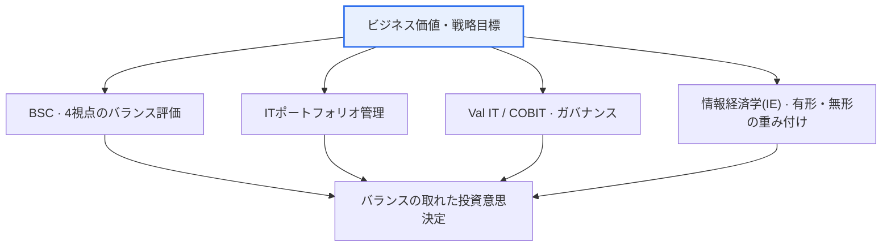

# IT投資分析 — プロセス、フレームワーク、分析方法論

## 1. 概要

### A. 定義
> **IT投資分析**とは、IT投資がビジネス価値と戦略目標にどれだけ貢献するかを**定量的・定性的に評価**し、限られた予算の中で投資の優先順位を定め、執行後の成果を管理・フィードバックする一連の経営活動である。

IT投資分析が必要となる根本的な理由は、「**IT投資は大きいが、その効果が目に見えにくい**」という構造的特性にある。企業は毎年売上の相当な割合をITに支出するが、その投資が実際に売上を伸ばしたのか、コストを削減したのか、複数の候補のうちどれを先に行うべきかを判断するのは難しい。その理由は、ITの効果が財務成果へ直ちに換算されない無形価値(顧客満足・業務効率・意思決定スピード・戦略的柔軟性)を大きく含むためである。例えば新しいERP導入の効果は、「在庫回転率の改善」のように一部は計量化できるが、「データに基づく意思決定文化の定着」のように相当部分は数値として捉えられない。このため、IT投資はしばしば「コストセンター」と誤解されたり、逆に根拠なく流行を追って過剰に執行されたりもする。

IT投資分析はこの難しさを体系的なプロセス・フレームワーク・方法論で扱い、限られた予算を価値の大きいところに配分し、投資決定を経営陣と利害関係者に対して正当化し、執行後の成果を検証して次の投資に反映する。すなわち「ITに**いくらを、どこに、なぜ**投資し、その**結果は何か**」に答える経営ツールである。これは個別プロジェクトの妥当性検討(feasibility)を超え、組織全体のIT投資を一つのポートフォリオとして捉え、リスクとリターンをバランスよく管理するITガバナンスの中核領域でもある。

### B. 必要性
IT投資は規模が大きく後戻りが難しく、その成否が組織の競争力を左右するという点で、他の投資と区別される。誤った大規模システムの導入は、サンクコストだけでなく業務の麻痺・機会損失という二次的損失を生む。

IT予算の制約と投資失敗のリスクが大きくなるにつれ、「勘」ではなく根拠に基づいて投資を決定・統制する必要性が高まった。大規模ITプロジェクトの相当数が予算超過・スケジュール遅延・期待効果未達に苦しむという経験的観察が繰り返されるなかで、投資前に妥当性を客観的に検討し、投資後に成果を検証する体系が求められるようになった。IT投資分析は、(1) **資源配分の合理化**(価値の高いところへ優先配分)、(2) **投資の正当化**(経営陣・株主の説得)、(3) **成果に対する説明責任の確保**(事後検証とフィードバック)を通じてこの要求を満たす。特にデジタルトランスフォーメーション(DX)によってITが全社戦略の中心となった今日、IT投資分析は戦略実行の羅針盤の役割を果たす。

## 2. IT投資分析プロセス

IT投資分析は一回限りの審査ではなく、投資ライフサイクルに沿って循環する管理プロセスである。最初の段階である**計画・候補の導出**では、事業目標とIT戦略を整合(alignment)させ、その目標を達成するための投資候補を識別する。このとき候補は現場の要求・規制対応・インフラ更新・新規事業支援などさまざまな出所から生まれ、各候補が「どの経営目標に貢献するか」を明確に結び付けることが、以降の評価の基準線となる。目標との結び付きが弱い候補は、技術的にいかに魅力的であっても優先順位で後回しにされる。

第2の**分析・評価**段階では、各候補のコスト・効果・リスクを定量的・定性的に検討する。コストは導入費だけでなく運用・保守までを含む総所有コスト(TCO)の観点で算定し、効果は財務的便益(コスト削減・売上増加)と無形の便益(満足・柔軟性)を併せて推定する。リスクは技術・スケジュール・市場の不確実性を反映し、シナリオ別に検討する。この段階が分析の心臓部であり、後述する方法論(NPV・ROI・AHPなど)が集中的に動員される。

第3の**優先順位付け・選定**段階では、個別候補の評価結果をポートフォリオの観点から総合し、予算・人員の制約の中で実行する組み合わせを決定する。個別プロジェクトがそれぞれ妥当であっても全体の予算・リスク限度を超える可能性があるため、リスク・リターンのバランスと戦略への貢献度を併せて見て組み合わせを最適化する。その後の**執行・モニタリング**段階で進捗・予算・品質を統制し、最後の**事後成果評価**段階で目標に対する実際の成果を検証し、その教訓を次の投資計画へ**フィードバック**する。この事前(Pre)・執行中・事後(Post)評価の循環が投資管理の核心であり、フィードバックのループが途切れると同じ失敗が繰り返される。

| 段階 | 中核活動 | 成果物 |
|---|---|---|
| **計画・候補の導出** | 事業目標との整合、投資候補の識別 | 投資候補リスト・整合表 |
| **分析・評価** | コスト・効果・リスクの定量・定性分析 | 妥当性分析書・評価スコア |
| **優先順位付け・選定** | ポートフォリオ観点での優先順位決定 | 投資ポートフォリオ・予算案 |
| **執行・モニタリング** | 進捗・予算・品質の統制 | 進捗報告・EVM指標 |
| **事後成果評価** | 目標に対する成果の検証・フィードバック | 成果評価書・改善課題 |

## 3. IT投資分析フレームワーク

フレームワークとは、投資を「どの観点からバランスよく捉えるか」を規定する思考の枠組みである。財務成果だけを見ると戦略的・無形の価値を見落としやすいため、多面的な観点を強制するフレームワークが必要となる。

**BSC(Balanced Scorecard、バランスト・スコアカード)** は、投資を財務・顧客・内部プロセス・学習と成長の4つの視点から評価する。例えばコラボレーションプラットフォームへの投資は、短期的な財務効果はわずかでも「学習と成長」と「内部プロセス」の視点では大きな価値を持ち得るが、BSCはこうしたバランスを明示的に示して財務偏重を是正する。**ITポートフォリオ管理**は、個別プロジェクトではなく投資の集合全体を一つのポートフォリオとして捉え、高リスク・高リターン(革新)と低リスク・安定(保守)の投資を適切に組み合わせて組織全体のリスク・リターンを最適化する。これは金融のポートフォリオ理論をIT投資に適用したものであり、「一か所に集中させない」という分散の原理に従う。

この二つのフレームワークが相補的なのは、観点が異なるためである。BSCが「何を測定するか」(成果の多面性)を扱うのに対し、ITポートフォリオ管理は「何を選択するか」(投資の組み合わせの最適化)を扱う。実務では、各投資候補をBSCの4視点で評価してスコアを付けた後、そのスコアとリスク度を座標軸としてポートフォリオマトリクスに配置し、「高価値・低リスク」の投資を優先的に選定するという形で両フレームワークを結び付けて用いる。

**Val IT / COBIT** はISACAが提示したITガバナンスのフレームワークであり、IT投資の価値創出・リスク管理・資源管理を組織レベルで統制する原則とプロセスを提供する。Val ITは特に「投資が実際に価値を生んでいるか(Are we getting the benefits?)」を継続的に問う価値ガバナンスに焦点を当てる。**情報経済学(Information Economics、IE)** は、伝統的な費用便益分析が扱いきれない無形の効果(戦略適合・競争対応・組織リスク)を重み付けでスコア化して順位を付ける技法であり、定量化が難しいITの便益を意思決定に反映しようとする代表的な試みである。

| フレームワーク | 焦点 | 中核となる考え方 |
|---|---|---|
| **BSC(バランスト・スコアカード)** | 多面的成果 | 財務・顧客・プロセス・学習と成長の4視点のバランス |
| **ITポートフォリオ管理** | リスク・リターンのバランス | 投資をポートフォリオとして捉え分散・最適化 |
| **Val IT / COBIT** | ガバナンス | IT投資の価値・リスク・資源の組織的統制 |
| **情報経済学(IE)** | 無形価値 | 有形・無形の効果を重み付けでスコア化 |

## 4. 分析方法論 (定量・定性・リスク)

IT投資の効果には財務的なもの(定量)と無形のもの(定性)が混在しているため、どちらか一方の系統の方法だけでは完全な評価にはならない。定量的技法で「金銭に換算できる部分」を厳密に検討し、定性的技法で「金銭に換算できない戦略的価値」を補完し、リスク技法で「不確実性」を反映するという三重構造が実務の定石である。

**定量(財務)技法**は、便益とコストを貨幣価値に換算して投資の妥当性を計算する。**NPV(正味現在価値)** は将来のキャッシュフローを割引率で現在価値化して合算した値であり、0より大きければ投資価値があるとみなす。貨幣の時間価値を反映するという点で、理論的に最も堅牢な指標である。**IRR(内部収益率)** はNPVを0にする割引率であり、投資の収益率を百分率で示すため資本コストと直接比較しやすい。**ROI(投資収益率)** は「(便益−コスト)/コスト」で直感的だが、時間価値を反映できないという限界がある。**TCO(総所有コスト)** は導入費だけでなく運用・教育・保守・廃棄までライフサイクル全体のコストを包括し、初期価格だけを見て判断する誤りを防ぐ。**回収期間(Payback Period)** は投資額を取り戻すまでにかかる期間であり、理解しやすいが回収後の便益を無視する。

これらの財務指標は相互補完的であり、一つだけでは誤った判断を招く。ROIは計算が容易だが時間価値を無視し、回収期間は直感的だが回収後の長期的便益を見落とす。NPVは理論的に最も堅牢だが割引率の仮定に敏感であり、IRRはキャッシュフローの符号が何度も変わると解が複数出るという限界がある。そのため実務では、NPVで絶対的価値を、IRRで収益率を、回収期間で流動性回復のスピードを、TCOでライフサイクル全体のコストを併せて見て、多角的にクロス検証する。

一つ留意すべき点は、これらの財務技法がいずれも「便益を信頼性をもって推定できる」という前提の上に成り立っていることである。IT投資ではこの便益推定そのものが最も難しい部分であり、いかに精巧なNPVモデルでも入力値(予想削減額・売上増加)が不十分であれば結果は歪む。そのため財務分析の品質は計算式ではなく「便益推定の根拠と仮定」で分かれ、楽観バイアスを抑制するために保守的な推定と事後の実測比較(推定対実現)を並行させる規律が重要である。

**定性技法**は、無形価値と戦略的貢献を構造化して評価する。代表的には**AHP(階層分析法)** があり、評価基準を階層に分け、一対比較(pairwise comparison)を通じて重みを算出した後、各代替案をスコア化して優先順位を定める。AHPは定性的判断を定量的な順位に変換するという点で、戦略整合度・顧客価値のような無形の便益を意思決定に体系的に組み込むために広く用いられる。**リスク技法**は不確実性を反映するものであり、**感度分析**は主要変数(割引率・需要)を変化させながら結果の変動を見て、**シナリオ分析**は楽観・悲観・基準といういくつかの状況を想定し、**モンテカルロ・シミュレーション**は変数の確率分布に基づいて数千回の試行を行い、結果の確率分布を得る。

| 区分 | 方法 | 特徴・用途 |
|---|---|---|
| **定量(財務)** | NPV・IRR・ROI・TCO・回収期間 | 貨幣価値で投資の妥当性を評価(時間価値はNPV・IRR) |
| **定性** | AHP・重み付け評価・戦略整合度 | 無形価値・戦略的貢献を構造化してスコア化 |
| **リスク** | 感度・シナリオ・モンテカルロ | 不確実性・変動性を確率的に反映 |

例えば3年間で3億ウォンを投資し毎年1.5億ウォンのコストを削減する自動化プロジェクトであれば、単純なROIは「(4.5億−3億)/3億 = 50%」で魅力的に見えるが、割引率10%でNPVを計算すると将来の削減額の現在価値が小さくなり、実際の正味現在価値はそれより小さくなる。ここに「自動化によって確保される人員の高付加価値業務への転換」という無形の便益をAHPで重み付けして加えると、財務指標だけでは後順位だった投資が上位に上がることもある。このように複数の技法を併用してこそ、偏りのない結論に至る。

### A. 定量・定性技法の選択基準
どの技法を用いるかは投資の性格による。便益が明確に貨幣換算できるコスト削減型の投資(インフラ統合・自動化)では、NPV・IRR・TCOのような財務技法が主力となる。逆に戦略的・革新的な投資(新規プラットフォーム・データに基づく事業)は便益が不確実で無形であるため、AHP・情報経済学・BSCのような定性技法の比重が大きくなる。実際の意思決定では、財務技法で「経済性の下限」を確認した後、定性技法で「戦略適合度」を上乗せして総合順位を出す2段階アプローチが一般的である。

また、不確実性が大きい投資ほどリスク技法の役割が大きくなる。結果がいくつかの明確な状況に分かれるならシナリオ分析が、多数の変数が連続的に変動するならモンテカルロ・シミュレーションが適している。どの組み合わせを用いるにせよ、方法論は「正解を自動的に出す計算機」ではなく「判断の根拠を透明にするツール」であることに留意しなければならない。仮定(割引率・便益推定・重み)が変われば結論も変わるため、仮定を明示し、感度によってその頑健性を併せて報告することが、信頼される分析の要件である。

## 5. 深化:デジタルトランスフォーメーション時代のIT投資分析と予想出題方向

デジタルトランスフォーメーション(DX)とクラウド・AIの普及は、IT投資分析の前提を変えつつある。第一に、**コスト構造がCapExからOpExへ移行**した。かつてはサーバー・ライセンスを資産として購入(CapEx)し減価償却していたが、クラウドは使用量に基づく課金(OpEx)であるため初期投資の負担は減る代わりに継続的な支出が発生する。このためTCO算定とNPVモデリングにおいて「弾力的な使用量」を反映する方法が重要となり、FinOpsと呼ばれるクラウドコスト最適化の実践がIT投資管理の新たな軸として浮上した。第二に、**AI・データ投資のように効果が不確実でオプション価値の大きい投資**が増えるにつれ、伝統的なNPVの限界を補うリアルオプション(Real Option)の観点が注目されている。「今は小規模に始め、成果が良ければ拡大する」という段階的投資の柔軟性そのものを価値として評価するのである。

こうした変化は評価指標そのものの再解釈を求める。例えばクラウド移行は初期CapExを減らす代わりに使用量に比例したOpExを発生させるため、単純な回収期間だけで見ると「初期コストが低く魅力的」に見えるが、3〜5年の累積TCOではオンプレミスより高くなることもある。したがって移行投資は、使用量の成長シナリオ別に複数年のTCOを比較し、オートスケーリング・リザーブドインスタンスのような最適化の余地を便益に反映してこそバランスの取れた結論に至る。FinOpsはまさにこの継続的なコストの可視化・最適化を組織文化として定着させようとする動きである。

第三に、**便益実現(Benefits Realization)管理**が強調されている。投資前の妥当性評価にだけ力を注ぎ執行後の成果を放置すると、「計画された便益」と「実現された便益」のギャップが放置される。そのため、Val IT・BSCを事後評価に結び付け、目標便益の達成可否をKPIで追跡し、未達の場合は原因を分析・是正するクローズドループ管理がベストプラクティスとして定着した。技術士試験の観点では、このテーマは(1) プロセスとフレームワーク・方法論を構造的に結び付けて記述し、(2) NPV・ROI・AHPの概念と限界を対比させ、(3) 無形価値の評価と事後フィードバックの重要性を結論で強調し、(4) 最近のクラウド・AI・DXの文脈(OpEx移行・FinOps・リアルオプション)を深化の論拠として付け加える答案が高く評価される。小問として「定量 vs 定性の比較」「特定の方法論(AHP・NPV)の手順」「BSC 4視点の適用」が頻出するため、各要素を独立して説明できるようにしておく必要がある。

## 6. 考慮事項および示唆点

1. **無形価値の評価が鍵である。** ITの効果の相当部分は財務に換算されない無形価値であるため、定量指標だけを見ると戦略的投資を見落とす。AHP・情報経済学・BSCで無形の便益を構造化し、定量・定性をバランスよく結合しなければならず、無形価値を無理に貨幣化するよりも、重み・スコア体系で透明に示すほうが説得力が高い。
2. **事前・事後評価の連携(クローズドループ)が重要である。** 投資前の妥当性だけを検討し事後の成果を検証しなければ、投資管理は半分にとどまる。計画された便益と実現された便益をKPIで照合し、その教訓を次の投資にフィードバックするBenefits Realization体系があってこそ、組織の投資能力が累積的に向上する。
3. **経営戦略との整合(Alignment)が根本である。** IT投資はそれ自体が目的ではなくビジネス目標達成の手段であるため、BSC・COBIT・ITガバナンスによって戦略と整合した投資を優先しなければならない。戦略との結び付きが弱い「技術的魅力」中心の投資は警戒の対象である。
4. **ポートフォリオ・リスクの観点でのバランスが必要である。** 個別プロジェクトの妥当性を超え、革新・維持・インフラ投資を一つのポートフォリオとして捉え、リスク・リターンを分散・最適化しなければならない。不確実性の大きい投資は感度・シナリオ・リアルオプションでリスクを計量化し、段階的投資によって下方リスクを限定する戦略が有効である。
5. **クラウド・DXの環境変化に合わせたコストモデルの更新が求められる。** CapEx→OpEx移行、使用量に基づく課金、FinOps最適化を反映してTCO・NPVモデルを再整備し、AI・データのように効果が不確実な投資はオプション価値を併せて評価するなど、方法論そのものを時代の変化に合わせて進化させなければならない。

## 参考資料
- ISACA, Val IT Framework / COBIT — https://www.isaca.org/resources/cobit
- Kaplan & Norton, The Balanced Scorecard 概要 — https://www.investopedia.com/terms/b/balancedscorecard.asp
- IT投資成果管理全般(情報経済学・ITポートフォリオ) — https://en.wikipedia.org/wiki/IT_portfolio_management

---

> **一言まとめ**: IT投資分析は*IT投資のビジネス価値を定量的・定性的に評価*する活動であり、計画→分析→選定→モニタリング→事後評価の循環プロセスと、BSC・ポートフォリオ・Val ITフレームワーク、NPV・ROI・TCO(定量)・AHP(定性)・シナリオ(リスク)の方法論を併用して無形価値までバランスよく評価し、戦略と整合した投資をポートフォリオ・クローズドループの観点で管理する経営ツールである。
