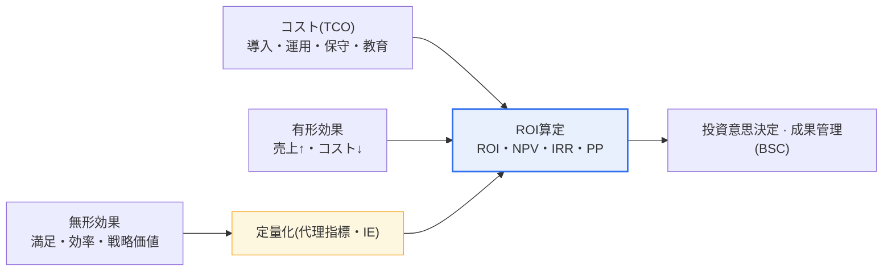
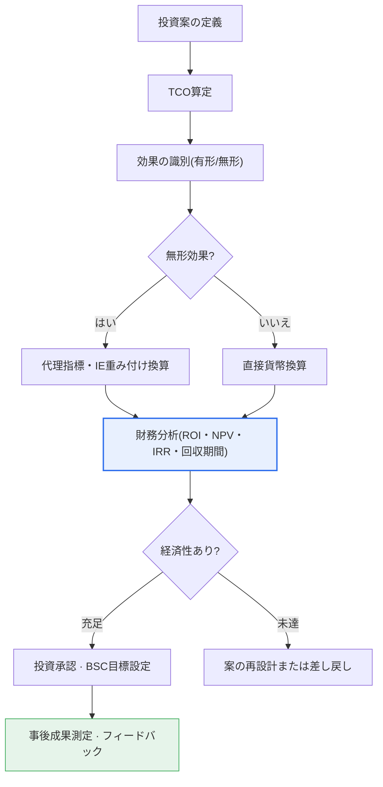

# IT-ROI 投資成果評価モデル

## 1. 概要

### A. 定義
> **IT-ROI(Return On Investment)** とは、IT投資に投入したコストに対してそこから得られた効果(収益増加・コスト削減・リスク回避など)を定量的に測定し、**IT投資の経済的妥当性と成果を貨幣単位で評価**するモデルである。最も基本となる公式は `ROI(%) = (効果 − コスト) / コスト × 100` であり、これに貨幣の時間価値を反映したNPV・IRR、総コストを包括するTCO、無形の効果を重み付けして評価する情報経済学(IE)の技法が結合され、一つの評価体系を形成する。

IT-ROIが求められる根本的な理由は、「**IT投資の成果を経営陣が理解する言語(お金)で証明**」しなければならないという点にある。IT組織はインフラ更新、新規システム構築、クラウド移行、AI導入など絶えず投資を要請するが、「その投資が結局どれだけの価値を生み出したのか」を数字で示せなければ、CFO・取締役会から予算の正当性を確保することは難しい。伝統的にITはコストセンター(cost center)と認識されてきており、投資対効果が不透明であるという理由で、景気後退期のたびに真っ先に削減される予算であった。IT-ROIはこうした認識を変えるために、投入コスト(TCO)と産出効果を同一の貨幣尺度に換算して比較することで、投資の優先順位を定め事後の成果を検証する根拠を提供する。

しかしITの効果には、売上増加・人件費削減のような**有形効果(tangible)** だけでなく、顧客満足度の向上・意思決定スピードの改善・業務への没入・戦略的柔軟性(オプション価値)のような**無形効果(intangible)** が大きく含まれる。特にデジタルトランスフォーメーション期のIT投資では、有形効果よりも無形・戦略的効果の比重が大きくなる傾向があり、単純な財務ROIだけでは投資価値を十分に捉えきれないという根本的な限界がある。したがってIT-ROIモデルの実質的な核心は「無形効果をいかに信頼性をもって定量化(monetization)するか」にあり、ここで情報経済学・BSC・リアルオプションのような補完的技法が登場する。

### B. 登場背景と必要性
IT-ROIが一つの方法論として定着した背景には、1990年代以降に拡大した大規模なIT投資と、それに比例して頻発した投資失敗の経験がある。米国を中心に「ITに莫大な資金を投じているのに、なぜ生産性は上がらないのか」といういわゆる**生産性のパラドックス(productivity paradox)** の論争が起こり、これがIT投資効果を厳密に測定しようとする学術的・実務的な努力を促した。韓国でも公共・金融分野の大型情報化事業が増えるにつれ、予算編成段階で経済的妥当性を事前に検証し(事前投資評価)、事業終了後に実際の成果を検証する(事後評価)手続きが制度化された。

必要性は3つに要約される。第一に、**資源配分の合理化**である。限られたIT予算の中でどの事業に先に投資するかを、勘ではなく定量的根拠に基づいて決定しなければならない。第二に、**説明責任(accountability)** である。投資後に実際の効果を測定して計画対実績を検証することで、ITガバナンスの透明性を確保する。第三に、**コミュニケーション**である。ITの成果を財務の言語に翻訳して経営陣・現場と共通認識を形成し、継続的な投資の推進力を確保する。

## 2. IT-ROI評価フレームワークと構成要素

IT-ROI評価は、コストを算定し、有形・無形の効果を測定し、これを財務技法で総合して意思決定に結び付けるという一連の流れで構成される。以下の構造図は、評価に投入される入力(コスト・効果)と産出(投資意思決定・成果管理)の関係を示している。

**コスト(TCO)の側面**をまず正確に把握することが、ROIの信頼性の出発点である。初心者がよく犯す誤りは、ハードウェア・ソフトウェアの導入費のような目に見える初期コストだけを計算することである。しかし実際のコストの相当部分は導入後に発生する。運用・保守、ライセンス更新、障害対応、ユーザー教育、組織の変革管理、さらにはシステム廃棄のコストまで含めてこそ、真の投資規模が明らかになる。これを総所有コスト(TCO、Total Cost of Ownership)といい、一般にシステムのライフサイクル全体のコストに占める初期導入費の比重は20〜30%にすぎず、残りの70〜80%は運用・保守段階で発生するとされている。TCOを過小評価するとROIは実際より膨らみ、誤った投資決定を招く。

**有形効果の側面**は、貨幣に直接換算できる効果である。例えばコールセンターの相談自動化によって相談員20人分の人件費を削減したならば、これは明確な定量効果であり、ECサイトのレコメンドシステム導入によって客単価が8%上昇したならば、売上増加分を計算できる。有形効果は財務技法(ROI・NPV・IRR)で比較的正確に評価されるという長所があるが、IT投資価値の一部しか説明しないという点に常に留意しなければならない。

**無形効果の側面**は、IT-ROIで最も難しい領域である。顧客満足度の向上、意思決定の精度改善、ブランドへの信頼、規制リスクの低減、将来の拡張に向けた戦略的柔軟性などは、それ自体は貨幣単位ではない。しかし無形だからといって測定を放棄すると、戦略的に重要な投資ほど過小評価されるという逆説が生じる。そのため実務では**代理指標(proxy metric)** を設定して間接的に貨幣化する。例えば顧客満足度の向上は「離脱率の低下 → 顧客生涯価値(LTV)の維持 → 売上防衛額」として、業務効率の改善は「処理時間の短縮 × 時間当たり人件費 × 処理件数」として換算する。このように無形効果を定量化する体系的なアプローチが情報経済学(IE)である。

| 構成要素 | 詳細内容 | 評価時の留意点 |
|---|---|---|
| **コスト(TCO)** | 導入・運用・保守・教育・変革管理・廃棄 | 初期費用だけを計算する誤りに注意、ライフサイクル全体を反映 |
| **有形効果** | 売上増加、人件費・在庫・時間コストの削減 | 財務技法で定量化しやすい |
| **無形効果** | 顧客満足、業務効率、リスク低減、戦略的柔軟性 | 代理指標・重み付けによる間接的な貨幣化が必要 |

## 3. 主要評価技法と算定手順

IT-ROI評価には、複数の財務的・定性的技法が併用される。以下のプロセス図は、投資案が投入されてから最終的な成果管理に至るまでの手順を示している。

### A. 財務技法
財務技法は有形効果の評価に強力である。**ROI**は `(効果−コスト)/コスト×100` で直感的だが、貨幣の時間価値と投資期間を反映できないという弱点がある。これを補うのが**NPV(正味現在価値)** であり、将来発生するキャッシュフローを適正な割引率で現在価値化して合算した後、初期投資額を差し引いて求める。NPVが0より大きければ、その投資は資本コスト以上を稼ぎ出す経済的な投資である。**IRR(内部収益率)** はNPVを0にする割引率であり、投資の収益率を百分率で示すため、規模の異なる事業を比較する際に有用である。**回収期間(Payback Period)** は投資額を回収するのにかかる期間であり、計算が容易でリスク感覚を与えるが、回収後の効果と時間価値を無視する。

これらの技法は相互補完的に用いられる。例えば2つの事業のROIが同じでも、初期に効果が集中する事業のほうがNPV・IRRで有利になる。実務では、NPVで絶対的価値を、IRRで相対的収益率を、回収期間でリスクにさらされる期間を併せて見る多面的評価が標準である。

### B. TCOと情報経済学(IE)
**TCO**は前述のとおりコストの完全性を確保する技法であり、クラウド移行のような意思決定においてオンプレミスとの5年TCOを比較する形でよく活用される。**情報経済学(Information Economics)** は、財務ROIに無形・戦略的価値を重み付けで加えて評価する拡張技法である。純粋な財務ROIのスコアに「経営戦略との適合度」「競争優位への貢献」「組織リスク」のような項目別の価値・リスクのスコアを重み付けして合算することで、財務数値だけでは表れない戦略的価値を評価に反映する。無形効果の重みを決める際には、AHP(階層分析法)のような多基準意思決定技法を併用することもある。

| 技法 | 算出方式 | 強み | 限界 |
|---|---|---|---|
| **ROI** | (効果−コスト)/コスト×100 | 直感的、コミュニケーションが容易 | 時間価値・期間を反映しない |
| **NPV** | Σ キャッシュフローの現在価値 − 投資額 | 時間価値を反映、絶対的価値 | 割引率の仮定に敏感 |
| **IRR** | NPV=0となる割引率 | 規模の異なる事業の比較 | 複数解・非現実的な再投資の仮定 |
| **回収期間(PP)** | 投資額の回収期間 | リスクの直感的把握 | 回収後の効果・時間価値を無視 |
| **TCO** | ライフサイクル総コスト | 隠れたコストの捕捉 | 効果の側面は別途 |
| **情報経済学(IE)** | 財務ROI + 無形・戦略の重み付け | 無形価値を反映 | 重みの主観性 |

## 4. 適用事例と比較

技法の選択は投資の性格によって異なる。この違いが生じる理由は、投資ごとに効果の種類・発生時点・戦略性が異なるためである。例えば**コスト削減型投資**(例:老朽サーバーの統合、RPA導入)は効果の大半が有形で短期に実現されるため、ROI・回収期間だけでも十分に説得力のある評価が可能である。実際に、反復的な手作業をRPAで置き換えて年間1万時間の業務を自動化し、時間当たり処理コストを計算して12か月以内の回収を立証するといった具合である。

一方、**戦略型・プラットフォーム型投資**(例:データプラットフォーム構築、クラウド移行、AI導入)は効果が長期にわたり無形の形で現れるため、単純なROIでは過小評価されやすい。この場合、NPVで複数年の効果を現在価値化し、情報経済学で戦略的柔軟性(今後新規サービスを迅速に載せられるオプション価値)を重み付けして反映してこそ、投資の妥当性が明らかになる。クラウド移行の事例では、オンプレミスの5年TCOとクラウドの5年TCOを比較しつつ、単純なコストだけでなく、弾力的な拡張による機会費用の削減・市場投入までの時間短縮のような無形効果を併せて計量するのが定石である。

3つ目に、**規制対応・リスク回避型投資**(例:セキュリティ強化、個人情報保護システム)は売上を増やさないため、伝統的なROIがマイナスのように見えることがあるが、「侵害事故の発生確率 × 予想被害額」で回避価値(risk-adjusted return)を計算すれば投資の正当性が確保される。このように同じIT-ROIでも、投資の種類に応じてどの技法を前面に立て、何を補完技法として用いるかが変わる。

### A. 簡単な算定例
概念を具体化するために例を挙げる。ある企業が文書処理自動化システムに初期導入費3億ウォンを投入し、その後4年間毎年保守・運用費として5千万ウォンかかるとする。このシステムで年間8千時間の反復的な手作業を自動化し、時間当たり処理コストを2万5千ウォンと換算すると、年間の削減効果は約2億ウォンである。単純累積ROIを4年基準で見ると、総効果8億ウォン、総コスト5億ウォン(導入3億 + 保守2億)で `(8−5)/5×100 = 60%` となる。ここに貨幣の時間価値を反映して割引率8%でNPVを計算すると、将来効果の現在価値が小さくなり、正味現在価値は60%より保守的な値となる。回収期間は、初期費用3億ウォンを年間純効果(2億−0.5億=1.5億)で割って約2年と算定される。このように同じ投資でも、どの技法で見るかによって「経済性がある」という結論の強さが変わるため、複数の技法を併せて提示するのが定石である。(上記の数値は原理説明のための仮定値であり、実際のプロジェクトでは組織のデータで算定しなければならない。)

## 5. 深化:BSCとの連携と最近の動向

IT-ROIは単独で用いられるよりも、**バランスト・スコアカード(BSC、Balanced Scorecard)** と結合されたときに完成度が高まる。BSCは財務の視点一つにとどまらず、顧客・内部プロセス・学習と成長の4つの視点で成果をバランスよく捉える。IT投資の無形効果の多くは顧客・プロセス・学習と成長の視点に自然にマッピングされるため、IT-ROIの財務数値とBSCの非財務指標を併せて配置すれば、財務ROIが見落とす戦略的価値を補うことができる。実際に多くの組織が、IT投資審議において財務的妥当性(NPV・IRR)と戦略的整合性(BSC・情報経済学のスコア)を2つの軸とする評価表を用いている。

最近の動向としては、第一に**価値実現(Value Realization)の観点の強化**がある。投資承認時点の事前ROIで終わらせず、プロジェクト終了後に実際の効果を継続的に追跡して計画対実績を管理するベネフィット・マネジメント(benefits management)が、ITガバナンス(COBITなど)で強調されている。第二に、**デジタルトランスフォーメーション・AI投資のROI測定の難しさ**である。生成AI導入のように効果が広範かつ無形の投資は伝統的なROIの算定が特に難しく、生産性向上時間・品質改善率のような代理指標と、パイロットに基づく段階的投資(オプション的アプローチ)で評価する方式が広がっている。第三に、**ESG・サステナビリティ価値の反映**であり、IT投資による炭素削減・エネルギー効率のような非財務効果を成果に含めようとする試みが増えている。ただし、こうした最新指標の標準化の程度はまだ組織ごとにばらつきが大きいため、断定するよりも組織の文脈に合わせた慎重な設計が必要である。

## 6. 考慮事項および示唆点 (技術士の観点)

1. **無形効果の定量化が成否を左右する。** IT価値の相当部分は無形であるため、代理指標(顧客維持率・処理時間の短縮・リスク回避額)で体系的に換算しなければ、戦略的に重要な投資ほど過小評価されるという逆説が生じる。情報経済学・AHP・リアルオプションなどの補完技法を状況に応じて組み合わせなければならない。

2. **TCOの観点による完全なコスト算定が前提である。** 導入費だけを見る誤りを避け、運用・保守・教育・変革管理・廃棄までライフサイクル全体のコストを反映してこそ、ROIは歪まない。特にクラウド・サブスクリプション型モデルでは、長期の運用費が初期費用を大きく上回り得ることに留意する。

3. **BSC・ITガバナンスと連携して多面的に評価する。** 単一の財務ROIに埋没せず、財務・顧客・プロセス・学習と成長のバランスの取れた観点で評価し、COBITなどのガバナンスフレームワークの価値実現プロセスと結び付けて、事前評価–事後検証のクローズドループを作る。

4. **事前評価と事後成果管理をクローズドループで運用する。** 投資承認時の推定ROIで終わらせず、実際の効果を継続的に測定して計画対実績を検証し、次の投資意思決定にフィードバックしてこそ、IT-ROIは形式ではなく実質的な経営ツールとなる。

5. **トレードオフと仮定の透明性を確保する。** 割引率・効果の推定値・無形の重みなど、ROIの算定には多くの仮定が介在するため、感度分析によって仮定の変化に伴う結果の変動を併せて提示してこそ、意思決定の信頼性が高まる。特に無形効果の代理指標はそれ自体が推定であるため、楽観・悲観のシナリオを並列に提示することが、過大な見せ方であるという批判を避ける道である。

6. **投資の種類ごとに技法を使い分ける。** コスト削減型はROI・回収期間で十分だが、戦略・プラットフォーム型はNPV・リアルオプション・情報経済学で長期・無形の価値を反映し、リスク回避型は回避価値(確率×被害額)で評価しなければならない。一つの物差しをすべての投資に画一的に適用すると、戦略的投資を過小評価する誤りが生じる。

総合すると、IT-ROIの本質は計算公式そのものではなく、「無形価値をいかに信頼性をもって貨幣に翻訳し、その仮定を透明に示し、事前判断と事後検証をつなぐ管理体系として運用するか」にある。技術士の観点からは、個別技法の計算方法を超え、組織のITガバナンス・戦略と整合した投資意思決定体系としてIT-ROIを設計・運用する能力が求められる。

## 参考資料
- ISACA, COBIT 2019 — Governance and management objectives (価値実現/ベネフィット・マネジメント): https://www.isaca.org/resources/cobit
- Kaplan & Norton, Balanced Scorecard (Harvard Business Review 概要): https://hbr.org/1992/01/the-balanced-scorecard-measures-that-drive-performance-2
- Brynjolfsson, IT生産性のパラドックス(Productivity Paradox)の議論の概要: https://en.wikipedia.org/wiki/Productivity_paradox

---

> **一言まとめ**: IT-ROIは*IT投資コスト(TCO)に対する効果を定量評価*するモデルであり、ROI・NPV・IRR・回収期間の財務技法と情報経済学・BSCを結合して有形・無形の効果をバランスよく測定するが、**無形効果の定量化と事前–事後のクローズドループ成果管理**が中核課題である。
