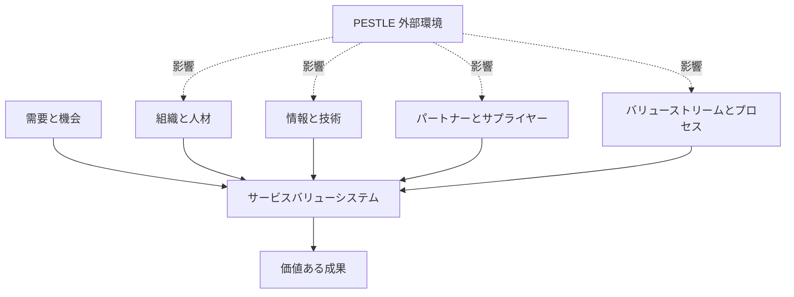
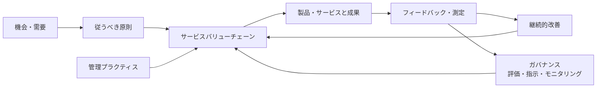
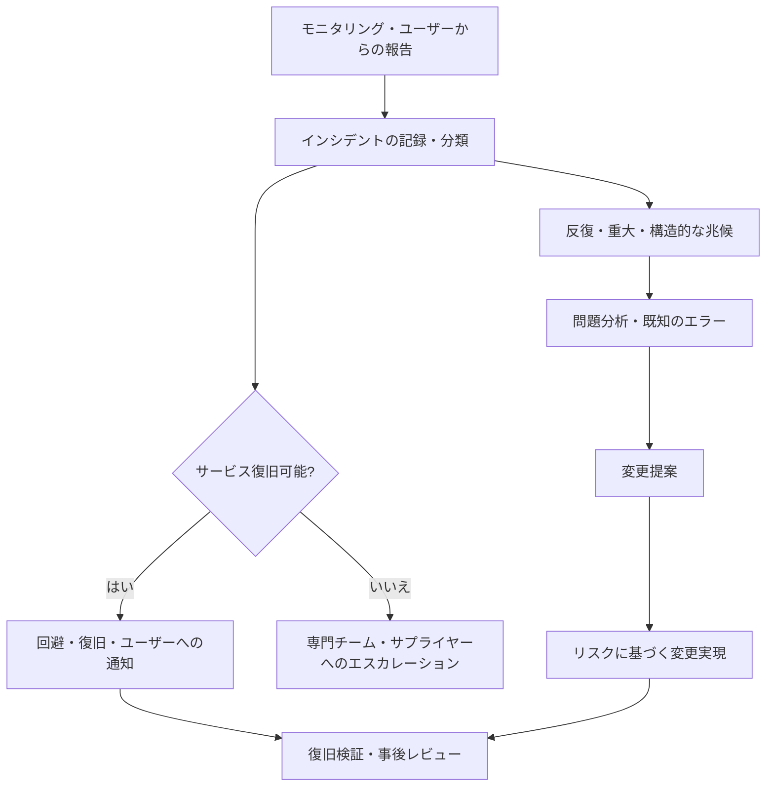

# ITIL 4(ITインフラストラクチャ・ライブラリ)とサービスマネジメント

## 1. 概要

> ITIL 4とは、組織がデジタル製品とサービスを設計・移行・運用・改善しながら、顧客および利害関係者と共に価値を創出できるよう支援するサービスマネジメントのフレームワークである。

ITIL(Information Technology Infrastructure Library)は、ITを技術構成要素の運用ではなく、サービスの品質と価値を管理するという観点へ転換するための実務指針である。ITが業務を支援する水準を超えて業務成果、顧客体験、規制遵守、コスト効率を左右するようになり、障害件数を減らすだけの運用管理では経営目標を説明することが難しくなった。

ITIL 4は、定められた手順をすべての組織に強制するプロセス標準ではない。サービスが創出する価値と利害関係者の成果を出発点とし、組織の規模・リスク・技術・サプライチェーンに合わせてバリューストリームと管理プラクティスを組み合わせる。したがって同じプラクティスであっても、金融機関の基幹勘定サービスとスタートアップの実験的サービスとでは、異なる統制水準が適用され得る。

従来のITIL v3がサービスライフサイクルとプロセスごとの統制を強調していたのに対し、ITIL 4はサービスバリューシステム(SVS)、バリューチェーン活動、4つの側面、7つの従うべき原則を中心に、アジリティ・協働・自動化までを包含する。この変化は、DevOps、アジャイル、クラウド、SREとITサービスマネジメントが互いに排他的ではなく、共通の価値目標のもとで結合され得ることを意味する。

技術士の答案では、ITIL 4を単に34のプラクティスの一覧として書くよりも、需要と機会を入力として受け取り、サービス関係を通じて成果を生み出し、ガバナンスと継続的改善によって再び学習するクローズドな管理体系として説明すべきである。

### 1.1 登場背景と必要性

第一に、サービス消費者は稼働率そのものよりも業務上の成果を求める。オンラインショッピングモールは、サーバーが稼働しているかどうかよりも、注文が正常に受け付けられ決済が完了するかどうかを重視する。IT運用指標とビジネス成果指標を結び付けなければ、高い稼働率を達成しても顧客価値を生み出せない可能性がある。

第二に、クラウドとSaaSの普及により、サービス構成要素の境界が組織の外へと拡張した。社内サーバー、パブリッククラウド、外部API、オープンソース、協力会社の運用が一つのサービスの流れを構成するため、サプライヤー管理と契約上の責任境界が不可欠である。

第三に、アジャイルとDevOpsは迅速な変更を可能にするが、変更のスピードだけを高めると、障害・セキュリティ事故・監査の追跡可能性の問題が大きくなり得る。ITIL 4の変更実現、デプロイメント、インシデント、問題、サービスレベル管理のプラクティスは、スピードと統制を相反させる代わりに、リスクに基づいてバランスを取る。

第四に、データと自動化が運用上の意思決定の中心となった。オブザーバビリティデータ、構成情報、ユーザーのフィードバック、コスト情報を一つのサービスの文脈で結び付けてこそ、問題を早期に発見し、改善投資の優先順位を定めることができる。

### 1.2 主な特徴

ITIL 4の核心はプロセスの遵守率ではなく、価値の共創である。サービス提供者だけが価値を生み出すのではなく、消費者の能力、利用方法、業務の文脈が結合したときに成果が実現される。

また、プラクティスとは、人・情報・技術・パートナー・バリューストリームを併せて考慮する実行能力である。文書に手順を書いておくだけでプラクティスが成熟するわけではなく、責任と権限、ツール、データ、熟練度、測定と改善が共に機能しなければならない。

## 2. サービスマネジメントの基本概念

### 2.1 サービス・価値・成果

サービスとは、顧客が特定のコストとリスクを直接負担することなく、望む成果を得られるように提供者が行う活動の集まりである。ここで重要なのは、提供者がすべての技術構成要素を顧客に移転するわけではないという点である。顧客はサーバーを購入するのではなく、業務上の成果を得るための能力を消費する。

価値は、有用性(utility)と保証(warranty)が結合して認識される。有用性とはサービスが何をしてくれるかに関する機能と目的適合性であり、保証とは約束された条件のもとでどれだけ安定的に提供されるかに関する品質と使用適合性である。

例えばモバイルバンキングサービスが振込機能を提供することは有用性である。取引が定められた時間内に処理され、障害時に復旧され、個人情報が保護されることは保証である。機能が多くても保証が不足していれば、ユーザーはサービスの価値を低く評価する。

サービス関係とは、提供者と消費者がサービスの提供・消費のために協力する関係である。関係には、サービス提供、サービス消費、関係管理が含まれる。SLA文書を交換するだけの関係ではなく、目標・リスク・フィードバック・改善の優先順位を共に調整する運用上の関係として捉えるべきである。

### 2.2 コストとリスクの観点

サービス消費者は直接コストと間接コストを共に負担する。直接コストは利用料、ライセンス、人件費のように契約や予算に現れる項目であり、間接コストは教育、移行、遅延、障害による機会損失のようにサービスの利用過程で発生するものである。

リスクとは、サービスが成果を生み出すことを妨げる不確実性である。提供者がリスクの一部を管理していても、消費者組織のデータ品質、ユーザー教育、業務プロセスが不適切であれば、全体の成果は悪化する。したがってサービスレベルの協議では、提供者が統制できるリスクと消費者が管理すべきリスクを区別する。

技術士は、サービスカタログとSLAに機能一覧だけを記録するのではなく、主要な成果・品質条件・コスト要素・リスクオーナー・測定方法を併せて定義すべきである。この構造があってこそ、障害の優先順位と投資の妥当性を経営の言語で説明できる。

| 概念 | 中核となる問い | 実務上の管理ポイント |
|---|---|---|
| 有用性 | サービスはどのような業務を可能にするか? | 機能、利用シナリオ、成果指標 |
| 保証 | 約束された条件のもとで安定して使えるか? | 可用性、キャパシティ、セキュリティ、継続性 |
| コスト | 提供・消費にどれだけの資源がかかるか? | TCO、単位コスト、ライセンス、人員 |
| リスク | 成果を妨げる不確実性は何か? | リスク登録簿、統制、残存リスク |
| 成果 | 利害関係者が得る変化は何か? | KPI、顧客成果、業務効果 |

## 3. ITIL 4の4つの側面

サービスマネジメントの意思決定は、一つの側面だけを最適化してはならない。ITIL 4は、組織と人材、情報と技術、パートナーとサプライヤー、バリューストリームとプロセスという4つの側面をバランスよく検討する。外部環境であるPESTLEも4つの側面に影響を与えるため、規制・経済・社会・技術・法律・環境の変化を併せて検討しなければならない。

### 3.1 組織と人材

組織構造、役割と責任、権限委譲、能力、文化、コミュニケーションを含む。サービスデスクと開発チームが異なる目標を持っていると、インシデントを迅速に解決するよりも責任を押し付け合うようになる。したがって、RACI、オンコール体制、エスカレーション経路、学習時間をサービス運用モデルに反映させなければならない。

人を単なる運用コストとしてのみ捉えると、自動化の導入は失敗しやすい。自動化によって反復作業を減らした後、分析、設計、顧客とのコミュニケーション、リスク管理の能力を強化する再配置計画が必要である。役割に基づく教育と現場でのコーチングも、プラクティスの成熟度の一部である。

### 3.2 情報と技術

サービスを設計・運用するために必要なデータとツールを扱う。構成管理データベース(CMDB)、モニタリング、ログ・トレース、サービスカタログ、ナレッジベース、デプロイパイプライン、ITSMツールが代表的である。

ツールを多く導入することよりも、データの意味と品質が重要である。資産の識別子がそれぞれ異なればインシデントと構成アイテムを結び付けることができず、モニタリングのアラートが業務への影響に翻訳されない。情報の分類、保存、アクセス制御、データ品質のルールを設計しなければならない。

### 3.3 パートナーとサプライヤー

クラウド事業者、ネットワーク事業者、パッケージ供給者、外部委託の運用会社、オープンソースコミュニティなど、サービスに参加する外部主体を管理する。サプライヤーの成果は契約書上の稼働率だけで評価せず、障害時の協働、セキュリティ通知、復旧訓練、データの持ち出し、終了時の支援までを含めなければならない。

マルチクラウドでは、サプライヤーごとの責任分界が特に重要である。提供者のプラットフォーム障害と顧客の誤った構成とでは対応主体が異なるため、サービスモデルと運用分担表を文書化し、定期的に検証しなければならない。

### 3.4 バリューストリームとプロセス

需要が成果へと転換される活動の順序、統制、待機、引き継ぎ、自動化を扱う。プロセスが業務を統制するルールであるのに対し、バリューストリームは特定の製品・サービスにおいて実際に価値が移動する経路全体である。

例えば新規顧客向けモバイル機能のバリューストリームは、アイデア、要求事項、設計、開発、テスト、デプロイ、観測、フィードバックへとつながる。各段階の承認だけを増やすとボトルネックが生じるため、リスクの高い変更に統制を集中させ、低リスクの標準変更は自動化することが望ましい。

| 側面 | 点検すべき問い | 代表的な成果物 |
|---|---|---|
| 組織と人材 | 誰が決定し、どのような能力が必要か? | 運用モデル、RACI、能力計画 |
| 情報と技術 | どのようなデータとツールを連携させるべきか? | CMDB、ナレッジベース、オブザーバビリティ設計 |
| パートナーとサプライヤー | 外部依存性と責任境界は明確か? | 契約、OLA、サプライヤー評価表 |
| バリューストリームとプロセス | どこで待機・手戻り・統制が発生するか? | バリューストリームマップ、手順、自動化ルール |

## 4. サービスバリューシステム(SVS)

ITIL 4のSVSは、組織のすべての構成要素と活動が一つのシステムとして結合し、価値を創出する方式を説明する。入力は機会と需要であり、出力は製品・サービスを通じた価値である。SVSの5つの構成要素は、従うべき原則、ガバナンス、サービスバリューチェーン、管理プラクティス、継続的改善である。

### 4.1 7つの従うべき原則

従うべき原則とは、特定のツールや組織に依存しない意思決定の基準である。原則はチェックリストのように一つだけを選ぶものではなく、状況に応じて併せて適用する。

第一に、価値に着目する。活動そのものの完了よりも、顧客・ユーザー・組織が得る成果を確認する。第二に、現状からはじめる。既存の資産と能力を診断せずに全面的に置き換えると、コストと移行リスクが大きくなる。

第三に、フィードバックをもとに反復して進化する。大きな設計を一度に確定するよりも、小さな変更を測定し学習する。第四に、協働し、可視性を高める。開発・運用・セキュリティ・事業が同じダッシュボードと用語を使ってこそ、隠れた待機と責任の空白が減る。

第五に、全体的に考えて取り組む。特定のチームの処理量を高めても、サービス全体の流れが遅くなるならそれは最適化ではない。第六に、シンプルにし、実践的にする。統制の目的とリスクを説明できない承認・報告の手順は、除去するか自動化する。

第七に、最適化し、自動化する。まず無駄とボトルネックを分析した後、安定した反復業務を自動化する。悪い手順をそのまま自動化するとエラーがより速く拡散するため、自動化の前に標準化と例外処理が必要である。

### 4.2 ガバナンスと継続的改善

ガバナンスとは、組織を評価し、方向を指示し、結果をモニタリングする体系である。経営陣はサービスポートフォリオ、リスク許容水準、投資、規制遵守、サプライチェーンの原則を決定し、実務組織はその方向をバリューストリームとプラクティスとして実装する。

継続的改善は、別の革新チームによる一回限りのプロジェクトではなく、あらゆるレベルで繰り返される運用活動である。改善機会の登録、優先順位の決定、ベースラインの測定、小さな実行、結果の検証、ナレッジの普及という循環を作らなければならない。

改善の優先順位は、不満の大きい項目だけで決めない。顧客への影響、リスクの低減、コスト削減、規制上の重要度、実装の難易度、学習効果を併せて評価し、改善バックログを製品・サービスのロードマップと結び付ける。

## 5. サービスバリューチェーンとバリューストリーム

サービスバリューチェーンとは、組織が価値を提供し実現するために行う相互に連結された活動の運用モデルである。6つの活動は、Plan、Improve、Engage、Design & Transition、Obtain/Build、Deliver & Supportである。すべてのサービスが6つの活動を同じ順序でたどるわけではなく、需要の種類によって経路が異なる。

| 活動 | 目的 | 代表的な成果物 |
|---|---|---|
| Plan | ビジョン・現状・改善の方向性の共通理解 | 戦略、ポートフォリオ、ポリシー |
| Improve | 製品・サービス・プラクティスの継続的改善 | 改善バックログ、振り返りの結果 |
| Engage | 利害関係者の需要・透明性・関係の管理 | 要求事項、フィードバック、SLA |
| Design & Transition | 品質・コスト・市場投入の目標に沿った設計と移行 | 設計書、リリース計画 |
| Obtain/Build | 必要なサービス構成要素の確保・開発 | コード、インフラ、供給契約 |
| Deliver & Support | 合意された条件に従ったサービスの提供・サポート | 運用、インシデント対応、ナレッジ |

### 5.1 新規サービスのバリューストリームの例

オンライン教育機関がリアルタイム講義字幕機能をリリースするとしよう。Engageでは障害のある学生、講師、カスタマーセンターの要求を収集し、Planでは個人情報とコストの目標を定める。Design & Transitionでは、遅延時間、精度、保存期間、障害時の代替手段を設計する。

Obtain/Buildでは、音声認識APIと字幕ストレージを構成し、テストデータを準備する。Deliver & Supportでは、デプロイ後に品質・遅延・エラー率を観測し、インシデントが発生すればサービスデスクとサプライヤーが共に対応する。Improveでは、実際のユーザーフィードバックをもとに辞書とモデルを改善する。

この流れにおいて各活動を担当するチームの生産性だけを測定すると、全体の体験を見落とす。講義再生成功率、字幕到達時間、エラー報告の解決時間、機能利用率のように、成果と結び付いた指標を併せて測定しなければならない。

### 5.2 バリューストリーム設計の原則

バリューストリームを描く際には、活動名だけを並べるのではなく、顧客の要求から成果の確認までの開始・終了条件、入力・出力、担当者、待機時間、手戻り、統制、自動化を表示する。実際のデータを使ってリードタイムと処理時間を区別してこそ、ボトルネックが見える。

低リスクの標準要求はカタログと自動承認で処理し、高リスクの変更は影響評価と承認・検証を強化する。このようにリスクに比例した統制を適用すれば、ITILの統制性とDevOpsのスピードを同時に達成できる。

## 6. 主要な管理プラクティスと運用との連携

ITIL 4は、14の一般的マネジメント・プラクティス、17のサービスマネジメント・プラクティス、3つの技術的マネジメント・プラクティスで構成される34の管理プラクティスを提示する。プラクティスはプロセスより広い概念であり、目的達成に必要な人・責任・知識・技術・サプライヤー・バリューストリームを併せて含む。

一般的マネジメントには、戦略・ポートフォリオ・リスク・情報セキュリティ・サプライヤー・関係・プロジェクト・組織変更・測定と報告などが含まれる。サービスマネジメントには、インシデント、問題、変更実現、サービスデスク、サービスレベル、サービス要求、構成、資産、可用性・キャパシティ・継続性などが含まれる。技術的マネジメントには、デプロイメント・インフラストラクチャ・プラットフォーム、ソフトウェア開発・管理、技術アーキテクチャに関連する能力が含まれる。

### 6.1 インシデント・問題・変更の連携

インシデント(incident)とは、サービスの計画外の中断や品質低下であり、インシデント管理は、できる限り早く合意されたサービスレベルへ復旧することを目的とする。根本原因の究明が復旧を遅らせる場合には、回避策を先に適用し、事後の分析は問題管理として切り分ける。

問題(problem)とは、一つ以上のインシデントを引き起こす、または引き起こし得る原因もしくは潜在的な原因である。問題管理は、反復するインシデントと構造的な欠陥を分析し、既知のエラーと回避策を管理して再発を減らす。

変更実現(enablement)とは、サービスに影響を与える変更をリスクに応じて評価・承認・スケジュール・実装する能力である。すべての変更を同じように承認するとボトルネックになり、すべての変更を無統制にデプロイすると障害のリスクが大きくなる。標準・通常・緊急の変更によってリスク水準を区分し、自動化の水準を変えなければならない。

### 6.2 サービスデスクとサービスレベル管理

サービスデスクはユーザーとサービス提供者の接点であり、単なる電話受付窓口ではなく、需要・期待・体験を管理する中核プラクティスである。マルチチャネルの接点、ナレッジ検索、自動分類、ユーザー認証、コミュニケーションのテンプレート、フィードバックの収集を統合しなければならない。

サービスレベル管理は、事業要求を測定可能なサービス目標へと翻訳し、目標の達成状況と改善を管理する。SLAには可用性だけでなく、応答・復旧時間、処理量、データ復旧、セキュリティ通知、ユーザー体験、測定除外条件と責任境界を含める。

SLAがあまりに多くの指標を含むと、運用者は目標を形式的に満たすことに集中してしまう。主要なジャーニーとビジネス成果を代表する少数の指標を選び、内部のOLAとサプライヤー契約の測定基準を整合させなければならない。

### 6.3 構成・資産・ナレッジ管理

サービス構成管理は、サービス構成アイテムとその関係に関する信頼できる情報を提供する。資産管理は、資産のライフサイクルと価値・コスト・リスクを管理する。両プラクティスは連携するが、すべての資産がサービス構成アイテムであるわけではなく、目的と統制水準も異なる。

ナレッジ管理は、解決方法と意思決定の根拠を再利用可能にする。インシデント終了後にナレッジを記録する際には、単なる原文のコピーではなく、適用条件、リスク、検証手順、有効期限、オーナーを含めなければならない。そうしてこそ、自動推奨やセルフサービスで誤った解決法が繰り返されない。

## 7. ITIL 4と関連アプローチの比較

ITIL 4はサービスマネジメントの運用体系と共通言語を提供するが、企業全体のガバナンスや開発方法論を単独で置き換えるものではない。COBITは企業ITガバナンスと目標・統制に強く、ISO/IEC 20000はサービスマネジメントシステムの要求事項と審査に適しており、DevOpsとSREは迅速なデリバリーと信頼性の高い運用のためのエンジニアリング実践に強みがある。

| アプローチ | 主な目的 | 強み | 適用時の留意点 |
|---|---|---|---|
| ITIL 4 | サービス価値の共創と運用管理 | バリューチェーン・プラクティス・共通言語 | 文書・承認中心に誤用しない |
| ISO/IEC 20000 | サービスマネジメントシステムの要求事項と適合性 | 監査・認証・システムの観点 | 認証がそのままサービス品質を意味するわけではない |
| COBIT | 企業ITガバナンスと目標・統制 | 経営目標・リスク・統制の連結 | 運用の実行手順は別途設計が必要 |
| DevOps | 開発・運用の流れとデプロイ速度の改善 | 自動化・協働・短いフィードバック | リスク・規制上の統制を組み込む必要がある |
| SRE | 信頼性目標とエンジニアリングによる運用 | SLO・エラーバジェット・自動化 | 非IT利害関係者とのサービス言語の整合が必要 |

ITIL 4とDevOpsは対立しない。変更を小さな単位でデプロイし自動化された検証を行うDevOpsパイプラインは、変更実現とデプロイメント管理のプラクティスの実行手段となり得る。逆にITILのサービスレベルとインシデントからの学習は、DevOpsが迅速に生み出した変更が顧客の成果に貢献しているかを確認させる。

SREのエラーバジェットは、許容可能な信頼性リスクをデプロイの意思決定と結び付ける。ITILの継続的改善とサービスレベル管理にエラーバジェットを組み合わせれば、目標を達成している間はイノベーションを許容し、バジェットを使い切れば安定化に集中するという運用ポリシーを作ることができる。

## 8. 適用事例

### 8.1 ECプラットフォームの決済障害

大規模なセール期間中に決済承認の遅延が発生したと仮定する。モニタリングはAPIの遅延と失敗率を検知し、サービスデスクは顧客からの報告をまとめて重大インシデントとして分類する。インシデント管理の第一の目標は、原因究明よりも、代替の決済経路と再処理キューによって注文の損失を防ぐことである。

問題管理では、特定の決済事業者のタイムアウト、リトライの急増、データベース接続の枯渇という連鎖的な原因を分析する。変更実現では、リトライポリシーとサーキットブレーカーを標準化し、次のセールの前に負荷試験と障害訓練を実施する。

成果はインシデント件数一つで評価しない。注文成功率、決済遅延のパーセンタイル、顧客への返金件数、検知から緩和までの時間、再発率を併せて見る。このように成果中心の指標を用いれば、インフラチームの単純な稼働率よりも顧客価値を直接管理できる。

### 8.2 公共機関のクラウド移行

公共機関は、規定、個人情報、予算、調達契約、既存システムへの依存性を併せて考慮しなければならない。Planではサービスポートフォリオと規制要求を整理し、Engageでは現場・セキュリティ・監査・クラウドサプライヤーの責任について合意する。

Design & Transitionでは、データ分類、暗号化、バックアップ、復旧目標、アクセス制御、ログの保存、終了時のデータ持ち出しを設計する。Obtain/Build段階でインフラをコードとして管理し構成ベースラインを検証すれば、変更履歴と再現性を高めることができる。

移行後のDeliver & Supportでは、サプライヤーのモニタリングと内部のサービスデスクを連携させる。SLAを満たしていても、住民からの申請処理の遅延や業務の中断が発生すればサービス価値は低いため、業務処理時間とユーザー満足度を追加で測定する。

### 8.3 データプラットフォームのモデル変更

分析プラットフォームがデータスキーマを変更すると、複数のレポートとAIモデルが影響を受け得る。サービス構成管理によってデータプロダクト・パイプライン・消費者の関係を把握し、変更前に影響分析と下位互換性の検証を行う。

標準変更は自動テストと承認ポリシーで迅速に処理しつつ、個人情報カラムや規制報告書に影響する変更は通常変更として分類する。変更後はデータ品質、パイプラインの遅延、レポートのエラー、モデル性能を観測し、異常があればロールバックや互換ビューを提供する。

この事例は、ITIL 4が伝統的なインフラ運用のためだけのフレームワークではなく、データ・AIサービスのバリューストリームにも適用され得ることを示している。

## 9. 深化:デジタルサービス時代におけるITIL 4の適用方向

### 9.1 プロダクト中心の運用とサービスマネジメントの結合

プロダクトチームがバックログとデプロイを主導していても、サービスのライフサイクル、運用責任、顧客のフィードバック、コスト・リスクを管理しなければならない。プロダクトチームの完了の定義に、運用準備度、オブザーバビリティ、セキュリティ、サポートのナレッジ、復旧訓練を含めれば、開発と運用の断絶を減らすことができる。

サービスカタログもまた、静的なメニューではなく、製品・API・データセット・プラットフォームの消費条件を示すデジタルポータルへと発展し得る。カタログの項目には、オーナー、コスト単位、SLO、サポート時間、依存関係、データ分類、要求・解約の方法を含めるのがよい。

### 9.2 自動化・AIOpsと統制

イベント相関分析、異常検知、チケット分類、ナレッジ推奨、自動復旧は、Deliver & Supportの効率を高める。しかしモデルの誤検知・見逃し・バイアスが運用障害につながり得るため、自動化の水準をリスク別に分け、承認・監査ログ・停止スイッチを設けなければならない。

生成AIをサービスデスクに適用する際には、回答の根拠と最新性、機密情報の露出、権限に応じた検索、人による最終確認を管理する。AIが生成した解決法は検証済みのナレッジと分けて実験段階として保存し、適用結果をフィードバックデータとして残すのが安全である。

### 9.3 成熟度と測定

成熟度評価は、文書の有無よりも目的達成能力を測定すべきである。例えばインシデント管理の成熟度は、チケット様式の存在ではなく、検知の品質、復旧時間、反復率、ユーザーとのコミュニケーション、事後の学習が実際に改善されているかで評価する。

測定体系は、入力・活動・出力・成果の階層で構成する。入力には人員・予算・ツール、活動には変更・サポート・改善、出力には解決・デプロイ・報告書、成果にはサービスの信頼性・顧客成果・コスト・リスクの低減を置く。成果指標と先行指標を併用してこそ、短期目標の達成のために長期的な品質が損なわれることを防げる。

## 10. 考慮事項および示唆点

### 10.1 フレームワークの過剰導入の防止

ITIL 4のすべての用語と文書を同時に導入すると、現場の負担が大きくなり形式的な遵守へと変質する。中核サービスを一つか二つ選定してバリューストリームと主要なペインポイントを診断した後、効果が確認されたプラクティスを段階的に拡大しなければならない。

### 10.2 価値とリスクに基づく統制

組織ごとにサービスの重要度とリスクへの露出が異なるため、同じ承認水準を適用しない。決済・医療・公共の基幹サービスには強い追跡可能性と復旧検証を設け、社内の実験的サービスには限定された範囲と迅速なフィードバックを適用するなど、比例的な統制が必要である。

### 10.3 責任境界とサプライチェーンのレジリエンス

クラウドとSaaSを利用しても、運用責任がなくなるわけではなく分割されるのである。契約上の責任分界、障害通知、データ移動、下位サプライヤー、終了計画、復旧訓練をサービス設計段階で確認し、サプライヤーの成果を定期的に検証しなければならない。

### 10.4 データ品質とオブザーバビリティ

CMDB、ログ、メトリクス、トレース、カタログが互いに連携していなければ、自動化と分析の信頼性は低下する。共通の識別子とタグの標準、データオーナー、保存ポリシー、品質検査を定義し、サービスへの影響へと翻訳されるダッシュボードを提供しなければならない。

### 10.5 DevOps・SREとの統合

変更を遅らせる承認段階ではなく、リスクを減らす自動検証、段階的デプロイ、ロールバック、エラーバジェット、事後レビューを設計しなければならない。ITIL 4のプラクティスは、開発パイプラインとSREの運用モデルに組み込まれたときに、文書の負担よりも実際の信頼性向上に貢献する。

### 10.6 人と文化の変化

サービスマネジメントの改善は、ツールの導入よりも協働の方法と心理的安全性の変化のほうが難しい。インシデントを個人のミスとして処罰すると隠蔽が増えるため、非難しない事後レビューと学習の共有を定着させ、新たな役割に必要な教育とキャリアパスを提供しなければならない。

### 10.7 測定の副作用の管理

チケット処理量やSLA遵守率一つだけを目標にすると、複雑なインシデントを分割したり、顧客に早期のクローズを促したりするという副作用が生じる。顧客成果、再発率、品質、従業員の負担、コスト、リスクをバランスよく見て、指標間のトレードオフを経営陣が検討しなければならない。

### 10.8 技術士の観点からの答案戦略

答案では、まず定義と構成要素を示し、SVS-4つの側面-バリューチェーン-プラクティスの関係を概念図で結び付ける。その後、インシデント・問題・変更の事例を通じて運用への適用を説明し、DevOps・SRE・ISO/IEC 20000・COBITとの違いと相互補完を比較する。

最後に、組織・技術・サプライチェーン・プロセス・データ・文化の観点からの考慮事項を提示しなければならない。単なる暗記型の34項目の一覧よりも、需要が成果へと転換されるバリューストリームと継続的改善のフィードバックを強調することが、ITIL 4の本質を示すことになる。

## 参考資料

- PeopleCert, ITIL 4 Management Practices 2023: https://www.peoplecert.org/news-and-announcements/2023/itil-4-management-practices-2023
- ITIL, Introduction to the ITIL Maturity Model: https://itil.com/-/media/itilsite/site-assets/documents/capability-and-maturity/introduction-to-the-itil-mm.pdf
- Atlassian, ITIL 4 Guiding Principles and Practices: https://www.atlassian.com/itsm/itil

---

> **一言まとめ**: ITIL 4はサービスライフサイクルの手順を暗記する体系ではなく、SVSとバリューチェーン・4つの側面・プラクティスを結合して需要を測定可能な顧客価値へと転換し、継続的に改善するサービスマネジメントのフレームワークである。
