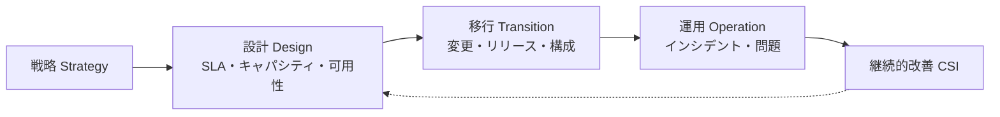

# ITサービスマネジメント体系(ITSM)とISO/IEC 20000

## 1. 概要

### A. 定義
> ITを**ビジネスと整合したサービスの観点**から計画・提供・運用・改善する管理体系。**ISO/IEC 20000**はその国際標準(SMS、Service Management System)であり、**ITIL**を代表的な参照フレームワーク(ベストプラクティスの集合)として活用する。

伝統的なIT運用は、サーバー・ネットワークのような「技術資産」をうまく動かすことに焦点を当てていた。しかしユーザーにとって重要なのは機器ではなく、「**必要なときに安定して使えるサービス**」である。ITSMはこの認識の転換を反映し、ITを技術の塊ではなく顧客に価値を届ける**サービスの束**として捉え、そのサービスの品質をSLAで約束・測定・改善するプロセス体系である。ISO/IEC 20000はこれに認証可能な要求事項(shall)を付与し、組織が国際水準の管理能力を備えていることを証明できるようにする。

### B. 登場背景および必要性
ITが業務の中心となるにつれ、一度の障害がビジネス上の損失に直結するようになり、担当者個人の能力に依存する場当たり的な運用では品質を保証できなくなった。組織は、(1) **一貫したサービス品質とSLAの遵守**、(2) 人が替わっても維持される**プロセスの標準化と反復可能性**、(3) 監査・規制に対応する**ITガバナンス**、(4) 費用対効果の観点からの**運用の効率化**を求めるようになり、ITSMはこれをPDCA(計画-実行-評価-改善)の循環として制度化する。特に、問題に事後対応するだけにとどまらず、繰り返される障害の根本原因を取り除き継続的に改善する**好循環の構造**を作ることが中核的な価値である。

## 2. ISO/IEC 20000のサービスマネジメントプロセス

ISO/IEC 20000のプロセスは、サービスの「提供-関係-解決-統制」という4つの軸にまとめられる。サービス提供プロセスがSLA・キャパシティ・可用性のような**約束の骨格**を立てれば、関係プロセスが顧客・サプライヤーとの**接点**を管理し、解決プロセスが発生した障害を**復旧・根絶**し、統制プロセスが変更によるリスクを管理してこれらすべてを下支えする。

| 領域 | プロセス(例) | 目的 |
|---|---|---|
| **サービス提供** | SLM、キャパシティ・可用性・継続性、予算管理、情報セキュリティ | サービスレベルの約束・設計 |
| **関係** | ビジネス関係・サプライヤー管理 | 顧客・サプライヤーとの接点の管理 |
| **解決** | インシデント・問題管理 | 障害の復旧と根本原因の除去 |
| **統制** | 構成(CMDB)・変更・リリース管理 | 変更リスクの統制・構成の維持 |

## 3. サービスの設計・構築・移行活動(A/B/C/D)

サービスは戦略から始まり、設計・移行・運用を経て継続的改善へとフィードバックされるライフサイクル(ITILのサービスライフサイクル)を持つ。各段階がなぜ必要なのかが重要である。

**A. 設計(Design)** は、サービスを作る前に「どれだけ速く、どれだけ途切れずに(SLA)、どれだけの負荷を(キャパシティ)、災害時にどう復旧するか(継続性)」をあらかじめ規定する。ここで定めた目標が、以降のすべての段階の基準線となる。**B. 移行(Transition)** は、設計されたサービスを運用環境へ安全に引き渡す段階であり、変更が予期せぬ障害を招かないよう**変更・リリース管理**で統制し、すべての構成アイテム(CI)とその関係を**CMDB**に記録して影響度を把握する。例えば特定サーバーへのパッチ適用を計画する際に、CMDBでそのサーバーに依存するサービスを事前に識別しておけば、変更失敗時の波及を予測・遮断できる。**C. 運用(Operation)** は実際のサービスを稼働させる段階であり、サービスを早く復旧させる**インシデント管理**(症状への対応)と、繰り返される障害の根を取り除く**問題管理**(原因の除去)を区別して実施する。**D. 継続的改善(CSI)** は、SLA達成率・処理時間などを測定・分析し、プロセスをPDCAで磨き上げる。

| 段階 | 中核活動 |
|---|---|
| **設計(Design)** | SLAの定義、キャパシティ・可用性・継続性の設計、情報セキュリティ |
| **移行(Transition)** | 変更・リリース・展開、構成管理(CMDB)、検証・ナレッジ管理 |
| **運用(Operation)** | インシデント・問題・要求の処理、イベント管理 |
| **継続的改善(CSI)** | 測定・分析・改善(PDCA) |

## 4. 関連概念

サービスレベルの約束は階層的に連結されている。顧客との**SLA**を守るには、内部チーム間の**OLA**と外部サプライヤーとの**UC**が裏付けとならなければならず、どれか一つの層が崩れただけでもSLAは破られる。この連結を支えるのが、CI間の関係を格納したCMDBである。

| 概念 | 説明 |
|---|---|
| **SLA/OLA/UC** | 顧客・内部チーム・外部サプライヤー間のサービスレベル合意(階層的に連動) |
| **CMDB** | 構成アイテム(CI)・関係の管理により影響度分析の基盤を提供 |
| **ITIL 4** | サービスバリューシステム(SVS)・バリューストリーム・4つの側面を中心に進化 |

## 5. 考慮事項および示唆点
技術士の観点から見ると、ITSM導入の成否は標準への準拠の有無ではなく、**定着のさせ方**にかかっている。プロセス文書だけを整えても、現場の文化・能力・ツールが伴わなければ形式的な認証にとどまる。したがって、ITSMソリューション(チケット・CMDBの自動化)とともに、**責任・役割(RACI)** を明確にする組織の変革管理を並行しなければならない。近年は変化のスピードが速まり、重い変更統制がボトルネックとなったことで、ITSMが**DevOps・SREと融合**する傾向にある。SREの**エラーバジェット(Error Budget)** は「安定性とデプロイ速度」のトレードオフを定量化して変更管理を柔軟にし、自動化が反復的な運用を置き換える。結局ITSMは、COBITのようなITガバナンスや品質マネジメントと連携し、**ビジネス価値中心のサービスガバナンス**へと拡張しつつある。

---

> **一言まとめ**: ITSMは*ITをビジネスと整合したサービスの観点から管理*する体系であり、ISO/IEC 20000は設計(SLA・キャパシティ)→移行(変更・リリース・CMDB)→運用(インシデント・問題)→継続的改善(CSI)のプロセスによって品質を保証し、近年はDevOps・SREと融合して進化している。
