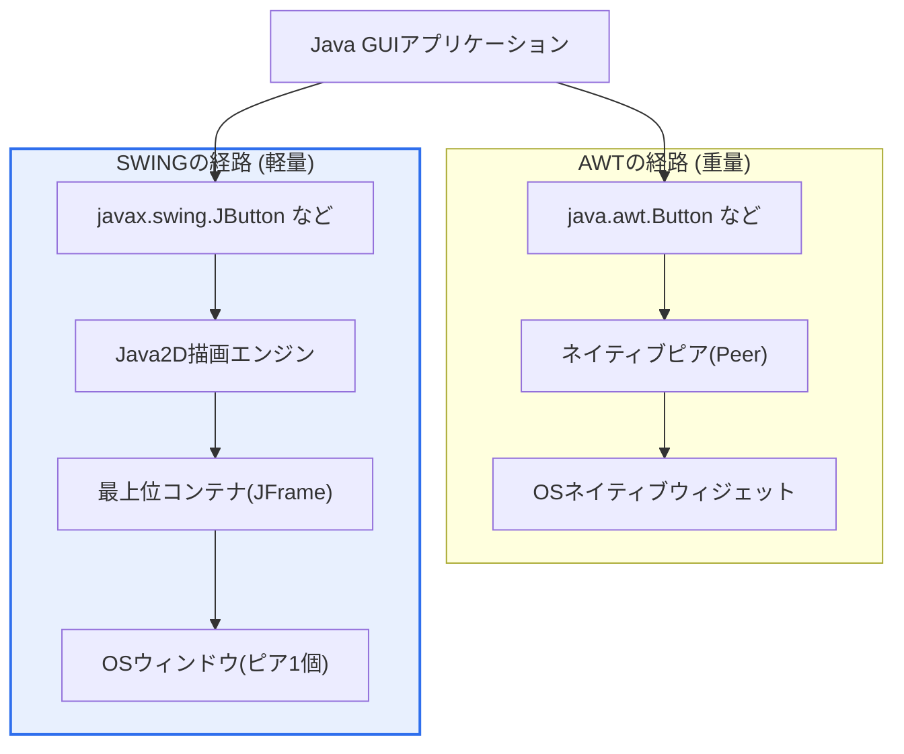
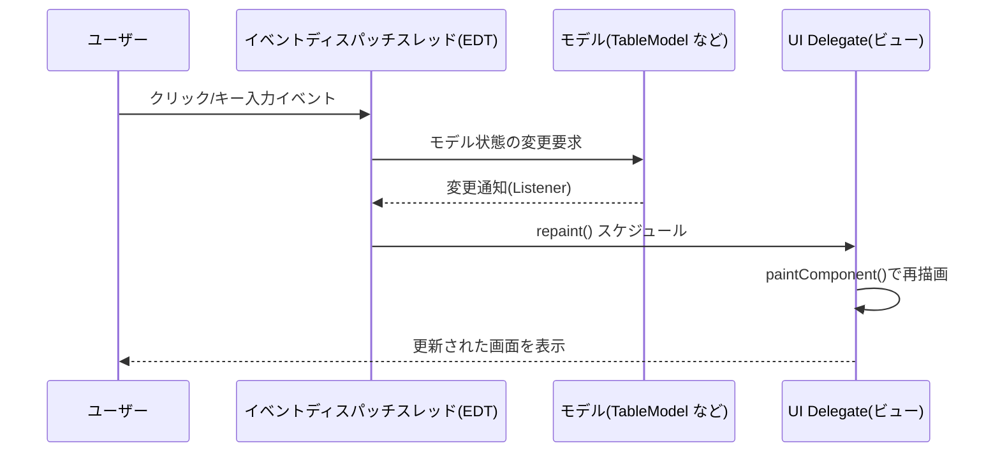
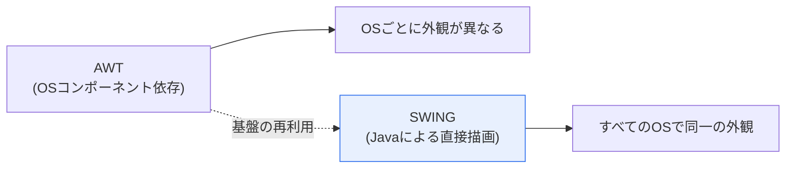

# Java AWTとSWING

## 1. 概要

### A. 概念

> **AWT**(Abstract Window Toolkit)と**SWING**は、Javaにおいて**GUI(グラフィカルユーザーインターフェース)を実装するための標準ライブラリ**である。AWTはオペレーティングシステムのネイティブコンポーネントに依存する初期の方式(重量、heavyweight)であり、SWINGはJavaが自ら画面を描画してプラットフォーム独立性を高めた後継の方式(軽量、lightweight)である。

2つのライブラリを並べて比較する根本的な理由は、「**Javaの理想であるプラットフォーム独立性(Write Once, Run Anywhere、WORA)を、GUIという最もOS依存的な領域でいかに実現するか**」という問いにある。サーバー・演算ロジックはJVMバイトコードによって難なく移植できるが、ウィンドウ(Window)・ボタン・フォント・マウスイベントのように画面と入力装置に結び付く部分はOSごとに実装が大きく異なるため、「一度書けばどこでも同じように」が最も守りにくい部分であった。AWTとSWINGの設計の違いは、まさにこの難しさを異なる方法で解いた2世代の解決策である。

初期の**AWT**(JDK 1.0、1996)は、各OSがすでに提供しているネイティブGUIコンポーネント(Windowsのボタン、X Windowのウィンドウなど)をそのまま利用する方式を採った。Javaコードの`java.awt.Button`一つが、実際にはOSに存在する本物のボタン(ピア、peer)に1:1で対応付けられる。この方式はOSが最適化したウィジェットをそのまま使うため描画が速く、OS固有の見慣れた外観が得られるが、肝心のOSごとにコンポーネントの見た目・サイズ・動作がまちまちであるため画面がプラットフォームごとに異なり、すべてのOSが共通して持つウィジェットの「最小公倍数」しか使えないため表現力が大きく制限された。Javaが掲げた「どこでも同じように」という理想と真っ向から矛盾したのである。

この限界を改善したのが**SWING**(JDK 1.2、1998、JFCの一部)である。SWINGはOSのネイティブウィジェットに依存せず、Javaが自らピクセルを描画する。最上位ウィンドウ(JFrame・JDialog)一つだけがOSのリソース(ピア)に結び付き、その中のボタン・テーブル・ツリーのようなコンポーネントはすべてJavaが描いた絵である。そのおかげで、どのOSでも同一の外観・動作を保証し、テーブル(JTable)・ツリー(JTree)・タブ(JTabbedPane)のような豊富なコンポーネントと、ルック&フィール(Look & Feel)の自由な切り替えを提供する。ただし、Javaが自ら描画する分、登場初期(1990年代末〜2000年代初頭)にはハードウェア性能が低かったため「重くて遅い」という評価を受けることもあった。要するに、AWTからSWINGへの発展は、ネイティブ依存から脱却して真のプラットフォーム独立GUIを追求した過程として要約される。

### B. 登場背景と必要性

GUIフレームワークが解決すべき本質的な緊張関係は、「**ネイティブ親和性(速さ・OS標準の外観)対プラットフォーム一貫性(同一の外観・豊かな表現)**」である。AWTは前者を選んで後者を失い、SWINGは後者のために前者を一部放棄した。このトレードオフは今日のクロスプラットフォームフレームワーク(Electron、Flutter、React Native)にまで繰り返されるGUI設計の恒久的なテーマであり、それゆえAWT/SWINGの対比は単なるJavaの文法知識ではなく、「GUIアーキテクチャ選択の原型(archetype)」を理解する題材として試験によく登場する。

## 2. アーキテクチャ — 軽量 vs 重量コンポーネント

AWTとSWINGを分ける技術的な核心は、コンポーネントがOSのリソースに対応付けられるかどうか、すなわち**重量(heavyweight)** と**軽量(lightweight)** の区別である。以下の構造図は、2つの方式がアプリケーション・JVM・OSの間のどこに描画の責任を置くかを対比している。

**重量コンポーネント(AWT)** は、各コンポーネントがOSのネイティブリソース、すなわちピア(peer)を一つずつ占有する。ボタンを100個作れば、OSのウィジェットが100個生成されることになる。この方式はOSが描画・イベントを代わりに処理してくれるためJava側の負担が小さく反応が速いが、ピアというOSリソースを多く消費し、OSごとに動作が分かれる。また重量コンポーネントは常に軽量コンポーネントより上に描画されるという「Zオーダーの重なり」問題があり、AWTとSWINGを混在させると、メニューが他のコンポーネントに隠れてしまう現象が発生することもあった。

**軽量コンポーネント(SWING)** は独自のOSリソースを持たず、自らを格納している最上位の重量コンテナ(JFrameなど)の画面領域にJavaが直接描画する。コンポーネントがいくら多くても実際のOSウィンドウは最上位の数個だけであるためリソース効率が良く、すべての描画をJavaが制御するのでOSに関係なく完全に同一の画面を作り出す。透明領域・角丸・カスタムペインティングのように、ネイティブウィジェットでは難しい表現も自由である。この「Javaがすべて描く」という原則が、SWINGのプラットフォーム独立性と豊かな表現力の源泉である。

| 区分 | 重量(Heavyweight) | 軽量(Lightweight) |
|---|---|---|
| **代表** | AWT | SWING |
| **OSリソース(ピア)** | コンポーネントごとに占有 | 最上位コンテナのみ占有 |
| **描画の主体** | OS | Java(Java2D) |
| **外観の一貫性** | OSごとに異なる | すべてのOSで同一 |
| **カスタマイズ** | 限定的 | 自由 |

## 3. MVC構造と描画パイプライン

SWINGのもう一つの設計上の強みは、各コンポーネントが**MVC(Model-View-Controller)の変形構造**になっている点である。例えばJTableは、データを保持するモデル(TableModel)、画面表現を担うビュー(レンダラー/UI Delegate)、編集・インタラクションを担うコントローラーが分離されている。以下の図は、ユーザー入力がイベントディスパッチスレッド(EDT)を経てモデル・ビューを更新し、画面に反映される過程を示している。

**モデルとビューの分離の実務的な意味**は、大量のデータを扱う画面で顕著になる。数万行の表を描画する際、モデルはデータだけを保持し、ビューは画面に見える部分だけを描画するため、メモリ・性能を節約できる。同じモデルを複数のビューで共有したり、ルック&フィールだけを変えて別の外観をまとわせたりできるのも、この分離のおかげである。これは今日のフロントエンドにおける状態とビューの分離(Reactなど)と同じ原理であり、SWINGが時代に先んじた設計を採用していたことを示している。

**イベントディスパッチスレッド(EDT)のルール**は、SWING開発で最もよく誤りが起きる点である。SWINGコンポーネントはスレッドセーフ(thread-safe)ではないため、すべてのUI更新は必ず単一スレッドであるEDTで行わなければならない。時間のかかる処理(ファイルI/O・ネットワーク)をEDTで実行すると画面が固まる(freeze)ため、`SwingWorker`でバックグラウンドスレッドにおいて処理し、結果だけをEDTに渡して画面を更新するパターンが定石である。このルールに違反すると、断続的な描画エラーやデッドロックが発生するが、こうした「単一UIスレッド」モデルは、その後ほとんどのGUIフレームワークが共有する共通の原則となった。

**ルック&フィール(Pluggable Look & Feel)** はSWINGの象徴的な機能である。`UIManager.setLookAndFeel(...)`の1行で、Metal(Javaのデフォルト)、Nimbus、そして各OSを模したSystem L&Fなどへと外観を丸ごと切り替えられる。Javaが自ら描画するからこそ可能なことであり、「同一のコードでOSごとのネイティブな雰囲気を模倣しつつ、必要なら完全に統一された外観」という柔軟性をもたらす。

## 4. AWT vs SWINGの比較と実際の事例

2つのライブラリは置き換えの関係ではなく、**継承・拡張の関係**である。SWINGはAWTを捨てたのではなく、AWTのイベント処理モデル(委譲イベントモデル、Delegation Event Model)・レイアウトマネージャー(BorderLayout・GridLayoutなど)・グラフィックス(Graphics)・色などの基盤インフラをそのまま再利用しながら、コンポーネント階層だけを軽量なものとして作り直した。そのため、SWINGアプリケーションを作成する際にも`java.awt.*`のレイアウトとイベントクラスを併せてimportして使う。この事実は、「SWINGがAWTを完全に置き換えた」というよくある誤解を正す重要なポイントである。

| 区分 | AWT | SWING |
|---|---|---|
| **コンポーネント** | 重量(ネイティブピア) | 軽量(Java描画) |
| **プラットフォーム独立性** | 低い(OSごとに異なる) | 高い(同一の表現) |
| **コンポーネント数** | 基本的・限定的 | 豊富(テーブル・ツリー・タブ) |
| **ルック&フィール** | OS固定 | 切り替え可能(Pluggable) |
| **MVC分離** | 弱い | 強い(モデルとビューの分離) |
| **パッケージ** | java.awt | javax.swing |
| **命名規則** | Button, Frame | JButton, JFrame(接頭辞J) |
| **関係** | 基盤インフラ | AWTを基盤とした拡張 |

具体的な事例で見ると違いは明確である。第一に、**統合開発環境(IDE)** であるIntelliJ IDEAとかつてのEclipse系を比較すると、IntelliJはSWINGベースですべてのOSでほぼ同一の画面を提供する一方、Eclipseはネイティブウィジェットを使うSWT/JFaceベースであるためOSごとに外観が異なる — 同じJava陣営でも「一貫性 vs ネイティブ」の選択が分かれたことを示す代表的な事例である。第二に、**金融機関の社内トレーディング・勘定系クライアント**や各種**エンタープライズ管理コンソール**は、2000年代にSWING(JTableで大量データを表示)で大量に構築され、現在も保守されている。第三に、Oracleのデータベース管理ツール・インストールウィザードなどもSWINGで作成され、Windows・Linux・Macで同じように動作する。このように「複数のOSに配布しつつ画面は統一」しなければならないツール・社内システムにおいて、SWINGの価値は大きかった。

## 5. 深化 — JavaFXへの進化と現代的な位置付け

AWT・SWINGに続く世代が**JavaFX**(2008年に初公開、JavaFX 2.0からJava API化)である。JavaFXはSWINGの限界を多方面で改善した。第一に、**シーングラフ(Scene Graph)** ベースのアーキテクチャによって画面をツリー構造のオブジェクトとして扱い、アニメーション・エフェクト・変換を自然にサポートする。第二に、**CSSスタイリング**と**FXML**(宣言的UIマークアップ)を導入してデザインとロジックを分離し、Web開発者に馴染みのある方式を提供する。第三に、GPUアクセラレーションによる描画パイプライン(Prism)でリッチメディア・チャート・3Dを扱う。データバインディング(Property/Binding)機能も内蔵し、モデルとビューの同期を言語レベルでサポートする。

注目すべき変化は、**JDK 11(2018)からJavaFXがJDKから分離**され、別モジュール(OpenJFX)として配布されるようになった点である。つまりOracleはJavaFXをコアJDKから切り離してオープンソースコミュニティ(Gluonなど)主導へと移し、JavaFXは今やMaven/Gradleの依存関係として追加して使うものとなった。一方、**AWTとSWINGは依然として標準JDKに含まれて**おり、Oracleはこれを「削除の予定がない」安定したレガシーとして維持している。逆説的なことに、後継のJavaFXがコアから外れ古いSWINGが残っている形であり、実務では依然としてSWINGがJavaデスクトップのデフォルトの位置を守っている場合が多い。

一方、より大きな流れでは、GUIの重心はデスクトップから**Web・モバイル**へと移った。今日の新規アプリケーションはブラウザ(SPA)・モバイルアプリ・Electron/Flutterのようなクロスプラットフォームフレームワークで作られ、JavaデスクトップGUIの新規採用の比重は減少した。それでも、産業制御・計測機器のUI、金融・公共の社内ツール、すでに構築された大規模なSWING資産の保守の領域では、AWT・SWINGは引き続き現役で使われている。

## 6. 考慮事項および示唆点

技術士の観点からは、AWT・SWINGを単一ライブラリの知識にとどまらず、GUIアーキテクチャの意思決定のレンズとして読み解くべきである。

1. **プラットフォーム独立性と性能・ネイティブ親和性のトレードオフ。** AWTはネイティブであるため速くOS標準の外観を得られるが一貫性と表現力を失い、SWINGは一貫性・豊かな表現を得る代わりに描画の負担を負う。この対立は今日のElectron(Web技術による一貫性、重いメモリ)・Flutter(独自描画による一貫性)・React Native(ネイティブウィジェットによる親和性)の選択にもそのまま繰り返されるため、新規プロジェクトのGUIスタックを決定する際には必ず比較衡量しなければならない。

2. **レガシーの保守と近代化戦略。** 相当数のJavaエンタープライズクライアントがSWINGで作成され、依然として稼働中である。これを扱う際には、(a) 保守の継続、(b) JavaFXへの段階的移行、(c) Web(SPA)・軽量クライアントでの再構築の中から、組織の人員・寿命・コストを考慮して選択しなければならない。EDTのルール・SwingWorkerのような原則を知らないと、近代化の過程で微妙なバグを生みやすい。

3. **単一UIスレッドモデルの普遍性。** SWINGのEDTルール(すべてのUI更新は一つのスレッドで、重い処理はバックグラウンドで)は、その後ほぼすべてのGUIフレームワークが共有する共通の原則となった。この概念を正確に理解すれば、他のフレームワークに移ってもUIの応答性・並行性の設計を一貫して適用できる。

4. **アーキテクチャ分離(MVC)の先駆性。** SWINGのモデルとビューの分離は、今日のフロントエンドにおける状態とビューの分離の思想を先取りして実装した事例である。データ・表現・インタラクションを分離する設計原則はフレームワークが変わっても維持される資産であるため、レガシーの学習を通じて得た設計感覚は新規スタックにも転用できる。

5. **標準に含まれるか否かというリスク管理の観点。** JavaFXがJDKから分離(JDK 11)され別途の依存関係管理が必要になった一方で、SWING/AWTはコアに残っているという点は、技術選択において「ベンダーの長期サポート・標準への包含の有無」が性能・機能と同じくらい重要な判断基準であることを示している。

## 参考資料

- Oracle, "The Swing Tutorial (The Java Tutorials)" — https://docs.oracle.com/javase/tutorial/uiswing/
- Oracle, "AWT (java.awt) API Documentation" — https://docs.oracle.com/en/java/javase/17/docs/api/java.desktop/java/awt/package-summary.html
- OpenJFX, "JavaFX — Getting Started / Modular distribution" — https://openjfx.io/

---

> **一言まとめ**: AWTは*OSネイティブコンポーネントに依存する重量GUI*、SWINGは*JavaがJava2Dで直接描画し、プラットフォーム独立性・豊富なコンポーネント・MVC分離・ルック&フィールの切り替えを提供する軽量GUI*であり、AWTの基盤の上に拡張されてその限界を克服した。その後、シーングラフ・CSS・GPUアクセラレーションのJavaFXへと引き継がれたが、SWING/AWTは標準JDKに残り、レガシー・社内ツールで依然として現役で使われている。
