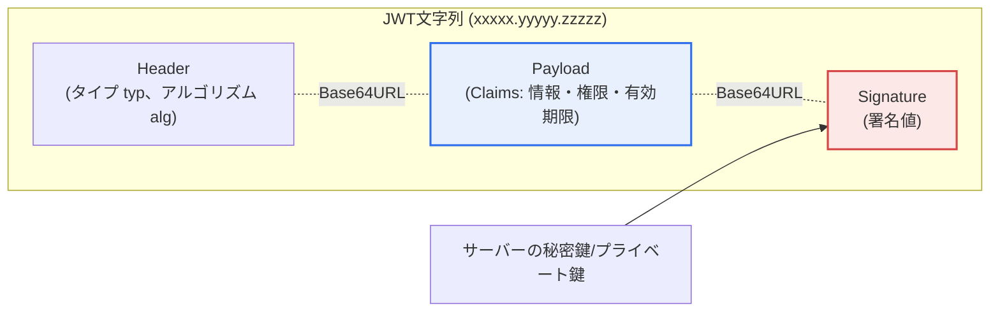
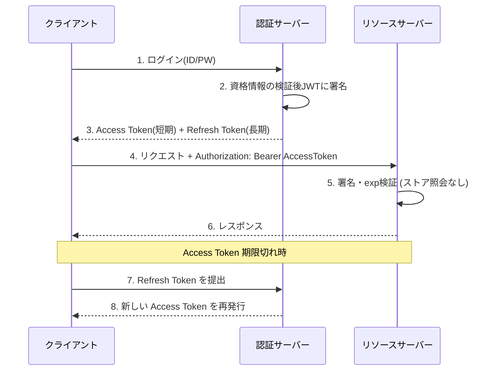

# JWT(JSON Web Token)

## 1. 概要

### A. 概念
> **JWT**とは、認証・認可に必要な**情報(Claims)をJSON形式で格納し、デジタル署名したトークン**であり、サーバーがセッションを保存しなくても(ステートレス、Stateless)ユーザーを認証できるようにする標準(RFC 7519)のトークンである。ドット(.)で区切られた3つの部分をBase64URLでエンコードし、一つの文字列(`xxxxx.yyyyy.zzzzz`)として表現する。

JWTが広く使われる根本的な理由は、「**サーバーがログイン状態を記憶しなくてもよくなる**」という点にある。この発想の背景を理解するには、まず従来のセッション方式が抱える構造的な負担を押さえておく必要がある。セッション方式では、ユーザーがログインするとサーバーがセッション識別子(Session ID)を発行し、そのセッションの実際の状態(ユーザーID・権限・ログイン時刻など)をサーバーのメモリやDB、別途のセッションストアに保管する。以降、リクエストのたびにクライアントが送ってきたセッションIDでストアを照会してユーザーを確認する。つまり「信頼できる唯一の情報源(Source of Truth)」はサーバー側のストアにある。

この構造は単一サーバーでは問題ないが、サーバーが複数台ある分散・クラウド環境ではすぐにボトルネックとなる。リクエストがどのサーバーにルーティングされるか分からないため、すべてのサーバーが同じセッションを参照できなければならず、そのためにはスティッキーセッション(Sticky Session)で特定のサーバーに固定するか、Redisのような中央セッションストアを置いて共有する必要がある。前者はロードバランシングと無停止デプロイを妨げ、後者はストアが単一障害点(SPOF)かつ性能のボトルネックとなる。トラフィックが毎秒数万件に達すると、リクエストのたびに発生するセッション照会そのものが負担となる。

JWTはこの発想を逆転させる。認証に必要な情報を**トークン自体に格納して署名**した後、このトークンをクライアントが保管し、リクエストのたびに提出する。サーバーはトークンの署名を検証するだけでよく、別途ストアを照会する必要がない。署名が有効であればトークンの内容を信頼する。このように信頼できる情報源をサーバーのストアからトークン自体へと移すことで、サーバーは状態を持たなくなり(Stateless)、どのサーバーにリクエストが届いても検証するだけでよい。そのため、MSA・APIゲートウェイ・モバイル・SPAのように、サーバーが水平スケールする分散環境の認証によく適している。ただし、この自己完結性には代償が伴う — 発行されたトークンは有効期限が切れるまでサーバーが強制的に無効化することが難しいという特性であり、このトレードオフがその後の設計全般を左右する。

### B. 特徴
JWTの特徴は4つに要約される。第一に、**サーバーのステートレス性(Stateless)** — サーバーがセッションを保管しないため、水平スケールが容易である。第二に、**自己完結性(Self-contained)** — 検証に必要な情報がトークンの中に含まれているため、外部への照会なしに処理される。第三に、**署名に基づく完全性(Integrity)** — 署名によって改ざんを検知するが、署名は「内容を隠すこと(機密性)」ではなく「内容が変更されていないことを保証すること(完全性)」であるという点が核心である。第四に、**可搬性(Portability)** — JSON・Base64URLという汎用フォーマットであるため、言語・プラットフォーム・ドメインを越えて通用する。これらの特徴は相互にかみ合っており、ステートレス性が拡張性を生み、自己完結性がステートレス性を可能にし、その代償として無効化の難しさという限界も併せて生む。

## 2. JWTの構造と構成要素

JWTは、Header、Payload、Signatureの3つの部分がドット(.)でつながった構造である。以下は全体構造図である。

**A. Header(ヘッダー).** ヘッダーはトークンのメタデータを格納する。トークンのタイプを示す`typ`(通常は`JWT`)と、署名に使われたアルゴリズムを示す`alg`(例:`HS256`、`RS256`)が中核となるフィールドである。ヘッダーがなぜ重要かというと、検証する側が「どのアルゴリズムで検証すべきか」をここから読み取るためである。まさにこの点が、有名なセキュリティ脆弱性の出発点でもある。攻撃者が`alg`を`none`に変えたり(署名検証の省略)、非対称方式(RS256)を対称方式(HS256)にすり替えて公開鍵を秘密鍵のように悪用したりする攻撃が知られている。したがって実務では、サーバーはヘッダーの`alg`をそのまま信頼せず、許可するアルゴリズムをサーバー設定で固定(Allowlist)して検証しなければならない。

**B. Payload(ペイロード)とClaims.** ペイロードは、実際の情報であるクレーム(Claim)の集合である。クレームは3種類に分けられる。**登録済みクレーム(Registered)**は標準が定めた予約語であり、`iss`(発行者)、`sub`(主体)、`aud`(対象)、`exp`(有効期限)、`iat`(発行時刻)、`nbf`(有効化時刻)、`jti`(トークン固有ID)がある。**パブリッククレーム(Public)**は衝突を避けるためにURIなどで名前を定めたものであり、**プライベートクレーム(Private)**は発行者と利用者が合意したユーザー定義の値(例:`role`、`dept`)である。ここで必ず覚えておくべき原則は、**ペイロードは署名されるだけで暗号化されない**という点である。Base64URLはエンコーディングであって暗号化ではないため、誰でもデコードして内容を読むことができる。したがって、パスワード・住民登録番号・カード番号のような機密情報は絶対に格納してはならず、格納する必要がある場合はJWE(JSON Web Encryption)で別途暗号化しなければならない。

**C. Signature(署名).** 署名は`Base64URL(Header) + "." + Base64URL(Payload)`を入力として、サーバーが保有する鍵で生成する。共通鍵方式(HS256)は一つの秘密鍵で署名・検証の両方を行い、公開鍵方式(RS256・ES256)はプライベート鍵で署名し公開鍵で検証する。署名の役割は完全性の保証である — ペイロードを1文字でも変えれば署名が一致しなくなり、検証が失敗する。そのため、署名鍵の管理がJWTセキュリティの急所である。HS256で秘密鍵が漏洩すれば攻撃者は任意のトークンを偽造でき、鍵が短ければ総当たり攻撃で破られる。複数のサービスが検証だけを行うMSA環境では、検証側に公開鍵だけを配布すればよいRS256が、鍵の露出リスクを減らすより安全な選択となる。

もう一つ留意すべき点は**トークンのサイズ**である。ペイロードに権限・ロール・部署などのクレームを多く格納するほどトークンは大きくなり、このトークンはリクエストのたびにHTTPヘッダーに載せてやり取りされる。例えばクレームを過度に入れてトークンが数KBに達すると、毎秒数千リクエストの環境では累積帯域幅とヘッダー解析コストが無視できなくなる。一部のWebサーバー・プロキシはヘッダーサイズの上限(例:8KB)を設けているため、トークンがこれを超えるとリクエスト自体が拒否されることもある。したがってペイロードには認証・認可に本当に必要な最小限のクレームだけを格納し、詳細な情報は必要に応じてサーバーが照会するよう設計するのが望ましい。

以下の表は3つの構成要素を整理したものであり、各要素の「なぜ」は上記の段落で説明した。

| 構成 | 内容 | 実務上の留意点 |
|---|---|---|
| **Header** | トークンタイプ(`typ`)、署名アルゴリズム(`alg`) | `alg`の偽装防止のため許可アルゴリズムをサーバーで固定 |
| **Payload** | クレーム(登録済み/パブリック/プライベート): ユーザー・権限・`exp`など | 暗号化ではない → 機密情報は禁止、`exp`は必須 |
| **Signature** | Header+Payloadを鍵で署名 | 鍵管理が急所、MSAではRS256を推奨 |

## 3. 認証・認可フローとトークン戦略

以下は、ログインからリクエストの検証、そして期限切れ時の再発行までのプロセスの詳細図である。

**A. 発行と提出.** ユーザーがIDとパスワードでログインすると、認証サーバーは資格情報を検証した後、情報を格納して署名したJWTを発行する。クライアントはこれを保管し、以降のリクエストのHTTPヘッダーに`Authorization: Bearer <token>`の形で載せて送る。リソースサーバーは署名と有効期限を検証するだけでよいため、セッションストア照会という往復コストがなくなる。実際に大規模なAPIでは、この違いがレスポンスの遅延とストアの負荷を目に見えて減らす。

**B. 保存場所のトレードオフ.** クライアントがトークンをどこに置くかは、セキュリティ設計の中核的な決定である。**ローカルストレージ**は扱いやすいが、JavaScriptからアクセスできるため、XSS(クロスサイトスクリプティング)攻撃によってトークンが丸ごと窃取される恐れがある。逆に**`HttpOnly` Cookie**はスクリプトからのアクセスを防ぐためXSSに強いが、ブラウザが自動的にCookieを付けて送る特性のため、CSRF(クロスサイトリクエストフォージェリ)にさらされる。そのため実務では、`HttpOnly`+`Secure`+`SameSite`のCookieにトークンを置き、CSRFトークンを併用する方式がよく推奨される。どちらも万能ではないため、脅威モデルに合わせて選択しなければならない。

**C. アクセス・リフレッシュトークン戦略.** JWTの最大の弱点である「強制無効化の難しさ」を緩和する標準的なパターンが、二重トークン構造である。**アクセストークン**は寿命を短く(例:5〜15分)設定し、窃取されても被害時間を最小化する。その代わり、ユーザーが毎回ログインする不便をなくすために、寿命の長い**リフレッシュトークン**(例:数日〜数週間)を別途発行し、アクセストークンが期限切れになるとこれを提出して新しいアクセストークンを再発行してもらう。リフレッシュトークンは窃取時の被害が大きいため、サーバーが保存・管理(ローテーション Rotation、再利用検知)し、この点でJWTは完全なステートレス性を一部譲り、サーバーの状態を再び導入する。つまり実務のJWTは「純粋なステートレス」ではなく、「ステートレスの利点と無効化の統制との間の均衡点」を選択している。

**D. 寿命設定の定量的トレードオフ.** トークンの寿命は、セキュリティと使いやすさの間の比較衡量である。例えばアクセストークンの寿命を60分に延ばすと再発行の呼び出しが減りサーバーの負荷と遅延は下がるが、トークンが窃取されると最大60分間不正アクセスが可能になる。逆に寿命を5分に縮めると窃取被害のウィンドウ(Window)は12分の1に縮まるが、認証サーバーへの再発行トラフィックはおよそ12倍になる。そのため実務では、リスクの高いドメインほどアクセストークンを数分単位で短く設定し、リフレッシュトークンのローテーションで使いやすさを保つ。このように「何分」という一つの数字がセキュリティ・性能・使いやすさを同時に規定するため、寿命の設定はドメインのリスク評価に基づいて決定しなければならない。

## 4. セッション方式との比較

比較の核心は「信頼できる情報源がどこにあるか」である。セッションはサーバーのストアに、JWTはトークン自体に置く。この一つの違いから、拡張性・無効化・データ露出のすべての違いが派生する。

| 区分 | セッション(Session) | JWT |
|---|---|---|
| **状態の保存** | サーバー(ストア)で保管 | クライアントがトークンを保管、サーバーはステートレス |
| **拡張性** | セッションの共有・同期が必要(負担) | 水平スケールが容易 |
| **無効化** | ストアから即時削除が可能 | 期限切れ前の強制破棄が困難 |
| **リクエストコスト** | リクエストごとにストアを照会 | 署名検証のみ(照会なし) |
| **データ露出** | サーバーで保管(露出が少ない) | ペイロードをデコード可能(機密情報は禁止) |

セッションが無効化に強いのは、情報源がサーバーにあるため削除すれば済むからであり、JWTが無効化に弱いのは、情報源がすでにクライアントの手元のトークンに複製されており、サーバーにはそれを回収する手段がないからである。逆に拡張性でJWTが勝る理由も同じ根に由来する — サーバーが保持すべき状態がないため、サーバーを自由に増やせるのである。実務上の含意は明確である。即時の強制ログアウト・セッション無効化が頻繁に必要なバンキング・管理者コンソールではセッション(またはセッションとの併用)が有利であり、大規模なステートレスAPI・MSAではJWTが有利である。したがって答えは「どちらが優れているか」ではなく、「何を最適化するか」である。

## 5. 深化:最新動向と実務適用事例

**A. OAuth 2.0・OIDCとの結合.** 今日のJWTは単独で使われるよりも、**OAuth 2.0**のアクセストークンのフォーマットや**OpenID Connect(OIDC)**のIDトークンのフォーマットとして標準化されて使われている。OIDCのIDトークンは事実上JWTであり、`iss`・`aud`・`exp`・`sub`のようなクレームによって「誰が認証したか」を標準的に伝達する。Google・Apple・Kakaoなどのソーシャルログイン、そしてAuth0・Okta・KeycloakのようなIdP(Identity Provider)は、いずれもこの組み合わせを基盤としている。大規模サービスでは、IdPが公開鍵の一覧を**JWKS(JSON Web Key Set)** エンドポイントで公開し、各リソースサーバーがこれをダウンロードしてトークンを検証する。この方式は鍵のローテーション(Key Rotation)を検証側のコード変更なしに可能にし、数十〜数百のマイクロサービスで構成される環境の鍵管理を簡素化する。

**B. MSA・ゼロトラストにおける実務事例.** Netflix・Uberなどに代表される大規模MSAでは、APIゲートウェイでJWTを一次検証し、内部のサービス間呼び出しでもトークンを伝播(Token Propagation)させ、各サービスが独立して認可を判断する。これは「内部ネットワークは信頼する」という境界型セキュリティを捨て、**すべてのリクエストを検証**するゼロトラストの原則と通じている。ただし、自己完結型トークンの無効化の限界のため、実務ではアクセストークンの寿命を数分単位で短く設定し、リフレッシュトークンのローテーションと窃取検知を組み合わせることが定着したパターンである。ゲートウェイがトークンを検証した後に内部ではより軽量な形で再署名したり、サービスメッシュ(Service Mesh)の相互TLS(mTLS)でサービス間の信頼を別の階層で保証したりする組み合わせも広く用いられている。

**C. 予想出題方向と答案構成戦略.** 技術士の観点では、JWTは「概念説明」だけでは不十分であり、① セッションとのトレードオフ(拡張性 vs 無効化)、② ペイロードが暗号化ではなく署名であることを根拠としたセキュリティ設計(機密情報の禁止・HTTPS・`exp`)、③ アクセス/リフレッシュの二重トークンとローテーション、④ OAuth2/OIDC・MSA・ゼロトラストへの拡張までを結び付けて記述してこそ高得点となる。`alg`混同攻撃(none・RS↔HS)や保存場所(XSS vs CSRF)のような具体的な脅威を根拠とともに提示すれば、深化の深さを示すことができる。

## 6. 考慮事項および示唆点

技術士の観点では、JWTは単一技術の採否ではなく、拡張性・セキュリティ・運用の複雑さという相反する要因をドメインの文脈でいかに均衡させるかという問題である。以下の示唆点は、その均衡を取るための判断基準を整理したものである。

1. **セキュリティ設計は選択ではなく前提である。** ペイロードは暗号化されないため機密情報を入れず、必ずHTTPS(TLS)で送信し、強力な署名アルゴリズムと十分に長い鍵を使用し、ヘッダーの`alg`をサーバーが許可リストで固定してアルゴリズム混同攻撃を遮断しなければならない。`exp`・`aud`・`iss`の検証を漏らさないことも基本である。

2. **無効化の限界をアーキテクチャで補う。** 発行されたJWTは期限切れ前の強制破棄が難しいため、ログアウト・窃取への対応として、短いアクセストークンの寿命、リフレッシュトークンのローテーション・再利用検知、`jti`に基づくブラックリスト(またはトークンのバージョン・発行時刻によるカットオフ)を組み合わせる。これは純粋なステートレス性を一部放棄する意思決定であるため、ステートレスの利点と統制の必要性との間で均衡点を明示的に選択しなければならない。

3. **保存場所と脅威モデルを併せて設計する。** ローカルストレージ(XSSに脆弱)と`HttpOnly` Cookie(CSRFに脆弱)はそれぞれ異なる脅威にさらされるため、サービスの脅威モデルに合わせて保存場所を決め、XSS対策(CSP・入力検証)・CSRF対策(SameSite・CSRFトークン)を併用しなければならない。

4. **標準・エコシステムとの整合を追求する。** 独自の認証を作るよりも、OAuth 2.0・OIDC・JWKSのような検証済みの標準とIdPを採用するほうが、鍵のローテーション・相互運用性・監査の面で有利である。特にMSAでは、検証側に公開鍵だけを配布するRS256/ES256とJWKSの組み合わせが鍵の露出リスクを減らす。

5. **適正技術の選択という観点を維持する。** JWTは万能ではない。即時の無効化・強制ログアウトが頻繁なドメインではセッションまたは併用方式のほうが適している場合があるため、拡張性・無効化・運用の複雑さという軸でセッションと比較し、ドメインに合った方式を選択することが技術士の判断である。[[msa]]

## 参考資料
- RFC 7519, JSON Web Token (JWT) — https://datatracker.ietf.org/doc/html/rfc7519
- RFC 8725, JSON Web Token Best Current Practices — https://datatracker.ietf.org/doc/html/rfc8725
- OWASP JSON Web Token Cheat Sheet — https://cheatsheetseries.owasp.org/cheatsheets/JSON_Web_Token_for_Java_Cheat_Sheet.html

---

> **一言まとめ**: JWTは*認証情報を格納して署名したステートレスなトークン*であり、Header・Payload・Signatureで構成され、信頼できる情報源をトークン自体に置くことでMSA・API認証に優れるが、ペイロードが暗号化ではなく署名であるという点・強制無効化の限界を、HTTPS・短い有効期限・リフレッシュトークンのローテーション・標準(OAuth2/OIDC)との結合によって補わなければならない。
