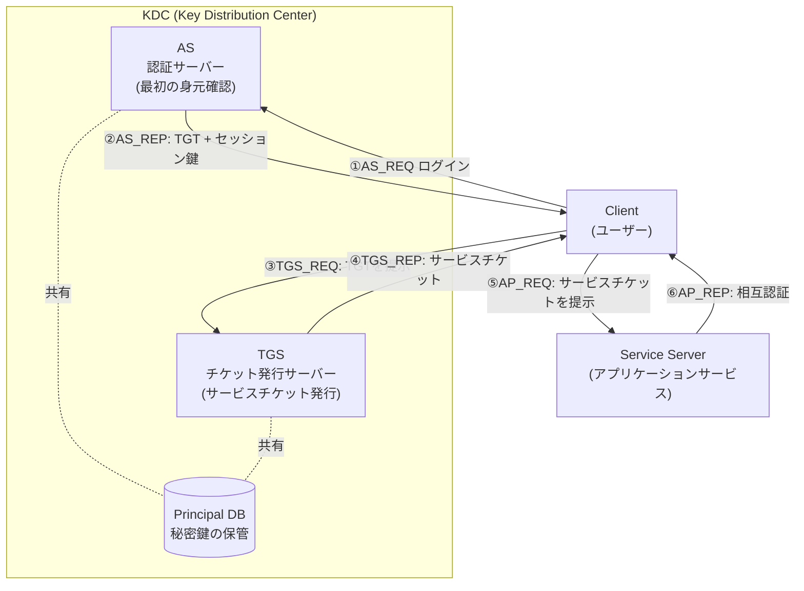
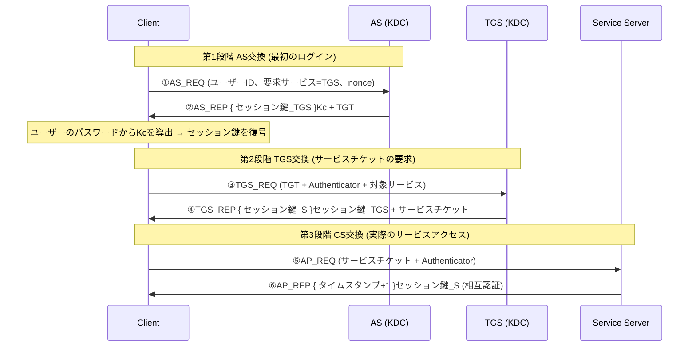

# Kerberos認証プロトコル

## 1. 概要

> **Kerberos**とは、信頼できる第三者(TTP、Trusted Third Party)である**KDC(Key Distribution Center)**を中心に、共通鍵暗号と**チケット(Ticket)**ベースの資格情報を用いて、オープンなネットワーク上でユーザー・サービスを相互認証する**ネットワーク認証プロトコル**である。

Kerberosは1980年代にMITのAthenaプロジェクトで始まり、信頼できない(untrusted)ネットワーク上でも安全に認証を行うために設計された。名前はギリシャ神話で冥界の門を守る3つの頭を持つ犬「ケルベロス」に由来するが、これはKerberosが**クライアント・サーバー・KDC**という3つの主体の相互作用によって認証を成立させるという構造を暗喩している。現在広く使われているバージョンはRFC 4120(2005)で標準化された**Kerberos v5**であり、Microsoft **Active Directory**のドメイン認証の基本プロトコルであるとともに、Linux・UNIX環境におけるSSOの基盤技術として定着した。

Kerberosが登場した根本的な背景は、**平文パスワード送信の危険性**と**繰り返し認証の非効率**である。初期のTelnet・FTP・rloginなどは認証のたびにネットワーク上にパスワードを流しており、スニッフィング(sniffing)に対して無防備であった。また、ユーザーが複数のサービスにアクセスするたびに資格情報を入力・送信することは、使いやすさとセキュリティの両方にとって有害であった。Kerberosは、**パスワードをネットワークで送信せず**(パスワードから導出した共通鍵で暗号文を復号できるかどうかで身元を証明)、**一度のログインで複数のサービスにアクセスする**(SSO)という2つの目標を同時に達成する。

Kerberosの設計思想は3つの原理に要約される。第一に、**共通鍵暗号だけで相互認証**を実現し、公開鍵基盤(PKI)の複雑な証明書管理なしに動作する。第二に、**KDCがすべての主体の秘密鍵を保管**する中央の信頼点の役割を果たし、N個の主体がそれぞれKDCとだけ鍵を共有すればよいため、N×Nの個別鍵交換の問題を回避する。第三に、**タイムスタンプ(timestamp)と短い寿命のチケット**によってリプレイ攻撃(replay)を防止する。これら3つの原理のおかげで、Kerberosは大規模組織の内部ネットワークにおいてスケーラブルな認証インフラとして機能する。

Kerberosの特徴を整理すると次のとおりである。

- **パスワード非送信(Passwordless on wire):** パスワードから導出した共通鍵による復号の成否で身元を確認し、パスワード自体はネットワークに送らない。
- **SSO(Single Sign-On):** 最初の1回のログインで取得したTGTを再利用して複数のサービスチケットを受け取るため、繰り返しの認証が不要である。
- **相互認証(Mutual Authentication):** クライアントだけでなくサーバーもセッション鍵の所有を証明し、偽装サーバー(フィッシング型)への接続を防止する。
- **共通鍵に基づく拡張性:** 各主体がKDCとだけ鍵を共有すればよいため、組織の規模が大きくなっても鍵管理は線形に保たれる。
- **時刻依存性:** リプレイ防御をタイムスタンプに依存するため、精密な時刻同期が動作の前提条件となる。

## 2. Kerberosの構成要素と全体構造

Kerberosは、認証を担うKDCと、それを利用するクライアント・サービスサーバーで構成される。KDCは論理的に**AS(Authentication Server、認証サーバー)**と**TGS(Ticket Granting Server、チケット発行サーバー)**の2つの機能に分かれ、すべての主体(principal)の長期秘密鍵を格納した**データベース**を共有する。この分離構造がKerberosの核心であり、ASは「最初の1回のログイン」を、TGSは「個別サービスへのアクセス」を担当し、パスワードの露出を最小化する。

中核となる構成要素を文章で説明すると、次のとおりである。

**A. KDCとRealm.** KDCはKerberosの心臓部であり、組織のすべてのユーザー・サービスのマスター鍵を保管する。一つのKDCが管轄する管理ドメインを**Realm(レルム)**といい、慣例として大文字で表記する(例:`EXAMPLE.COM`)。一つのRealm内ではKDCがすべての主体の鍵を知っているため、仲介者として見知らぬ2つの主体の間にセッション鍵を安全に配布できる。ただしこれは、**KDCが単一障害点(SPOF)であり、かつ最も価値の高い標的**であることを意味する。KDCが侵害されるとRealm全体の身元が偽造可能になるため、実務ではマスターKDCと複数の読み取り専用の複製KDC(slave)を置いて可用性を確保し、KDCサーバーを物理的・論理的に強く隔離する。

**B. TicketとTGT.** チケットとは、「このクライアントがこのサービスにアクセスしてよい」ことをKDCが保証する暗号化された資格情報である。チケットの内部にはクライアントの身元、セッション鍵、有効期間、発行時刻などが格納され、**対象サービスの秘密鍵で暗号化**されているため、クライアントはその内容を読むことができず、ただ伝達するだけである。特に、ASが最初のログイン時に発行するチケットを**TGT(Ticket Granting Ticket)**といい、これは以後TGSから個別のサービスチケットを受け取るための「万能の通行証」である。TGTの導入こそがKerberosの決定的なアイデアであり、ユーザーはログイン時にただ一度だけパスワード由来の鍵を使い、その後はTGTだけを提示するため、パスワードが繰り返し露出することがない。

**C. セッション鍵(Session Key)とAuthenticator.** セッション鍵とは、特定の通信セッションの間だけ有効な一時的な共通鍵であり、KDCが生成して双方に安全に伝達する。クライアントはサービスにアクセスする際、チケットとともに**Authenticator**を送るが、これはクライアントの身元と**現在のタイムスタンプ**をセッション鍵で暗号化したものである。サーバーはチケット内のセッション鍵でAuthenticatorを復号し、タイムスタンプの新鮮さ(freshness)を検証することで、チケットを傍受した攻撃者が後から再送信することを防ぐ。チケットは再利用可能だが、Authenticatorはリクエストごとに使い捨てであるという点がリプレイ防御の核心である。このときサーバーは、短い時間枠(replay cache)の中ですでに見たAuthenticatorを記憶し、同一タイムスタンプの重複提出を除外するため、時間枠内の超高速な再送信まで遮断する。

**D. チケットオプション(フラグ)と寿命管理.** チケットには用途を制御するフラグが付けられる。**renewable(更新可能)** チケットは、最大寿命(max renew)の範囲内で期限切れ前にKDCへ再提出して有効期間を延長できるため、長時間のバッチ処理中の再認証を避けつつ、各チケットの絶対的な寿命は短く保つ。**forwardable(転送可能)** チケットは、ユーザーが接続したリモートサーバーがユーザーに代わって別のサービスにアクセスすること(委任、delegation)を許可するものであり、多階層アプリケーション(Web→WAS→DB)で最終ユーザーの身元を後段に伝達するために使われる。ただし委任は、サーバーがユーザーの資格情報を代行する分だけ悪用のリスクがあるため、実務では**制約付き委任(Constrained Delegation)**によって委任先を特定のサービスに限定する。チケットの寿命は短いほど窃取時の被害ウィンドウが縮まるが再発行の負荷が増えるという典型的なトレードオフであるため、組織はセキュリティレベルに応じて、TGT 10時間・サービスチケット数時間といったポリシー値を調整する。

## 3. Kerberos認証手順 (詳細)

Kerberos v5の認証は、論理的に**AS交換 → TGS交換 → CS(Client/Server)交換**の3段階・6メッセージで構成される。以下のシーケンスは、各メッセージでどの鍵で何が暗号化されるかを示している。

**A. AS交換 — 最初の認証とTGTの取得.** ユーザーがログインすると、クライアントはASに自身のIDと「TGSサービスを利用する」という要求、そしてリプレイ防止用の乱数(nonce)を格納して`AS_REQ`を送る。注目すべき点は、**パスワードを送らない**ことである。ASはDBからユーザーの秘密鍵(パスワードハッシュから導出、`Kc`)を取り出して応答`AS_REP`を構成するが、ここには(a) クライアントとTGSが使うセッション鍵を`Kc`で暗号化した部分と、(b) TGSの秘密鍵で暗号化された**TGT**が含まれている。クライアントは、ユーザーが入力したばかりのパスワードから`Kc`を生成して(a)の復号に成功すれば、それがすなわち自分が本物のユーザーであることの証明となる。もしパスワードが間違っていれば復号に失敗して認証は成立しないため、ASはパスワード自体を検証する必要がなく、「復号の成否」によって身元を確認する。この点が、Kerberosがパスワードをネットワークに流さずに認証する原理である。

ここで実務上留意すべき点は、事前認証(pre-authentication)がなかった初期の設計では、攻撃者が任意のユーザーIDで`AS_REQ`を送り、`Kc`で暗号化された応答を受け取って**オフライン辞書攻撃(AS-REP Roasting)**を試みることができたということである。そこでKerberos v5は、クライアントがリクエスト時にタイムスタンプを`Kc`で暗号化して添付する**PA-ENC-TIMESTAMP事前認証**を導入し、正しいパスワードを知っている者だけが有効なリクエストを作れるよう強化した。

**B. TGS交換 — サービスチケットの取得.** 次にクライアントは、特定のサービス(例:ファイルサーバー)にアクセスしようとする。クライアントは先に受け取ったTGTと、セッション鍵で暗号化したAuthenticator、そしてアクセス対象のサービス名を格納して`TGS_REQ`を送る。TGSは自身の鍵でTGTを復号してその中のセッション鍵を取得し、そのセッション鍵でAuthenticatorを復号してタイムスタンプの新鮮さを検証する。検証に成功すると、TGSは新しい**サービスセッション鍵**を生成し、これを(a) TGTのセッション鍵で暗号化した部分と、(b) 対象サービスの秘密鍵で暗号化した**サービスチケット**として構成し、`TGS_REP`を返す。この段階の妙味は、**パスワードが再び不要である**という点である。ユーザーはログイン時に一度だけパスワードを使い、その後は複数のサービスチケットをTGTだけで受け取るため、これこそがSSOの実現である。

**C. CS交換 — サービスへのアクセスと相互認証.** クライアントは、サービスチケットと新しいAuthenticatorを格納してサービスサーバーに`AP_REQ`を送る。サーバーは自身の秘密鍵でサービスチケットを開いてセッション鍵を取得し、その鍵でAuthenticatorを復号してタイムスタンプを検証する。これによりサーバーはクライアントを認証する。さらに**相互認証(mutual authentication)**が必要な場合、サーバーはAuthenticatorのタイムスタンプに1を加えてセッション鍵で暗号化した`AP_REP`を返し、クライアントはこれを復号して、サーバーが本物のセッション鍵を知っている(=偽装サーバーではない)正当なサーバーであることを確認する。以降、双方は確立されたセッション鍵によって機密性・完全性が保証された通信を続ける。

## 4. 比較 — Kerberos vs. 他の認証方式

Kerberosの位置付けは、他の認証方式と対比するときに明確になる。以下の表は補助的な整理であり、違いが生じる理由はその下の文章で説明する。

| 区分 | Kerberos | PKI/証明書(X.509) | SAML/OAuth・OIDC | 単純なパスワード |
|------|----------|-------------------|------------------|----------------|
| 信頼モデル | 共通鍵・中央KDC(TTP) | 公開鍵・CA階層 | IdP中心のトークン | なし(サーバーに保存) |
| 暗号方式 | 共通鍵 | 公開鍵 | 署名付きトークン(JWTなど) | ハッシュで保存 |
| 主な適用 | 組織内部ネットワークのSSO | インターネット・電子署名 | Web・クラウドのSSO | 小規模 |
| リプレイ防御 | タイムスタンプ・短いチケット | nonce・署名 | トークンの有効期限・nonce | 脆弱 |
| 拡張性の限界 | Realmの境界・時刻同期 | 証明書管理の負担 | IdPへの依存 | 非常に低い |

KerberosとPKIの根本的な違いは、**鍵管理の方式**に由来する。Kerberosは共通鍵であるためKDCがすべての鍵を知っていなければならず、組織の境界内(Realm)では強力だが、互いを知らないインターネット上の任意の2主体間の認証には不向きである。一方PKIは公開鍵であるため、事前に鍵を共有していない見知らぬ主体間でもCAの署名によって信頼を伝達でき、インターネットの電子商取引・電子署名に使われる。したがって、銀行内部の職員システムのSSOにはKerberos(AD)が、対外的なWeb決済・公的電子署名にはPKIが適している。

この違いを数値で感覚的に捉えると、PKIは主体数Nに対してそれぞれ証明書1枚(公開鍵)があれば十分だが、共通鍵を任意の2主体が直接共有する方式ではN(N-1)/2個の鍵が必要となる。KerberosはこのためにKDCという中央点を経由することで、**N個の鍵だけで(各主体-KDC間に1個)**任意のペアの認証を仲介するため、数千人規模の組織でも鍵管理が爆発的に増えない。これが、Kerberosが内部ネットワークにおける大規模SSOの事実上の標準となった拡張性の根拠である。

KerberosとSAML/OIDCの関係は、置き換えではなく**階層的な補完**に近い。Kerberosは内部ネットワークのOS・サービスレベルの認証に強いが、ファイアウォールを越えるWeb・クラウド環境では、時刻同期の要求とファイアウォール通過の問題から扱いが難しい。そのため大企業は、社内ではKerberos(AD)で一次認証した後、**AD FS**やKeycloakのようなIdPがそれをSAML・OIDCトークンに変換し、クラウドSaaS(例:Microsoft 365、Salesforce)と連携するハイブリッドSSOを構成する。実際に韓国の多くの金融・公共機関が、この方式でオンプレミスのADとクラウドサービスを連携している。

## 5. 深化 — 実務適用、攻撃手法と防御

Kerberosは理論的には堅牢なプロトコルであるが、実際のセキュリティ事故は、プロトコルの数学的欠陥よりも**運用・実装上の抜け穴**から発生する。本節では、最も広く使われている実装であるActive Directoryを中心に、代表的な攻撃手法と防御、そして暗号アルゴリズムの近代化の流れを見ていく。

**A. Active DirectoryにおけるKerberos.** Windowsドメインでは、ドメインコントローラー(DC)がKDCの役割を果たし、各サービスは**SPN(Service Principal Name)**として登録され、サービスアカウントのアクセス権限はチケット内の**PAC(Privilege Attribute Certificate)**に格納されたグループSIDによって伝達される。ユーザーがドメインにログインするとTGTを受け取り、共有フォルダ・SQL Server・SharePointなどにアクセスするたびに裏側で自動的にサービスチケットが発行され、ユーザーは再ログインなしにリソースを利用する。これが、組織で体感する「一度ログインすれば何でも使える」というSSO体験の実体である。

**B. 代表的な攻撃と防御.** Kerberosは堅牢であるが、運用上の脆弱性が攻撃対象領域となる。① **Pass-the-Ticket**はメモリから窃取したチケットを再利用する攻撃であり、チケット寿命の短縮とエンドポイント保護(資格情報の隔離)によって緩和する。② **Golden Ticket**は、KDCのマスターアカウント`krbtgt`のハッシュを窃取して任意のTGTを偽造する致命的な攻撃であり、`krbtgt`のパスワードを定期的に(2回)リセットすることが事実上唯一の根本的な対策である。③ **Silver Ticket**は、特定のサービスアカウントの鍵でサービスチケットだけを偽造する局所的な攻撃であり、④ **Kerberoasting**は、SPNが設定されたサービスアカウントのサービスチケットを要求し、オフラインでそのアカウントのパスワードをクラッキングする手法であって、サービスアカウントに長く複雑なパスワード(またはgMSA、グループ管理サービスアカウント)を使うことが防御策である。これらの攻撃の大半は、**弱いサービスアカウントのパスワード・過度なチケット寿命・krbtgt管理の不備**に起因するため、防御の焦点はプロトコルそのものよりも運用上の衛生管理にある。以下の表は、主な攻撃と防御を整理したものである。

| 攻撃 | 原理 | 標的となる鍵 | 中核となる防御 |
|------|------|---------|-----------|
| Pass-the-Ticket | 窃取した有効なチケットの再利用 | セッションチケット | チケット寿命の短縮・資格情報の隔離 |
| Golden Ticket | krbtgtハッシュによるTGTの偽造 | krbtgt | krbtgtの定期的な2回リセット |
| Silver Ticket | サービス鍵によるサービスチケットの偽造 | サービスアカウント | サービスアカウント鍵の保護・モニタリング |
| Kerberoasting | サービスチケットのオフラインクラッキング | サービスアカウントPW | 長いパスワード・gMSA・AESの強制 |
| AS-REP Roasting | 事前認証未設定アカウントのクラッキング | ユーザーPW | PA-ENC-TIMESTAMP事前認証の強制 |

**C. クロスRealm認証(Cross-Realm).** 大規模・多国籍の組織は複数のRealmに分かれているが、あるRealmのユーザーが別のRealmのサービスにアクセスするには、2つのKDCが**Realm間信頼鍵(inter-realm key)**を共有しなければならない。ユーザーは自身のKDCから相手RealmのTGSを対象とした「クロスRealm TGT」を受け取って相手RealmのKDCに提示し、相手のKDCがそれを信頼してサービスチケットを発行する。Realmが多くなると、すべてのペアごとに信頼鍵を置くことは非現実的であるため、**階層的な信頼(ツリー構造)**やADのツリー・フォレスト信頼関係によって経路を短縮する。実務では、韓国の大企業グループが親会社・系列会社のドメインをフォレスト信頼で結び、グループ共通システムにSSOでアクセスできるようにしているのがこの事例である。ただし、信頼経路が長いほど一つのRealmの侵害が連鎖的に伝播するリスクが大きくなるため、信頼関係の設計はセキュリティ境界の設計と直結する。

**D. 暗号アルゴリズムの近代化.** かつてのKerberosはDES・RC4-HMACのような脆弱な暗号をサポートしており、これがKerberoastingによるクラッキングを容易にしていた。現在の標準は**AES128/256-CTS-HMAC-SHA1**を基本とし、RFC 8009はSHA-2ベースのAES暗号スイートを追加した。実務では、ドメインポリシーでRC4・DESを無効化し、AESだけを許可するよう強制することが推奨される。また近年Microsoftは、共通鍵の限界を補うために公開鍵で初期認証を行う**PKINIT**や、スマートカード・**FIDO2**との連携を拡大しており、Kerberosが純粋な共通鍵モデルからハイブリッドへと進化していることを示している。

**E. 予想出題方向と答案構成戦略.** 情報管理技術士試験において、Kerberosは単独の25点論述だけでなく、10点の略述(TGTの役割、AS・TGSを分離する理由)、そしてSSO・ゼロトラスト・ADセキュリティと絡めた統合問題としてもよく変形されて出題される。答案を書く際には、(a) 3段階6メッセージの流れを、**どの鍵で何を暗号化するか**まで明示したシーケンス図で示し、(b)「なぜパスワードを送らなくても認証できるのか」「なぜTGTを導入したのか」という**設計上の理由を原理として記述**し、(c) Golden/Silver Ticket・Kerberoastingのような**攻撃と防御の対応**と、時刻同期・krbtgt管理のような運用上の課題で締めくくると、差別化が図れる。近年はパスワードレス(FIDO2)・ハイブリッドSSO・ゼロトラストとの連携が深化の論点として浮上しており、プロトコルの知識に加えてアーキテクチャの観点を併せて提示することが高得点の戦略である。

## 6. 考慮事項および示唆点 (技術士の観点)

- **時刻同期(Time Skew)の管理:** Kerberosはタイムスタンプでリプレイを防ぐため、クライアント・サーバー・KDC間の時刻誤差が許容値(デフォルト5分)を超えると認証に失敗する。したがって、**NTPを用いた精密な時刻同期が必須の前提**であり、大規模分散・グローバル環境では時刻同期インフラそのものが可用性の重要な要素となる。これはKerberos導入における隠れた運用コストである。

- **KDCの可用性・機密性の設計:** KDCは、SPOFであり最も価値の高い標的でもあるという二面性を持つ。可用性の面ではマスター-複製KDCの多重化と地域分散が、機密性の面ではKDCサーバーの隔離・最小権限・`krbtgt`の定期的な更新・特権アクセスのモニタリングが並行して行われなければならない。トレードオフとして、複製KDCを増やすと可用性は上がるが、鍵が複製されるノードが増えるため攻撃対象領域も同時に大きくなる。

- **境界と連携の戦略(ハイブリッドSSO):** Kerberosは内部ネットワークに最適化されているため、クラウド・モバイル・B2B環境には単独では不向きである。今後は、オンプレミスのKerberos(AD)とSAML/OIDC IdPを組み合わせた**ハイブリッドアイデンティティ**が標準アーキテクチャとなり、さらにユーザーの位置・デバイスの状態をアクセスのたびに評価する**ゼロトラスト**の流れの中で、Kerberosは「内部の一次認証」という役割として再定義されるであろう。

- **暗号の俊敏性(Crypto-Agility)とパスワードレス:** 脆弱な暗号(DES・RC4)を迅速に廃止し、AES・SHA-2へ移行できる暗号の俊敏性がセキュリティ水準を左右する。中長期的には、PKINIT・FIDO2・Windows Helloと組み合わせた**パスワードレス**認証が普及し、パスワードに基づくオフラインクラッキング(Kerberoasting類)の根本原因を取り除く方向へと進むであろう。技術士の観点からは、プロトコルの選択に劣らず、**運用上の衛生管理(アカウント管理・チケット寿命・モニタリング)が実際のセキュリティの成否を分ける**という点を答案で強調すべきである。

- **委任(Delegation)の統制と最小権限:** forwardableチケットに基づく委任は、多階層アプリケーションで最終ユーザーの身元を後段に伝達する利便性をもたらすが、サーバーがユーザーの資格情報を代行する分だけ、侵害時には権限拡散の経路となる。したがって、制約なしの委任を避け、**制約付き委任・リソースベースの制約付き委任(RBCD)**によって委任先を特定のサービスに限定し、委任アカウントを常時監査して最小権限の原則を貫かなければならない。利便性と攻撃対象領域の縮小との間の均衡が、委任設計の本質である。

- **モニタリング・検知と規制との連携:** Kerberosへの攻撃は正常なプロトコルの流れを悪用するため、ファイアウォールだけでは検知が難しく、異常なチケット要求パターン(大量のSPNチケット要求、RC4の強制使用、失効したアカウントのTGT使用など)をSIEMで相関分析する**振る舞いに基づく検知**が必要である。また、アカウント管理・アクセス制御・ログの保存は、ISMS-P・ISO/IEC 27001などの認証要求事項とも直結するため、Kerberosの運用ポリシーはセキュリティガバナンス体系の中で統合的に管理されてこそ、実質的な準拠性を確保できる。

## 参考資料

- RFC 4120, "The Kerberos Network Authentication Service (V5)" — https://datatracker.ietf.org/doc/html/rfc4120
- RFC 8009, "AES Encryption with HMAC-SHA2 for Kerberos 5" — https://datatracker.ietf.org/doc/html/rfc8009
- MIT Kerberos Documentation — https://web.mit.edu/kerberos/
- Microsoft, "Kerberos Authentication Overview" — https://learn.microsoft.com/en-us/windows-server/security/kerberos/kerberos-authentication-overview

---

> **一言まとめ**: Kerberosは、中央のKDC(AS・TGS)と共通鍵・チケット(TGT)・タイムスタンプを用いて、パスワードを露出させずに相互認証とSSOを実現する内部ネットワーク向けの認証プロトコルであり、時刻同期・KDCの保護・krbtgt管理といった運用上の衛生管理とハイブリッド連携が、実際のセキュリティの成否を左右する。
