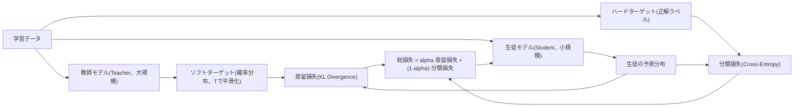
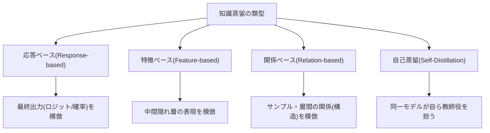

# 知識蒸留(Knowledge Distillation)

## 1. 概要

> **知識蒸留(Knowledge Distillation)**とは、大規模で高性能な教師モデル(Teacher)が学習した知識を、相対的に小さく軽量な生徒モデル(Student)が模倣するように学習させ、元のモデルに近い精度を維持しつつパラメータ数・演算量・メモリを大幅に削減する**モデル軽量化(Model Compression)**手法である。

ディープラーニングモデルの性能は、概ねパラメータ規模に比例して向上してきた。しかし数十億~数千億パラメータの大規模モデルは推論レイテンシ(latency)が大きく、GPUメモリと電力を過度に消費し、スマートフォン・IoT・自動車ECUのようなエッジ環境にはそのまま搭載することが難しい。実際、同一タスクでパラメータを10分の1にすれば推論コストと応答時間は数倍改善されるが、単純に小さなモデルをゼロから(scratch)学習させると表現力不足により精度が急落する。知識蒸留はこのジレンマを解決するために登場した。すなわち「小さなモデルをうまく学習させること」ではなく、「すでによく学習された大きなモデルの判断傾向を受け継がせること」が核心的な発想である。

蒸留が効果的である根本的な理由は、教師モデルの出力が正解か否か(0/1)よりもはるかに豊富な情報を含んでいるためである。例えば手書き数字「7」を分類する際、教師モデルは「7である確率0.92、1である確率0.05、9である確率0.02」のように、クラス間の類似度(dark knowledge、暗黙知)を確率分布として表現する。正解ラベル一つだけを与えるよりも、こうした**ソフトターゲット(Soft Target)**を併せて学習すれば、生徒モデルはクラス間の関係構造まで学び、汎化性能が向上する。2015年にヒントン(Hinton)らが提案して以来、蒸留は今日、sLLM(軽量言語モデル)、オンデバイスAI、リアルタイム推論サービスの標準的な軽量化手段として定着している。

## 2. 知識蒸留の基本構造と原理

蒸留の学習は二つの損失を組み合わせて行う。第一は**蒸留損失**であり、教師のソフトターゲットと生徒の出力分布との差をKLダイバージェンス(Kullback-Leibler Divergence)で最小化する。第二は一般的な**分類損失**であり、実際の正解(ハードターゲット)と生徒出力との交差エントロピーを最小化する。最終損失は両項を重みalphaで調整し、通常は蒸留損失により大きな比重を置いて教師の判断傾向を優先的に学習させつつ、正解信号で偏りを補正する。

この過程における核心的なハイパーパラメータが**温度(Temperature, T)**である。ソフトマックス関数をTで割って確率分布をなだらかに(soften)すると、本来0近くに押し潰されていた非正解クラス間の微細な確率差が浮かび上がる。T=1であれば通常のソフトマックスと同じであり、Tを2~5程度に大きくするとクラス間の相対的類似度情報が増幅され、生徒はより豊富な知識を吸収する。ただしTが過度に大きいと分布が一様になり、かえって信号が弱まるため、検証セットで最適値を探索しなければならない。学習時には教師・生徒の双方に同一のTを適用し、デプロイ(推論)時にはT=1に戻す。

例えば画像分類ベンチマークにおいて、教師(ResNet-50、約2,560万パラメータ)の知識を生徒(ResNet-18、約1,170万パラメータ)に蒸留すると、生徒を単独で学習させた場合より精度が1~3%pほど回復しつつ、推論速度は2倍以上高速になるという結果が報告されている。自然言語分野では、BERT-base(約1.1億パラメータ)を蒸留した**DistilBERT**が、パラメータを約40%削減し推論を約60%高速化しながらも、元の性能の約97%を維持した事例が代表的である。

## 3. 蒸留方式の類型

蒸留は、生徒が教師の「何を」模倣するかによって類型が分かれる。**応答ベース蒸留**は教師の最終出力(ロジット・確率)のみを模倣する最も古典的かつ単純な方式であり、教師の内部構造を知らなくてもよいため、異なるアーキテクチャ間でも適用が容易である。ただし最終出力のみを見るため、教師の内部推論過程に含まれる情報は活用できない。

**特徴ベース蒸留**は、教師の中間隠れ層(hidden layer)の表現(feature map)まで生徒が似るよう誘導する。生徒が教師の階層別表現を段階的に吸収するため、より精密な知識転移が可能であるが、教師・生徒の層構造と次元が異なるため、これを合わせる射影(projection)層が追加で必要となり、学習が複雑になる。**関係ベース蒸留**は個々の出力ではなく、データサンプル間の関係や層間の相関構造といった「関係的知識」を伝達し、教師が学習した埋め込み空間の幾何学的構造を保存する。

一方、**自己蒸留(Self-Distillation)**は別途の大規模な教師なしに、同一モデル(または深い層)が浅い層や前エポックの自分自身を教師として学習する変形であり、教師の学習コストをなくしつつ正則化(regularization)効果によって性能を引き上げる。近年の大規模言語モデルでは、強力なモデルが生成した回答・推論過程をデータ化して小さなモデルを学習させる**シーケンスレベル蒸留**や、根拠の連鎖(rationale)まで伝達する**Chain-of-Thought蒸留**が活発に用いられている。

| 区分 | 転移対象 | 長所 | 短所・留意点 |
|------|-----------|------|-------------|
| 応答ベース | 最終出力(ロジット・確率) | 実装が単純、異種構造間への適用が容易 | 内部知識を活用しない |
| 特徴ベース | 中間層の表現 | 精密な知識転移 | 層の整合・射影が必要、複雑 |
| 関係ベース | サンプル・層間の関係 | 構造的知識の保存 | 関係定義の設計難易度 |
| 自己蒸留 | 自分自身 | 教師不要、正則化効果 | 性能向上幅が限定的 |

## 4. 類似する軽量化手法との比較

知識蒸留はモデル軽量化の複数の軸のうちの一つであり、実務では**枝刈り(Pruning)・量子化(Quantization)**と相互補完的に用いられる。三つの手法はアプローチが根本的に異なる。枝刈りは寄与度の低い重み・ニューロンを除去してモデルを「薄く」し、量子化は32ビット浮動小数点を8ビット整数などで表現して格納・演算精度を下げる。一方、蒸留は構造そのものを変えるというより、小さなモデルを「よりよく教える」ことで性能を引き上げるという点で性質が異なる。

三つの手法は性能と効率のトレードオフにおいて異なる地点を攻略するため、実際のデプロイパイプラインでは順次組み合わせることが多い。例えば大規模な教師から蒸留で小型の生徒を得て、その生徒を枝刈りして不要な接続を除去した後、最後に量子化して整数演算アクセラレータ(NPU)に載せるといった形である。こうすることで、単一手法では到達しにくい水準の圧縮率と推論速度を確保できる。

| 手法 | 核心原理 | 精度への影響 | 代表的効果 |
|------|-----------|-------------|-----------|
| 知識蒸留 | 大規模モデルの知識を小規模モデルが模倣 | 低い損失で回復 | 元の性能の95~97%を維持した事例 |
| 枝刈り | 不要な重み・ニューロンを除去 | 過度に行うと急落 | スパース化によりサイズ・演算を縮小 |
| 量子化 | 表現ビット数の削減(FP32→INT8) | 小幅な損失 | メモリ4分の1、NPU加速 |

## 5. 考慮事項および示唆

技術士の観点から、知識蒸留の導入は単なるアルゴリズム選択ではなく、**サービスコスト・応答性・精度・保守性の総合的なトレードオフ設計**としてアプローチすべきである。

- **適用戦略(教師・生徒間の格差管理):** 教師と生徒の容量格差が大きすぎると、生徒が教師に追いつけない「容量ギャップ(capacity gap)」問題が発生する。この場合、中間サイズのティーチングアシスタント(Teacher Assistant)モデルを段階的に置く多段階蒸留によって格差を緩和する戦略が有効である。

- **品質トレードオフと検証体制:** 蒸留された生徒モデルは平均精度を保っていても、ロングテール(稀な)ケースやバイアス・ハルシネーション(hallucination)の特性が教師と異なる場合がある。したがってデプロイ前に代表指標だけでなく、脆弱なシナリオ・公平性・安全性に対する別途の回帰検証体制を整備しなければならない。

- **データ・ライセンス・ガバナンス:** 特にLLMにおいて、商用のクローズドモデルの出力を蒸留データとして用いることは利用規約上の制約がありうるため、データの出所とライセンスに対する事前検討が必須である。教師モデルのバイアスが生徒にそのまま転移・増幅されうるため、データガバナンスの観点からの管理が求められる。

- **展望(オンデバイス・sLLMの普及):** オンデバイスAIとsLLMの需要拡大に伴い、蒸留はファウンデーションモデルの能力をエッジへ降ろす核心的な経路となりつつある。今後は枝刈り・量子化・低ランク適応(LoRA)と結合した統合軽量化パイプラインや、推論能力(思考過程)まで伝達する蒸留が標準化されると展望される。

---

> **一言まとめ**: 知識蒸留は、大規模な教師モデルのソフトターゲット(暗黙知)を温度調整とKL損失によって小さな生徒モデルへ転移し、精度を最大限保ちながらサイズ・演算・レイテンシを削減する代表的なモデル軽量化手法であり、枝刈り・量子化と組み合わせることでオンデバイス・sLLM時代の核心的なデプロイ戦略となる。
