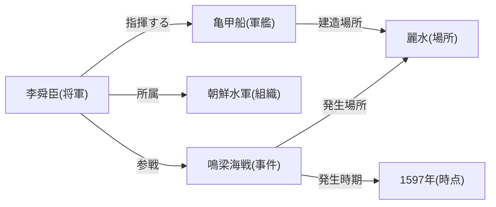
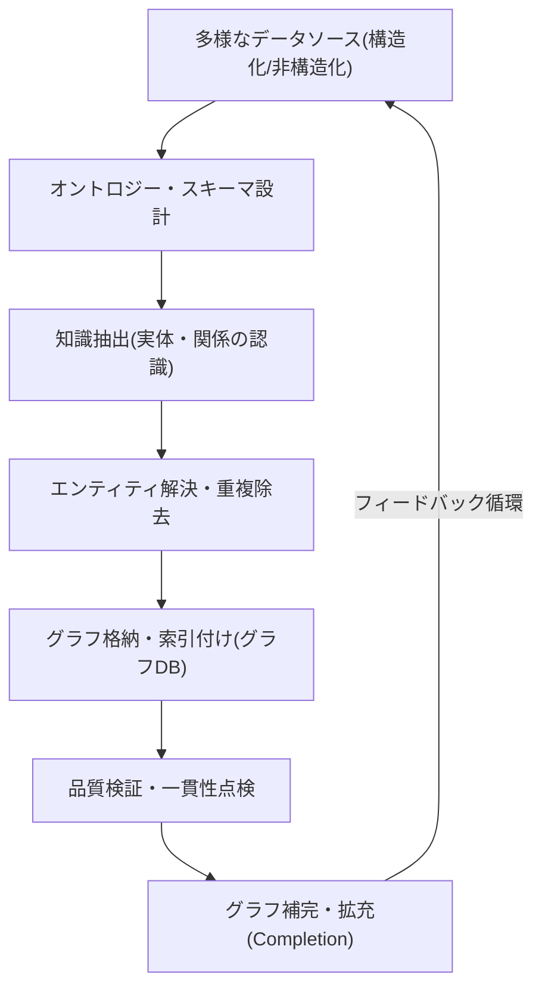
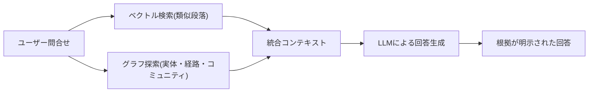

# ナレッジグラフ(Knowledge Graph)

## 1. 概要

> **ナレッジグラフ**とは、現実世界の実体(Entity)をノードとして、実体間の意味的関係(Relationship)をエッジとして表現し、知識をグラフ構造に組織化した知識表現・格納体系である。一般に`主語(Subject)–述語(Predicate)–目的語(Object)`の**トリプル(Triple)**単位で事実を記述し、これを大規模に連結して機械が推論・問合せできる形にしたものをいう。

リレーショナルデータベースはデータを定型化された表に格納し、正確な値の照会には強いが、「AとBはどのような関係で何段階離れて繋がっているか」といった**接続中心(Connection-centric)**の問合せには多数の結合が必要となって非効率であり、スキーマが硬直的なため新たな関係タイプを柔軟に扱うことが難しい。一方、現実の知識は人–組織–場所–事件が複雑に絡み合った網の目の形をしており、検索・推薦・質問応答・不正検知のように「関係そのものが価値である」問題が増えてきた。ナレッジグラフはこうした空白、すなわち**意味(Semantics)と接続(Connectivity)を第一級の市民として扱う知識基盤**の必要性から登場した。

ナレッジグラフが注目されるようになった直接の契機は、2012年にGoogleが検索に導入した「Knowledge Graph」であり、文字列マッチングを超えて「事物(Things)を理解する」検索への転換を象徴した。近年では、大規模言語モデル(LLM)のハルシネーション(Hallucination)を抑制し事実的根拠を提供する**GraphRAG**の基盤知識源として再評価され、ナレッジグラフはデータ統合・セマンティック検索・説明可能AIを結ぶ中核インフラとして位置づけられつつある。

## 2. 全体構造と構成要素

ナレッジグラフは大きく**実体(ノード)**、**関係(エッジ)**、**属性(Property)**、そしてそれらが従う**オントロジー/スキーマ(Ontology)**で構成される。実体は「李舜臣」「亀甲船」のように世界に存在する対象であり、関係は「建造する」「指揮する」のように実体を結ぶ意味的な接続である。属性は実体や関係に付与された付加情報(生没年、位置など)であり、オントロジーは「将軍は人である」「人は組織に所属しうる」のように概念の種類と関係の規則を定義する上位スキーマとして、推論の根拠となる。

上図のように、一つの事実はトリプル(例:`李舜臣–指揮する–亀甲船`)で表現され、トリプルが蓄積されると実体間に**多段階経路(Multi-hop Path)**が形成される。この経路探索能力こそがナレッジグラフの本質的な強みであり、「李舜臣が参戦した事件が起きた場所は?」といった問合せを、結合の爆発なしにグラフ走査で回答できるようにする。

### A. 実体と関係、そして識別子

実体を信頼性をもって扱うには、**グローバル一意識別子(URI/IRI)**で実体を一意に指し示すことが重要である。同姓同名や表記の違い(「IBM」と「International Business Machines」)を一つの実体にまとめる**エンティティ解決(Entity Resolution)**が不十分だと、同じ対象が複数のノードに分裂し、グラフの事実性が崩れる。したがってナレッジグラフ構築において実体の識別・正規化はデータ品質の出発点であり、WikidataのQ識別子のような標準識別子体系と連結(Linking)すれば、外部知識との相互運用性が大きく高まる。

### B. オントロジーと推論

オントロジーはナレッジグラフに「意味の規則」を与える。例えば「親の親は祖父母」という規則(関係の合成)や「すべての将軍は人である」という階層(subClassOf)定義があれば、明示的に格納されていない事実も**論理的推論(Reasoning)**によって導出できる。これは格納領域を節約し、データの一貫性を検証する手段となり、単なるデータ格納を超えて「知識」へと格上げする核心的な仕組みである。オントロジーの表現には、表現力は低いが軽量なRDFSから、複雑な制約と推論をサポートするOWL(Web Ontology Language)までのスペクトルが存在する。

## 3. 表現モデル:RDFとプロパティグラフ(LPG)

ナレッジグラフを実際に実装するデータモデルは大きく二つの系統に分かれる。一つはW3Cのセマンティックウェブ標準に従う**RDF(Resource Description Framework)**系であり、もう一つは産業界で広く用いられる**プロパティグラフ(LPG, Labeled Property Graph)**系である。両モデルは同じ知識を表現するが、哲学と強みが異なるため、状況に応じた選択が重要である。

RDFはすべての事実をトリプルに還元し、グローバルURIで実体を識別するため、**データ統合と標準に基づく相互運用**に強い。問合せ言語にはSPARQLを用い、OWLによる形式的推論が可能であるため、学術・公共・医療のように標準と整合性が重要な領域に適している。一方で、関係そのものに属性を付けることが難しく(例:「勤務する」関係に「期間」属性)、表現がやや煩雑になる。

プロパティグラフ(LPG)はノードとエッジの双方に自由にキー・バリュー属性を付与できるため、**モデリングが直感的で柔軟**である。Neo4jのCypherのような問合せ言語で経路探索を簡潔に表現でき、推薦・不正検知・ネットワーク分析などグラフアルゴリズムを積極的に適用する実務システムで好まれる。ただしグローバル識別子と形式オントロジーの標準が弱いため、異なる組織間の統合においてはRDFほどの相互運用性を持ちにくい。

| 区分 | RDF(トリプル) | プロパティグラフ(LPG) |
|---|---|---|
| 基本単位 | 主語–述語–目的語のトリプル | 属性を持つノード・エッジ |
| 識別方式 | グローバルURI/IRI | 内部ノード/エッジID |
| 問合せ言語 | SPARQL | Cypher, Gremlin, GQL |
| 推論/標準 | OWL・RDFSによる形式推論が強い | 標準推論は弱く、アルゴリズムが強い |
| 強み | データ統合・相互運用 | 柔軟なモデリング・経路探索 |
| 代表事例 | Wikidata, DBpedia | Neo4j, TigerGraph |

両モデルの違いは、「標準準拠によるオープンな統合が優先か、アプリケーション性能と開発生産性が優先か」という目的の違いに由来する。近年ではISOのグラフ問合せ標準である**GQL(2024年国際標準制定)**や、RDFに関係属性を許容するRDF-starなどが登場し、両陣営の隔たりが縮まる傾向にある。

## 4. 構築手順と核心技術

ナレッジグラフの構築は一度きりの作業ではなく、継続的に知識を収集・精製・拡張するパイプラインとして運用される。典型的な手順は、データソースの特定 → オントロジー設計 → 知識抽出 → エンティティ解決・整合 → 格納・索引付け → 品質検証・拡張という循環である。

このパイプラインで技術的に最も難しい段階は、**知識抽出**と**エンティティ解決**である。非構造化テキストから固有表現認識(NER)と関係抽出(RE)によってトリプルを取り出す必要があるが、文の曖昧性と表現の多様性のために誤りが生じやすい。近年はLLMを活用して文書から実体・関係を自動抽出する方式が広がり、構築コストを大きく下げているが、LLMが生成したトリプルの事実性検証という新たな課題を残している。

また、実際のナレッジグラフは必然的に不完全(欠落した関係が存在)であるため、既存構造を学習して欠落リンクを予測する**ナレッジグラフ埋め込み(TransE、RotatEなど)**や、グラフニューラルネットワーク(GNN)に基づく**リンク予測・グラフ補完(Completion)**技術が併用される。例えばEコマースのグラフで「顧客–購入–商品」のパターンを学習すれば、まだ接続されていない顧客–商品間の嗜好を推論し、推薦に活用できる。

## 5. 活用事例とGraphRAG(深掘り)

ナレッジグラフはすでに産業全般で活用されている。検索エンジンはナレッジグラフで検索結果の横の情報パネルを構成し、Eコマースは商品・顧客・行動グラフで個人化推薦を行い、金融業界は口座・取引・所有関係のグラフで多段階の資金の流れを追跡して不正取引・マネーロンダリングを検知する。医療・製薬では遺伝子–疾患–薬物の関係グラフで新薬候補を発掘する。これらの共通点は、**「隠れた接続を明らかにすること」がそのままビジネス価値**であるという点である。

最も注目される深掘り応用は**GraphRAG**である。従来のRAGは文書をベクトルに埋め込んで類似段落を検索するが、複数の文書に散在する事実を総合しなければならない多段階推論には弱い。GraphRAGは元文書からナレッジグラフを構築し、問合せに関連する実体の近傍・経路・コミュニティ要約を併せて検索してLLMに提供する。こうすることで根拠の出所がグラフ上に明示され、**説明可能性(Explainability)**と**事実性**が高まり、「複数の事件に共通して登場する人物は誰か」のように、ベクトル検索だけでは難しい大域的(Global)な問合せにも対応できる。

このように、ベクトルデータベースが「意味的類似性」を担い、ナレッジグラフが「明示的な関係と事実」を担う**ハイブリッド知識検索**が最新の潮流である。ただしグラフの構築・維持のコストとグラフの品質が回答品質を左右するため、導入時には対象ドメインが関係中心の問合せを実際に必要としているかを見極める判断が先行すべきである。

## 6. 考慮事項および示唆

第一に、**品質ガバナンス**が核心である。ナレッジグラフの価値は事実性と完全性に比例するため、エンティティ解決・重複除去・出所管理・定期的な検証を含むデータガバナンス体系を併せて設計しなければならない。LLMによる自動抽出を導入する場合は、人手による検収と信頼度スコアリングを組み合わせた人間と機械の協働(Human-in-the-loop)手順が必要である。

第二に、**モデル・プラットフォーム選択のトレードオフ**を明確にすべきである。標準に基づくオープンな統合と形式推論が重要であればRDF/OWLを、アプリケーション性能と開発生産性・グラフアルゴリズムが重要であればプロパティグラフを選択しつつ、GQL・RDF-starなどの収斂しつつある標準を注視し、ロックイン(Lock-in)を警戒しなければならない。超大規模環境では、グラフのパーティショニングと分散処理性能も選定基準に含まれる。

第三に、**LLMとの相補的結合**戦略が有効である。LLMは柔軟な自然言語理解と生成を、ナレッジグラフは検証可能な事実と関係を提供するため、ナレッジグラフでLLMのハルシネーションを抑制し、逆にLLMでナレッジグラフを拡張する好循環を設計すれば、信頼性と拡張性を同時に得られる。

第四に、**段階的導入とROIの観点**が必要である。全社ナレッジグラフを一度に構築しようとする試みは、コスト・期間の面で失敗リスクが大きい。関係中心の問合せが明確な特定ドメイン(不正検知・推薦など)で小さく始めて価値を検証した後に拡張するのが望ましく、保守組織とオントロジー管理の責任を明確にする運用ガバナンスが成功の鍵である。

## 参考資料

- Google, "Introducing the Knowledge Graph: things, not strings" — https://blog.google/products/search/introducing-knowledge-graph-things-not/
- W3C RDF 1.1 Primer — https://www.w3.org/TR/rdf11-primer/
- Microsoft Research, "GraphRAG" — https://microsoft.github.io/graphrag/
- ISO/IEC 39075:2024 GQL (Graph Query Language) — https://www.iso.org/standard/76120.html

---
> **一言まとめ**: ナレッジグラフは実体と関係をトリプル・グラフで表現し、意味と接続を第一級として扱う知識基盤であり、RDFとプロパティグラフのモデル・オントロジー推論・グラフ埋め込みを軸に検索・推薦・不正検知に活用され、近年はGraphRAGによってLLMのハルシネーションを抑制する説明可能な知識源として再浮上している。
