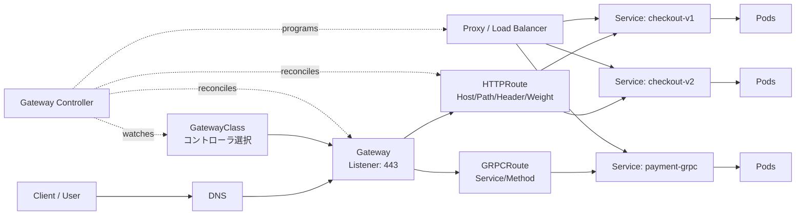
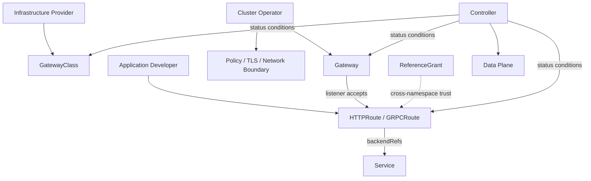

# Kubernetes Gateway APIに基づくクラウドネイティブ・トラフィック管理

## 1. 概要

> **定義**: Kubernetes Gateway APIは、クラスタ外部またはクラスタ内部のトラフィックをGatewayとRouteという宣言的リソースで接続し、インフラ担当者・クラスタ運用者・アプリケーション開発者の責任を分離する、拡張可能でプロトコルを認識するサービスネットワーキングAPIである。

Kubernetesにおける初期の外部トラフィック標準はIngressであった。Ingressはホストとパスをサービスにマッピングする単純なHTTP進入モデルを提供したが、実装ごとのアノテーションに依存した瞬間に、移植性と運用の一貫性が低下した。トラフィック分割、ヘッダーベースのルーティング、マルチプロトコル、組織ごとの権限分離を表現するには、各Ingress Controller独自の設定を習得しなければならなかった。

Gateway APIはこの問題を、単に「より多くのフィールドを持つIngress」として解決するのではない。インフラを生成または選択するオブジェクトと、アプリケーションのトラフィックルールを記述するオブジェクトを分離し、組織の実際の運用境界がKubernetesのリソースモデルに反映されるようにする。したがってプラットフォームチームはGatewayClassとGatewayを管理し、サービスチームはHTTPRouteやGRPCRouteを管理するという協業が可能になる。

Gateway API自体はデータプレーンのプロキシではない。Kubernetesに内蔵された単一のロードバランサーでもなく、Gateway APIを実装するコントローラがリソースを読み取り、Envoy、NGINX、クラウドロードバランサー、ハードウェア機器などの実際の設定へと翻訳する。この区別を見落とすと、YAMLが適用されたという事実だけでトラフィック処理が保証されると誤解することになる。

2026年9月25日時点の公式ドキュメントでは、GatewayClass、Gateway、HTTPRoute、GRPCRouteを安定APIの種類として説明しており、公式プロジェクトのリリースページではv1.6.2が最新リリースとして表示されている。実際の導入時には、コントローラがサポートするGateway APIのバージョンと各フィールドのサポートレベルを別途確認しなければならない。

### 1.1 登場背景と必要性

第一に、プラットフォームとアプリケーションでは変更サイクルが異なる。プラットフォーム担当者は、共用の外部IP、TLS証明書、ファイアウォール、L4/L7プロキシといった基盤を安定して運用しなければならない。一方でアプリケーション担当者は、`/checkout`を新バージョンに10%だけ送る、特定のヘッダーを持つリクエストだけを実験サービスに送るなど、頻繁な変更を行う。一つのIngressオブジェクトに二つの関心事が混在すると、権限が過剰に付与されたり、変更の衝突が発生したりする。

第二に、マイクロサービスの増加に伴い、HTTP以外のトラフィックも重要になった。gRPCはHTTP/2を基盤としてサービス間通信を行い、TLS passthroughやTCPベースの機器連携は、単純なHTTPパスルールだけでは表現しにくい。Gateway APIは共通のリソース関係を維持しつつ、プロトコル別のRouteを拡張する方向をとる。

第三に、宣言型運用は「何を望むか」と「どう実装するか」を分離したときに効果が大きくなる。HTTPRouteは`/v1`リクエストをどのServiceに送るかを宣言するが、コントローラは同じ意図をデータプレーンの実装方式に合わせて変換する。移植性とは、すべての実装の詳細が同じであるという意味ではなく、標準で表現可能な共通の意図が実装間で移動できるという意味である。

### 1.2 答案の核心となる観点

技術士の答案では、リソース名を列挙するよりも、「責任分離 → 信頼境界 → コントローラによる調整 → データプレーンへの反映 → 状態の観測」という流れを説明することが重要である。特にGateway APIの`spec`は望ましい状態であり、`status`の条件とコントローラのイベントは実際の収束状態を示すという点を区別しなければならない。

また、Gateway APIがIngressを直ちに廃止するといった記述は不正確である。Kubernetes公式ドキュメントは、Ingress APIは安定状態が維持され削除計画はないが、APIが凍結されているため新機能の開発にはGateway APIを推奨すると説明している。したがって現実的な戦略は、既存のIngressを保持しつつ新規サービスからGateway APIを適用し、機能・性能・運用指標を確認した後に段階的に移行することである。

## 2. 概念図と全体アーキテクチャ

上記の構造において、`GatewayClass`は特定の実装コントローラが提供するGatewayの種類を表す。例えば同じクラスタ内でパブリックインターネット用のクラスとプライベートネットワーク用のクラスを分ければ、アプリケーションチームが勝手にパブリックロードバランサーを作成できないようにできる。`GatewayClass`はそのまま実行インスタンスではなく、共通ポリシーとコントローラ選択の基準であるという点が核心である。

`Gateway`は実際のトラフィックを受け付ける論理的な入口である。リスナーごとのアドレス、ポート、プロトコル、証明書参照、Routeの受け入れ範囲を宣言する。クラウドロードバランサー一つである場合もあれば、クラスタ内のプロキシインスタンスである場合もあるため、「Gatewayオブジェクト一つ = 特定製品のプロキシ一台」と固定して考えてはならない。

`HTTPRoute`は、Gatewayのリスナーからサービスへ向かうHTTPルールを表現する。ホスト、パス、ヘッダーのマッチングやバックエンドの重みといった条件をリソースのフィールドで表すため、実装ごとのアノテーションよりも検証とレビューが容易である。ただし特定のコントローラがすべての任意フィールドを同じレベルでサポートするわけではないため、conformanceと実装のドキュメントを併せて確認しなければならない。

`GRPCRoute`は、gRPCのサービスとメソッド単位の意図をモデル化する。gRPCはHTTP/2ストリームとステータスコード、長時間接続を使用するため、単純なHTTPプロキシ設定をコピーするだけでは不十分である。Gateway実装がHTTP/2およびgRPC関連機能を実際にサポートしているか、タイムアウトとリトライのポリシーがストリームの意味を損なわないかを検証しなければならない。

### 2.1 リソース関係と責任境界

Gateway APIの役割指向モデルは、RBACとともに設計されなければならない。インフラ提供者は複数のテナントが使用するGatewayClassを定義し、クラスタ運用者はGatewayのアドレスとリスナー・証明書・受け入れポリシーを管理する。アプリケーション開発者は、自身が担当するネームスペースのRouteのみを変更できるよう権限を制限できる。

この分離が自動的に安全であるわけではない。開発者にGatewayの変更権限まで与えれば役割モデルの利点が失われ、運用者にすべてのRouteの権限を求めればデプロイ速度が低下する。組織の変更承認体制に合わせてリソースごとの`get`、`list`、`watch`、`create`、`update`権限を細分化し、GitOpsリポジトリのディレクトリ所有権とKubernetes RBACを一致させなければならない。

Routeが別のネームスペースのServiceを参照したり、別のネームスペースのGatewayに接続したりする場合には、信頼境界を明示しなければならない。デフォルトは同一ネームスペースとし、必要な場合には`allowedRoutes`、`ReferenceGrant`のような明示的な許可を用いる。クロスネームスペースを便利なデフォルトとして開放しておくと、あるチームが別のチームのトラフィック経路を横取りしたり、機微なバックエンドに接続したりするリスクが高まる。

### 2.2 コントロールプレーンとデータプレーン

コントローラはGateway APIのオブジェクトを監視し、依存関係を計算した上でデータプレーンの設定を調整する。この過程は非同期であるため、`kubectl apply`が成功しても、DNSの伝播、証明書の準備、ロードバランサーのプロビジョニング、プロキシの再構成が完了したことを意味するわけではない。運用者はリソースの`status.parents`、`Accepted`、`Programmed`、`ResolvedRefs`条件とコントローラのログを併せて確認しなければならない。

データプレーンは実際のパケットを処理する。L4ロードバランサー、L7リバースプロキシ、サービスメッシュのサイドカー、カーネルベースの転送層など、実装は多様である。同じHTTPRouteであっても、データプレーンのTLS終端位置、接続の再利用、バッファリング、リトライ方式によって遅延や障害の様相が異なるため、性能試験は必ず実際の実装を基準に実施する。

コントローラは、宣言された状態と観測された状態の差を縮める調整ループを持つ。Routeが削除されればプロキシ上の古い経路が除去されなければならず、バックエンドServiceのEndpointSliceが変われば対象エンドポイントも更新されなければならない。障害時には、最後に正常に反映された設定と現在の望ましい状態との差を追跡できるよう、イベント、設定バージョン、変更者、Gitコミットを紐づけておく必要がある。

## 3. 主要リソースとトラフィック処理手順

### 3.1 GatewayClass

`GatewayClass`は、Gatewayを管理するコントローラを選択するクラスである。StorageClassと同様にプラットフォームが提供する実装の種類を抽象化するが、実際にサポートされる機能やコスト、ネットワーク上の位置、TLS処理方式はコントローラごとに異なる。名前だけを見て機能が同一であると仮定せず、実装のconformance結果と運用上の制約をサービスカタログに記録しなければならない。

GatewayClassの`parametersRef`は、実装ごとの追加設定を接続する拡張ポイントとして使用されうる。このときすべてのチームに任意のパラメータを指定させると、プラットフォームポリシーが迂回されうるため、許可されたパラメータの種類と値の範囲をポリシーで制限しなければならない。プラットフォームチームは標準フィールドと実装の拡張を区別して文書化することが望ましい。

### 3.2 GatewayとListener

`Gateway`は一つ以上のリスナーで受信条件を宣言する。リスナーは、ポートとプロトコル、ホスト名、証明書参照、Routeの受け入れルールを組み合わせる。同じポートで複数のホストを運用する場合はホスト名と証明書の選択が一致しているかを確認し、TLS終端をGatewayで行うかバックエンドまで伝達するかを、セキュリティ要件と性能要件を併せて比較しなければならない。

Gatewayのアドレスは、コントローラがプロビジョニングした外部IPやDNS名として`status.addresses`に報告されうる。DNSレコードはこのアドレスの準備状態を確認した上で接続すべきであり、クラウドロードバランサーのコスト、IPの枯渇、予約アドレスのポリシーも設計に含める。内部専用Gatewayと外部公開Gatewayを別クラスに分ければ、事故の影響範囲を縮小できる。

### 3.3 HTTPRoute

`HTTPRoute`は`parentRefs`で上位のGatewayを指し、`hostnames`と`rules`でルーティングの意図を宣言する。一つのルールは、パス・ヘッダー・クエリなどのマッチング条件と、バックエンド参照、フィルター、重みを組み合わせる。マッチングの優先順位が複雑になるほどルール間の重なりをテストする必要があり、「より具体的なパスが先に適用される」という期待を、実装の公式な動作とテスト結果で確認しなければならない。

トラフィック分割はカナリアデプロイに有用である。例えばv1 Serviceに90、v2 Serviceに10の重みを与えれば、新バージョンに一部のトラフィックを送ることができる。しかし重みはリクエスト数基準の論理的な比率であり、ユーザーごとのセッション固定や金額ごとの配分を自動的に保証するものではない。決済のようにリトライと状態の一貫性が重要なリクエストについては、ユーザー識別子に基づく一貫性、アプリケーションでの重複処理、観測指標を別途設計しなければならない。

フィルターは、リクエスト・レスポンスヘッダーの変更、リダイレクト、URLの書き換え、リクエストのミラーリングなど、実装がサポートする動作を提供する。フィルターの順序と相互作用はプロトコル・プロキシごとに異なりうるため、認証ヘッダーを削除した上でバックエンドに送るのか、元のホストと転送先ホストをどの順序で変更するのかをテストしなければならない。

### 3.4 GRPCRouteと拡張Route

`GRPCRoute`はサービスとメソッド単位のマッチングを提供し、gRPC APIの境界に合ったポリシーを記述できる。ただしストリーミングRPCは、一般的な短いHTTPリクエストとは寿命やリトライの意味が異なる。接続が切れたときに自動リトライすると、サーバー側の副作用が重複しうるため、冪等性・deadline・クライアントの再接続ポリシーを併せて検討しなければならない。

TCPRoute、TLSRoute、UDPRouteのように追加のプロトコルを扱うリソースは、チャネルやバージョンごとに成熟度が異なりうる。安定チャネルに含まれないリソースは、機能が豊富であってもAPI変更の可能性があり、本番適用前には実験チャネルのインストール有無と、アップグレード・ロールバックの経路を点検しなければならない。標準チャネルと実験チャネルを同じクラスタで混用する場合は、CRDのバージョン衝突にも注意する。

### 3.5 Routeの接続と信頼モデル

Routeは`parentRefs`でGatewayまたはリスナーを指定し、Gatewayのリスナーは自身が受け入れるRouteの種類とネームスペースの範囲を判断する。この双方向の条件は、アプリケーションが任意の共用GatewayにRouteを接続する問題を減らす安全装置である。Routeが存在するというだけでデータプレーンに反映されたとみなさず、`Accepted`と`Programmed`の状態を確認しなければならない。

同一ネームスペース内の接続は運用が単純であるが、共用プラットフォームネームスペースのGatewayを複数のサービスネームスペースが共有する場合には、クロスネームスペース接続が必要になる。このときは、許可ネームスペースのラベル、ReferenceGrantの承認、サービスアカウントの権限、変更レビューを併用しなければならない。ネームスペース名だけを信頼するよりも、チーム・環境・データ等級を表すラベルとポリシーを組み合わせる方が安全である。

## 4. 運用アーキテクチャとセキュリティ設計

### 4.1 TLSと証明書

外部TLS終端をGatewayで行えば、証明書の集中管理と共通のセキュリティポリシーを適用しやすい。逆にバックエンドまでのエンドツーエンド暗号化が必要であれば、TLS passthroughまたはGatewayからバックエンドへの再暗号化を選択できる。両方式は、可視性、証明書の管理ポイント、暗号化のオーバーヘッド、アプリケーションへの元のクライアント情報の伝達方式が異なる。

証明書参照はネームスペースの境界を越えうるため、参照許可を明示しなければならない。証明書の有効期限を監視し、更新中にリスナーが`Programmed`状態を失わないかを検証する。TLS 1.2以上、許可する暗号スイート、SNIとホスト名の一致、失効・漏洩時の緊急差し替え手順を運用標準として定義しなければならない。

### 4.2 認証・認可とポリシーの執行

Gateway APIはトラフィックの経路とリソースの関係をモデル化するが、ユーザーの認証・認可や細粒度のAPIポリシーをすべて標準化するわけではない。JWT検証、OAuth2連携、WAF、rate limit、mTLS、リクエストサイズ制限は、コントローラ・ポリシー拡張・サービスメッシュ・外部セキュリティ機器のうち適切な層に配置する。標準Routeと実装の拡張を一つのドキュメント内で区別しなければ、別のコントローラに移行するときにセキュリティ統制が失われうる。

ポリシーのデフォルトは拒否に近く設定する。公開するホストとパス、許可メソッド、バックエンドポート、CORSオリジン、最大リクエストサイズを明示し、明示されていないリクエストは404・403・429など意図したステータスで終了させなければならない。特に管理用パスを同じGatewayに載せる場合には、別リスナー・別Gateway・ネットワークポリシーによって管理面を分離する方策を優先的に検討する。

### 4.3 オブザーバビリティと障害対応

最低限の観測項目は、リクエスト量、成功率、4xx・5xx比率、p50/p95/p99レイテンシ、TLSハンドシェイクエラー、アクティブ接続、バックエンドEndpointの状態である。重みベースのカナリアでは、バージョンごとのリクエスト比率とエラー・レイテンシを併せて見る必要があり、全体平均だけを見ると少量トラフィックの障害を見逃しうる。

分散トレーシングでは、Gatewayで生成・伝達されるtrace contextと元のリクエストIDをサービスログに紐づける。ログにはホスト、パステンプレート、Route名、Gateway名、バックエンドService、レスポンスコード、ポリシー判定結果を残しつつ、トークン・個人情報・機微なクエリ値はマスキングする。コントローラログとデータプレーンログの時刻同期も、障害原因の分析に必須である。

変更前には、`kubectl diff`、静的スキーマ検証、conformanceテスト、ポリシーテスト、合成トラフィックを順に実行する。変更後には、Routeの`status`と実際のプロキシ設定、DNS・証明書・バックエンド接続を確認する。ロールバックはGitコミットの差し戻しだけでは十分でない場合があるため、以前のCRD・コントローラ・データプレーンのバージョンとの互換性を事前に確認しておく。

## 5. 比較分析

### 5.1 IngressとGateway API

Ingressは、単純なHTTP/HTTPSの外部公開には依然として有効である。安定APIであり既存のコントローラのエコシステムが広く、小規模サービスは少ないリソースで運用できる。しかし高度な機能をアノテーションで拡張すると、アノテーションの名前と意味がコントローラごとに異なり、設定の移植性・ポリシーの検証性が低下する。

Gateway APIは、役割分離、マルチプロトコル、構造化されたRoute、状態報告、拡張ポイントを標準リソースとして提供する方向である。その代わりリソースが多く、コントローラのインストール・CRDのライフサイクル・実装ごとの機能差を管理しなければならない。したがってすべてのIngressを一括変換するよりも、複雑なルーティングや組織境界が必要なサービスから移行する方が費用対効果が高い。

| 区分 | Ingress | Gateway API |
|---|---|---|
| 主な対象 | 単純なHTTP/HTTPSの外部公開 | 役割ベースのサービスネットワーキングと高度なトラフィック管理 |
| 設定方式 | Ingressルール + 実装のアノテーション | GatewayClass、Gateway、Routeの階層 |
| 責任分離 | 一つのオブジェクトに混在しやすい | インフラ・運用・アプリケーションの役割分離 |
| プロトコル | 主にHTTP/HTTPS | HTTP、gRPCおよび実装・チャネルごとの拡張 |
| トラフィック分割・ヘッダーマッチング | コントローラごとの拡張に依存 | 標準フィールドで表現可能な範囲を提供 |
| 移行難易度 | 既存環境では低い | CRD・コントローラ・権限・テスト体制が必要 |
| 現在の戦略 | 安定状態を維持、API凍結 | 新規の高度な機能と新規設計に推奨 |

### 5.2 API GatewayとService Mesh

API Gatewayは、外部の利用者とクラスタまたはサービス境界との間の南北(north-south)トラフィックを制御することに強みがある。公開DNS、TLS、WAF、利用者認証、quotaを一つの境界で管理しやすい。Gateway APIはこの境界を宣言する標準化されたKubernetesリソースモデルであって、API商品管理・開発者ポータル・課金機能を自動的に提供する製品ではない。

Service Meshは、サービス間の東西(east-west)トラフィック、サービスアイデンティティ、内部mTLS、リトライ、サーキットブレーカー、細粒度の観測に焦点を当てる。Gateway APIとメッシュを併用すれば、外部からの進入はGatewayが担い、内部のサービス呼び出しはメッシュが担うように境界を定めることができる。ただし双方にリトライ・timeout・rate limitを重複して設定すると、リクエストの殺到や遅延が増幅されうるため、ポリシーの単一の所有者を定めなければならない。

| 比較軸 | Gateway APIベースの進入層 | Service Mesh |
|---|---|---|
| 主な方向 | 外部→クラスタ/サービスの南北 | サービス↔サービスの東西 |
| 核心オブジェクト | GatewayClass、Gateway、Route | サービスアイデンティティ、プロキシ、ポリシー |
| 代表的な関心事 | DNS、TLS、ホスト・パス・プロトコル | mTLS、サービスディスカバリ、リトライ・サーキットブレーカー |
| 運用リスク | 公開経路・証明書・外部攻撃面 | プロキシのオーバーヘッド・ポリシーの爆発・ループ |
| 結合方式 | 外部進入と共用ルーティング | 内部通信とワークロードの信頼 |

## 6. 適用事例

### 6.1 Eコマースのカナリアデプロイ

Eコマースプラットフォームが`checkout-v1`と`checkout-v2`を同時に運用していると仮定する。プラットフォームチームは443ポートと共用証明書を持つGatewayを作成し、アプリケーションチームはHTTPRouteの重みを95:5に設定する。5%のトラフィックでエラー率とp99レイテンシが基準を超えれば、Routeだけを以前の重みに戻すことで、データプレーン全体を再プロビジョニングせずに緩和する。

しかし決済リクエストを単純なランダム比率で分けると、同一ユーザーの照会・決済リクエストが異なるバージョンに送られうる。カートと決済セッションはアプリケーションのセッションストアを共有し、リトライ可能なリクエストと不可能なリクエストを区別しなければならない。また、カナリアバージョンごとの決済成功率、重複承認、返金比率を別の指標として設ける必要がある。

### 6.2 マルチテナントプラットフォーム

共用Kubernetesクラスタで、チームAとチームBがそれぞれ自身のネームスペースを使用しているとする。プラットフォームチームは内部専用のGatewayClassを提供し、運用チームは特定のリスナーで`team-a`と`team-b`ネームスペースのRouteのみを許可する。各チームは自身が所有するHTTPRouteを変更できるが、Gatewayの外部アドレス・TLSポリシー・許可ネームスペースは変更できない。

この構造はリソースの権限を絞るが、データ境界までを自動的に保証するものではない。Routeが接続するServiceの機微性とネットワークポリシー、バックエンド認証、ログへのアクセス権限は別途設定しなければならない。テナントが同じホスト名を競合して要求しないよう、ホスト名の所有権検証と承認ワークフローを追加することも必要である。

### 6.3 gRPCの内部・外部連携

モバイルバックエンドが外部GatewayでgRPCリクエストを受け、内部の`payment-grpc` Serviceへ転送する場合、GRPCRouteでサービス・メソッドごとに経路を分けることができる。`Login`と`Authorize`でtimeout、最大メッセージサイズ、認証要件が異なるならば、メソッド単位のポリシーが有用である。

一方で長時間のストリーミングRPCは、一般的なHTTPリクエストよりも接続が長く維持されるため、ロードバランサーのidle timeoutとデプロイ時の接続drainを併せて管理しなければならない。新バージョンに切り替える際に既存のストリームを強制終了するとユーザー体験が悪化するため、graceful shutdown、クライアントの再接続、サーバーでの重複イベント処理を検証しなければならない。

## 7. 深掘り:導入・移行戦略と予想出題ポイント

Gateway APIの導入はYAMLの置き換えプロジェクトではなく、プラットフォーム運用モデルの転換である。まず現在のIngressアノテーションを、標準機能、コントローラの拡張、アプリケーションロジックに分類する。標準化できない機能は、Gateway APIのポリシー拡張として残すのか、サービスや別のセキュリティ層に移すのかを決定した上で、移行コストを見積もる。

第2段階では、開発・ステージングクラスタに同一のGatewayClassとコントローラをインストールし、代表的な経路をIngressとGateway APIに並行して構成する。リクエスト比率、レスポンスヘッダー、TLSチェーン、送信元IP、timeout、リダイレクト、WebSocket・gRPCの動作を比較する。単にHTTP 200が返るかどうかだけを確認しても、プロキシの意味の違いは発見できない。

第3段階では、新規サービスと変更頻度の高いサービスにGateway APIを優先的に適用する。共用Gatewayとチームごとの Routeの所有者を明確にし、GitOpsの承認・ポリシー検査・conformanceテストをデプロイパイプラインに組み込む。既存のIngressを直ちに削除せず、DNSとロールバック手順を維持しながらサービス単位で移行する。

予想答案では、「GatewayClass–Gateway–Routeの階層」、「役割指向設計とクロスネームスペースの信頼」、「Ingressと比べた標準フィールドと移植性」、「コントローラ・データプレーンの分離」、「状態条件に基づく運用」を一つの因果関係として結びつけるとよい。最後に、実装への依存性と実験チャネルの変更可能性、性能・セキュリティの検証、段階的移行をトレードオフとして提示すべきである。

## 8. 考慮事項および示唆

1. **標準と実装の境界を管理しなければならない。** Gateway APIの標準リソースがあっても、実際のTLS、WAF、rate limit、リダイレクト、観測機能のサポート範囲はコントローラごとに異なる。標準フィールドと実装の拡張を別々のリストで管理し、移植性が重要なサービスではconformanceが確認された機能のみを使用すべきである。

2. **権限とネットワーク境界を同時に設計しなければならない。** Routeを作成できる権限は、トラフィックを変更できる権限と同じである。RBAC、`allowedRoutes`、`ReferenceGrant`、ホスト名の所有権、NetworkPolicy、バックエンド認証を併せて適用し、「接続可能」と「データアクセス可能」を分離しなければならない。

3. **変更の安全性を状態と指標で検証しなければならない。** `Accepted`は接続が許可されたことを、`Programmed`は実装が反映したことを示す運用上の手がかりであって、アプリケーションが正常であることの最終的な証拠ではない。実際の成功率・レイテンシ・バックエンドエラー・バージョンごとのトラフィックを確認し、自動ロールバックの基準を設けなければならない。

4. **性能はプロキシ層を含めて測定しなければならない。** TLS終端・再暗号化、HTTP/2とgRPCストリーム、ヘッダー操作、観測データの収集、マルチホップのプロキシは、CPU・メモリ・レイテンシを増加させうる。目標RPSとp99レイテンシ、接続数、障害時のdrain時間を、実際のデータプレーンで負荷試験しなければならない。

5. **CRDとコントローラのライフサイクルを製品のように管理しなければならない。** 実験チャネルのリソースは将来変更・削除されうるため、本番適用の基準とアップグレードの時間枠を別途設ける。CRDのバックアップ、コントローラのロールバック、既存Ingressへのフォールバック、クラウドロードバランサーのコスト・アドレス回収手順まで運用ランブックに含めなければならない。

6. **ポリシーの重複を避けなければならない。** Gateway、Service Mesh、WAF、アプリケーションのそれぞれにリトライとtimeoutを入れると、一度の失敗が何重にも増幅されうる。リクエストの所有層を定め、外部認証・共用ルーティング・内部の信頼・業務権限をそれぞれ異なる責任として文書化しなければならない。

7. **戦略的にプラットフォーム標準をサービスカタログ化しなければならない。** チームごとにGatewayを直接解釈させるよりも、共用クラス、推奨Routeテンプレート、セキュリティのデフォルト値、観測ダッシュボード、例外承認手順を提供すれば、開発の自律性と統制可能性を両立できる。Gateway APIはその標準をコードで表現する基盤であるが、組織の運用ガバナンスまでを代替するものではない。

## 参考資料

- Kubernetes公式Gatewayドキュメント: https://kubernetes.io/docs/concepts/services-networking/gateway/
- Kubernetes公式Ingressドキュメント: https://kubernetes.io/docs/concepts/services-networking/ingress/
- Gateway API公式API概要: https://gateway-api.sigs.k8s.io/concepts/api-overview/
- Gateway API公式セキュリティモデル: https://gateway-api.sigs.k8s.io/concepts/security-model/
- Gateway API公式ガイドおよびインストールチャネル: https://gateway-api.sigs.k8s.io/guides/
- Gateway API公式リリース: https://github.com/kubernetes-sigs/gateway-api/releases

---

> **一言まとめ**: Kubernetes Gateway APIは、GatewayClass・Gateway・Routeによってインフラとアプリケーションの責任を分離し、標準化されたマルチプロトコルのトラフィック管理と状態ベースの運用を可能にするクラウドネイティブなサービスネットワーキングAPIである。
