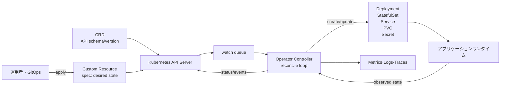
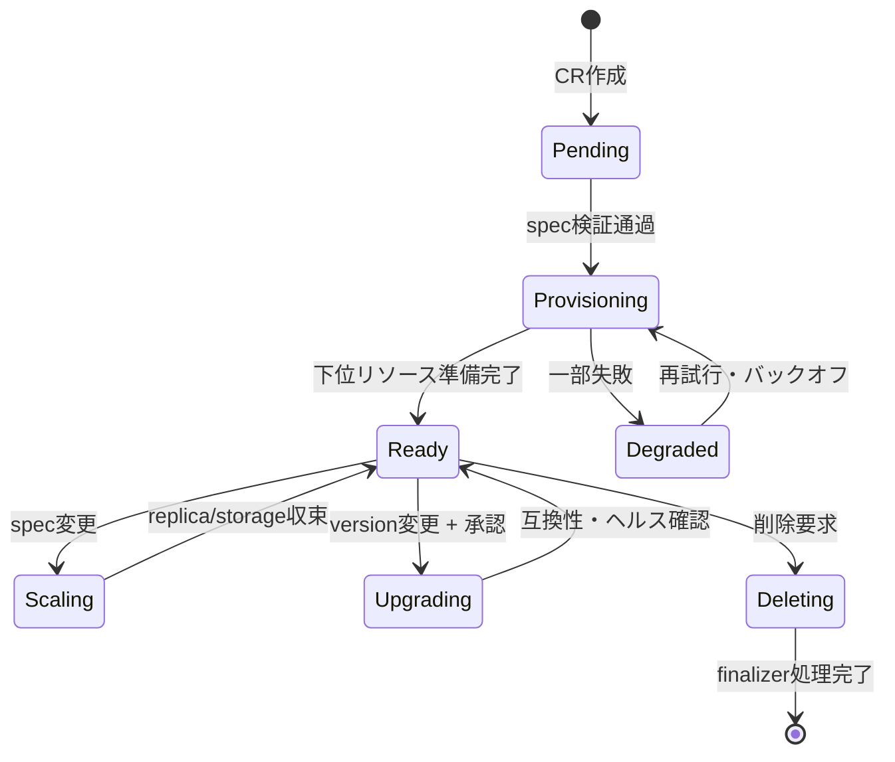

# Kubernetesオペレーターパターン(Kubernetes Operator Pattern)

## 1. 概要

> **定義**: Kubernetesオペレーター(Operator)とは、人間の運用者が行ってきたアプリケーションのインストール・構成・拡張・復旧・アップグレード・バックアップの知識を、Custom Resourceとコントローラの調整(Reconciliation)ループとしてコード化し、Kubernetes APIの宣言的管理モデルとして提供する拡張ソフトウェアである。

Kubernetesの基本リソースだけでも、Pod、Service、Deploymentのようなステートレスなアプリケーションは宣言的にデプロイできる。
しかし、データベース、メッセージブローカー、分散キャッシュのように状態と運用手順が複雑なシステムは、単にPod数を合わせるだけでは安全に運用できない。
初期化の順序、リーダー選出、レプリカの同期、フェイルオーバー、スキーマ変更、バックアップ検証、バージョン互換性に至るまで、ドメイン知識が必要となるためである。

伝統的に、こうした知識は運用者のドキュメントと手作業のコマンドに残されてきた。
ドキュメントに基づく運用は熟練者に依存し、夜間の障害や繰り返しのデプロイで実行順序がぶれ、同一の手順を複数のクラスタに一貫して適用することが難しい。
オペレーターはこの知識をAPIオブジェクトの望ましい状態とコントローラの自動処置へと置き換え、「何を望むか」と「どう達成するか」を分離する。

オペレーターの核心は、特定の製品をKubernetes向けにパッケージ化するHelmチャートとは異なるという点である。
チャートは主にマニフェストをテンプレートから生成し、インストール時点の値を注入する。
一方でオペレーターはインストール後もAPIリソースを監視し、現在の状態と望ましい状態の差を計算し、必要な下位リソースを作成または変更し、その結果をstatusに記録する。
したがってオペレーターは、デプロイの自動化であると同時に継続的な運用の自動化でもある。

技術士の答案では、CRD、Custom Resource、Controllerを列挙するよりも、宣言的API、イベント駆動の監視、冪等な調整、状態の観測可能性、権限の最小化が一つの運用体系として結びついている点を説明しなければならない。
また、オペレーターが万能の自動化ではなく、複雑さと障害面を追加する拡張であるという点まで併せて評価してこそ、バランスの取れた答案となる。

### A. 登場背景と必要性

第一に、ステートフルアプリケーションの運用難易度が高まった。
コンテナはプロセスのパッケージングには強いが、データの耐久性・複製・一貫性・復旧時点を自動的に保証するものではない。
例えばPostgreSQLクラスタでは、プライマリインスタンスとスタンバイインスタンスの役割、WALの保管、フェイルオーバー、接続エンドポイント、バックアップポリシーを併せて管理しなければならない。

第二に、クラスタとテナントの数が増えるにつれ、手作業のばらつきが大きくなった。
開発・検証・本番のクラスタがそれぞれ3つずつ存在し、チームが5つあれば、同じアプリケーションの運用手順が最大15の環境に複製される。
オペレーターは、同じCRを適用しても環境ごとのポリシーだけを変数とし、共通の調整ロジックを再利用させることで構成のばらつきを減らす。

第三に、GitOpsと宣言的インフラ運用が普及した。
Gitには望ましい状態を表現したYAMLが格納され、同期ツールがこれをクラスタに適用する。
オペレーターがアプリケーションのドメイン状態までAPIオブジェクトとしてモデル化すれば、GitOpsの管理範囲はDeploymentレベルからバックアップ・復旧・アップグレードポリシーのレベルへと拡張される。

### B. 核心となる目標

オペレーターの目標は、人を完全に排除することではない。
反復的で判断ルールが明確な作業は自動化し、データ損失のリスクや業務承認のように人が責任を負うべき意思決定は、ポリシーと承認手順として残すことである。
自動化の範囲を明確に分けておけば、障害時にオペレーターが予期しない破壊的な処置を行うリスクを減らすことができる。

オペレーターは次の五つの目標を持つ。
第一に、ユーザーがCRのspecに望ましい状態を宣言できなければならない。
第二に、コントローラが現在の状態を観測し、差を縮める調整ループを実行しなければならない。
第三に、調整の結果と失敗の原因をstatusとイベントで説明しなければならない。
第四に、同じ入力を何度処理しても結果が安定する冪等性を持たなければならない。
第五に、アップグレード・削除・復旧の境界を明示し、権限とリソースを制限しなければならない。

## 2. オペレーターの全体構造

オペレーターは、Kubernetes APIに格納されるCustom Resourceと、それを処理するCustom Controllerの結合である。
CRD(CustomResourceDefinition)は新しいリソースの種類のグループ・バージョン・Kind・スキーマ・スコープを定義し、Custom Resource(CR)はその定義に従って実際の望ましい状態を保持する。
コントローラはAPIサーバーのwatchイベントを受け取るか、定期的に状態を読み取って下位リソースを調整する。

ユーザーは`PostgresCluster`のような高水準のリソースだけを宣言する。
コントローラはその宣言を、StatefulSet、Service、ConfigMap、Secret、PodDisruptionBudget、バックアップジョブといった下位リソースへと翻訳する。
このとき、下位リソースを直接管理する主体がオペレーターであることを示すowner referenceを付与すれば、上位CRの削除時に従属関係とガベージコレクションを制御できる。

APIサーバーは、オペレーターにとって信頼できる唯一の情報源の役割を果たす。
コントローラはローカルメモリだけを信頼せず、APIサーバーから現在の状態を再度読み取らなければならない。
コントローラが再起動しても、specと下位リソースが残っていれば調整が継続されなければならないためである。
この特性は水平スケーリングと障害復旧の前提であるが、APIサーバーの負荷とwatchの再接続を考慮した設計も要求する。

### A. 宣言的モデルと命令型スクリプトの違い

命令型スクリプトは、「今Deploymentを3 replicaに変更し、次にmigrationコマンドを実行せよ」のように実行順序を指示する。
一方で宣言的モデルは、「このデータベースクラスタは3つのレプリカと特定のバックアップ保存期間を持つべきである」と目標を表現する。
調整者は、すでにどの段階まで実行されたかに関係なく、現在の状態から目標状態へ向かう次の安全な処置を選択する。

この違いのため、調整では一度の成功した実行よりも、反復可能な安定性が重要となる。
ネットワークタイムアウトでリクエストの結果を受け取れなかった後に同じリクエストを再送しても、重複リソースや重複バックアップが生じてはならない。
リソース名を決定的に定め、作成前に存在有無を確認し、更新は必要なフィールドだけをパッチする方式が一般的である。

| 区分 | 命令型運用スクリプト | オペレーターによる宣言的運用 |
|---|---|---|
| 表現 | 実行コマンドと順序 | 望ましい状態とポリシー |
| 実行時点 | デプロイ・作業時の1回が中心 | イベントと定期的な再調整 |
| 障害復旧 | 中断地点の特定と手動での再実行が必要 | 現在の状態を再観測した後に再開 |
| 知識の所在 | ドキュメント・運用者の経験 | コントローラのコード・CRスキーマ |
| 変更統制 | スクリプトの実行権限 | API・RBAC・GitOpsポリシー |
| リスク | 中間状態が不明確 | 誤った調整ロジックの自動反復 |

オペレーターが宣言的であるからといって、すべての段階が順序と無関係であるわけではない。
データベースのバージョンアップグレードは、バックアップの確認、読み取り専用への切り替え、レプリカのアップグレード、プライマリインスタンスの切り替えのように、逐次的な手順を持つ。
この場合は、specに`upgradePolicy`と承認条件を置き、statusに段階と観測結果を記録しながら、調整ループ内部で明示的なステートマシンとして実装しなければならない。

### B. Custom Resourceの設計

CRの`spec`は、ユーザーが要求する目標と選択可能なポリシーを保持する。
`status`は、コントローラが観測した実際の状態、条件(conditions)、下位リソースの準備状態、最後のエラーを保持する。
ユーザーが管理する入力とコントローラが計算する出力が混在すると、GitOpsがstatusを巻き戻したり、ユーザーが観測結果を勝手に上書きしたりする問題が生じるため、両領域を分離する。

良いCRスキーマはドメインの用語を用いつつ、内部の実装詳細を過度に露出しない。
例えば、ユーザーには`replicas`、`storage`、`backup.retentionDays`、`version`を宣言させ、内部のStatefulSet名やsidecarコンテナの一覧はコントローラが決定するようにする。
そうしてこそ、実装を変更してもCRの契約を維持できる。

スキーマには、型・必須性・デフォルト値・許容範囲・説明・バージョン変換ルールを明示する。
replica数に0を許可するか、保存期間を0日にできるか、ストレージの縮小を禁止するかといったポリシーが、ドキュメントとコードの両方に存在しなければならない。
構造的スキーマとサーバー側検証は誤った入力を早期に拒否するが、データベースの実際の容量や外部バックアップストレージの状態のように、ランタイムでしか判断できない条件はコントローラでの検証として残る。

条件は単純な文字列メッセージではなく、機械が読み取れる`type`、`status`、`reason`、`message`、`lastTransitionTime`の構造で管理する。
`Ready=False`と`Degraded=True`を区別すれば、ダッシュボードとアラートが意味のある状態を表現できる。
一時的なエラーと恒久的な設定エラーを区別し、再試行すべきかユーザーによる修正が必要かもstatusに示さなければならない。

### C. ControllerとReconciliation

コントローラは特定のリソースイベントをキューに入れ、キューからキーを取り出して該当オブジェクトの最新状態を読み取った上で調整する。
古いイベントのpayloadをそのまま実行せず最新のオブジェクトを読み直す理由は、短時間に複数の変更がまとめられることがあるためである。
調整関数は望ましい状態と観測された状態を比較して必要最小限の変更を行い、再調整の時点を返す。

調整ロジックは通常、次の順序に従う。
第一に、対象のCRが削除中かどうかを確認する。
第二に、削除中であれば、finalizerに必要なバックアップ・外部リソースの整理手順を実行する。
第三に、正常なオブジェクトであれば、入力を検証してデフォルト値を計算する。
第四に、owner referenceと決定的な名前によって、下位リソースの存在と差分を確認する。
第五に、作成・パッチ・削除を実行し、アプリケーションのreadinessを観測する。
第六に、status conditionsとイベントを更新し、次の調整時点を決定する。

冪等性とは「何もしないこと」ではなく、同じ目標にすでに到達していれば、追加の副作用なしに成功を返す性質である。
下位のDeploymentが存在するがimageだけが異なる場合は、全体を削除して再作成するのではなく、該当フィールドだけを調整してこそ可用性を守ることができる。
外部APIにバックアップを要求する場合は、リクエストのidempotency key、ジョブ識別子、完了状態の照会を用いて、ネットワークの再試行が重複作業を生まないようにする。

再試行には、指数バックオフと最大遅延を用いなければならない。
APIサーバーが一時的に失敗したときにすべてのオペレーターが即座に無限に再試行すれば、障害が増幅される。
逆に、証明書の期限切れや誤ったバージョンのように、ユーザーが修正すべきエラーを再試行し続けると、ログとAPIの負荷が増えるだけである。
エラー分類、再試行の上限、rate limit、queue depthを運用基準として定める。

## 3. オペレーターの実装要素と開発手順

オペレーターは、GoベースのController-runtime・Kubebuilder、PythonベースのKopfなどで実装できる。
言語よりも重要なのは、Kubernetes APIのキャッシュの一貫性、イベントの重複、リーダー選出、RBAC、バージョン互換性、テスト戦略を明示することである。
フレームワークはwatch・再試行・スキームの登録を補助するが、ドメインの状態遷移の安全性までは自動的に保証しない。

### A. 開発手順

1. 運用者が繰り返し行う作業と判断ルールをヒアリングし、自動化する範囲を定義する。
2. ユーザーが宣言するドメインAPIとその利用者、サポートするライフサイクルを文書化する。
3. API group/version/kindと、namespaced・cluster-scopedのスコープを決定する。
4. CRDスキーマとvalidation、defaulting、conversionのポリシーを設計する。
5. 正常・異常・部分成功の状態を表すstatus conditionsを定義する。
6. 調整対象の下位リソースと、owner reference、finalizerの関係を設計する。
7. 正常な収束、削除、フェイルオーバー、アップグレード、外部依存の失敗をコードで実装する。
8. 単体テスト、fake APIテスト、envtest、実クラスタでの統合テストを段階的に実施する。
9. 最小限のRBACとリソースのrequest・limitを設定し、イメージと依存関係のサプライチェーンを検証する。
10. ダッシュボード・アラート・runbookを準備した上で、段階的に本番クラスタへデプロイする。

開発初期は、一つのリソースと一つの運用フローから始めるのがよい。
例えば、データベースの作成・拡張・バックアップ・復旧・アップグレードを一度に盛り込むと、ステートマシンと失敗の組み合わせが爆発する。
まず作成とreadinessの観測を安定させ、その後でバックアップとアップグレードを別の機能フラグまたは明示的なポリシーとして追加する。

### B. 下位リソースと所有権

オペレーターが作成したDeployment、Service、Secret、PVCをユーザーが直接変更すると、二つの調整主体が衝突する。
コントローラが管理するフィールドを明確に示し、ユーザーの拡張ポイントは`podTemplate`の許可フィールドやpatchポリシーのような、制限された契約として提供する。
管理境界を文書化すれば、自動復旧と運用者の手動処置との衝突を減らすことができる。

owner referenceはKubernetesオブジェクト間の関係を示すが、外部のクラウドリソースやSaaSアカウントはクラスタの外にある。
このようなリソースは、外部識別子をstatusに保存し、finalizerで削除ポリシーを実行する。
削除時に外部リソースを即座に消すのか、保持するのか、承認後に消すのかを明示しなければ、CRの削除がデータ損失につながりうる。

finalizerは、削除イベントの前に整理を行う機会を提供する。
コントローラがfinalizerを除去できなければ、CRはTerminating状態に長く残る。
したがって外部システムが長期間障害に陥っていても運用者が手動で復旧できるよう、再試行状態、タイムアウト、強制保持の手順を提供しなければならない。

### C. セキュリティと運用統制

オペレーターはAPIサーバーに対して広範な権限を持つことが多いため、侵害されるとクラスタ全体が危険にさらされうる。
RBACでは必要なAPI group・resource・verbのみを許可し、namespaceのスコープを可能な限り狭める。
Secretを読み取って外部バックアップに送信する機能は、別のServiceAccountとネットワークポリシーで隔離し、ログに認証情報や生データを残さない。

オペレーターのイメージとHelm chartは、署名・ハッシュ・SBOMを検証し、脆弱性パッチと権限変更をリリースノートに記録する。
オペレーターが生成するPodにも、セキュリティコンテキスト、seccomp、読み取り専用ファイルシステム、非特権実行を適用する。
コントローラ自体のサプライチェーンだけでなく、生成するworkloadのセキュリティのデフォルト値も併せて管理しなければならない。

オブザーバビリティは、調整の成否を見るだけでは不十分である。
reconcileの回数と遅延、キューの滞留、API呼び出しのエラー、条件ごとのDegraded比率、外部ジョブの遅延、finalizerの残存時間を測定する。
例えば、5分間`Ready=False`が続くか、同一のエラーが10回繰り返された場合に、サービス運用者へアラートを送ることができる。

| 運用領域 | 核心指標 | アラート・点検の例 |
|---|---|---|
| 調整 | reconcile latency、error count | p95遅延と5分間のエラー率 |
| 収束 | Ready条件、generationの観測 | spec変更後10分以内に収束 |
| 安定性 | queue depth、API throttling | キューの滞留と429の増加 |
| データ | バックアップ成功、復旧検証 | 直近の復旧テストの時刻 |
| セキュリティ | RBAC変更、イメージの脆弱性 | 権限の拡大と署名検証 |
| 削除 | finalizerの残存時間 | Terminatingが30分超過 |

## 4. 類型と適用シナリオ

オペレーターは、管理対象と状態の複雑さに応じていくつかの類型に分けることができる。
アドオンオペレーターはモニタリング・証明書・ストレージといったクラスタ機能を管理し、アプリケーションオペレーターは特定製品のインストールと運用を管理する。
クラウドリソースオペレーターは、CRをAWS・Azure・GCPのような外部APIのリソースと結びつける。

ステートフルオペレーターは、複製・バックアップ・復旧・アップグレードの順序を把握しているため最大の価値を提供するが、最大のリスクも抱える。
ステートレスオペレーターは、構成バンドル、ポリシー、ルーティングといった比較的単純なリソースを管理できる。
運用者は、対象となる状態の破壊可能性と外部への副作用を基準に、自動化のレベルを選択しなければならない。

### A. データベース運用の事例

仮想の注文サービスが、3つのアベイラビリティゾーンでPostgreSQLのレプリカを運用しているとする。
`PostgresCluster` CRに`replicas: 3`、`storage: 500Gi`、`backup.retentionDays: 14`を宣言すると、オペレーターはStatefulSetとPVCを作成し、複製状態とバックアップジョブを観測する。
プライマリインスタンスに障害が発生すれば、同期済みのスタンバイインスタンスのうち一つを昇格させてService endpointを更新するが、データ損失の可能性と復旧時点をstatusに記録しなければならない。

ストレージを500Giから800Giに増やすことは一般的に拡張方向であるため自動化できるが、500Giから200Giに減らす作業はデータ損失のリスクがあるため拒否するのが安全である。
バージョンを14から15に変更する場合は、事前の互換性チェックとバックアップ成功の確認を要求し、承認フィールドを別途設けることで、Gitの変更だけで即座にアップグレードされないようにできる。
この事例は、オペレーターが単なるリソース生成器ではなく、ドメインの安全ルールの執行者であることを示している。

### B. メッセージング・キャッシュの事例

メッセージブローカーのオペレーターは、ブローカー数、トピック・キューの定義、レプリケーションファクター、保存期間、パーティションの再配置を管理できる。
例えば、6つのパーティションを持つ注文イベントのトピックを12に拡張する際、コントローラは既存コンシューマーとの互換性とスループット指標を確認し、段階的にパーティションを追加する。
トピックを削除する要求は、コンシューマーのoffsetと保存ポリシーを確認した上で、承認なしには実行しないように設計できる。

キャッシュのオペレーターは、データが再生成可能かどうか、永続性が必要かどうかを区別しなければならない。
キャッシュPodを自動的に再生成することは可用性に役立つが、キャッシュを元データのように扱うシステムでは、フェイルオーバー中の古い値と書き込みの喪失を別途統制しなければならない。
オペレーターのデフォルト値がすべての製品に一律に適用されないよう、業務特性をCRのポリシーとして表現する。

### C. クラウドリソースの事例

クラウドオペレーターを使えば、`DatabaseInstance` CRのリージョン、エンジン、サイズ、ネットワークポリシーを、クラウドAPIのRDS・Cloud SQL・Azure Databaseへと結びつけることができる。
開発環境でインスタンスを5つ自動作成し、GitからCRを削除すると外部リソースも一緒に削除されうるため、`deletionPolicy: Retain`と`Delete`を区別しなければならない。
外部APIの障害がKubernetesの調整キューを塞がないよう、リクエスト制限、非同期ジョブID、状態照会の周期を設計する。

この構造はマルチクラウドの抽象化にも役立つが、すべてのクラウドの機能を一つの共通CRに平準化すると、重要な違いが失われる。
共通フィールドとプロバイダー別の拡張フィールドを分離し、実際には提供されない機能は黙って無視するのではなく、明示的に`Unsupported`状態を返さなければならない。

## 5. 比較および連携技術

### A. オペレーターとHelm・GitOpsの比較

Helmはテンプレートとパッケージ管理に強く、初期インストールが速い。
しかし、インストール後にデータベースの複製状態を解釈したり、フェイルオーバー手順を実行したりすることはHelmの役割ではない。
GitOpsはGitの宣言状態をクラスタと同期させ、変更履歴を残す。
オペレーターは、GitOpsが適用したCRを受け取り、アプリケーションのドメイン状態まで収束させる。

三つの技術は、代替関係というより階層関係として捉えるのが正確である。
Helmでオペレーター自体をインストールし、GitOpsでCRとポリシーをデプロイし、オペレーターが下位リソースと外部リソースを運用することができる。
このとき、GitOpsがstatusやオペレーターが所有する下位マニフェストを上書きしないよう、所有フィールドを分離する。

| 区分 | Helm | GitOps | Operator |
|---|---|---|---|
| 主な関心事 | パッケージング・テンプレート | desired stateの同期 | ドメイン運用の自動化 |
| 持続性 | インストール・更新時点 | 継続的に比較・同期 | 継続的に観測・調整 |
| 複雑な障害判断 | 限定的 | 限定的 | ドメインロジックにより可能 |
| 入力 | valuesとマニフェスト | Gitリポジトリ | CRとポリシー |
| 代表的リスク | テンプレートの複雑さ | drift・権限の濫用 | 誤った自動処置 |

### B. オペレーターと一般的なコントローラの比較

すべてのオペレーターはコントローラの拡張パターンであるが、すべてのコントローラがオペレーターであるわけではない。
Deployment controllerのように、Kubernetesの基本リソースの一般的な状態を合わせるコントローラも存在する。
オペレーターは特に、人が行ってきた特定アプリケーションの運用知識とCustom Resource APIを結合したものを指す。
したがって答案では、上位概念であるcontroller patternと応用概念であるoperator patternを区別しなければならない。

### C. イベント駆動の調整とバッチ処理の比較

バッチスクリプトは一定の順序で環境全体を点検しやすいが、変化のない環境でも繰り返し実行のコストがかかる。
イベント駆動の調整は、該当CRや関連する下位リソースの変化に反応して迅速に処理するが、イベントの喪失・重複・順序の入れ替わりを前提としなければならない。
定期的な再調整を併用すれば、イベントが欠落してもeventual consistencyを回復できる。

## 6. 深掘り:設計上のトレードオフと最新の運用方向

オペレーター導入における第一のトレードオフは、自動化による利得とコントロールプレーンの複雑さとの交換である。
一つのオペレーターが10個のCRDと数百の下位リソースを管理すれば、運用者は一枚の単純なYAMLで多くの機能を得られるが、障害原因を追跡する経路も長くなる。
初期段階では、CRの状態とイベント、生成された下位リソースのowner reference、controllerのログを結びつけ、説明可能な運用体験を提供しなければならない。

第二のトレードオフは、抽象化とプロバイダー機能の保持との交換である。
共通CRはチームの学習コストを下げてプラットフォームを標準化するが、クラウドやデータベース製品の固有機能を隠すと、性能や復旧の要件を満たせないことがある。
共通モデルは安定した核心のライフサイクルに限定し、拡張は明示的なprovider profileとして隔離する方式が現実的である。

第三のトレードオフは、自動復旧とデータの安全性との交換である。
ステートレスサービスは即座に再生成する方がほとんどの場合安全であるが、保存データや外部の課金リソースは、同じルールで削除したり置き換えたりしてはならない。
復旧ポイント、承認、保持、dry-run、変更ウィンドウをCRのポリシーに含め、危険なコマンドはオペレーターが拒否するように設計する。

近年のプラットフォームエンジニアリングでは、オペレーターを社内開発者プラットフォームの製品として扱うアプローチが重要である。
プラットフォームチームはCRDを配布するだけでなく、サンプル、検証ルール、バージョンポリシー、SLO、アラート、コストの可視性、サポートチャネルを併せて提供しなければならない。
開発者は`DatabaseCluster`のような業務の言葉で要求し、プラットフォームチームはその背後にあるセキュリティ・ネットワーク・バックアップのガードレールを一貫して執行できる。

オペレーターSDKとフレームワークのバージョンは、Kubernetes APIの互換性、Webhookの認証、リーダー選出、キャッシュの動作に影響を与える。
特定のバージョン番号を固定して暗記するよりも、サポートするKubernetesのバージョン範囲、CRD conversion、APIのdeprecation、ロールバック方法をリリースポリシーとして管理することが、技術士の答案と実務の双方に有効である。

## 7. 考慮事項および示唆

### A. APIとライフサイクル

CRDはユーザーに公開するAPIであるため、フィールド名と意味を安易に変更しない。
`v1alpha1`から`v1beta1`、`v1`へ昇格させる際は、互換性・変換・デフォルト値・廃止時期を定義し、既存CRのバックアップと復旧の経路をテストする。
削除ポリシーとアップグレードポリシーを別フィールドとして設け、破壊的な動作の意図を明示する。

### B. 冪等性・収束・障害の隔離

調整関数は、重複イベントと再起動を正常な経路として扱わなければならない。
外部APIにはtimeout、circuit breaker、rate limit、ジョブ状態の照会を用い、あるテナントの大規模な変更が他のネームスペースの調整を飢餓状態に陥らせないよう、キューとworkerを隔離する。
再試行すべきエラーと人による修正が必要なエラーを、statusのreasonで区別する。

### C. セキュリティ・権限・サプライチェーン

オペレーターのServiceAccountには最小限のRBACを適用し、Secretへのアクセスと外部ネットワーク呼び出しを別途監査する。
コンテナイメージの署名・SBOM・脆弱性点検、ランタイムのセキュリティコンテキスト、ネットワークポリシーを、オペレーターと生成されるworkloadの双方に適用する。
Webhookや外部APIのトークンがある場合は、ローテーション・失効・漏洩対応を運用手順に含める。

### D. データ保護と復旧

ステートフルアプリケーションのオペレーターは、「PodがRunningである」ことと「データが復旧可能である」ことを区別しなければならない。
バックアップの成功率だけでなく、復旧リハーサルの所要時間、復旧ポイント、複製遅延、データ整合性の検証結果を観測する。
自動failoverがRPOに違反しうる状況では、保守的な停止と運用者による承認を選択できなければならない。

### E. オブザーバビリティと運用者体験

Ready・Progressing・Degradedの条件、Kubernetes Event、構造化ログ、メトリクスのリソース名を一貫して結びつける。
運用者は`kubectl describe`だけでもなぜ収束しないのかを把握できなければならず、ダッシュボードには望ましい世代と観測された世代、最後の調整時刻を表示する。
オペレーターが自動で処理できなかった例外のrunbookと、手動復旧のコマンドも併せて提供する。

### F. 導入戦略と成果の測定

導入前後のデプロイ時間、手作業の回数、障害復旧時間、設定のばらつき、変更失敗率を測定する。
例えば、15クラスタのデータベースデプロイで平均40分かかっていた手動手順をCRの適用で10分以内に短縮しても、復旧テストの成功率が下がったのであれば、成功と評価してはならない。
自動化率と運用の安全性を併せて指標としなければならない。

## 8. 予想出題方向および答案構成戦略

出題は、「オペレーターパターンを説明し、CRD・コントローラ・調整ループの役割、長所と短所、導入方策について論ぜよ」という形で構成されうる。
答案の冒頭で、人の運用知識のコード化と宣言的APIという定義を示し、全体構造図でCRD・CR・APIサーバー・コントローラ・下位リソースの関係を示す。

本論では、spec/statusの分離、watchとreconciliation、冪等性、finalizer、owner reference、RBAC、オブザーバビリティを原理とともに説明する。
Helm・GitOpsとの違いは、インストール時点、継続的な同期、ドメイン運用の自動化という基準で比較し、データベース・クラウドリソースの事例を挙げて、自動化の利点と削除のリスクを併せて提示する。

結論では、CRDを公開APIとして管理し、段階的な導入と最小権限、バックアップ・復旧の検証、SLOおよびコストの測定を提案する。
「自動化すれば運用者は不要になる」ではなく、「反復作業はコード化し、高リスクの意思決定は承認・ガードレールで統制する」という示唆で締めくくれば、技術士の観点としてのバランスを備えることができる。

## 参考資料

- [Kubernetes公式ドキュメント: Operator pattern](https://kubernetes.io/docs/concepts/extend-kubernetes/operator/)
- [Kubernetes公式ドキュメント: Custom resources](https://kubernetes.io/docs/concepts/extend-kubernetes/api-extension/custom-resources/)
- [Kubernetes公式ドキュメント: Controllers](https://kubernetes.io/docs/concepts/architecture/controller/)
- [Kubernetes公式ドキュメント: CustomResourceDefinitionsによる拡張](https://kubernetes.io/docs/tasks/extend-kubernetes/custom-resources/custom-resource-definitions/)
- [Kubernetes公式ドキュメント: API拡張の概念](https://kubernetes.io/docs/concepts/extend-kubernetes/)

---

> **一言まとめ**: オペレーターは、CRDで宣言したアプリケーションの目標状態を、ドメイン知識を内包した冪等なコントローラの調整ループによって継続的に収束させる、Kubernetesネイティブな運用自動化パターンである。
