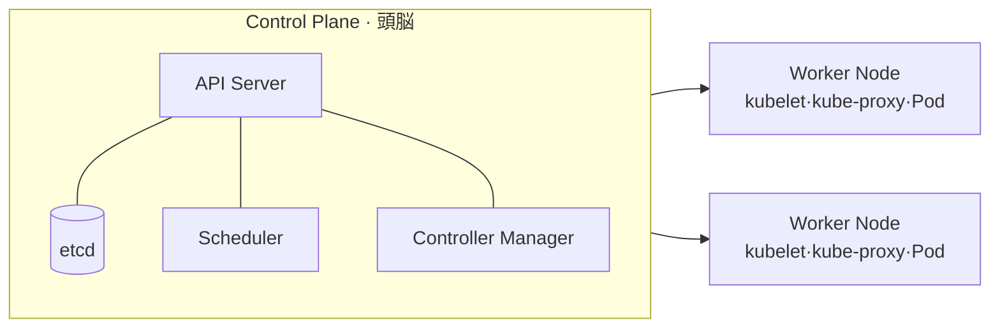

# Kubernetes(K8s)

## 1. 概要

### A. 定義
> コンテナ化されたアプリケーションの**デプロイ・スケーリング・運用を宣言的に自動化**するオープンソースの**コンテナオーケストレーション**プラットフォームであり、Googleの社内システム(Borg)に端を発し、現在はCNCFの卒業プロジェクトである。

### B. 登場背景および必要性
Dockerによってコンテナは標準化されたが、運用現場ではコンテナ一つではなく**数百~数千個**を扱わなければならない。どのサーバーにどのコンテナを起動するか、停止したら誰が再起動するか、トラフィックが集中したらどう増やすかを人が手動で管理することは不可能である。MSAとクラウドネイティブが普及するにつれ、この複雑さは爆発的に増大した。Kubernetesはこの「**大規模コンテナ運用の自動化**」という問題を解決するために登場し、管理者が「望ましい状態(Desired State)」を宣言するだけで、システムが自らその状態を維持するようにする。

### C. 特徴
核心となる哲学は**宣言的構成(Declarative)**である。「こうせよ(命令型)」ではなく「このような状態であるべきだ(宣言型)」をYAMLで記述すれば、Kubernetesが現在の状態と比較して自ら合わせる。これにより**自動復旧・オートスケーリング・無停止デプロイ**が可能となり、インフラに依存しないため、オンプレミス・マルチクラウド間の**移植性**が高い。

## 2. アーキテクチャ

Kubernetesは、命令・意思決定を担う**Control Plane(マスター)**と、実際のコンテナを実行する**Worker Node**に分かれる。この分離は「**決定(制御)と実行(作業)の分離**」によって、ノードが停止しても制御部は生きており、制御部が再起動してもノードのワークロードは動き続けるという堅牢性をもたらす。

- **API Server**:すべての要求が通過する唯一の関門(REST)。認証・検証の後に状態をetcdに記録し、すべての構成要素はこのAPI Serverを介してのみ通信する。
- **etcd**:クラスタのすべての状態(望ましい状態・現在の状態)を格納する分散Key-Valueストア。事実上クラスタの「**信頼できる唯一の情報源(SSOT)**」であり、損傷するとクラスタ全体が危険にさらされるため、バックアップが必須である。
- **Scheduler**:新しいPodを、リソース・制約(CPU・メモリ・affinity)を考慮してどのノードに配置するかを決定する。
- **Controller Manager**:後述する調整ループ(Reconcile)を実行する各種コントローラの集合である。
- **kubelet**:各ノードでAPI Serverの指示を受け、Podを実際に実行・監視する。
- **kube-proxy**:ノードのネットワークルールを管理し、Serviceに向かうトラフィックを適切なPodへルーティング・負荷分散する。

| 構成 | 役割 |
|---|---|
| API Server | すべての要求の関門(REST) |
| etcd | クラスタ状態の格納(分散KV、SSOT) |
| Scheduler | Podを適切なノードに配置 |
| Controller Manager | 状態の調整(Reconcile Loop) |
| kubelet | ノード上でのPodの実行・管理 |
| kube-proxy | ネットワークルーティング・ロードバランシング |

## 3. 主要オブジェクト

Kubernetesで扱うすべてのものは「オブジェクト」として宣言される。最小単位はコンテナではなく**Pod**であるが、これは密接に結合したコンテナ(例:アプリ + ログ収集サイドカー)を一つにまとめ、同じネットワーク・ストレージを共有させるためである。Podは一時的(いつでも停止・再生成される)でありIPが変わるため、安定したアクセスポイントを与える**Service**が必要となる。

| オブジェクト | 説明 |
|---|---|
| **Pod** | 最小のデプロイ単位(コンテナの束、一時的) |
| **ReplicaSet/Deployment** | レプリカ数の維持・ロールアウト・ロールバック |
| **Service** | Pod集合への安定したアクセスポイント・ロードバランシング |
| **Ingress** | 外部HTTP(S)ルーティング・パスベースの振り分け |
| **ConfigMap/Secret** | 設定・機密情報をコードから分離 |
| **Namespace** | 論理的な分離(マルチテナンシー・環境分離) |

例えばWebアプリをデプロイする場合、**Deployment**が「レプリカ3個」を宣言的に管理し、その前段で**Service**が3つのPodにトラフィックを分散し、**Ingress**が外部ドメインをこのServiceへ接続する。

## 4. 核心メカニズム — 調整ループ(Reconciliation)

Kubernetesの自動化が機能する根本原理は**調整ループ**である。各コントローラは「宣言された状態(例:レプリカ3個)」と「現在の状態(実際は2個)」を**絶えず比較し、差異があれば現在の状態を望ましい状態へ収束**させる。ノードが停止してPodが消えると、コントローラがこれを検知して別のノードに新しいPodを起動する。このループがあるからこそ、「自動復旧」は魔法ではなく必然となる。

- **オートスケーリング**:HPA(負荷に応じたPodの水平増減)・VPA(リソース要求の垂直調整)・Cluster Autoscaler(ノード自体の増減)によって需要に弾力的に対応する。
- **ローリングアップデート/ロールバック**:新バージョンのPodを少しずつ置き換えて**無停止デプロイ**を行い、問題が生じれば直前のリビジョンへ即座にロールバックする。

## 5. 考慮事項および示唆
- **運用の複雑さ**:強力である分、学習曲線が急である。そのため自前で構築するよりも、**マネージドサービス(EKS・GKE・AKS)**でControl Planeの運用負担を軽減するケースが多い。
- **セキュリティ**:デフォルト設定は寛容であるため、**RBAC(権限の最小化)・ネットワークポリシー・イメージ脆弱性スキャン**を必ず適用しなければならない。
- **オブザーバビリティ**:Podが頻繁に生成・消滅するため、Prometheus・Grafana・ログ収集などのモニタリングは運用上必須である。
- **標準インフラ・展望**:KubernetesはMSA・DevOps・CI/CDの事実上の標準基盤であり、Gitリポジトリを望ましい状態の情報源とする**GitOps(ArgoCDなど)**によってデプロイ自動化が拡張されつつある。

---

> **一言まとめ**: Kubernetesは*コンテナのデプロイ・スケーリング・運用を宣言的に自動化*するオーケストレーションプラットフォームであり、Control PlaneとNodeが調整ループ(Reconcile)によってPodを望ましい状態へ継続的に収束させ、マネージドサービス・GitOpsとともにクラウドネイティブの標準インフラとなった。
