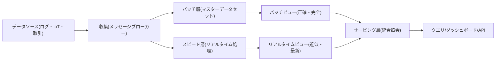
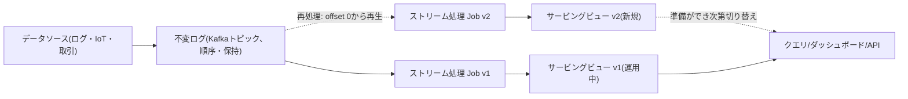

# ラムダ(Lambda)アーキテクチャとカッパ(Kappa)アーキテクチャ

## 1. 概要

### A. 定義

> **ラムダアーキテクチャ(Lambda Architecture)**とは、大容量データを正確・完全に処理するバッチ層(Batch Layer)と低遅延で処理するスピード層(Speed Layer)を並行して運用し、両者の結果をサービング層(Serving Layer)で統合することで、照会遅延と結果の正確性を同時に確保するビッグデータ処理アーキテクチャである。

> **カッパアーキテクチャ(Kappa Architecture)**とは、バッチ層を取り除き、すべてのデータを順序が保証される不変ログ(Immutable Log)のイベントストリームに統一し、単一のストリーム処理パイプラインだけでリアルタイム処理と過去データの再処理(Reprocessing)の両方を行うアーキテクチャである。

二つのアーキテクチャはいずれも、「大量のデータを、遅延(latency)と正確性(accuracy)のトレードオフの中でどのように処理するか」という同一の問題に対する異なる回答である。ラムダはバッチとストリームという**二つの真実の経路**を設けてそれぞれの長所(バッチの完全性、ストリームの即時性)を取り、カッパは経路を**一つのログに単一化**して二つのコードベースを維持する複雑さを取り除く。情報管理技術士の観点からは、このテーマを単なるツールの選択ではなく、データの整合性保証モデル・再処理戦略・運用の複雑さ・コストを併せて設計するデータパイプラインのガバナンス問題として理解すべきである。

### B. 登場背景と必要性

第一に、大容量データの処理要求が「正確な集計」と「即時性」に分化した。伝統的なバッチ(例:夜間ETL)処理は日単位で正確な統計を算出するが、その間に発生したイベントは翌日になってようやく反映される。逆に純粋なリアルタイム処理は即時性に優れるものの、遅れて到着したデータ(late-arriving data)や障害時の欠落・重複を完全に補正することは難しい。初期のHadoopベースのバッチとStormベースのストリームを組み合わせた経験から、ラムダアーキテクチャ(Nathan Marz、2011年頃)が確立された。

第二に、CAP・再現性の制約がある。分散環境で処理ノードが停止したりネットワークが遅延したりすると、ストリーム処理の結果は近似値になりやすい。ラムダは「スピード層の結果は一時的な値であり、バッチ層がいずれ正確な値で上書きする」という**再計算(recompute)ベースの最終的整合性**を核心原理とする。すなわち、ストリームの誤差をバッチが定期的に修復する自己修正構造である。

第三に、ストリーム処理エンジンの成熟によってバッチを取り除くことが可能になった。Apache Kafkaのログ保持(retention)・再生(replay)機能と、Apache Flinkのexactly-once(厳密に1回)の状態処理、イベント時間(event-time)・ウォーターマーク(watermark)ベースのウィンドウが成熟するにつれ、「バッチとは実は有限のストリームである」という観点(Jay Kreps、2014年にカッパを提案)が実現可能となった。これにより、二つのコードベースを維持していたラムダの負担を軽減しようとする流れが生まれた。

### C. 共通目標と特徴

二つのアーキテクチャが共通して追求するのは、**元データの不変保存と再処理可能性**である。元のイベントを変更せずappend-onlyで格納しておけば、ロジックの誤りが見つかってもコードを修正して過去データを再度流し、結果を再生成できる。これは「格納は原本、ビューは派生」という原則であり、データリネージ(lineage)と監査(audit)にも有利である。違いは、その再処理を**別個のバッチジョブ**で行うか(ラムダ)、**同じストリームエンジンの再生**で行うか(カッパ)にある。

また、両アーキテクチャとも**派生ビューの再生成可能性**を前提としてサービングストアを設計する。サービングビューは原本ではなく、いつでも作り直せるキャッシュに近いため、スキーマ・インデックス・集計軸を変更しても原本に手を触れずにビューだけを再構築すればよい。この考え方は、「書き込み時点で事前に計算して格納(precompute)し、読み取り時点では照会のみ」というCQRS・イベントソーシングとも自然に結びつき、ダッシュボード・検索・推薦など多様な消費形態を一つのソースの上に載せる柔軟性を提供する。

## 2. ラムダアーキテクチャの構造と動作

### A. 3層構成

ラムダはバッチ・スピード・サービングの三つの層で構成される。マスターデータセット(不変の原本)がバッチ層とスピード層に同時に流入し、各層が作成したビューをサービング層が統合してクエリに応答する。

**バッチ層**は、マスターデータセット全体を定期的に(例:毎時・毎日)再計算して正確なバッチビューを作成する。データ全体を読み直すため、一部のロジックの誤りや遅れて到着したデータも次のバッチで自然に修正される。Hadoop MapReduce・Sparkが代表的なエンジンである。短所は完了までの遅延であり、到着したばかりのイベントは次のバッチまで反映されない。

**スピード層**は、バッチがまだ処理していない直近の区間だけをリアルタイムに処理してリアルタイムビューを生成する。Storm・Flink・Spark Streamingが用いられる。増分(incremental)処理であるため高速だが、状態を近似的に維持するため誤差が蓄積しうる。核心は、このビューが**一時的**であるという点である。

**サービング層**は、バッチビューとリアルタイムビューを統合してクエリに応答する。バッチがカバーする時点まではバッチビューを、それ以降の最新区間はリアルタイムビューを用いて合算する。バッチビューが更新されれば、その分だけリアルタイムビューの古い部分は破棄(失効)する。サービングストアとしては、ランダム読み取りと高速照会に強いキー・バリュー/カラムストア(例:HBase・Cassandra・Redis)や検索エンジンがよく用いられ、バッチビューをアトミックに置き換える(スワップ)ことで照会中の不整合を防ぐ。

### B. データ整合性の原理(再計算 vs 増分)

ラムダの正確性は、「いずれバッチが全体を再計算して真実を確定する」という再計算の原則から生まれる。例えば、リアルタイムの訪問者数集計がノード障害で5分間イベントの一部を取りこぼしても、次のバッチが元ログ全体を数え直し、正確な値でサービングビューを上書きする。これを式で表すと`クエリ結果 = merge(batch_view(全データ - 直近), realtime_view(直近))`であり、時間が経って「直近」の区間がバッチに吸収されれば、リアルタイムの誤差は消滅する。

具体的な事例として、1日20億件(平均約23,000 TPS、ピーク5万TPS)の広告クリックログを処理する場合を考える。広告主ダッシュボードは「これまでの総クリック数」を表示しなければならないが、精算は正確でなければならず、ダッシュボードはリアルタイムでなければならない。バッチ層が毎時の累積クリック数を精密に集計し、スピード層が直近1時間分だけを増分集計すれば、広告主は即時性と正確性を同時に得られる。精算はバッチビューのみを信頼するため、ストリームの近似誤差が課金に影響を与えない。

### C. 長所と限界

ラムダの最大の長所は、**障害の隔離と自己修正**である。スピード層が誤動作しても、その影響は「直近区間の一時的な誤差」に限定され、次のバッチがこれを正本で上書きするため、誤差が恒久化しない。また、バッチビューはいつでも原本から再生成できるため、新しい指標を遡及適用したり、過去の分析軸を変更したりすることにも柔軟である。この特性は、データの信頼性が核心となる金融・通信・公共統計において特に価値が大きい。

逆に、限界は**ロジックの二重化から生じる運用負担**である。同一の集計ルールをバッチ用(例:Spark)とストリーム用(例:Flink)の二系統で作成・維持しなければならず、ルールが変わる際に両コードが食い違うと、バッチビューとリアルタイムビューが不整合となり、サービング層での統合時に値が跳ねる問題が生じる。これを減らすには、集計ロジックを共通ライブラリとして抽出したり、両エンジンが同じUDF・スキーマを共有するよう強制したりといった規律が必要である。サービング層の統合・失効ロジック自体も、境界条件(バッチのカバー時点の境界における重複・欠落)を精密に扱わなければならない。

## 3. カッパアーキテクチャの構造と動作

### A. 単一ストリームパイプライン

カッパはバッチ層を取り除き、すべてをログ(Kafkaトピックなど)にappendして、一つのストリーム処理ジョブでビューを作成する。再処理が必要であれば新しいジョブを起動し、ログの先頭(または特定のoffset)から再度消費して新しいビューを作成し、準備が整えばトラフィックを切り替える。

核心は、**「バッチは有限ストリームの特殊なケースである」**という観点である。過去全体を再計算すること(=バッチの役割)を、ログをoffset 0から再生(replay)するストリームジョブで代替する。したがって処理ロジックは一系統のみ存在し、バッチ用・ストリーム用の二つのコードベースを同期させる負担がなくなる。

### B. 再処理(Reprocessing)戦略と状態管理

カッパでロジックを変更したりバグを修正したりする際には、「ブルーグリーン再処理」を用いる。既存のジョブ(v1)がサービスを提供している間に、修正したジョブ(v2)をログの先頭から実行して新しい出力テーブルを埋める。v2が現在時点(head)に追いつけば(catch-up)、コンシューマーをv2に切り替え、v1と旧テーブルを破棄する。この方式の前提は、**ログの保持期間が再処理に必要な履歴全体を格納できるほど十分**でなければならないことである。無期限保持が高価であれば、古いイベントをオブジェクトストレージに階層化(tiered storage)したり、定期的なスナップショットと組み合わせたりする。

正確性は、ストリームエンジンの状態・時間処理機能に依存する。Flinkのチェックポイント(checkpoint)ベースのexactly-once、イベント時間ベースのウィンドウとウォーターマーク、遅延データのための許容遅延(allowed lateness)が、バッチの完全性をかなりの部分で代替する。例えば決済の異常検知において、ネットワーク遅延で3分遅れて到着した取引も、ウォーターマークが30分の遅延を許容していれば正しいウィンドウに集計される。ただし、極端に遅れたデータや大規模なバックフィル(backfill)は依然として再処理ジョブで処理しなければならず、この点がカッパ運用の難易度を決定する。

カッパの再処理の成否は、以下の要素の事前設計にかかっている。各項目は独立したオプションではなく、保持期間・コスト・復旧時間(RTO)を併せて決定する連動変数であるため、SLAを基準にバランス点を定めなければならない。

| 要素 | 役割 | 設計時の考慮点 |
|---|---|---|
| ログ保持期間 | 再処理可能な過去の範囲を決定 | 長いほど再現性↑、保存コスト・個人情報の負担↑ |
| パーティション・並列度 | 再処理のスループットを決定 | catch-up速度とリソースコストのバランス |
| 状態バックエンド | ウィンドウ・集計状態の保管 | RocksDBなどのサイズ・チェックポイント周期のチューニング |
| スナップショット/タイムトラベル | 特定時点からの再生 | レイクハウスとの結合で無期限保持のコストを緩和 |
| 冪等シンク | 重複出力の防止 | 冪等キー・トランザクションでexactly-onceを完成 |

### C. 長所と限界

カッパの長所は、**単一コード・単一システムから生じる単純さと一貫性**である。ロジックが一系統であるためバッチ・ストリーム間のルール不整合が原理的に発生せず、リアルタイム処理と過去の再処理が同一のコード経路を通るため、「リアルタイム値と過去値の算出方式が異なる」という微妙なバグがなくなる。開発・デプロイの速度が速く、イベント駆動のマイクロサービス・ストリーミングプラットフォームと自然に結合する。

限界は、**正確性・再処理の負担がストリームエンジンとログ設計に集中する**点である。exactly-onceの保証、イベント時間・ウォーターマーク、状態バックエンドの運用はバッチよりも理解・運用の難易度が高く、大規模なバックフィルは運用クラスタに瞬間的な負荷を与える。無期限に近い履歴の保持が高価であるか規制上不可能な場合、純粋なカッパだけでは「非常に古いデータの全量再計算」に対応しきれず、結局はレイクハウス・スナップショットのようなバッチ的な補完が必要になる。

## 4. 比較と事例(違いの原因と実務的含意)

二つのアーキテクチャの違いは単なる層の数ではなく、「正確性をどこで保証するか」と「コード・運用をどれだけ単純化するか」のトレードオフに由来する。ラムダはバッチという**独立した真実の経路**を設けてストリームの誤差を根本的に修復するが、二系統のロジックを維持しなければならない。カッパはロジックを一つにして保守を単純化するが、正確性と大規模再処理の負担をストリームエンジンとログ保持の設計で引き受けなければならない。

| 区分 | ラムダアーキテクチャ | カッパアーキテクチャ |
|---|---|---|
| 処理経路 | バッチ + スピード(2経路) | 単一ストリーム(1経路) |
| コードベース | バッチ・ストリームの2系統(ロジックの二重化) | 1系統 |
| 再処理方式 | バッチジョブによる全体再計算 | ログのoffsetからのストリーム再生 |
| 正確性の保証 | バッチによる定期的な全量再計算 | ストリームのexactly-once・イベント時間・ウォーターマーク |
| 遅延(latency) | バッチは分~時間、スピードは秒 | 秒単位(再処理中は負荷) |
| 運用の複雑さ | 二つのシステムの同期・統合ロジックが複雑 | ログ保持・ストリーム状態管理の負担 |
| 適した状況 | 精算など正確性が決定的 + リアルタイム併用 | イベント中心・ロジック変更が頻繁なストリーミング |

実務上の含意は次のとおりである。第一に、**精算・規制報告のように誤差が金銭的・法的責任につながる領域**では、ラムダのバッチ経路が「監査可能な正本」を提供するため安全である。例えば通信事業者の料金精算は、バッチビューを正本とし、リアルタイムビューは参考用としてのみ公開する。第二に、**ロジックが頻繁に変わり、イベントが事実上無限のストリームである領域**(推薦、異常検知、IoTテレメトリ)では、カッパが開発・デプロイの速度で有利である。Netflix・LinkedInなどは、Kafkaログ中心のカッパ型パイプラインで数十万TPSを処理した事例を公開している。

第三に、現実の多くのシステムは**ハイブリッド型**である。ストリームエンジンでリアルタイムビューを作成しつつ、ログをデータレイクハウス(例:Delta・Iceberg・Hudi)に蓄積し、必要に応じて大規模なバックフィル・整合性検証をバッチで実行する。すなわち「理論上のカッパ + セーフティネットとしてのバッチ」であり、純粋な形態よりも運用リスクが低い。

具体的な比較事例として、スマートファクトリーの設備センサーテレメトリ(毎秒数十万ポイント)を考えてみよう。純粋なラムダを採用すれば、リアルタイムの異常アラートはスピード層が、日次の設備総合効率(OEE)レポートはバッチ層が担うが、OEEの算定式が改訂されるたびに両層のコードを併せて修正しなければならない。カッパを採用すれば、算定式の改訂時に修正したストリームジョブをログの先頭から再生し、過去のOEEまで一貫して再算出できるため保守が単純になるが、数か月分の元ログの保持コストと、再処理時のクラスタ負荷の急増を受け入れなければならない。どちらが正しいかは、「算定式の変更頻度 × 履歴再現の要求 × 保持コストの上限」という業務変数の積によって決まり、この判断ロジックを提示することが技術士の答案の核心的な差別化要素である。

## 5. 深掘り:ストリーミング標準化の流れと最新動向

最近の動向は、「バッチとストリームの統合(Unified Batch/Stream)」へと収斂しつつある。Apache Flinkは同一のAPIで有界(bounded)・無界(unbounded)データを処理する統合実行を提供し、Apache Beamはバッチ・ストリームを一つのプログラミングモデルに抽象化してランナー(runner)だけを交換できるようにしている。これは、カッパの理念(一つのロジック)を言語・エンジンのレベルで裏付けるものである。

第二の流れは、**レイクハウスのテーブルフォーマットとの結合**である。Iceberg・Delta Lake・HudiがACID・タイムトラベル(time travel)・増分読み取りを提供するようになり、ログ(Kafka)–ストリーム処理(Flink/Spark)–テーブル(レイクハウス)が一つのパイプラインとしてつながった。タイムトラベル機能はカッパの再処理を「特定のスナップショットからの再生」へと単純化し、無期限のログ保持コストの問題を緩和する。これにより純粋なラムダ/カッパの境界は曖昧になり、「ストリーミングレイクハウス」という形態が台頭している。

第三は、**exactly-onceセマンティクスとイベント時間処理の標準化**である。Kafkaトランザクション、Flinkの2フェーズコミットシンク、ウォーターマークベースの遅延データ処理が成熟するにつれ、かつての「バッチだけが正確である」という前提は弱まった。ただし「exactly-once」は状態保存・シンクの冪等性(idempotency)を前提としてのみ成立するため、外部システムとの連携時には冪等キーの設計が依然として必須である。

予想される出題方向としては、▲ラムダ・カッパの構造図と違いの記述、▲バッチ/スピード/サービング層の役割と整合性の原理、▲カッパの再処理戦略とログ保持の問題、▲レイクハウス・Flinkとの連携、▲特定業務(精算 vs 異常検知)に適したアーキテクチャ選択の根拠提示が有力である。答案構成の戦略は、「概念図 → 層ごとの役割 → 整合性の原理 → 比較表 → 業務特性に基づく選択ロジック → 最新の統合動向」の順で展開すれば、深掘り・論述の要件を満たせる。

## 6. 考慮事項および示唆(技術士の観点)

- **正確性要求とアーキテクチャ選択の整合**: 誤差が金銭・規制上の責任につながる精算・開示の領域には、バッチの正本を持つラムダ(またはセーフティネットとしてのバッチを置いたハイブリッド型)が適しており、即時性・ロジックの俊敏性が優先される推薦・異常検知にはカッパが有利である。「リアルタイム=正確」ではないという点を明確に区別して設計しなければならない。
- **再処理・バックフィル戦略の事前設計**: ロジックの変更・バグの修正は必然であるため、元ログの不変保存・保持期間・再生(replay)手順・ブルーグリーン切り替えをアーキテクチャの初期段階から定義しなければならない。ログ保持コストは、階層化ストレージ・スナップショット・レイクハウスのタイムトラベルで最適化する。
- **運用の複雑さと組織能力のトレードオフ**: ラムダでは二つのコードベースの同期・統合ロジック・重複検証がコストとなり、カッパではストリーム状態・ウォーターマーク・exactly-once保証の運用が難所となる。チームのストリーミング成熟度・SRE能力・モニタリング体制を考慮し、現実的な形態(純粋型 vs ハイブリッド型)を選択する。
- **データガバナンス・リネージとの連携**: 不変の原本・派生ビューという構造は、リネージ・監査・個人情報削除要求(GDPR・個人情報保護法)への対応に直結する。ログに個人情報が無期限に保持されると削除義務と衝突するため、仮名化・トークン化・保持期間・crypto-shredding(鍵の破棄)の戦略を併せて設計しなければならない。
- **コスト・性能の定量管理**: バッチの再計算周期、ストリームの並列度、ログのパーティション・保持、状態バックエンド(RocksDBなど)のサイズを、SLA(遅延・精度)と予算に合わせて定量的にチューニングしなければならない。無分別な無期限保持と過度なバッチ周期はコストを急増させる。
- **展望**: Flink・Beamの統合処理とレイクハウスのテーブルフォーマットとの結合により、純粋なラムダ/カッパの区分は次第に「ストリーミングレイクハウス」という統合形態に吸収されていくであろう。ただし正確性が決定的な業務では、バッチ検証というセーフティネットが長く残るため、技術士には理念型のアーキテクチャをそのまま移植するのではなく、業務特性に合わせた実用的な折衷を設計する能力が求められる。

## 参考資料

- Nathan Marz, "How to beat the CAP theorem" / Big Data (Lambda Architecture), http://nathanmarz.com/blog/how-to-beat-the-cap-theorem.html
- Jay Kreps, "Questioning the Lambda Architecture" (Kappa), https://www.oreilly.com/radar/questioning-the-lambda-architecture/
- Apache Flink, Unified Batch and Stream Processing, https://flink.apache.org/
- Apache Beam Programming Model, https://beam.apache.org/documentation/basics/
- Apache Iceberg / Delta Lake table format, https://iceberg.apache.org/ , https://delta.io/

---

> **一言まとめ**: ラムダはバッチ(正確)とスピード(即時)の二つの経路をサービング層で統合して正確性とリアルタイム性を同時に得るアーキテクチャであり、カッパは不変ログの単一ストリームパイプラインでリアルタイム処理と再処理を統合し、コード・運用を単純化したアーキテクチャであって、近年はFlink・レイクハウスと結合した「ストリーミングレイクハウス」へと収斂しつつある。
