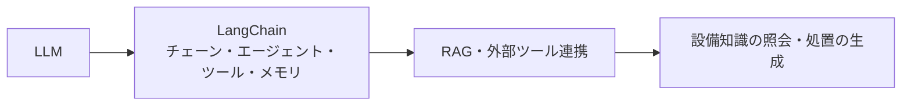

# LangChainを活用した設備の予知保全(Predictive Maintenance)

## 1. 概要

### A. 予知保全の定義および必要性
> **予知保全(PdM)**とは、設備に取り付けられたセンサーデータと状態情報を分析して**故障を事前に予測し、実際に必要な時点にのみ保全を行う**方式である。状態基準保全(CBM)に予測モデルを組み合わせた概念である。

保全方式は歴史的に三つの段階を経て発展してきた。初期の**事後保全(BM)**は故障が発生した後に修理する方式であり、予期しない生産停止と大きな損失を招いた。これを改善した**予防保全(PM)**は一定の周期ごとに部品を交換するが、まだ使える部品まで廃棄する**過剰保全**と、周期の合間に発生する突発故障を防ぐことはできなかった。**予知保全**は、設備の実際の状態(振動・温度・電流など)をリアルタイムに分析して「故障が差し迫ったまさにその時点」に保全を行うため、過剰保全の無駄と突発故障を同時に減らし、稼働率と安全性を高める。

### B. 背景
設備IoTセンサーと機械学習による異常検知技術が成熟するにつれ、予知保全の予測精度は大きく向上した。ただし異常検知モデルは「いつ・どこで異常がある」というシグナルはよく捉えるものの、**その原因が何であり、何を処置すべきか**を人間の言葉で説明することはできない。膨大な設備マニュアルと過去の保全履歴を、現場の作業者が即座に解釈することも難しい。そこでLLMとLangChainが、「検知された異常を理解可能な診断・処置へと翻訳する」役割として組み合わされる。

## 2. LangChainとLLM

**LLM(大規模言語モデル)**は膨大なテキストで学習して自然言語を理解・生成するが、それ自体では社内の設備データやリアルタイムのセンサーにアクセスできない。**LangChain**は、このLLMを外部のデータ・ツールと接続し、一つのアプリケーションとしてオーケストレーションするフレームワークである。複数のステップをつなぎ合わせる**チェーン**、自らツールの使用を判断する**エージェント**、外部機能を呼び出す**ツール**、対話の文脈を保持する**メモリ**、文書検索で根拠を注入する**RAG**を構成要素として提供する。すなわちLangChainは、LLMを「センサーDB・異常検知モデル・マニュアルリポジトリ」と接続する接着剤の役割を果たす。

| 概念 | 内容 |
|---|---|
| **LLM** | 大規模言語モデル — 自然言語の理解・生成 |
| **LangChain** | LLMアプリ開発フレームワーク — チェーン・エージェント・ツール・メモリ・RAG |
| **役割** | LLMをセンサーDB・API・マニュアルなどの外部資源と接続・オーケストレーション |

## 3. LangChainを用いた予知保全の活用

核心は、**数値予測はMLが、言語的な解釈と処置の案内はLLMが**担うという役割分担である。予知保全のワークフローにおいて異常検知モデルが「ベアリングの振動異常」を検知すると、LangChainのエージェントがこのシグナルを受け取り、RAGで該当設備のマニュアルと過去の類似事例を検索し、その根拠に基づいて原因と処置案を自然言語で生成する。現場の作業者はチャットボットに「3号機の振動はなぜ高いのか?」と尋ねるだけで、即座に診断を受けることができる。

| 活用 | 内容 |
|---|---|
| **RAGベースの知識照会** | 設備マニュアル・保全履歴をベクトルDBで検索し、根拠のある回答を提供 |
| **エージェント・ツール連携** | センサーDB・異常検知モデルを呼び出して診断結果を解釈 |
| **自然言語による診断・処置** | 異常原因の分析と保全指針を自然言語で生成 |
| **対話型インターフェース** | 現場作業者の質疑応答をチャットボットで支援 |

具体的な流れの例は次のとおりである。**① 異常検知モデルがアラートを発報** → **② LangChainエージェントが設備IDでマニュアルのRAGと保全履歴を照会** → **③ 検索された根拠をプロンプトに組み込み、原因推定・処置案を生成** → **④ 作業者に出典とともに提示**。こうすることで検知から処置までの時間が短縮され、熟練者に依存していた診断知識が標準化される。

## 4. 考慮事項および示唆

最大のリスクはLLMの**ハルシネーション**である。誤った保全指針は設備の損傷・安全事故に直結するため、必ず**RAGで実際のマニュアルの根拠を提示**し、最終判断は人が検証するHuman-in-the-loopの構造を設ける。また、設備の運用データ(OTデータ)は機密性が高く、外部の商用LLMにそのまま送信すると流出のリスクがあるため、**オンプレミス・プライベートLLM**や閉域網での配置が前提となる。リアルタイム性の面では、ミリ秒単位の異常検知は軽量なMLが担い、相対的に遅いLLMは解釈・報告の段階に配置するという役割分離が必要である。

| 考慮 | 内容 |
|---|---|
| **ハルシネーション・正確性** | RAGによる根拠提示 + 人による検証(Human-in-the-loop) |
| **データセキュリティ** | OTデータの流出防止 — オンプレミス・プライベートLLM |
| **リアルタイム性** | 異常検知(ML)とLLMによる解釈の役割・階層の分離 |

総合すると、予知保全の成否は**正確な異常検知(ML)と信頼できる解釈(LLM)の結合**にかかっている。前提条件であるOT/IT融合のセキュリティとデータ品質を確保した上で、産業現場のAIエージェント・デジタルツインと連携すれば、自律的な設備管理へと拡張しうる。

---

> **一言まとめ**: 予知保全は*センサーデータによって故障を事前に予測して保全する*方式であり、LangChainはLLMをセンサー・マニュアル(RAG)・ツールと接続して異常原因の分析・保全指針の生成・対話型診断を支援するが、ハルシネーションの防止(RAG・人による検証)とOTデータのセキュリティが前提となる。
