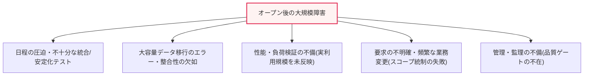
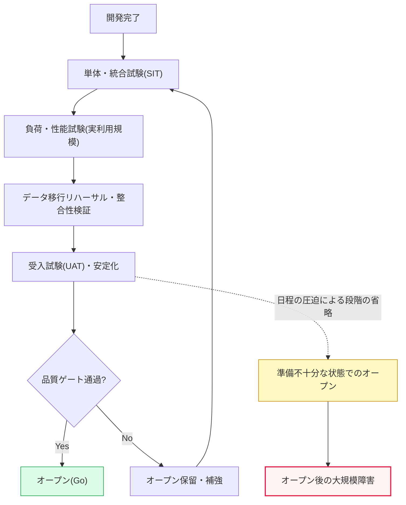

# 大規模公共次世代システムのオープン後の問題と対策

## 1. 概要

### A. 背景および問題提起

> 大規模公共次世代システム(教育・福祉・行政・税務など)がオープン直後に接続障害・処理エラー・データ不整合によって社会的混乱を招く事例が繰り返されるなかで、**開発・品質・オープン判断の体系全般に対する根本的な再点検**の必要性が浮上した。

この問題が繰り返される根本原因は、「**超大規模・高複雑度というシステムの特性と、切迫した政治・行政日程が品質を常に圧迫する**」構造にある。次世代システムは、数年~数十年にわたって蓄積・分散してきた老朽化(Legacy)システムを一度に置き換える超大規模事業であり、膨大なデータを移行し、省庁・機関間の複雑な機能を統合しなければならない。これに、数百万~数千万人が同時に利用する国民向けサービスという特性が加わり、小さな欠陥もたちまち大規模障害へと増幅される。

ところが、予算の会計年度・政策発表・開通式典といった**日程に追われて**十分な統合試験と安定化を経ずにオープンを強行すると、負荷が集中する実際の運用環境で潜在していた欠陥が一斉に噴出する。数百万人のユーザーが同時に経験する障害は、ただちに社会的な不便、苦情の急増、行政への信頼の毀損、そして発注機関と受注事業者間の責任の押し付け合いにつながる。実際、韓国の教育行政情報システム(第4世代NEIS、2023年)のオープン直後の成績処理・接続障害や、福祉・行政システム(次世代社会保障情報システム、2022年)開通後の給付支払いの遅延などは、この構造的問題を象徴的に示した事例として報道されている(具体的な数値・経過は監査・調査結果によって異なりうるため、一般化して記述する)。

したがってこの問題は、単なる「コーディングの欠陥」ではなく、**発注・業務管理・品質保証・オープンの意思決定**という事業管理全般の問題としてアプローチすべきである。技術的な対応だけでは再発を防げず、オープン判断の客観化と法・制度的な強制が併せて行われなければならないというのが核心的な認識である。

### B. 大規模次世代事業の構造的特性

次世代事業が一般のSIよりも危険である理由は、三つの特性にある。第一に、**ビッグバン(Big-bang)移行**が多い。老朽化システムを特定の時点で一括廃棄して新システムに移行するため、失敗時に元に戻す余地(Rollback)が小さい。第二に、**データ移行の規模・複雑さ**が大きい。数十年にわたって異なるルールで蓄積されたデータを新しいスキーマへ移す過程で、整合性のエラーが必然的に発生する。第三に、**利害関係者と要求の複雑さ**である。多数の省庁・機関・現業部門が絡み合って要求が頻繁に変わり、政治的な日程が技術的な準備度よりも優先される圧力が常に存在する。この三つの特性が組み合わさり、「準備が不十分なまま、元に戻せない方式でオープンする」という最悪の組み合わせを生み出す。

## 2. オープン後に発生する問題点と原因

オープン後の障害の原因は、ある一点ではなく複数の階層にわたって蓄積される。上記の構造図の五つの原因を文章で説明すると、次のとおりである。

第一に、**日程の圧迫によるテスト・安定化の不足**である。予算の会計年度末や政策発表の時点に開通を合わせようとするため、統合試験・負荷試験・安定化に必要な期間が真っ先に削減される。試験は日程が遅れると圧縮される「緩衝区間」として扱われやすく、その結果、潜在的な欠陥をオープン前に取り除く最後の防衛線が崩れる。特に複数の機関・モジュールを統合する**統合試験(SIT)**と、実際の業務フローを検証する**受入試験(UAT)**が不十分だと、単体機能は正常であるにもかかわらず接続部分で障害が発生するタイプの障害がオープン後に集中する。

第二に、**大容量データ移行のエラー・整合性の欠如**である。老朽化システムのデータは数十年にわたって異なるルール・例外とともに蓄積されており、新しいスキーマへ移すETLの過程で欠落・重複・型変換エラー・参照整合性違反が発生する。移行リハーサル(Dry-run)と整合性検証(移行元と移行先の件数・合計・サンプルの照合)を十分に行わなければ、オープン後に「自分の記録が消えた/間違っている」というタイプの苦情が急増する。データの問題は画面上のエラーとは異なり、事後の復旧が難しく信頼の毀損が大きいという点で、特に致命的である。

第三に、**性能・負荷検証の不備**である。開発・試験環境は、実利用規模の同時接続・トランザクションを再現できないことが多い。実際のオープン日に全国のユーザーが同時に集中すると、試験では表面化しなかったコネクションプールの枯渇・ロック競合・キャッシュミス・バッチの遅延が一斉に表面化する。目標応答時間・同時接続数・秒間処理量(TPS)を実環境に準じる規模で検証しなかったことが原因である。

第四に、**要求の不明確さと頻繁な業務変更**である。事業初期に要求が詳細化されないまま着手すると、開発中に業務内容が変わり続け、設計・試験が揺らぐ。範囲(Scope)が統制されなければ、日程・品質がともに崩れる。第五に、これらを早期に取り除くべき**管理・監理が不十分**であり、段階ごとの品質ゲートが機能しなかったことが根本的な背景である。

| 原因 | 具体的内容 | 代表的症状 |
|---|---|---|
| **日程の圧迫** | 安定化・統合/負荷試験期間の削減、オープンの強行 | 接続部分での統合エラーの集中 |
| **データ移行** | 大容量ETLのエラー・整合性検証の不足 | 記録の欠落・金額エラーの苦情 |
| **性能検証の不備** | 実利用規模の負荷試験の不足 | 接続遅延・サービスダウン |
| **要求の不明確さ** | スコープ統制の失敗、業務変更の頻発 | 設計・試験の手戻り |
| **管理・監理の不備** | 品質ゲート・段階検証の不作動 | リスクの後半での爆発 |

これらの原因は互いに独立しておらず、**連鎖的に増幅**される。日程の圧迫が試験を減らし、減らされた試験がデータ・性能の問題をオープン後へ先送りし、要求の不明確さが手戻りを生んで再び日程を圧迫するという悪循環である。したがって、ある一つの原因だけを手当てする対症療法ではなく、「日程ではなく準備度がオープンを決定する」という原則によって、連鎖全体を断ち切らなければならない。以下のプロセス詳細図は、理想的なオープン判断の流れと失敗地点(赤い分岐)を併せて示している。

プロセス詳細図において、正常経路(A→…→G→H)は各試験段階を順に通過し、品質ゲートで最終確認を行う流れである。一方、点線の経路(E-.->J→K)は、日程の圧迫によって負荷試験・整合性検証・安定化を飛ばし、オープンを強行した失敗経路である。二つの経路の分岐点は、結局のところ「ゲートを強制するのか、迂回するのか」という意思決定にあり、この決定を人の裁量ではなく制度によって固定することが対策の核心である。

## 3. 再発防止対策および法・制度の補完

根本的な対策は、「**準備が不十分なまま急いでオープンしないよう、制度で強制すること**」である。個別の技術的措置だけでは次の事業で同じ圧力が再現されるため、品質・データ・管理・制度の四つの軸から併せてアプローチしなければならない。

第一に、**品質管理**の面では、統合・負荷・安定化試験を契約上の義務期間として明記し、旧・新システムを一定期間並行して稼働させる**並行運用(Parallel Run)**によって結果を相互に照合する。並行運用は、新システムの出力を既存システムと比較して異常を早期に捉える安全装置である。

第二に、**データ**の面では、移行を複数回**リハーサル**し、移行元と移行先の件数・合計・主要項目のサンプルを照合する整合性検証を合格基準とする。移行失敗時の復帰手順(Rollback plan)も事前に定義する。

第三に、**管理・監理**の面では、事業着手前に要求を詳細化する**ISMP(情報システムマスタープラン)**を実施し、段階ごとに監理と**品質ゲート(Quality Gate)**を設けて、基準未達の場合は次の段階に進めないようにする。

第四に、**法・制度**の面では、客観的な準備度に基づいてオープンを判断するよう**オープン判断基準を制度化**し、無理な日程・低価格発注を防ぐために適正な事業期間・対価を保証し、瑕疵・責任の所在を契約で明確にする。

| 区分 | 対策 | 期待効果 |
|---|---|---|
| **品質管理** | 統合・負荷・安定化試験の義務化、並行運用 | オープン前の欠陥除去、安全な移行 |
| **データ** | 移行リハーサル、整合性検証、復帰手順 | データの完全性・信頼の確保 |
| **管理・監理** | ISMPによる要求の詳細化、段階ごとの監理・品質ゲート | リスクの早期遮断 |
| **法・制度** | オープン判断基準の法制化、適正な期間・対価、責任の明確化 | 日程圧迫の構造の改善 |

これらの対策に共通する論理は、「リスクを**後半から前半へ、人の判断から制度・指標へ**移す」ということである。すなわちオープン直前の臨機応変な対応ではなく、事業設計の段階から品質を確保し、オープン判断を定量化する予防的アプローチである。

特に**並行運用と段階的移行**は、ビッグバン方式の不可逆性(Irreversibility)を緩和する最も実効的な仕組みである。旧システムを即座に廃棄せず一定期間並行して運用すれば、新システムの出力を既存システムと照合して異常を早期に捉えることができ、重大な障害時には即座に元に戻せる安全弁が確保される。機能・地域・機関を分けて順次開通する段階的移行は、初期の開通規模を縮小して障害の波及範囲を限定し、前の段階で得た教訓を次の段階に反映させることを可能にする。一度に全国・全機能を公開するビッグバンは華々しいが、失敗コストが事業全体の規模にまで膨らむという点で慎重であるべきである。

また、制度的な補完は**発注慣行そのもの**を対象としなければならない。低価格落札と切迫した事業期間が構造的に品質への圧力を生み出すため、適正な対価の算定と現実的な工期の保証、業務変更に対する正当な対価の支払いが併せて行われなければ、受注事業者は再び試験・安定化を犠牲にすることになる。すなわち「品質を守ることが損にならない」契約構造をつくることが、技術的な対策に劣らず重要である。

## 4. オープン可否判断のための指標管理(品質ゲート)

オープンの可否は、担当者の勘や政治的な日程ではなく、**事前に定義された定量指標**によって判断しなければならない。核心は、オープン判断基準(Go/No-go Criteria)を事業初期に合意し、オープン直前にそれを満たしたかどうかを客観的に確認する**品質ゲート**を運用することである。

判断指標は大きく四つの軸で構成する。**欠陥(Defect)**の軸では、重大(Critical)・緊急(Blocker)の欠陥が0件か、欠陥密度が目標以下かを確認する。**テスト**の軸では、要求に対する試験カバレッジと合格率が目標を達成したかを確認する。**性能**の軸では、目標応答時間・同時接続数・TPSを実利用規模の負荷試験で満たしたかを検証する。**データ**の軸では、移行整合率が基準(例:100%に近い値)を満たすかを確認する。この四つの軸をすべて通過して初めて「オープン可能(Go)」と判定する。

| 指標の軸 | 判断基準(例) | 未達時の措置 |
|---|---|---|
| **欠陥** | 重大・緊急欠陥0件、欠陥密度が目標以下 | オープン保留・ホットフィックス |
| **テスト** | 要求に対するカバレッジ・合格率の目標達成 | 試験の補強 |
| **性能** | 目標応答時間・同時接続数・TPSの負荷試験合格 | チューニング・増設 |
| **データ** | 移行整合率の基準充足 | 再移行・補正 |

重要なのは、指標を**オープン後ではなくオープン前に**強制力をもって適用することである。ゲートを通過できなければ日程を延期してでもオープンしないという原則が確立されなければ、指標は形式的な手続きに成り下がる。また、オープン後も接続成功率・エラー率・応答時間をリアルタイムのダッシュボードで監視し、事前に定めた閾値を超えれば並行運用中の旧システムに切り戻す**ロールバック・緊急対応体制**を整えなければならない。

## 5. 深掘り:類似既出問題との関連と予想出題方向

このテーマは、プロジェクト・品質・監理・リスク管理が交差する総合的な論題であり、多くの既出問題とつながっている。① **品質管理**の面では、欠陥密度・テストカバレッジといった品質指標とSQA(ソフトウェア品質保証)、② **リスク管理**の面では、ビッグバン移行のリスク分散(段階的移行・並行運用)、③ **発注・監理**の面では、ISMP・情報化事業の監理・EVM(アーンドバリューマネジメント)、④ **データ管理**の面では、データ移行・品質(Data Quality)・マイグレーション戦略と関連する。近年はクラウドネイティブへの移行と相まって、ビッグバンの代わりに機能を段階的に移す**ストラングラーパターン(Strangler Fig)**や、カナリア・ブルーグリーンデプロイによって移行リスクを分散する方策が代替案として議論されている。

技術士の答案では、「なぜ繰り返されるのか(構造的原因) → 何を改めるのか(品質・データ・管理・制度) → オープンをどう判断するのか(定量ゲート)」の流れで展開し、結論で**オープン判断の客観化・制度化とビッグバンのリスク分散**を強調すれば説得力が高まる。特定事業の原因を断定するよりも、共通する構造と対策を一般化して記述する方が安全である。

## 6. 考慮事項および示唆

1. **オープン判断の客観化・制度化が核心である。** 政治・行政日程の圧迫から脱し、定量指標(品質ゲート)を満たして初めてオープンするという原則を、契約・制度で明確に定めなければならない。ゲート不通過時のオープン延期権限を明確に付与してこそ実効性が生まれる。
2. **ビッグバンの代わりに段階的移行・並行運用でリスクを分散する。** 旧・新システムの並行運用、機能・地域単位の順次開通、ストラングラー・カナリアデプロイによって、「一度にすべてを変える」ことによる爆発的なリスクを減らす。
3. **発注・業務管理体系の改善が根本である。** ISMPによる要求の詳細化、適正な事業期間・対価の保証、低価格・短納期発注の慣行の改善、段階ごとの監理によって最初から品質を確保することが、事後対応よりもはるかに効果的である。
4. **データ移行を独立したリスクとして管理する。** 移行は機能開発とは別の専任・検証体制(リハーサル・整合性検証・復帰手順)を設けるべきであり、データの信頼の毀損は復旧が難しいという点で、最優先の管理対象である。
5. **オープン後の安定化・緊急対応まで事業範囲に含める。** オープンは終わりではなく始まりであるため、リアルタイム監視・ホットフィックス体制・ロールバック計画・安定化要員を契約範囲と予算に明記し、「オープン後の放置」を防がなければならない。

## 参考資料

- 韓国ソフトウェア振興法・情報システム監理基準(科学技術情報通信部), https://www.msit.go.kr/
- 韓国知能情報社会振興院(NIA)情報化事業の管理・監理案内, https://www.nia.or.kr/
- Martin Fowler, StranglerFigApplication, https://martinfowler.com/bliki/StranglerFigApplication.html

---

> **一言まとめ**: 大規模公共次世代システムのオープン後の障害は、*日程の圧迫・データ移行のエラー・性能検証の不備・要求の不明確さ・監理の不備*という構造的原因に起因しており、十分な統合/負荷試験・並行運用・定量指標に基づくオープン判断(品質ゲート)・ビッグバンのリスク分散・法制度の補完によって再発を防止しなければならない。
