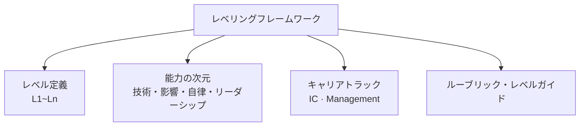

# レベリングフレームワーク(Leveling Framework、職務レベル体系)

## 1. 概要

### A. 定義
> 組織内の職務の**責任・能力・影響力(impact)の水準を体系的に定義し、等級(レベル)として構造化**することで、採用・評価・報酬・成長経路に一貫した基準を提供する人事・組織管理体系。特にIT・エンジニアリング組織において、「何がシニアをシニアたらしめるのか」を、年次ではなく**影響力の範囲(scope of impact)**によって規定する。

レベリングフレームワークの本質は、**成長と報酬の「共通言語」をつくること**である。レベルがなければ、「あの人はなぜシニアなのか」「自分はなぜ昇進できなかったのか」という問いに、管理者の主観以外に答える根拠がない。レベリングフレームワークは、各レベルが要求する行動・能力・影響力を明文化した**ルーブリック(rubric)**を提示することで、評価・報酬・昇進を個人の印象ではなく**観察可能な基準**に整合させる。

### B. 登場背景および必要性
組織が小規模なうちは、メンバーの貢献をリーダーが直接観察できるため、別途の体系は必要ない。しかし人員が数十・数百人に増えると、**公平性の問題(同じ職級なのになぜ報酬が違うのか)**、**成長経路の不透明さ(何をすれば次の段階に進めるのか)**、**主観的な評価**が組織の信頼を蝕み始める。特にIT人材は、専門性が深まるほど管理職にならなければ成長・報酬が上がらない構造に閉じ込められがちであり、優れたエンジニアを管理職に昇進させた結果、両方を失うという**ピーターの法則(Peter Principle)**がそれをよく示している。レベリングフレームワークは、こうした問題に対応して**客観的な基準と専門職の成長経路**を同時に提供するために登場した。

## 2. 構成要素

レベリングフレームワークは、四つの要素がかみ合って機能する。レベルだけがあって能力の次元がなければ、何をもってレベルを判定するかが曖昧になり、ルーブリックがなければ、同じレベルでも評価者ごとに異なる解釈がなされるためである。

| 構成要素 | 内容 | 役割 |
|---|---|---|
| **レベル定義** | L1(ジュニア)~Ln(フェロー/役員級)の段階 | 成長の階段の骨組み |
| **能力の次元** | 技術的専門性、影響範囲、自律性、協業・リーダーシップ、ビジネスインパクト | 何をもってレベルを判定するか |
| **キャリアトラック** | IC(個人貢献者)・Management(管理職)の二元経路 | 成長方向の選択肢 |
| **ルーブリック/レベルガイド** | 各レベル×次元の期待行動を記述したマトリクス | 判定の客観的根拠 |

最も核心となる軸は**影響力の範囲**である。低いレベルは与えられた課題(task)を完遂することに焦点があり、レベルが上がるほどその影響が**プロジェクト→チーム→組織→全社**へと広がる。例えばミドルエンジニアは明確に定義された機能を自ら実装するが、スタッフ級は複数のチームにまたがるアーキテクチャの問題を定義し、方向性を示す。このように、**自律性(どれだけ指示なしに自ら問題を定義・解決できるか)と曖昧さへの対処能力**がレベルとともに大きくなることが核心原理である。

## 3. デュアルラダー(Dual Ladder)

レベリングフレームワークの最も重要な設計思想は、**個人貢献者(IC)トラックと管理職(M)トラックを同等のレベルで並列に配置する**デュアルラダーである。二つのトラックを同じ高さに置く理由は明確である。専門性の深いエンジニアを成長させるために管理職へ昇格させると、組織は優れたエンジニアを失い、代わりに準備のできていない管理者を得るという二重の損失を被るためである。

| トラック | 成長方向 | 上位レベルの例 |
|---|---|---|
| **IC(個人貢献者)** | 技術の深さ・影響力の拡大 | スタッフ → プリンシパル → フェローエンジニア |
| **Management** | 組織・人の管理範囲の拡大 | チームリーダー → グループ長 → ディレクター → VP |

核心は、特定のレベル以上で二つのトラックが**同一の報酬・地位**を持つという点である。例えばプリンシパルエンジニアとディレクターが同じレベルとして処遇されれば、エンジニアは「管理職にならなくても」最高水準まで成長できる。これは、技術リーダーシップを組織に引き留める強力なインセンティブとなる。ただし、二つのトラックは**相互に転換可能**でなければならず、管理職トラックも技術への理解を失わないよう設計しなければならない。

## 4. 運用:キャリブレーションとスキルフレームワークとの連携

ルーブリックがあっても、評価者ごとに物差しが異なれば公平性は崩れる。そのため、複数の管理者が集まって互いの評価根拠を照合し、基準のばらつきを調整する**キャリブレーション(calibration)**会議が必須である。Aチームの「シニア」とBチームの「シニア」が実際に同じ水準かを相互検証することで、レベルが組織全体で一貫した意味を持つよう補正するのである。

また、レベリングフレームワークは、標準的な**スキルフレームワークと連携**させることで客観性が高まる。代表的なものとして、国際的なIT能力標準である**SFIA(Skills Framework for the Information Age)**は、ITの職務能力を7段階の責任レベル(自律性・影響・複雑性など)で定義しており、これを社内レベルとマッピングすれば、外部ベンチマークに基づく根拠が得られる。韓国では**NCS(国家職務能力標準)**の能力単位・水準体系が類似の役割を果たしている。

| 運用要素 | 目的 |
|---|---|
| **キャリブレーション** | 評価者間の基準のばらつきを調整 → 組織全体の公平性 |
| **スキルフレームワーク(SFIA・NCS)との連携** | 外部標準に基づく客観性の確保 |
| **定期レビュー・レベルインフレの管理** | レベルの濫発による基準の崩壊を防止 |

## 5. 伝統的な年功序列との比較

レベリングフレームワークがなぜ必要なのかは、**年功序列(号俸制)**と対比すると明確になる。年功序列は勤続年数に比例して等級・報酬が上がるため、運用が単純で予測可能であるが、**貢献と報酬が食い違う**という問題がある。長く勤務しているが影響力が停滞している人と、勤続は短いが組織に大きなインパクトをもたらした人の処遇が逆転すれば、優秀な人材が流出する。レベリングフレームワークは、報酬の基準を**年次から影響力・能力へ移す**ことで、この不一致を解消する。違いが生じる根本的な理由は、二つの体系が測定する対象そのものが異なるためである—一方は「どれだけ長く」、もう一方は「どれだけ広く」である。

| 区分 | 年功序列(号俸制) | レベリングフレームワーク |
|---|---|---|
| **基準** | 勤続年数 | 能力・影響力の範囲 |
| **長所** | 単純・予測可能・安定 | 貢献と報酬の整合、成長経路が明確 |
| **短所** | 貢献と報酬の不一致、人材の流出 | 設計・運用コスト、レベルインフレのリスク |

## 6. 考慮事項および示唆(技術士の観点)
- **客観性と柔軟性のバランス**: ルーブリックが細かすぎるとチェックリストを埋める形式主義に陥り、抽象的すぎると主観が入り込む。観察可能な行動を中心に記述しつつ、文脈に応じた判断の余地を残すバランスが必要である。
- **レベルインフレへの警戒**: 転職・リテンションの圧力からレベルを濫発すると、基準そのものが崩壊してフレームワークが無意味になる。キャリブレーションと、上位レベル昇進の高い基準線(bar)によって統制しなければならない。
- **組織の成熟度に合わせた導入**: 小規模なスタートアップに大企業式の多段階レベルを移植すると、官僚化を招くだけである。人員規模・成長段階に合わせ、単純な骨組みから段階的に精緻化していくことが望ましい。
- **文化・報酬体系との整合**: レベルは、評価・報酬・昇進と結びついて初めて実効性を持つ。レベル定義だけを作成して報酬バンドと連動させなければ、文書として残るだけである。
- **AI時代における能力の再定義**: 生成AIがコーディング・文書作成を補助するようになり、低いレベルで求められていた「実行速度」よりも、**問題定義・検証・判断**といった上位能力の比重が高まっている。レベルルーブリックの能力の次元も、これに合わせて定期的に更新しなければならない。

---

> **一言まとめ**: レベリングフレームワークは、職務を*影響力の範囲・能力*で等級化し、採用・評価・報酬・成長の共通言語を提供する体系であり、*IC・管理職のデュアルラダー*によって専門職の成長経路を開き、*キャリブレーション・SFIA/NCSとの連携*によって公平性と客観性を確保しつつ、レベルインフレを警戒しなければならない。
