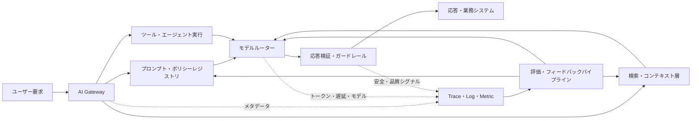
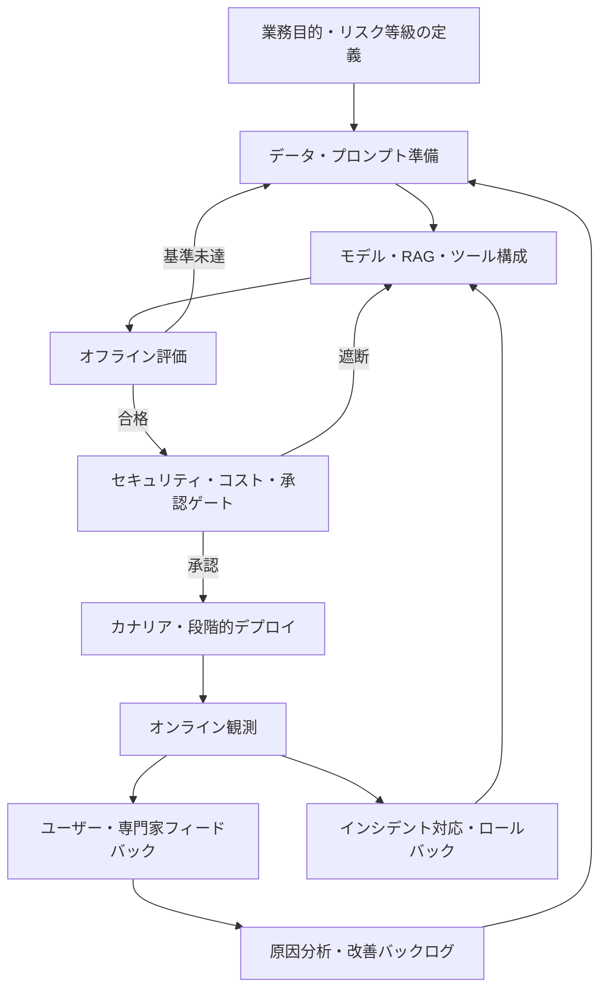

# LLMOps（大規模言語モデル運用）と生成AIサービスのライフサイクル管理

## 1. 概要

> **定義**: LLMOps（Large Language Model Operations）とは、大規模言語モデルおよびそれを活用したアプリケーションを開発・デプロイ・運用・監査・改善するために、プロンプト、モデル、データ、検索、ツール呼び出し、評価、オブザーバビリティ、セキュリティ、コストを一つの反復可能な運用体系として管理する実践方法論である。

大規模言語モデルサービスは、従来のソフトウェアのように同一入力に対して常に同一の出力を返すわけではない。
モデル自体の確率的生成、提供者によるモデルの変更、プロンプトの小さな修正、検索文書の変化、ツール呼び出し結果が相まって出力品質を変化させる。
したがって、アプリケーションコードをデプロイするだけではサービス品質を保証できない。

初期の生成AIプロジェクトでは、プロンプトをノートやコード内に一時的に保存し、いくつかの例示質問で品質を確認した後、そのまま本番に投入するケースが多かった。
この方式はデモを素早く作れるが、どのプロンプトとモデルがどの根拠を使用したかを再現することが難しい。
誤答・ハルシネーション・プロンプトインジェクション・個人情報漏えいが発生した際に原因を追跡することも難しい。

LLMOpsは、こうした不確実性を消し去るのではなく、制御可能な変化へと転換するアプローチである。
変更可能な要素をバージョンと承認の単位とし、リリース前評価と運用中の観測を結び付ける。
品質・安全・レイテンシ・コストを同時に測定し、単一指標のみを最適化する副作用を減らす。

本答案では、LLMOpsの構成原理と参照アーキテクチャ、MLOpsとの違い、開発から廃棄までの手順、評価・オブザーバビリティ・セキュリティ統制、事例、そして技術士の観点からの導入戦略を論述する。

## 2. LLMOpsの目標と構成原理

LLMOpsの第一の目標は再現性である。
ユーザー要求、システムプロンプト、検索クエリ、検索文書の識別子、モデル識別子、パラメータ、ツール呼び出し、出力および評価結果が結び付いていてこそ、同じ事象を再分析できる。
完全な決定性を強制するよりも、同一条件を再構成できる証跡を残すことが現実的な目標である。

第二の目標は品質の持続性である。
LLMの応答は正確性だけでは評価しにくく、業務目的に合った根拠性・関連性・一貫性・安全性・形式遵守の有無を併せて見る必要がある。
そのため、代表的な質問で構成した評価データセットと、自動・専門家・ユーザー評価を組み合わせて変更前後の差を比較する。

第三の目標は運用効率性である。
モデル呼び出しコストとトークン数、キャッシュヒット率、検索の深さ、ツール呼び出し回数、GPUまたは外部APIの使用量を管理しなければならない。
性能を高めるために大きなモデルばかりを選べばコストとレイテンシが増大するため、ルーティング・キャッシュ・プロンプト圧縮・小型モデルへの置き換えを併せて検討する。

第四の目標は説明責任と制御可能性である。
誰がどのような目的とデータでシステムを承認したのか、どのポリシーに違反したのか、事故後にどのような措置を取ったのかを確認できなければならない。
これは技術的なログだけでなく、オーナー、リスク等級、利用目的、保存期間、変更承認といったガバナンス情報まで含む。

以下は、ユーザー要求が複数の運用資産を経て応答と証跡に変換される全体構造である。

AI Gatewayは、複数のモデル提供者を抽象化し、認証・レート制限・ルーティング・コストポリシーを適用する境界層である。
単純なプロキシとは異なり、モデルバージョン、入出力ポリシー、障害時の代替経路、テナント別使用量を併せて管理できなければならない。

プロンプト・ポリシーレジストリは、システムプロンプトとテンプレートをソースコードまたは専用リポジトリでバージョン管理する。
プロンプトを変えるだけでも結果が変わるため、コードと同等のレビュー・承認・ロールバック手順が必要である。

検索・コンテキスト層は、RAGで使用する文書を収集・クレンジング・分割・埋め込み・索引化し、要求に合った根拠を検索する。
文書が変わった際に索引バージョンと文書権限を併せて管理しなければ、古い情報や権限のない情報が応答に混入し得る。

モデルルーターは、タスクの種類とリスク度に応じてモデルを選択する。
単純な分類は小型モデルで処理し、複雑な推論や高リスク業務は上位モデルと人によるレビューを経る方式が代表的である。
ルーティング規則は品質だけでなく、コスト、レイテンシ、地域・データ主権、障害時の代替可能性を含まなければならない。

応答検証・ガードレールは入力と出力の両方を検査する。
入力ではプロンプトインジェクション、過度な個人情報、ポリシー外の質問を確認し、出力では禁止語・機微情報・構造化形式・根拠リンク・業務ルールを点検する。
ガードレールに抵触した場合、一律に遮断するよりも、リスク度に応じて再質問・マスキング・案内文・人による承認へ分岐させる方がサービス目的に適う。

## 3. 運用ライフサイクルと参照プロセス

LLMOpsのライフサイクルは、アイデア、データ・目的の定義、プロンプトとチェーンの設計、オフライン評価、デプロイ、オンライン運用、フィードバックと改善、廃棄の循環で構成される。
各段階の成果物が次の段階へ引き渡されてこそ、運用品質が個人の経験に依存しなくなる。

### 3.1 目的定義とリスク分類

最初の段階では、モデルを導入すること自体を目的とするのではなく、解決すべき業務成果を定義する。
例えばカスタマーセンターの目標は「回答を生成する」ではなく、「社内ポリシーに基づく回答草案によって相談員の処理時間を短縮し、最終責任は相談員が保持する」となり得る。
目標が具体的であってこそ、正確性、処理時間、相談員の修正率、個人情報事故率といった測定値を定めることができる。

業務影響度と誤り許容度を基準にリスク等級を分類する。
単純な文書要約は自動掲載が可能な場合もあるが、融資承認・医療判断・人事措置のように権利や財産に影響を与える業務は補助ツールに限定し、人による承認を求める。
リスク等級はモデル性能が向上したからといって自動的に引き下げず、法的責任・被害規模・復旧可能性を併せて反映する。

### 3.2 プロンプト・モデル・データ資産の管理

プロンプトは文字列ではなく、実行可能なポリシー資産である。
テンプレートID、バージョン、作成者、変更理由、入力変数、許容モデル、期待出力スキーマ、禁止事例、承認状態を併せて記録する。
本番環境では、浮動的なモデルエイリアスではなく提供者が保証するモデル識別子と変更日を記録し、予期せぬモデルの差し替えを減らす。

モデルレジストリには、基盤モデル、ファインチューニングアダプタ、量子化方式、ライセンス、学習・検証データの出所、評価結果、デプロイ状態を関連付ける。
モデルファイルだけを保管し、データと評価条件を残さなければ、性能劣化やライセンス問題を説明することが難しい。

RAGデータは、文書の内容と同じくらい権限と鮮度が重要である。
収集時にソースシステム、所有部署、有効期限、削除・訂正履歴、アクセス等級を保存し、チャンクと埋め込みの関係を追跡する。
文書削除の要求があれば、原本リポジトリだけでなく、キャッシュ、ベクトルインデックス、検索結果ログの保存ポリシーまで確認しなければならない。

### 3.3 評価設計と品質ゲート

LLMの評価では、正解文字列と一致するかを見る評価と、業務目的に適合するかを見る評価を分離する。
要約は事実の保持と欠落を、質疑応答は根拠性と回答可否を、エージェントはツール選択と実行結果を中心に評価する。
単一の総合スコアは便利だが、高い流暢さが安全性の低下を覆い隠す問題があるため、生の指標も併せて保管する。

オフライン評価セットは正常な質問だけで作らない。
誤字・多言語・長文書・矛盾した資料・権限のない要求・敵対的入力・境界事例を含めてこそ、実際の障害を予測できる。
運用ログを評価セットとして再利用する際は個人情報を非識別化し、評価データが再びモデル学習に使用されるかを別途統制する。

自動評価は迅速な回帰検出に有利であり、人による評価は業務文脈や微妙な有害性を発見するのに有利である。
LLM-as-a-Judgeはコストと速度の面で利点があるが、評価者モデルのバイアスや自己選好が存在するため、サンプルに対する専門家のクロス検証が必要である。

代表的な指標は、以下のように目的別にまとめる。

| 品質領域 | 測定例 | 解釈時の注意点 |
|---|---|---|
| 正確性・根拠性 | 正答率、引用根拠適合率、回答不可判定 | 業務別の正解基準と文書の鮮度を明示する |
| 生成品質 | 関連性、一貫性、指示遵守率、形式エラー率 | 流暢さは事実性を保証しない |
| RAG品質 | 検索再現率、検索適合率、コンテキスト忠実度 | 検索失敗と生成失敗を分離する |
| 安全性 | ポリシー違反率、個人情報露出率、インジェクション成功率 | 平均ではなく最悪事例と高リスク群を見る |
| 運用性 | p50・p95レイテンシ、エラー率、可用性 | モデル・検索・ツールの区間別に分解する |
| 経済性 | 要求あたりトークン、要求あたりコスト、キャッシュヒット率 | 品質低下のないコスト削減かを確認する |

品質ゲートは、合格・不合格の基準を事前に宣言しなければならない。
例えば「根拠のない回答は回答不可に切り替え、高リスクのポリシー違反は0件を目標とし、p95レイテンシはサービス目標以内」のように、指標と措置を結び付ける。
実際の閾値は業務リスクとユーザーの期待を基準に定め、文書に記載された例示数値を組織の普遍的基準と誤解しないようにする。

### 3.4 デプロイ・ロールバック・オンライン運用

LLMアプリケーションは、モデルだけでなくプロンプト、検索インデックス、ツールスキーマ、ガードレール規則が一緒にデプロイされる。
したがって、一つのリリースマニフェストにすべての構成要素のバージョンを記録し、互換性検査を通過した組み合わせのみを昇格させる。

カナリアデプロイは、一部のトラフィックに新しい組み合わせを適用して品質と運用指標を比較する方式である。
トラフィック比率よりも重要なのは、観測期間、比較群、中止条件、自動または手動ロールバックの責任者である。
モデルの応答品質は要求タイプ別のばらつきが大きいため、全体平均だけでなく、中核業務群とリスク入力群を別途監視する。

ロールバックは、以前のモデルに戻すだけの操作ではない。
以前のプロンプト、検索インデックス、ツールバージョン、ポリシー設定を互換性のある一まとまりとして復元しなければならない。
古いインデックスを復元できない場合は、読み取り専用モードや検索なしの安全応答を用意しておく方が、より現実的な復旧戦略である。

## 4. 中核となる運用統制

### 4.1 オブザーバビリティと追跡性

インフラのログだけでは「なぜこの回答が出たのか」を説明できない。
一つの要求のtrace内に、原文または保護された参照値、プロンプトバージョン、モデル識別子、検索クエリと文書ID、ツール呼び出し、トークン数、レイテンシ、応答検証結果とユーザーフィードバックを結び付けなければならない。
機微な原文には最小収集・マスキング・アクセス制御を適用し、分析用ログと監査用原本の保存目的を区別する。

オブザーバビリティとは、シグナルを大量に保存することではなく、意思決定に必要な文脈を提供することである。
例えばレイテンシが増加した際、モデル推論、検索、外部ツール、リトライのどの区間が原因かを分解できなければならない。
品質低下が発生した際には、特定のプロンプトバージョン・文書コレクション・モデルルーティングとの相関関係を確認できなければならない。

### 4.2 セキュリティと個人情報保護

プロンプトインジェクションは、ユーザーの入力だけでなく、検索された文書やツールの結果にも含まれ得る。
したがって、外部コンテンツを指示文とデータに分離し、ツール呼び出しは許可リスト・最小権限・引数検証・再承認によって制限する。
モデルにシステム権限を直接与えず、中間サービスがユーザー権限を再確認する構造が必要である。

個人情報は入力前に目的と保存期間を点検し、必要に応じてマスキング・トークン化・機微情報検出を経てからモデルへ渡す。
出力においても原文の復元や間接的な識別可能性を検査しなければならず、ログ・評価セット・キャッシュ・ベンダーへの送信領域を同一のデータフローとして管理する。

モデル提供者および外部APIのデータ学習利用条件、処理地域、保存・削除ポリシー、事故通知、再委託先を、契約と技術設定の両面で確認する。
特に、無料または開発用エンドポイントと本番用エンドポイントのデータ処理条件を混同しない。

### 4.3 コスト・性能の最適化

要求あたりのコストは、入力トークン・出力トークン・モデル単価・呼び出し回数・検索とツールのコストの関数として考えることができる。
大まかに `要求コスト = 入力トークンコスト + 出力トークンコスト + 付随呼び出しコスト` と分解すれば、コスト上昇の原因を見つけやすい。

コスト削減とは、やみくもにプロンプトを短くすることではない。
反復するコンテキストはキャッシュし、検索結果の重複を除去し、要求の難易度に合わせてモデルをルーティングし、ツール呼び出し失敗によるリトライを制限する。
ただし、文脈を過度に縮約すると根拠性が低下し得るため、品質指標と併せて最適化する。

性能は平均レイテンシよりもテールレイテンシが重要である。
p95またはp99が高いとユーザーは断続的な停止を体験するため、検索・モデル・ツールの区間ごとにタイムアウトと予備経路を設ける。
ストリーミング応答は最初のトークンまでの時間を短縮できるが、全体完了時間や中断時の部分応答の安全性も併せて評価する。

### 4.4 ガバナンスと監査

LLMOpsの承認単位はモデル一つではなく、業務目的と実行構成の組み合わせである。
モデルのリスク評価、データの権利、プロンプト変更、評価結果、セキュリティ点検、運用責任者、緊急停止手順を一つの意思決定記録として結び付ける。

変更管理には「何が変わったのか」と併せて「なぜ変えたのか、どのようなリスクを受容したのか」を残す。
プロンプトの修正で品質が向上したとしても、特定の集団に不利な出力が増える可能性があるため、代表性のある評価と承認記録が必要である。

## 5. MLOps・LLMOps・GenAIOpsの比較

MLOpsは、データ・特徴量・学習モデルの実験とデプロイを体系化することに強みを持つ。
LLMOpsは、モデルの再学習よりも、プロンプト、検索コンテキスト、トークン、生成品質、ツール呼び出しといったアプリケーション実行時の変動性を追加で扱う。
GenAIOpsは、テキストだけでなく画像・音声・映像など生成AI全般の運用へ範囲を広げた表現であり、組織によってはLLMOpsを包含する上位概念として使われる。

| 区分 | MLOps | LLMOps | 実務的含意 |
|---|---|---|---|
| 主な対象 | 学習モデル・特徴量パイプライン | LLMアプリ・プロンプト・RAG・ツール | アプリケーション実行traceが必須である |
| 品質評価 | 正解率・F1・AUC・ドリフト | 根拠性・流暢さ・安全性・ツール成功率 | 定量・定性評価を組み合わせる |
| 変更単位 | データ・コード・モデル | プロンプト・モデル・インデックス・ツール・ポリシー | リリースマニフェストが必要である |
| コスト変数 | 学習・推論リソース | トークン・呼び出し回数・モデル単価 | 要求あたりコストを観測する |
| 失敗の様相 | 予測性能の低下 | ハルシネーション・インジェクション・形式違反・非決定性 | 入出力ガードレールを設ける |
| 運用責任 | モデル・データエンジニア | アプリ・プラットフォーム・セキュリティ・業務オーナー | 共同責任と承認体制が必要である |

この違いは、LLMOpsがMLOpsを置き換えるという意味ではない。
基盤モデルを直接学習またはファインチューニングするのであれば、MLOpsのデータ・実験・モデルレジストリが必要であり、その上にプロンプト・検索・エージェント運用を追加しなければならない。
逆に、外部モデルAPIを利用する企業もモデル内部を制御できないため、提供者の変更・品質回帰・データ処理条件を監視するLLMOpsが必要である。

## 6. 適用事例

### 6.1 社内規程検索型カスタマーセンター

金融機関が、相談員の社内規程検索を支援するRAGサービスを導入すると仮定する。
従来の検索はキーワードが一致する文書を列挙していたが、LLMOps方式では質問の意図と顧客タイプを分類し、権限のある規程のみを検索した後、根拠段落を含む回答草案を生成する。

運用前には、代表的な問い合わせ、例外規程、廃止された規程、悪意ある指示文を評価セットとして構成する。
回答が根拠文書を正確に引用しているか、根拠がない場合に回答を保留するか、相談員が修正した割合はどうかを測定する。

運用中は、規程文書の有効期限と改定履歴を索引のメタデータに反映する。
新しい規程のリリース時には、インデックスバージョンとプロンプトバージョンを併せて昇格させ、中核商品群についてカナリア検証を実施する。

顧客へ直接自動送信せず、相談員による承認段階を維持すれば、生成エラーによる被害を減らすことができる。
ただし、相談員がモデル出力を無批判にコピーする恐れがあるため、根拠表示、不確実性を示す文言、修正履歴、教育を併せて提供しなければならない。

### 6.2 社内開発支援エージェント

開発支援エージェントは、コード検索、イシュー要約、テスト実行、デプロイ要求まで遂行できる。
この場合、単純なチャットボットよりもツール呼び出し権限と変更の影響が大きいため、読み取り作業と書き込み作業を分離し、本番ブランチへの反映には人による承認を求める。

プロンプトとリポジトリ文書は信頼境界を行き来し得るため、検索されたREADMEやイシューのコメントを実行指示として扱わない。
ツール呼び出しの引数と対象リポジトリを検証し、実行コマンドはサンドボックスと時間・ネットワーク制限の中で実行する。

評価では、コードの正答率だけでなく、危険なコマンドの拒否、テスト失敗の検知、秘密情報漏えいの防止、変更説明の正確性を検証する。
運用指標は、タスク完了率、人による差し戻し率、テスト通過率、ツール失敗率、要求あたりコストと併せて見る。

この事例の要点は、エージェントにより多くの作業をさせることではなく、許容された自動化の範囲と中断可能な境界を明確にすることにある。

## 7. 深掘り: LLMOpsの最新運用動向と出題との関連

近年のLLMOpsは、モデルサーバーの管理から、アプリケーション全体の品質・安全・経済性を管理する方向へと拡張している。
公式のLLMOpsガイドでは、プロンプト管理、評価、トレーシング、デプロイ、モニタリングと継続的改善を一つの運用フローとして説明している（[MLflow LLMOps Guide](https://mlflow.org/llmops)）。

この方向性は、モデルを呼び出すAPIさえ作れば運用は終わるという考え方を変える。
プロンプト・検索・ツール・ガードレール・評価データはそれぞれ独立して変更されるため、変更の組み合わせを追跡し、品質回帰を自動的に検知しなければならない。

AIリスク管理の観点では、信頼性・安全・セキュリティ・透明性・説明可能性・個人情報保護を運用統制に組み込む必要がある。
NIST AI RMFはAIシステムのリスクを管理するための自主的フレームワークを提供しているため、LLMOpsの評価と監査項目を組織のリスク管理体系と結び付けることができる（[NIST AI Risk Management Framework](https://www.nist.gov/itl/ai-risk-management-framework)）。

セキュリティの面では、プロンプトインジェクション、機微情報の開示、サプライチェーンの脆弱性、過度なエージェント権限を、事前・運用・事後の各段階で繰り返し点検する。
OWASPのLLMアプリケーションリスク一覧は、開発・運用チームが脅威シナリオと統制を整理する出発点として活用できる（[OWASP Top 10 for Large Language Model Applications](https://owasp.org/www-project-top-10-for-large-language-model-applications/)）。

技術士の答案では、LLMOpsを「ツールの一覧」として列挙するのではなく、業務目標→資産のバージョン管理→評価ゲート→段階的デプロイ→観測・インシデント対応→フィードバック改善という管理サイクルとして提示するのが効果的である。
また、正確性だけを強調するのではなく、品質・安全・レイテンシ・コストのトレードオフと、人の最終責任を併せて記述しなければならない。

## 8. 考慮事項および示唆

### 8.1 業務目的と自動化の限界

LLMを導入する前に、エラーが発生しても復旧可能な業務か、人によるレビューが可能か、正解の根拠を確保できるかを判断する。
高リスク業務は、完全自動化よりも意思決定支援と承認証跡を優先する。

### 8.2 評価データの代表性と漏えい

評価セットは、実際のユーザーの言語・業務タイプ・例外状況を代表していなければならない。
運用中の質問をそのまま学習・評価に再利用するとデータリーケージにより性能を過大評価し得るため、分割とアクセス権限を管理する。

### 8.3 提供者ロックインと移行可能性

特定モデルの専用機能に深く依存すると、コスト・ポリシー・品質の変化時に移行が難しくなる。
モデル抽象化層、プロンプト契約、共通評価セット、代替モデルの性能基準を準備しつつ、抽象化がモデル固有の機能を過度に制限しないバランスが必要である。

### 8.4 個人情報とデータ主権

入力・検索・キャッシュ・ログ・評価セット・外部モデルへの送信を一つのデータフローとして描いてこそ、漏れている処理ポイントを見つけることができる。
目的外利用と長期保存を防ぎ、削除・訂正要求が埋め込みやバックアップにどのように反映されるかを手順化する。

### 8.5 観測データのパラドックス

詳細なtraceは障害原因の説明に有用であるが、それ自体が機微情報の保管庫となり得る。
原文の代わりにトークン化した参照値を使用し、運用者のロール別の照会範囲・保存期間・監査ログを分離する。

### 8.6 コストと品質の共同最適化

コスト削減のみをKPIとすると、根拠文書の縮小や小型モデルへの切り替えによって品質が低下し得る。
要求あたりコスト、業務成功率、安全性、レイテンシを一つのダッシュボードで見て、Paretoの観点から意思決定する。

### 8.7 組織と責任

プラットフォームチームは共通ランタイムと観測基盤を提供し、業務オーナーは正解基準とリスク許容度を定義し、セキュリティ・法務・個人情報担当者は統制と承認基準をレビューする。
モデル提供者が回答の業務責任を肩代わりするわけではないため、最終責任者とインシデント時の停止権限を明確にしなければならない。

### 8.8 継続的改善と廃棄

モデル・プロンプト・データは永続的な資産ではなく、成果とリスクを再評価する対象である。
利用が少ない、あるいはリスクに見合う価値のない機能は安全に廃棄し、関連するキー・キャッシュ・インデックス・ログ・アクセス権限まで整理してこそ、真のライフサイクル管理となる。

## 参考資料

- MLflow, “What is LLMOps?”: https://mlflow.org/llmops
- MLflow Documentation, “LLMs & Agents”: https://mlflow.org/docs/latest/
- NIST, “AI Risk Management Framework”: https://www.nist.gov/itl/ai-risk-management-framework
- OWASP, “Top 10 for Large Language Model Applications”: https://owasp.org/www-project-top-10-for-large-language-model-applications/
- NVIDIA Developer Blog, “Mastering LLM Techniques: LLMOps”: https://developer.nvidia.com/blog/mastering-llm-techniques-llmops/
- OpenTelemetry, “Generative AI semantic conventions”: https://opentelemetry.io/docs/specs/semconv/gen-ai/

---

> **一言まとめ**: LLMOpsは、プロンプト・モデル・検索・ツール・評価・セキュリティ・コスト・オブザーバビリティをバージョンと証跡で束ね、生成AIを再現可能かつ説明責任のある運用サービスへと転換する体系である。
