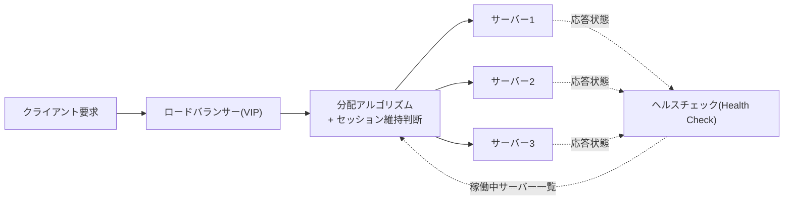
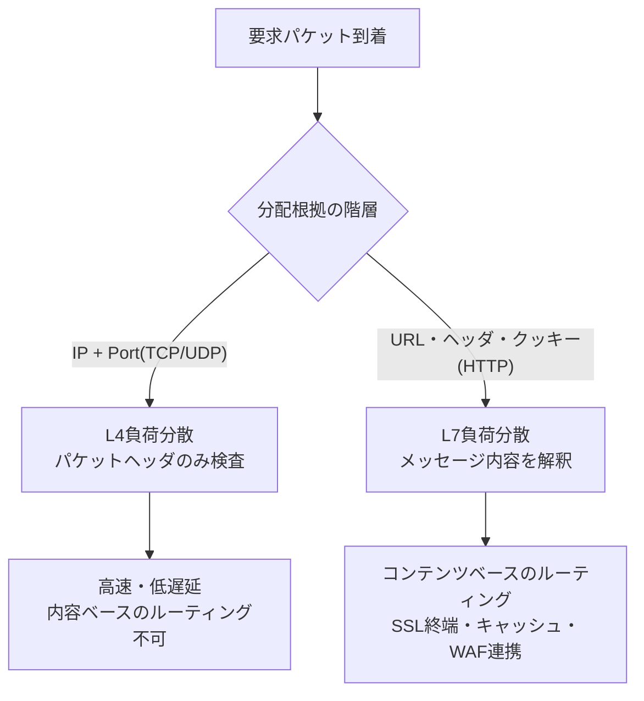

# 負荷分散（Load Balancing）とL4/L7トラフィック分配

## 1. 概要

> **負荷分散（Load Balancing）**とは、多数のクライアント要求を複数台のサーバー（または処理リソース）に規則的に配分することで、特定のリソースへの負荷集中を防ぎ、可用性・拡張性・応答性能を確保する技術であり、アーキテクチャ原則である。

単一サーバーですべての要求を処理していた構造は、三つの限界に直面する。第一に、処理容量の上限が明確であるため、トラフィックが増加すると応答遅延やタイムアウトが発生する。第二に、そのサーバーが障害を起こすとサービス全体が停止する単一障害点（SPOF, Single Point of Failure）となる。第三に、無停止でのデプロイ・パッチ適用が難しく、保守時にはサービスを止めなければならない。負荷分散は、同一の役割を担うサーバー群を一つの論理的サービスとして束ね、その前段にトラフィックを振り分ける層を置くことで、これら三つの問題を同時に緩和する。

負荷分散が必要となった背景は、トラフィックパターンの変化にある。EC（電子商取引）のセールイベント、公共予約システムの受付開始時刻、ストリーミングサービスの新作コンテンツ公開のように、瞬間的に要求が数十倍に急増（Spike）する状況が日常化した。例えば韓国の大手チケット予約サイトは、チケット販売開始直後の数分間に平常時の30〜50倍のトラフィックを受けるが、単一サーバーでは物理的に処理しきれない。また、クラウドとオートスケーリングが普及し、サーバー台数がリアルタイムに変化する環境では、「今稼働しているサーバーにだけ」トラフィックを送るインテリジェントな分配が必須要素となった。

負荷分散は、単に「要求を均等に振り分けること」ではない。稼働中のサーバーを識別するヘルスチェック（Health Check）、同一ユーザーの要求を同一サーバーへ送るセッション維持（Session Persistence）、トラフィック特性に合った分配アルゴリズムの選択、さらに地理的に分散したデータセンター間の分配（GSLB）までを含む、総合的なトラフィック管理体系として理解すべきである。

### A. 負荷分散が提供する中核的価値

負荷分散の効用は、三つの品質特性に要約される。第一は**可用性（Availability）**である。複数のサーバーが同一サービスを提供するため、一部が停止しても残りがトラフィックを吸収し、ヘルスチェックが障害サーバーを自動的に隔離する。これにより単一障害点が除去され、無停止デプロイ・ローリングアップデートが可能になる。

第二は**拡張性（Scalability）**である。要求が増えればサーバーを水平拡張（scale-out）してプールに追加するだけでよく、ロードバランサーが新しいサーバーへトラフィックを流してくれる。垂直拡張（より大きなサーバーへの交換）とは異なり物理的な上限がなく、オートスケーリングと組み合わせればトラフィックに比例して自動的に容量が調整される。

第三は**性能（Performance）**である。負荷を分散すればサーバーあたりの処理量が下がって応答遅延やキュー待ちが減り、地域ベースの分配（GSLB）によってユーザーに近いサーバーを割り当てることでネットワーク往復遅延まで短縮する。これら三つの価値は相互補完的であり、負荷分散は今日の大規模サービスアーキテクチャにおいて事実上必須の構成要素となった。

## 2. 負荷分散の全体構造と処理フロー

負荷分散システムは、クライアント、ロードバランサー（Load Balancer）、サーバープール（Server Pool）、ヘルスチェックモジュール、そしてセッション・ポリシーストアで構成される。ロードバランサーは、クライアントに対しては一つの仮想IP（VIP, Virtual IP）とサービスポートを公開し、内部的には複数の実サーバー（Real Server）へ要求を中継する。

上図の要点は、二つの制御ループが同時に回っていることである。一つは要求→アルゴリズム→サーバーへと続く**分配経路**であり、もう一つはヘルスチェックが定期的に各サーバーの生死を確認してアルゴリズムに反映する**監視経路**である。監視経路がなければ、すでに停止したサーバーにも要求が流れ続け、エラーが拡大する。実務では、ヘルスチェックの周期（例：5秒）と失敗閾値（例：3回連続失敗で隔離）を調整し、障害サーバーを素早く外しつつ、一時的な遅延によって正常なサーバーを誤検知（false positive）しないようバランスを取る。

### A. ヘルスチェック（Health Check）の原理と階層

ヘルスチェックは、「このサーバーにトラフィックを送ってよいか」を判断する根拠である。最も単純な方式はL3層のICMP Pingでサーバーのネットワーク接続のみを確認するものだが、これではOSは稼働しているがアプリケーションが停止している場合（例：Webサーバープロセスは起動しているがDBコネクションプールが枯渇している）を検出できない。

そのため実務では、階層を上げてチェックする。L4チェックは、TCP 3-way handshakeが正常に行われるかを確認し、ポートが開いていることを検証する。L7チェックは、実際のHTTP要求（例：`GET /healthz`）を送って200応答と特定の本文文字列まで確認するため、アプリケーションの論理的な正常性まで判別できる。成熟したサービスでは、`/healthz`エンドポイントでDB・キャッシュ・外部API接続までチェックしたうえで総合結果を返す、ディープヘルスチェック（Deep Health Check）を実装する。

ただし、ディープヘルスチェックは諸刃の剣である。ヘルスチェックがDBまで確認すると、DBが一時的に遅くなった際に全サーバーが同時に「異常」と判定され、サーバープール全体が外れるカスケード障害（cascading failure）が発生し得る。これを防ぐため、浅いチェック（プロセスの生存）と深いチェック（依存先の状態）を分離し、依存先の障害時にはトラフィックを受け続けつつ縮退モードで動作させる設計が推奨される。

### B. セッション維持（Session Persistence、Sticky Session）

HTTPは本来ステートレス（stateless）であるが、ログイン状態やショッピングカートのようにサーバーメモリにユーザー状態を保持する場合、同一ユーザーの後続要求が別のサーバーへ送られると状態が失われる。これを防ぐのがセッション維持である。

セッション維持の方式には、送信元IPベース（Source IP Hash）、クッキーベース（ロードバランサーがサーバー識別用クッキーを挿入）などがある。IPベースは実装が単純だが、多数のユーザーが同一のNAT/プロキシの背後にいると一台のサーバーに偏る問題がある。クッキーベースはユーザー単位で正確に固定できるため、Webサービスで広く使われている。

しかし技術士の観点からより重要な洞察は、「セッション維持は拡張性と相反する」という点である。特定のサーバーにユーザーが固定されると、そのサーバーだけが過負荷となり、オートスケールでサーバーを増やしても既存ユーザーは移行されない。したがって現代的なアーキテクチャでは、セッション自体をサーバーメモリから切り離し、Redisのような外部セッションストアやJWTのようなステートレストークンへ移し（外部化、Session Externalization）、ロードバランサーはセッション維持なしで純粋な分配に専念するよう設計するのが定石である。

### C. 負荷分散の実装形態

負荷分散は、実装方式によってハードウェア型、ソフトウェア型、DNS型に分かれる。ハードウェア型は専用アプライアンス（ASICベース）で超高速処理と安定性を提供するが、導入コストが大きく、拡張が物理機器に縛られる。ソフトウェア型はNGINX・HAProxy・Envoyのように汎用サーバー上で動作し、柔軟かつ安価で、コードによる構成管理（IaC）が可能であるため、クラウド時代の主流となった。

DNS型は、ドメイン問い合わせに対して複数のIPを順番に応答する最も単純な方式である。専用機器なしで広域分散が可能だが、クライアント・リゾルバのDNSキャッシュのため、サーバー状態の変化が即座に反映されず、きめ細かな負荷認識が難しい。そのためDNS型はGSLBの一次関門として用い、実際の精緻な分配は後段のL4/L7ロードバランサーが担う階層構成が一般的である。

## 3. L4負荷分散とL7負荷分散の比較

負荷分散は、OSI階層のうちどの情報を根拠にトラフィックを振り分けるかによって、大きくL4（トランスポート層）方式とL7（アプリケーション層）方式に区分される。この区分は試験で最も頻繁に出題される中核事項である。

**L4負荷分散**は、IPアドレスとTCP/UDPポート番号のみを見てサーバーを決定する。パケットのペイロード（内容）を解釈しないため処理負荷が小さく遅延が低く、毎秒数百万の接続を処理できる。一方で要求の内容を知らないため、「画像要求は画像サーバーへ、API要求はAPIサーバーへ」のようなコンテンツベースの分配はできない。

**L7負荷分散**は、HTTPメッセージのURLパス、Hostヘッダ、クッキー、メソッドまで解釈する。例えば`/api/*`はバックエンドサーバー群へ、`/static/*`は静的コンテンツサーバーへ送るパスベースのルーティングが可能であり、SSL/TLS復号（SSL Termination）、応答キャッシュ、WAF（Webアプリケーションファイアウォール）連携、要求の書き換えといった付加機能を提供する。その代わりメッセージを解析・復号するため、L4よりリソース消費が大きく、遅延もやや増える。

この違いは、マイクロサービス環境で特に顕著になる。一つのドメイン（`shop.example.com`）の下で、商品照会はカタログサービスへ、決済は決済サービスへ、検索は検索サービスへと分かれている場合、L7ロードバランサーはURLパスだけを見て各要求を担当サービスのプールへ正確にルーティングする。L4だけではこのようなサービス単位の分配は不可能であるため、マイクロサービス・APIゲートウェイアーキテクチャにおいてL7負荷分散は事実上必須の要素となる。

| 区分 | L4負荷分散 | L7負荷分散 |
|------|------------|------------|
| 分配根拠 | IP、TCP/UDPポート | URL、HTTPヘッダ、クッキー |
| 処理性能 | 非常に高い（低遅延） | 相対的に低い（解析負荷） |
| コンテンツベースのルーティング | 不可 | 可能（パス・ドメイン別） |
| SSL処理 | 通過（パススルー） | 終端・再暗号化が可能 |
| 付加機能 | 限定的 | キャッシュ・圧縮・WAF・認証連携 |
| 代表的な活用 | ゲーム・DB・大容量ストリーム | Web・API・マイクロサービス |

違いが生じる根本的な理由は、「どれだけ深く覗き込むか」にある。L4は封筒（ヘッダ）だけを見て配達するため速いが内容に応じた判断ができず、L7は封筒を開けて手紙（メッセージ）を読むため精緻だが遅い。実務的な含意は、階層を組み合わせることである。大規模サービスでは、最前段のL4で大量のトラフィックを複数のL7ロードバランサーへ散らし、L7層できめ細かなルーティングとセキュリティ処理を行う2段構成を採用することが多い。KubernetesのIngress（L7）の前にクラウドのL4 LBを置く構成が代表的な事例である。

もう一つ留意すべき点は、SSL/TLSの処理位置である。L7ロードバランサーがTLSを終端（SSL Termination）すると、サーバーは平文のHTTPだけを処理すればよくなり、サーバーの暗号化・復号の負担がなくなる。また、ロードバランサーが証明書を一括管理するため、更新・ローテーションが単純になる。反面、ロードバランサー〜サーバー間が平文となり内部盗聴のリスクが生じるため、規制産業（金融・医療）では、ロードバランサーで復号した後にサーバーへ再暗号化するSSL Bridgingを適用し、エンドツーエンドの機密性を維持する。階層の選択が単なる性能の問題ではなく、セキュリティ・規制要件と直結する事例である。

## 4. 負荷分散アルゴリズム

どのサーバーへ送るかを決定する規則が分配アルゴリズムであり、サーバーの性能差と要求の特性を考慮して選択する。アルゴリズムは大きく、状態を考慮しない静的（static）方式と、サーバーの現在の負荷・応答を反映する動的（dynamic）方式に分かれる。静的方式は予測可能で計算コストが低い一方、動的方式は実際の負荷を反映してより均等な分配を実現するが、状態収集・計算のオーバーヘッドを伴う。

- **ラウンドロビン（Round Robin）**：サーバーに順番に割り当てる。実装が単純でサーバー性能が均等な場合に効果的だが、要求ごとに処理時間が大きく異なる場合（例：ある要求は1ms、ある要求は5秒）には負荷が不均衡になる。
- **重み付きラウンドロビン（Weighted Round Robin）**：サーバーのスペックに比例して重みを与え、性能が2倍のサーバーに2倍の要求を送る。異機種サーバー環境で有用である。
- **最小コネクション（Least Connection）**：現在のアクティブ接続数が最も少ないサーバーへ送る。要求処理時間のばらつきが大きい環境（例：ファイルアップロードが混在するWeb）では、ラウンドロビンより実際の負荷をよく反映する。
- **最小応答時間（Least Response Time）**：アクティブ接続数と直近の応答遅延を併せて考慮し、実際に最も速く応答するサーバーを選択する。
- **IPハッシュ（Source IP Hash）**：送信元IPをハッシュして常に同じサーバーにマッピングする。セッション維持の目的で使われ、サーバー増減時にマッピングが大量に再配置される問題は**コンシステントハッシュ（Consistent Hashing）**で緩和する。
- **重み付き最小コネクション（Weighted Least Connection）**：アクティブ接続数をサーバーの重みで割って比較し、性能の異なるサーバー間でも負荷を相対的に均等に揃える。異機種サーバーとばらつきの大きい要求が共存する実環境で広く使われる。
- **ランダム（Random）およびP2C**：ランダム選択は大規模分散において統計的に均等へ収束し、二台のサーバーをランダムに選んで空いている方を選ぶP2C（Power of Two Choices）は、少ない状態情報でも最小コネクションに近い効果を出すため、サービスメッシュで好まれる。

アルゴリズムの選択は、トラフィックの性質に左右される。処理時間が均一な静的APIにはラウンドロビンで十分だが、要求ごとの負荷のばらつきが大きければ最小コネクション系が有利である。例えば動画トランスコーディングのように要求あたり数秒かかる処理でラウンドロビンを使うと、重い要求が偶然集中したサーバーが過負荷になるため、最小コネクションやリアルタイム負荷指標に基づく分配が必要となる。

アルゴリズムの実際の効果は数値で確認できる。応答時間が100msの要求と3秒の要求が9:1の比率で混在してサーバー4台に流入する状況を想定すると、ラウンドロビンは3秒の要求を均等に配分できず、特定サーバーのキューが長くなってp99遅延が急増する。一方、最小コネクションは重い要求を処理中のサーバーを自然に回避するため、同一条件でテールレイテンシ（tail latency）が大きく緩和される。すなわち、「平均」ではなく「最悪遅延」を管理すべきサービスほど、リアルタイムの状態を反映するアルゴリズムの価値が高まる。

一方、アルゴリズムとは別に**応答経路を最適化する手法**も重要である。代表的なものとして、ダイレクトサーバーリターン（DSR, Direct Server Return）は、要求はロードバランサーを経由するが、応答はサーバーがクライアントへ直接送る方式である。大容量ダウンロード・ストリーミングのように応答トラフィックが要求の数十倍に及ぶサービスでは、応答までロードバランサーを経由させるとその帯域幅がボトルネックになる。DSRは応答を迂回させてロードバランサーの負担を要求処理のみに限定するため、同一機器ではるかに大きなトラフィックを処理できる。ただし、ネットワーク構成が複雑になり、L7機能（内容の書き換えなど）を使いにくいという制約があるため、帯域幅が鍵となるL4シナリオに選択的に適用する。

### A. GSLB（Global Server Load Balancing）と広域分散

単一データセンター内の分配を超え、地理的に離れた複数のデータセンター・リージョンへトラフィックを振り分けるのがGSLBである。主にDNS応答の操作やAnycastを活用し、ユーザーを最も近い、あるいは最も余裕のあるデータセンターへ誘導する。

GSLBの価値は三つある。第一に遅延の最小化である。米国のユーザーは米国リージョンへ、韓国のユーザーはソウルリージョンへ接続し、往復遅延（RTT）を減らす。第二に災害復旧である。一つのリージョンが丸ごと麻痺しても、DNS応答を別のリージョンへ切り替え（failover）てサービスを継続する。第三に規制遵守である。データ主権（Data Sovereignty）の要求に従い、特定国のユーザーを当該国のリージョンに固定できる。ただし、DNSベースのGSLBはDNSキャッシュのTTLのために障害切り替えが即時ではないという限界があり、短いTTL設定やAnycastの併用で補完する。

グローバルなストリーミング・SaaS事業者が複数の大陸にリージョンを置き、ユーザーを最も近いリージョンへ誘導するのが、代表的なGSLBの活用である。この場合、単純な近接性だけでなく、リージョン別のリアルタイム負荷とヘルスチェック結果を併せて反映し、特定リージョンが飽和すれば隣接リージョンへ振り替えるインテリジェントなポリシーを適用する。GSLBは災害復旧（DR）戦略のRPO・RTO目標とも直結するため、負荷分散は性能技術であると同時に、事業継続（BCP）の観点からのインフラ設計要素として扱う必要がある。

## 5. 深掘り: クラウド・コンテナ環境における負荷分散の進化

従来の負荷分散は、別途の専用ハードウェアアプライアンス（例：F5 BIG-IP）をネットワーク経路に配置する方式であった。しかし、クラウドとマイクロサービスの普及に伴い、負荷分散の形態は大きく変化した。

第一に、**ソフトウェア・クラウドマネージド型の負荷分散**が標準となった。AWSのELB（ALBはL7、NLBはL4）、GCP・AzureのマネージドLBは、ハードウェアの購入・運用なしにAPI呼び出しだけで拡張・縮小でき、オートスケーリンググループと自動連携して新たに起動したサーバーを即座にプールへ組み込む。これにより、サーバー台数が分単位で変化する弾力的な環境が自然にサポートされる。

第二に、**負荷分散のポイントがサービスの近くへ移動**した。Kubernetesでは、Service（ClusterIP・kube-proxyベースのL4分配）とIngress（L7ルーティング）がクラスタ内部の分配を担い、外部のエントリポイントにはクラウドLBが付く。さらに**サービスメッシュ（Service Mesh）**は、各サービスの横にサイドカープロキシ（例：Envoy）を置き、負荷分散・リトライ・サーキットブレーカー（Circuit Breaker）をアプリケーションコードの外で処理する。すなわち、中央集中型の負荷分散から、分散型・クライアントサイド負荷分散へと重心が移りつつある。

第三に、ロードバランサーが**セキュリティ・オブザーバビリティの関門**へと拡張された。L7ロードバランサーはTLSの終端ポイントであるため、証明書管理、WAF、DDoS緩和、そして要求ログ・遅延指標の収集（Observability）の自然な配置場所となる。最近では、eBPFベースのカーネルレベル負荷分散（例：Cilium）により、iptables方式の性能限界を超えようとする試みも活発である。

第四に、デプロイ戦略との結び付きが深まった。負荷分散層がトラフィック比率を制御できるようになったことで、新バージョンにトラフィックの5%だけを流して問題を観察した後、段階的に100%まで引き上げるカナリアデプロイ（Canary）や、二つの環境を用意して瞬時に切り替えるブルーグリーンデプロイが、ロードバランサーの設定だけで可能になった。これはデプロイリスクを低減し、問題発生時に即座にロールバックできるようにするため、無停止デプロイと安定したリリースの中核手段として定着した。実際、大手SaaS企業は新機能を特定の地域・ユーザー群にのみ先行公開する形で、負荷分散層を実験プラットフォームのように活用している。

## 6. 考慮事項および示唆

**第一（適用戦略）、階層を組み合わせ、セッションを外部化せよ。** 最前段のL4で大量トラフィックを受け止め、L7でコンテンツルーティング・セキュリティを処理する2段構成が、拡張性と柔軟性を同時に得る定石である。このとき、セッション維持に依存せずセッションストアを分離し、どのサーバーに要求が送られても同一に処理されるステートレス設計を目指してこそ、オートスケールの効果を十分に享受できる。

**第二（トレードオフ）、ヘルスチェックの感度を慎重に調整せよ。** チェック周期を短くすれば障害サーバーを早く外せるが、誤検知とチェック負荷が増大し、ディープヘルスチェックは正確だが、依存先の障害時にサーバープール全体が同時に外れるカスケード障害のリスクを生む。浅いチェックと深いチェックを分離し、依存先の劣化時には縮退モード（graceful degradation）へ切り替える設計が必要である。

**第三（可用性の観点）、ロードバランサー自体の単一障害点を除去せよ。** ロードバランサーが停止するとサービス全体が止まるため、Active-StandbyまたはActive-Activeの冗長化、VRRP/Floating IPによる自動切り替え、さらに広域ではGSLB・Anycastを組み合わせ、負荷分散層自体の高可用性を確保しなければならない。

**第四（展望および連携技術）、負荷分散はトラフィック管理プラットフォームへと収斂する。** 単純な分配を超え、カナリア・ブルーグリーンデプロイのトラフィック比率調整、サーキットブレーカー・リトライ、オブザーバビリティの収集、セキュリティポリシー（WAF・Zero Trust）の執行が、負荷分散層へ統合されつつある。サービスメッシュ、APIゲートウェイ、オートスケーリング、CDNと併せて設計してこそ、弾力的で堅牢なサービスアーキテクチャが完成する。

**第五（コスト・運用の観点）、階層数と機能をサービス要件に合わせて抑制せよ。** L7機能と多段構成は強力であるが、解析・復号のコスト、管理の複雑さ、追加の遅延を伴う。すべてのサービスに最高仕様の負荷分散スタックを適用するのではなく、帯域幅が鍵となる経路には軽量なL4を、精緻なルーティング・セキュリティが必要な経路にはL7を選択的に配置し、費用対効果を最適化すべきである。マネージドクラウドの負荷分散は処理量・ルール数に応じて課金されるため、トラフィック予測と併せてFinOpsの観点からのコストモニタリングを並行することが望ましい。

## 参考資料

- AWS, "Elastic Load Balancing Features" — https://aws.amazon.com/elasticloadbalancing/features/
- NGINX, "What Is Load Balancing?" — https://www.nginx.com/resources/glossary/load-balancing/
- Cloudflare, "What is load balancing?" — https://www.cloudflare.com/learning/performance/what-is-load-balancing/
- Kubernetes Documentation, "Service" — https://kubernetes.io/docs/concepts/services-networking/service/

---

> **一言まとめ**: 負荷分散は多数のサーバーへ要求を配分して可用性・拡張性・性能を確保する技術であり、IP/ポートベースの高速なL4とコンテンツベースの精緻なL7を組み合わせ、ヘルスチェック・セッション外部化・GSLB・冗長化を併せて設計してこそ、弾力的で堅牢なサービスアーキテクチャが完成する。
